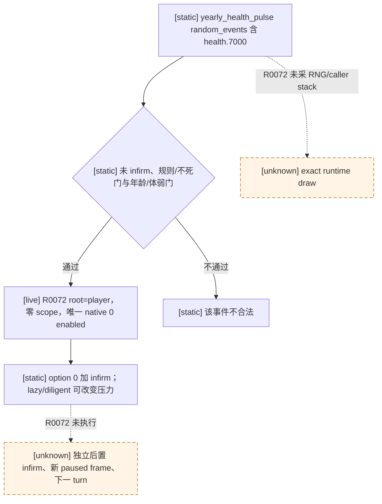

# CK3 1.19.0.6：`health.7000` 衰弱开始事件

## 证据边界

- [static-confirmed] R0072 所用 Steam CK3 `1.19.0.6` 的
  `Z:\SteamLibrary\steamapps\common\Crusader Kings III\binaries\ck3.exe`
  SHA-256 为 `2D00FF3101EF70B566F2FCBAE292F09263199C80E9DC8F139B82D7D96F83DB86`。
  原版 `game/common/on_action/health_on_actions.txt` SHA-256
  `253988DA3E14BE7CC9B86CAB2A3C15843B0CB8B273B2B4BC391EB287AEF0C94C`；
  `game/events/health_events.txt` SHA-256
  `8CAB7F230E09A37C15F7C088383D40752D970918D44D86762FDD068EE168EFEB`。
- [production paused RED] R0072 普通封建 campaign 正式报告
  `Z:\ck3_mod_rewrite\.task-tmp\RUN-001\ordinary-continuation-r0072\formal-R0072-live\formal-report.txt`
  SHA-256 `3D6D480350F3AE1D654821F953BDA0731E0A1C287122CE854EBD7D8777AD438B`：
  `date_raw=53293128`、玩家/root `31853`、事件 instance `9`、`native:11`
  paused snapshot（public revision 12 / native revision 11）。零 saved scopes；唯一
  rendered `0` / native `0` 为 shown+enabled，infirm trait icon 为 native ID `122`。
  `registered_contract_projection_drift` 发生在选择前，未提交动作，不能称选项生效。
  R0070 上一安全 checkpoint 与此 RED 分开保存；本事件文档不重写 G2 状态。

## 原版树与已知效果

`yearly_health_pulse`（`health_on_actions.txt:4–45`）是
`random_yearly_everyone_pulse` 的子入口；其 random events 包含
`20 = health.7000`（第 43 行）。R0072 正式时间推进后自然出现该事件，但
compact report 没有保存实际 RNG/caller stack，因此“确由该次 yearly draw
选中”的动态边只作推断，不能当调用栈证据。

`health_events.txt:11854–12002` 的事件 trigger 首先排除已 infirm、禁用老人
健康事件规则与不死 trait，然后要求年龄至少 45，或年龄至少 30 且有原版
体弱 trait。`weight_multiplier` 用健康、年龄和其它条件调节**事件抽取**；
其中 faith/culture 条件仅作为原版 opaque factor 记录，本包不扩展宗教树。

事件仅有 authored option 1 / native index `0`。`name` 可因 lazy 特质变化，
但选项效果不因此分叉：`add_trait = infirm`；`stress_impact` 的 lazy
分支为 `minor_stress_loss`、diligent 分支为 `medium_stress_gain`，其它状态
不能猜作零效用。`infirm` trait 原版见 `common/traits/00_traits.txt:5826`
（SHA-256 `079F0AB5C4224C505AB9F25BCA80D8DF296E5899BFAB26049CE5FE794DC0B042`），
基础效果包括健康 `-0.25`、生育 `-0.1`、外交/军事各 `-1`；不应称为
“无效果 ACK”。该 option 没有 authored `ai_chance` / `ai_will_select`，
exact-build 通用事件选择器在唯一合法项上无需比较分数；默认 AI 权重
`1` 也不是玩家的质量评分。

## 当前合同漂移与最小修复

R0072 的 registry 检查只失败四项：`saved_scope_names_exact`、
`scope_types_cover_projection`、`native_option_indices_exact`、
`disabled_option_contract`。原因是 `records_manager_a.py` 的该 key 历史
合同虽已写零 scope/单 option，却漏掉 direct consumer 必须显式核验的
`scope_types={}`、`saved_scope_name_sets=((),)`、
`native_option_indices=(0,)`、`disabled_native_option_indices=()`。
这四项与原版定义和本次 paused frame 一致；同文件相邻 `health.7200` 已使用
相同空 scope/单 option 形状。仅为 exact `health.7000` 补这四字段并复验，
不能删检查或改成“任何单选项都点”。

可执行 bounded 合同是：exact build/key、玩家 root、当前 full event instance、
同一 paused revision、零 saved scopes、snapshot authored count `1`、唯一
rendered/native `0` shown+enabled 且非 fallback/cancel 全匹配时，正式
`select-event-option-1` 提交一次。独立下一 paused frame 必须旧 instance
消失或推进，且同一角色新增 infirm；下一 turn 消费该结果并保留 checkpoint/
cold restore，不因 ACK 或数量匹配 alone 报 GREEN。压力结果只在取得同帧
lazy/diligent 状态及前后 stress 点时单独核对，不是解这个单选 B0 的前置。
