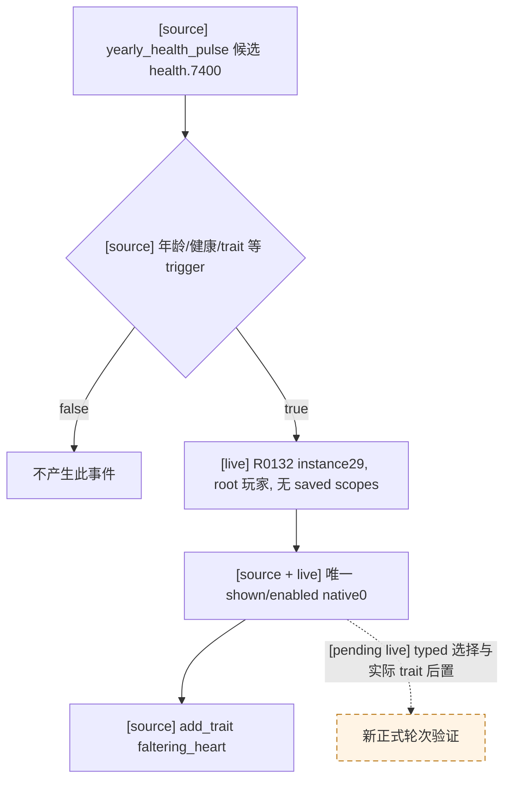

# R0132 `health.7400`：原版强制衰弱心脏事件

状态：exact-build 源码与 R0132 paused 帧已核对；registry 修复仅具静态候选资格，尚无新轮 typed 选择、独立后置或后续 turn。

- [source-confirmed] CK3 `1.19.0.6-steam23530548`，EXE SHA-256 `2D00FF3101EF70B566F2FCBAE292F09263199C80E9DC8F139B82D7D96F83DB86`。`game/events/health_events.txt` SHA-256 `8CAB7F230E09A37C15F7C088383D40752D970918D44D86762FDD068EE168EFEB`，`health.7400` 自第 12426 行定义：`character_event`，trigger 限制年龄、健康及尚未具有 `faltering_heart`，只有一个无独立 trigger 的 `option`，其玩法 effect 是 `add_trait = faltering_heart`；没有 `after` 或第二选项。
- [source-confirmed] `game/common/on_action/health_on_actions.txt` SHA-256 `253988DA3E14BE7CC9B86CAB2A3C15843B0CB8B273B2B4BC391EB287AEF0C94C`，`yearly_health_pulse.random_events` 第 41 行列出 `30 = health.7400`；这是原版自然健康脉冲候选，具体 R0132 的 engine 调度未另行逆向。
- [live-confirmed] R0132 原始 formal report SHA-256 `AE156BF039A0DB4A96EA50BBD5362229BB7E7BA9AD56EECA73FDD8E69346FB68`，turn 14/raw53439984 停于 `registered_contract_projection_drift`，未提交选项。原 driver #2498 的唯一 paused `query-current-event-window-context-v1` 为 instance29、root character36403、`saved_scopes=[]`、只有 rendered0/native0 shown+enabled。effect indicator 显示增加 `faltering_heart`，但 `complete_effect_set=false`；完整效果判断由冻结原版脚本支持，不能由 indicator 子集推出。
- [contract diagnosis] 既有 `health.7400` 记录只保留 R103 的基础 one-option/count 字段，遗漏 `scope_types={}`、`saved_scope_name_sets=((),)`、`native_option_indices=(0,)` 与 `disabled_native_option_indices=()`。R0132 的四项 false 正是这些未写字段；`records_manager_a` 的既有产品中性化会把历史 root29037 换成当前玩家并移除历史日期，故不需写死 actor36403/日期或新增策略。

最小 counter-policy 是补齐这个现有一选项 registry 记录的完整空作用域与 native0/无 disabled 投影；继续沿用同帧身份、唯一 enabled 及原有未知事件拒绝门。静态通过只解除 R0132 的候选定义漂移；正式动作、实际 trait 后置、下一 turn 与 checkpoint/恢复另由唯一实例队列验证。原 R0118 WarID251658364 的战争 RED 不受此健康事件修复影响。

## 冷恢复边界

R0132 最后持久配对为 h2493/raw53439672。原始 `state-final/profile/save games/xar_checkpoint.ck3` SHA-256 `8293562D3331320059ABFA5087AAC8417E592494C3A731DDD6D917F20005193E`；原始 `state-final/native-session/driver-state.json` SHA-256 `7BD0313D7FCD6714EC2532BEA76B7F4B1CFFB0301BC58F4DE5CC8ABB7AE25F61`。driver 有 #2494–2498 未配尾，#2497 已推进 13 天但没有配对存档。下一正式候选须保留这些原件，并由官方恢复器按语义裁切到 h2493；不能直接从阻塞帧 raw53439984 启动，也不能手删 driver 尾。当前 M5 R0133 占用唯一 CK3 实例，恢复准备和实机验证另排队。
