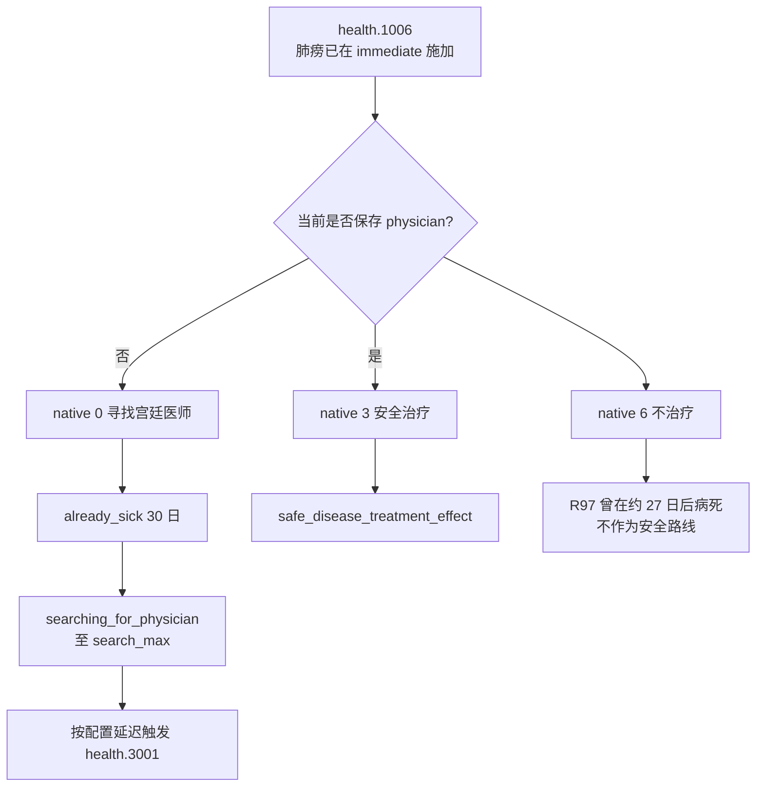

# CK3 1.19.0.6 `health.1006` 肺痨诊断决策树

## 状态与证据边界

- [static-confirmed] 本专题绑定 CK3 `1.19.0.6`、Steam build `23530548` 与 `ck3.exe` SHA-256
  `2D00FF3101EF70B566F2FCBAE292F09263199C80E9DC8F139B82D7D96F83DB86`。
- [historical live] R97 在有医师投影中选择 authored `7` / native `6` 不治疗；事件本身完成 advance，但玩家
  约 27 日后病死并造成 played-owner binding RED。这个结果只证明该实机链的后果，不把死亡期限写成通用规则。
- [paused live RED] R416 attempt 05 在 PID `174656` / generation `1`、`date_raw=53864592` 命中 instance
  `1084`。root 与 `sick_character` 都是玩家 `32904`；没有 `physician` scope；native `0/6` shown/enabled；
  未提交选择。
- [counter-policy static-ready, live action pending] 当前无医师投影选择 authored `1` / native `0`，进入寻找
  宫廷医师链。现有医师投影仍选择 authored `4` / native `3` 的安全治疗。动作 ACK 不能代替 instance advance。

## 原版状态与入口

事件 `immediate` 先调用 `save_court_physician_as_effect`，再调用
`contract_disease_effect = { DISEASE = consumption TREATMENT_EVENT = no }`。后者在窗口出现前就保存
`sick_character` / `disease_type` 并施加肺痨；若来自疫情传播，还会继承 `epidemic` 并创建 `new_memory`。
因此没有任何按钮能撤销本次感染，选择的实际问题是“如何进入治疗”。

入口至少包括三类：`disease_outbreak_pulse` 中 weight `100` 的候选、
`contract_disease_notify_effect` 在识别 consumption 后延迟 5–15 日触发、以及一个旅行事件结束时的随机疾病尾链。
这些入口的节奏不同，不能从某一次实机日期推导固定复发周期。

## 已准入的两个投影

当前合同只准入实见的两组耦合形态：

| 形态 | saved scopes | rendered native options | 选择 |
|---|---|---|---|
| 无医师，R416 | `epidemic,disease_type,sick_character,new_memory` | `0,6` | authored `1` / native `0` |
| 有普通医师，R97 | 上述四项加 `physician` | `3,4,6` | authored `4` / native `3` |

原版还定义了 liege 代选、旅行返家和 mystic treatment 行，但它们没有进入这两个实见投影。合同不根据源码猜测其
当前可见性；将来若实际出现，会先保留新的暂停 RED，再增加独立 variant。

## 选择语义

无医师时，native `0` 仅对玩家执行：设置 30 日 `already_sick`，设置有界的
`searching_for_physician`，并在 `court_physician_search_min..max` 延迟后触发 `health.3001`。native `6`
在当前无医师形态下没有治疗效果。由于感染已经发生，native `0` 是唯一打开恢复路径的选项。

有医师时，native `3` 调用安全治疗；native `4` 是风险治疗；native `6` 明确不治疗。R97 已提供了拒绝治疗后
玩家死亡的实机结果，所以保留原有安全治疗选择。宗教只可能影响未准入的 mystic 选择权重；本策略不读取或扩展
faith/doctrine 域。

## exact-build 来源

- `events/health_events.txt:2135-2334`，SHA-256
  `8CAB7F230E09A37C15F7C088383D40752D970918D44D86762FDD068EE168EFEB`。
- `common/scripted_effects/20_health_effects.txt:127-691,2093-2107`，SHA-256
  `6D7DEF1245D899DE4DEBC42136815BC7F4D14F6A467A8320355507AD03528F12`。
- `common/on_action/health_on_actions.txt:343-357`，SHA-256
  `253988DA3E14BE7CC9B86CAB2A3C15843B0CB8B273B2B4BC391EB287AEF0C94C`。
- `events/travel_events/travel_events_filippa.txt:8622-8674`，SHA-256
  `F4984713B39DC4436A495DAE8D2264D6A6E179D0DBEAD0897124B97805D20AE7`。
- 英文与简中 localization SHA-256：
  `043216116C522B5D108315A3730DA12C5D7B2EDDB8CF60D67D0967AF4AFE23D0`、
  `AFDC39A947F036A140288CC565EDE0B2CC29B1DCD27AF191A7CC0F91A026A0E4`。
- R416 attempt 05 RED：
  `_runtime/p1-terminal-resume-r416-20260911/live-artifacts/terminal-stages-red-attempt-05.json`，SHA-256
  `0BFAB9EF8D38AE9C74F783FE3E4B3672222E5289F760D21074BD04D5683692AA`。

R97 下游死亡边界见
[`promotion-source-checkpoint-choreography-forensics-2026-09-04.md`](../phase2-promo/promotion-source-checkpoint-choreography-forensics-2026-09-04.md)。
