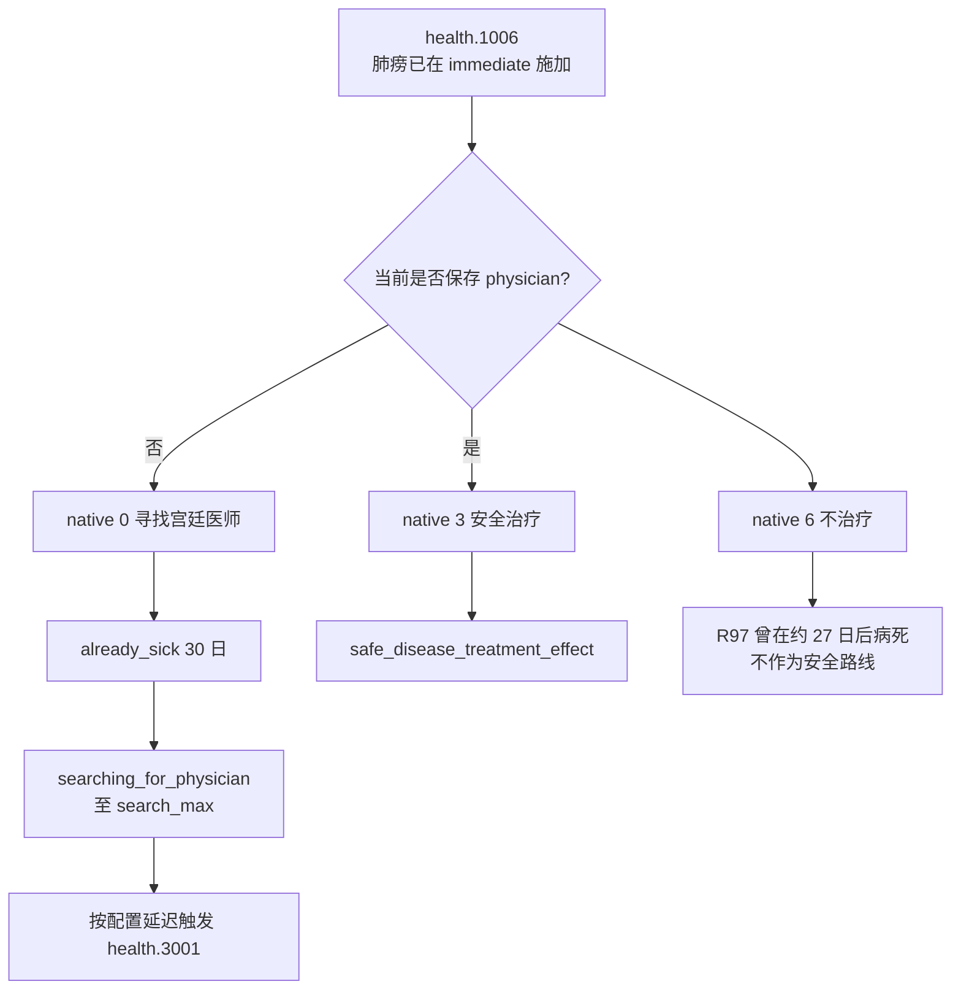
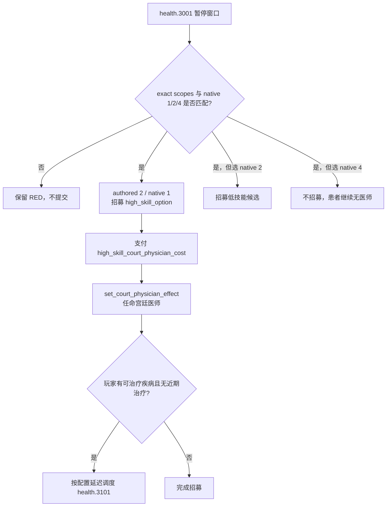
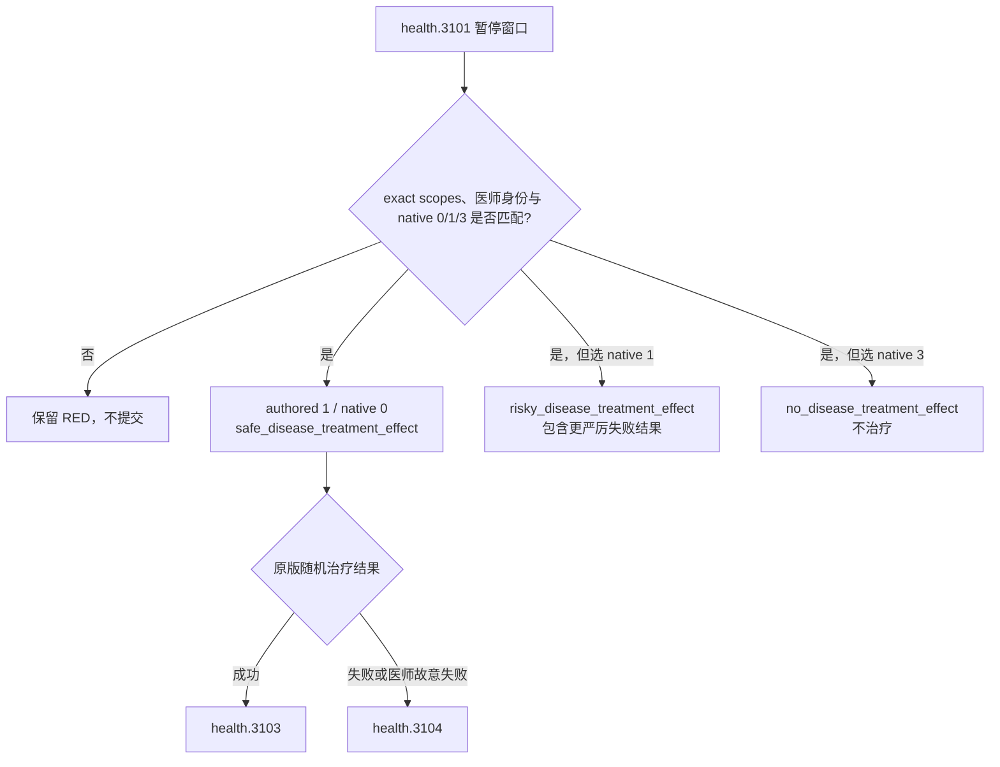

# CK3 1.19.0.6 `health.1006 → health.3001 → health.3101` 肺痨诊断、医师招募与治疗树

## 状态与证据边界

- [static-confirmed] 本专题绑定 CK3 `1.19.0.6`、Steam build `23530548` 与 `ck3.exe` SHA-256
  `2D00FF3101EF70B566F2FCBAE292F09263199C80E9DC8F139B82D7D96F83DB86`。
- [historical live] R97 在有医师投影中选择 authored `7` / native `6` 不治疗；事件本身完成 advance，但玩家
  约 27 日后病死并造成 played-owner binding RED。这个结果只证明该实机链的后果，不把死亡期限写成通用规则。
- [paused live RED] R416 attempt 05 在 PID `174656` / generation `1`、`date_raw=53864592` 命中 instance
  `1084`。root 与 `sick_character` 都是玩家 `32904`；没有 `physician` scope；native `0/6` shown/enabled；
  未提交选择。
- [production-live primitive] R416 retry 06 在相同 PID / generation 选择 authored `1` / native `0`，instance
  `1084 -> null`、snapshot `native:1026 -> native:1027`、revision `1027 -> 1028`，且
  `postcondition_verified=true`。这证明无医师恢复路线已经越过真实诊断窗口。
- [paused live RED → production-live primitive] 同次 retry 随后按原版延迟进入 `health.3001` instance `1085`，`date_raw=53864784`。
  root/player 为 `32904`，高技能候选为 `33648496`，低技能候选为 `16889335`；native `1/2/4` 均
  shown/enabled。旧合同没有接受从诊断链继承的 `epidemic,new_memory`，因此先保留 RED；retry 07 随后在同一
  PID / generation 选择 authored `2` / native `1`，instance `1085 -> null`、snapshot
  `native:1032 -> native:1033`、revision `1033 -> 1034`，且 `postcondition_verified=true`。
- [paused live RED] 原版紧接着打开 `health.3101` instance `1086`，`date_raw=53864832`。新任医师与
  `high_skill_option` 都是 `33648496`；native `0/1/3` 均 shown/enabled。旧合同再次没有接受继承的
  `epidemic,new_memory`，未提交治疗选择。
- [counter-policy static-ready, live action pending] `health.3101` 当前投影选择 authored `1` / native `0`
  的原版 safe treatment。该路线仍有随机成功或失败，不能表述为必定治愈。动作 ACK 不能代替 instance advance。

## 原版状态与入口

事件 `immediate` 先调用 `save_court_physician_as_effect`，再调用
`contract_disease_effect = { DISEASE = consumption TREATMENT_EVENT = no }`。后者在窗口出现前就保存
`sick_character` / `disease_type` 并施加肺痨；若来自疫情传播，还会继承 `epidemic` 并创建 `new_memory`。
因此没有任何按钮能撤销本次感染，选择的实际问题是“如何进入治疗”。

入口至少包括三类：`disease_outbreak_pulse` 中 weight `100` 的候选、
`contract_disease_notify_effect` 在识别 consumption 后延迟 5–15 日触发、以及一个旅行事件结束时的随机疾病尾链。
这些入口的节奏不同，不能从某一次实机日期推导固定复发周期。

## 已准入的两个投影

当前合同只准入实见的两组耦合形态：

| 形态 | saved scopes | rendered native options | 选择 |
|---|---|---|---|
| 无医师，R416 | `epidemic,disease_type,sick_character,new_memory` | `0,6` | authored `1` / native `0` |
| 有普通医师，R97 | 上述四项加 `physician` | `3,4,6` | authored `4` / native `3` |

原版还定义了 liege 代选、旅行返家和 mystic treatment 行，但它们没有进入这两个实见投影。合同不根据源码猜测其
当前可见性；将来若实际出现，会先保留新的暂停 RED，再增加独立 variant。

## 选择语义

无医师时，native `0` 仅对玩家执行：设置 30 日 `already_sick`，设置有界的
`searching_for_physician`，并在 `court_physician_search_min..max` 延迟后触发 `health.3001`。native `6`
在当前无医师形态下没有治疗效果。由于感染已经发生，native `0` 是唯一打开恢复路径的选项。

有医师时，native `3` 调用安全治疗；native `4` 是风险治疗；native `6` 明确不治疗。R97 已提供了拒绝治疗后
玩家死亡的实机结果，所以保留原有安全治疗选择。宗教只可能影响未准入的 mystic 选择权重；本策略不读取或扩展
faith/doctrine 域。

## `health.3001` 医师搜索树

`health.3001` 只要求 ROOT 仍有首都省份。窗口 `immediate` 对玩家执行候选搜索：只有学习生活方式或达到高学习
门槛的统治者才创建 `excellent_skill_option`；`high_skill_option` 与 `low_skill_option` 总会搜索或兜底生成；
`mystic_option` 只在池中有合法候选时存在。R416 没有 excellent/mystic 候选，因此五个 authored option 中只渲染
native `1/2/4`。

旧 R197 样本只携带 `sick_character,disease_type,high_skill_option,low_skill_option`。R416 从
`health.1006` 进入时，原版事件上下文继续携带 `epidemic,new_memory`，并在当前事件的 `immediate` 后追加高、低技能
候选，形成六 scope 形态：

| 形态 | saved scopes | rendered native options | 选择 |
|---|---|---|---|
| 普通医师搜索，R197 | `sick_character,disease_type,high_skill_option,low_skill_option` | `1,2,4` | authored `2` / native `1` |
| 疫情诊断继承，R416 | 上述四项加 `epidemic,new_memory` | `1,2,4` | authored `2` / native `1` |

两个继承 scope 不参与当前三项按钮的显隐，也不改变招募效果；合同以独立 exact scope variant 接受它们，不放宽候选
身份关系或 option 投影。high/low 候选必须互不相同且都不是患病玩家。native `1` 任命高技能候选并进入已审阅的
`health.3101` 治疗链；native `2` 任命较低技能候选；native `4` 不招募任何人。此次路线不需要读取信仰内容；
mystic 分支仍保持未准入，若以后真实出现则冻结新 RED 后单列投影。

## `health.3101` 治疗选择树

`health.3101` 要求玩家仍有可治疗疾病且宫廷医师可用。其 `immediate` 重新保存当前医师，保存玩家最严重的疾病为
`disease_type`，并在医师有 location 时保存 `background_terrain_scope`。在 R416 中，`physician` 与刚刚招募的
`high_skill_option` 同为 `33648496`，所以招募到治疗的身份连续性成立。

旧 R198 形态有六个 scope：`sick_character,disease_type,high_skill_option,low_skill_option,physician,background_terrain_scope`。
R416 继续继承 `epidemic,new_memory`，形成八 scope 形态；两者都渲染 native `0/1/3`，因为当前医师没有满足 mystic
option 的特质。合同把八 scope 形态作为独立 variant，仍要求 `sick_character == player`、`physician ==
high_skill_option`、高低技能候选彼此不同且都不是玩家。

native `0` 是原版命名的安全治疗，但效果不是确定性成功：源码以医师能力等修正 success/failure 权重，且敌对医师
可以进入故意失败分支。选择它的依据是避免 native `1` 风险治疗的更严厉结果范围，以及 native `3` 确定不治疗；
后续究竟进入 `health.3103` 还是 `health.3104` 必须以实机窗口为准。

## exact-build 来源

- `events/health_events.txt:2135-2334`，SHA-256
  `8CAB7F230E09A37C15F7C088383D40752D970918D44D86762FDD068EE168EFEB`。
- 同文件 `health.3001` 定义在 `6667-7276`，候选搜索为 `6705-7075`，五个 option 为
  `7077-7257`，after 为 `7259-7275`。
- 同文件 `health.3101` 定义在 `7314-7524`，trigger 为 `7471-7474`，immediate 为
  `7480-7486`，四个 option 为 `7488-7523`。
- `common/scripted_effects/20_health_effects.txt:127-691,2093-2107`，SHA-256
  `6D7DEF1245D899DE4DEBC42136815BC7F4D14F6A467A8320355507AD03528F12`。
- 同文件 `set_court_physician_effect` 位于 `1308-1408`；它负责任命医师并在玩家仍需治疗时调度
  `health.3101`。
- 同文件 safe/risky/mystic/no-treatment effect 分别位于 `1581-1713`、`1716-1897`、
  `1899-2087`、`2089-2091`。
- `common/on_action/health_on_actions.txt:343-357`，SHA-256
  `253988DA3E14BE7CC9B86CAB2A3C15843B0CB8B273B2B4BC391EB287AEF0C94C`。
- `events/travel_events/travel_events_filippa.txt:8622-8674`，SHA-256
  `F4984713B39DC4436A495DAE8D2264D6A6E179D0DBEAD0897124B97805D20AE7`。
- 英文与简中 localization SHA-256：
  `043216116C522B5D108315A3730DA12C5D7B2EDDB8CF60D67D0967AF4AFE23D0`、
  `AFDC39A947F036A140288CC565EDE0B2CC29B1DCD27AF191A7CC0F91A026A0E4`。
- R416 attempt 05 RED：
  `_runtime/p1-terminal-resume-r416-20260911/live-artifacts/terminal-stages-red-attempt-05.json`，SHA-256
  `0BFAB9EF8D38AE9C74F783FE3E4B3672222E5289F760D21074BD04D5683692AA`。
- R416 retry 06 同时包含 `health.1006` 的选择后置条件和 `health.3001` 的选择前 RED：
  `_runtime/p1-terminal-resume-r416-20260911/live-artifacts/terminal-stages-red-attempt-06.json`，SHA-256
  `0A19C4E378730320173A6F34A99C3724D043432E6529D8496715CA920C30569B`。
- R416 retry 07 同时包含 `health.3001` 的选择后置条件和 `health.3101` 的选择前 RED：
  `_runtime/p1-terminal-resume-r416-20260911/live-artifacts/terminal-stages-red-attempt-07.json`，SHA-256
  `EDBE88226F5CB6C31632359164BC050E9ACD7B84687864EE7A368B7125B9F799`。

R97 下游死亡边界见
[`promotion-source-checkpoint-choreography-forensics-2026-09-04.md`](../phase2-promo/promotion-source-checkpoint-choreography-forensics-2026-09-04.md)。
