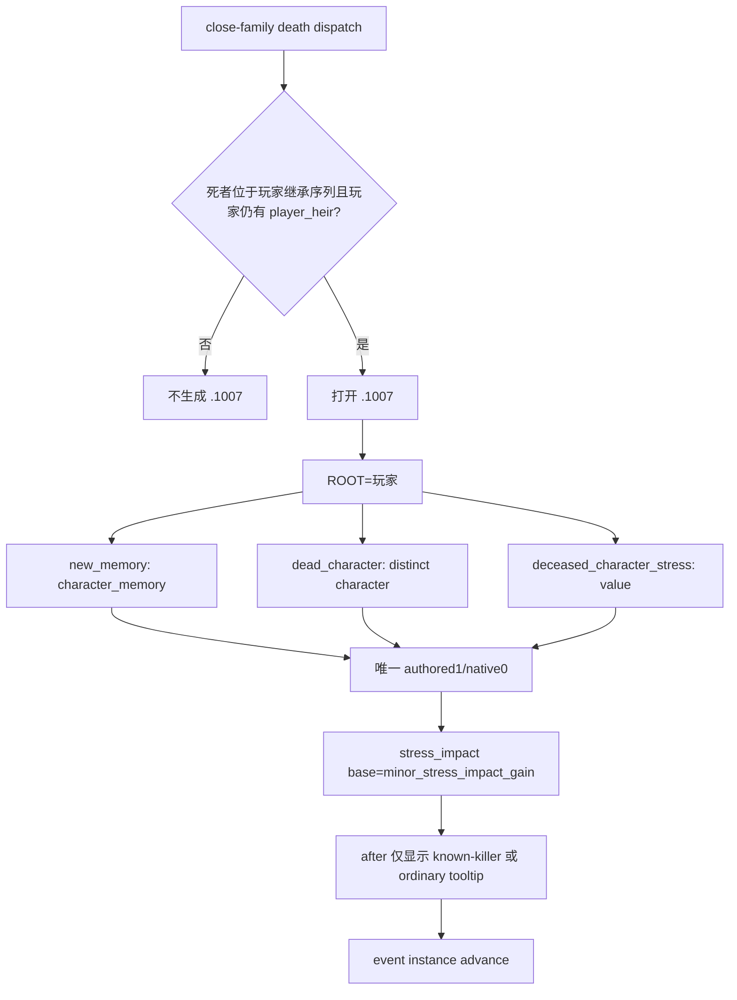

# CK3 1.19.0.6 `death_management.1007` 继承人死亡压力后置

## 结论与证据边界

- **[static-confirmed]** 本专题绑定 CK3 `1.19.0.6 (Scribe)`，`ck3.exe` SHA-256 为
  `2D00FF3101EF70B566F2FCBAE292F09263199C80E9DC8F139B82D7D96F83DB86`。
- **[historical production-live action]** R374 已在唯一 CK3 进程中选择 authored option 1/native 0，event instance
  `1046 -> null`、snapshot `native:1779 -> native:1780`、revision `1780 -> 1781`，事件 advance 已验证。
- **[material comparator static-ready, live pending]** 当时的 state snapshot 尚未发布玩家压力，所以旧 action 不能补写成
  material-delta 证据。当前 registry choice、effect profile 和同角色压力比较器已经闭合，但仍没有由当前实现产生的前后实机读数。

R374 的 pre-selection report、hot park 和 driver snapshot 仍存在，但 driver state 明确为 `last_checkpoint=None`，原进程已结束。
它们是可复核证据，不是可冷恢复的存档。今后只在正常 campaign 再次撞到该事件时完成一次 bounded material 验收，不为单事件长跑。

## 原版调用与效果树

`on_death` 为 close family 创建 `relative_died` memory；death-management dispatcher 保存死者、计算收件人的
`deceased_character_stress`，并在死者属于当前继承序列时把 `.1007` 发给玩家。当前严格合同只接受无 killer 的 R374 shape：

`deceased_character_stress` 虽由上游传入，但 `.1007` 本身不读取它。唯一物质效果是对 ROOT 施加
`minor_stress_impact_gain`；`00_stress_values.txt` 的 authored base 为 `+20`。after block 只展示 tooltip，不写游戏状态。

## 直接消费边界

通用 direct-projection policy 仍默认拒绝需要扩展 scope 语义的合同。本包只为 `death_management.1007` 准入
`unique_character_scope_excludes`，并使用通用检查器证明 `dead_character`：

1. 是 `status=available / type_key=character`；
2. 携带可用 full CharacterID；
3. 不等于 materialized `$player`；
4. 与三个 scope 名、类型、数量以及唯一 native option 共同严格匹配。

其它带 unique-exclude 或 scope variant 的事件仍保持 blocked，不因本包自动进入 planner。

## 结构化效果与后置

选择档案为 `xar.ck3.vanilla-event-choice-effect/v1`：authored base `+20`，runtime delta 明确为 non-exact。人物的
stress-impact adjustments 与压力上限尚未作为同帧输入发布，因此可验证关系是
`played_character.stress_points / non_decreasing`：

- `post > pre`：`verified_change`，可计 material evidence；
- `post == pre`：`verified_no_change`，事件可以安全关闭，但不计 material evidence；
- `post < pre`、CharacterID 漂移或读数缺失：失败或不可用，不能冒充通过。

planner 绑定选择前 snapshot ID、revision、玩家 full CharacterID 与压力点。native action 已经会记录前后玩家压力，service 复用
现有 material-postcondition envelope，无新 mailbox、native reader、等待或桌面操作。

## 聚焦验证

- registry policy、unique-exclude drift、effect profile 和 material comparator：normal/optimized 各 `25/25` GREEN；
- 由上一条 registry 新增暴露的六个旧计数断言已从 `187/333` 同步到真实 `188/334`，对应 record 模块
  normal/optimized 各 `45/45` GREEN；
- `py_compile` 与 `git diff --check`：GREEN；
- 本包未启动 CK3、录屏器、注入器或任何桌面输入。

## 证据

- 原版事件：`Crusader Kings III/game/events/death_events/death_management_events.txt:1948-2057`，SHA-256
  `31591A2F2D3A61E65853CC43B9BEF4B001FEB75EA1502861D2FB9AC054AB1FB7`；
- 压力值：`Crusader Kings III/game/common/script_values/00_stress_values.txt:25-34`，SHA-256
  `104A7EF94EE9DA1092F23AEB2FD9DC971B08C695415F3B7EBFB628F381D26395`；
- R374 pre-selection report：`_runtime/p2r374-active-boundary-continuation-live/death-management-1007-red-report.json`，SHA-256
  `B69243825168B01F11C0CBDEBC321C277E3AC22CEEC2F50650ABB9C0994D1D64`；
- R374 action/advance：[`../autonomous-agent-progress/weekly/2026-W37.md`](../autonomous-agent-progress/weekly/2026-W37.md)；
- exact contract/analysis/observation：
  `ck3_autonomous_player/src/xar_autoplayer/vanilla_events/records_death_management.py`。
