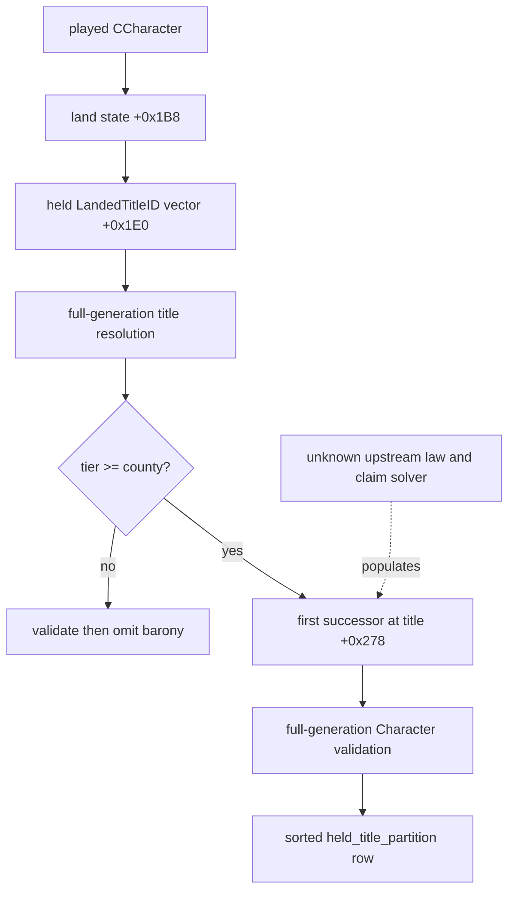

# Held-title succession partition v1

## Status

- **[static-ready, live pending]** `campaign-root-context-v1` now publishes
  `held_title_partition` for every personally held county-or-higher title.
- Each row contains the generation-stable title identity and tier, the current
  engine-calculated first heir or `null`, and a `primary` marker.
- `ck3_query_turn_bundle_v1` derives `single_successor`, `split_successors` or
  `no_primary_heir`, preserves the full row set, and raises
  `succession_partition_split` only when a non-primary title has a different
  heir from the observed primary-title heir.
- The field does not calculate inheritance law, claims or hypothetical law
  changes. Those remain later G2-M3 inputs.

Exact build:

- CK3 `1.19.0.6`
- `ck3.exe` SHA-256
  `2D00FF3101EF70B566F2FCBAE292F09263199C80E9DC8F139B82D7D96F83DB86`

## Exact native path

The live character root already used by campaign-root exposes its land state at
`CCharacter+0x1B8`. The exact-build held-title enumerator
`0x28C39A0..0x28C3B18` reads a full-generation `LandedTitleID` vector from:

```text
land_state+0x1E0 -> data
land_state+0x1E8 -> capacity
land_state+0x1EC -> count
```

That function slice is `0x178` bytes with SHA-256
`D7C6700177B5401E712DA7913FE46468C7868450A12488422005E5CBAAFB19A9`.
The reader resolves every ID through the existing LandedTitle storage,
round-trips `CLandedTitle+0x10`, and requires
`CLandedTitle+0x258 == player_character_id`.

For every admitted title it reads:

```text
CLandedTitle+0x160 -> title template
           +0x278 -> ordered successor CharacterID data
           +0x280 -> successor capacity
           +0x284 -> successor count
title template+0x5C -> raw tier
```

The first element of the successor vector is the current engine result for that
specific title. An empty valid vector becomes `first_heir_character_id=null`.
Every non-null heir must round-trip through full-generation Character storage
and must differ from the current holder.

## Why the projection matches the stock realm view

The stock My Realm builder at `0x113621F..0x11364C9` iterates held titles,
reads each title's first entry at `+0x278`, and groups title rows by that heir.
The slice is `0x2AA` bytes with SHA-256
`8D3696555ADB3F338244D1E8872C3721707D7B90EEE7E6AD95DD38020195EEA2`.
This proves that per-title first-heir grouping is the game's own current
partition presentation. The upstream law solver that populated each successor
vector remains outside this contract.



## Wire contract

Rows are sorted by full-generation `title_id` so repeated paused reads are
canonical. The primary title must occur exactly once for county-or-higher
roots. A landless or barony-only root publishes an empty row set; the turn
bundle marks its realm partition `not_applicable`.

```json
{
  "held_title_partition": [
    {
      "title": {"title_id": 90, "tier_raw": 4, "tier_key": "kingdom"},
      "first_heir_character_id": 88,
      "primary": true
    },
    {
      "title": {"title_id": 91, "tier_raw": 2, "tier_key": "county"},
      "first_heir_character_id": 77,
      "primary": false
    }
  ]
}
```

The primary row's heir must equal the first entry of
`primary_title_succession_character_ids`. Duplicate or generation-invalid
IDs, holder mismatch, invalid tier/span, primary disagreement, or two-sample
drift makes the entire campaign-root frame typed unavailable as
`held_title_partition_unavailable` or `state_changed`.

The turn-bundle `partition.value` contains:

- `title_heirs`: the full normalized row set;
- `primary_heir_character_id`;
- `titles_to_other_heirs`;
- `titles_without_heir`;
- `risk_state`;
- `split_risk`.

## Verification boundary

The MSVC Release reader fixture covers a primary hegemony title, a secondary
county assigned to another heir, barony exclusion and a holder-mismatch
failure. The source-contract executable binds both exact-build slices and all
published offsets. The focused campaign-root, live-harness and turn-bundle
Python suites pass `42/42` in normal and optimized modes.

No CK3 process or desktop input was used for static verification. The next
already-required G2 paused session should read this field in the same two
bounded campaign scenes used for the remaining campaign-root extensions. That
single shared check is sufficient; this field does not need a dedicated long
run.
