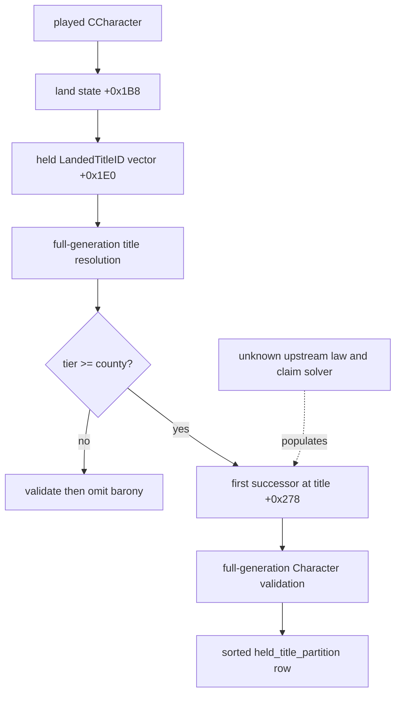

# Held-title succession partition v1

## Status

- **[static-ready, live pending]** `campaign-root-context-v1` now publishes
  `held_title_partition` for every personally held county-or-higher title.
- Each row contains the generation-stable title identity and tier, the current
  engine-calculated first heir or `null`, and a `primary` marker.
- `ck3_query_turn_bundle_v1` derives `single_successor`, `split_successors` or
  `no_primary_heir`, preserves the full row set, and raises
  `succession_partition_split` only when a non-primary title has a different
  heir from the observed primary-title heir.
- The field does not calculate inheritance law, claims or hypothetical law
  changes. Those remain later G2-M3 inputs.

Exact build:

- CK3 `1.19.0.6`
- `ck3.exe` SHA-256
  `2D00FF3101EF70B566F2FCBAE292F09263199C80E9DC8F139B82D7D96F83DB86`

## Exact native path

The live character root already used by campaign-root exposes its land state at
`CCharacter+0x1B8`. The exact-build held-title enumerator
`0x28C39A0..0x28C3B18` reads a full-generation `LandedTitleID` vector from:

```text
land_state+0x1E0 -> data
land_state+0x1E8 -> capacity
land_state+0x1EC -> count
```

That function slice is `0x178` bytes with SHA-256
`D7C6700177B5401E712DA7913FE46468C7868450A12488422005E5CBAAFB19A9`.
The reader resolves every ID through the existing LandedTitle storage,
round-trips `CLandedTitle+0x10`, and requires
`CLandedTitle+0x258 == player_character_id`.

For every admitted title it reads:

```text
CLandedTitle+0x160 -> title template
           +0x278 -> ordered successor CharacterID data
           +0x280 -> successor capacity
           +0x284 -> successor count
title template+0x5C -> raw tier
```

The first element of the successor vector is the current engine result for that
specific title. An empty valid vector becomes `first_heir_character_id=null`.
Every non-null heir must round-trip through full-generation Character storage
and must differ from the current holder.

## Why the projection matches the stock realm view

The stock My Realm builder at `0x113621F..0x11364C9` iterates held titles,
reads each title's first entry at `+0x278`, and groups title rows by that heir.
The slice is `0x2AA` bytes with SHA-256
`8D3696555ADB3F338244D1E8872C3721707D7B90EEE7E6AD95DD38020195EEA2`.
This proves that per-title first-heir grouping is the game's own current
partition presentation. The upstream law solver that populated each successor
vector remains outside this contract.


```mermaid
flowchart TD
  A[played CCharacter] --> B[land state +0x1B8]
  B --> C[held LandedTitleID vector +0x1E0]
  C --> D[full-generation title resolution]
  D --> E{tier >= county?}
  E -->|no| F[validate then omit barony]
  E -->|yes| G[first successor at title +0x278]
  G --> H[full-generation Character validation]
  H --> I[sorted held_title_partition row]
  J[unknown upstream law and claim solver] -. populates .-> G
```

## Wire contract

Rows are sorted by full-generation `title_id` so repeated paused reads are
canonical. The primary title must occur exactly once for county-or-higher
roots. A landless or barony-only root publishes an empty row set; the turn
bundle marks its realm partition `not_applicable`.

```json
{
  "held_title_partition": [
    {
      "title": {"title_id": 90, "tier_raw": 4, "tier_key": "kingdom"},
      "first_heir_character_id": 88,
      "primary": true
    },
    {
      "title": {"title_id": 91, "tier_raw": 2, "tier_key": "county"},
      "first_heir_character_id": 77,
      "primary": false
    }
  ]
}
```

The primary row's heir must equal the first entry of
`primary_title_succession_character_ids`. Duplicate or generation-invalid
IDs, holder mismatch, invalid tier/span, primary disagreement, or two-sample
drift makes the entire campaign-root frame typed unavailable as
`held_title_partition_unavailable` or `state_changed`.

The turn-bundle `partition.value` contains:

- `title_heirs`: the full normalized row set;
- `primary_heir_character_id`;
- `titles_to_other_heirs`;
- `titles_without_heir`;
- `risk_state`;
- `split_risk`.

## Verification boundary

The MSVC Release reader fixture covers a primary hegemony title, a secondary
county assigned to another heir, barony exclusion and a holder-mismatch
failure. The source-contract executable binds both exact-build slices and all
published offsets. The focused campaign-root, live-harness and turn-bundle
Python suites pass `42/42` in normal and optimized modes.

No CK3 process or desktop input was used for static verification. The next
already-required G2 paused session should read this field in the same two
bounded campaign scenes used for the remaining campaign-root extensions. That
single shared check is sufficient; this field does not need a dedicated long
run.

## 2026-10-06: Noble-family counties without a province (1.20.0.3)

A county-tier held title does not always represent a geographical county. A
stock noble-family title can return a non-null **Null Province** object whose
ID is zero. R14 actually observed title16850, getter completed/non-null and
tag `0x4E756C6C`, but the old positive-capital guard rejected the whole root.
This is distinct from a failed getter, an unreadable object or an ordinary
landed county with an invalid capital.

Source09 admits one explicit variant only: county tier; successful non-null
getter; province ID exactly0; actual Null tag; actual native `landless_type=1`,
`noble_family=1`, `children_count=0`; and a valid county title key read from the
native title template. Any failed read, negative ID, unknown tag or ordinary
zero-capital county still fails closed. This is a subtype check, not a title
ID allowlist. Valid ordinary province rows keep their existing contract.
The family title remains in the inheritance partition; consumers must not
turn its absent province into a geographical target or drop the title.

The JSON variant has `capital_province_id: null`,
`capital_province_kind: "landless_noble_family_no_province"` and an actual
`title_key`. Native/Python validation requires this exact variant instead of
accepting arbitrary nulls or zeros. R15's actual row was:

```json
{
  "title": {"title_id": 16850, "tier_raw": 2, "tier_key": "county"},
  "first_heir_character_id": 37989,
  "capital_province_id": null,
  "capital_province_kind": "landless_noble_family_no_province",
  "title_key": "c_nf_zhao_8d99_1",
  "primary": false
}
```

[R15 exact initial proof](C:/workspace/ck3-upgrade-20261006/xqol-r15-thin-report-observer-agent-01/ACTUAL_INITIAL_ROOT_THIN_NON_EOF_01.json)
(19024B, SHA `f6add1d5c856bf918d7362f90a7bb88071fe7474c3b4b1a925bb6edf53c476d2`)
proves root available/readiness=true and partition-ready in this scene.
`council_ready=false` and unexposed title-definition flags are retained; the
DTO's kind/key/null are not a dump of every native flag. This result does not
prove XQOL defense business success or other campaigns.

The frozen Source09 build11 DLL
`916bd5a3cccacd05198b4e07d58c6883a9b8bd7dc639e691649bcec8d1029eb4`
was built successfully and used for R15. The separately migrated five master
test files passed Python39 normally and with `-O`, native16/17 existing groups,
and the optional monthly-piety fixture mode. [Regression evidence](C:/workspace/ck3-upgrade-20261006/held-family-master-regression-migration-agent-01/FINAL-REGRESSION-MIGRATION-RECEIPT-01.json)
(11575B, SHA `703d71aeda5ce2b90c0a9c722f52f30f6dece12802f53b46894122c68f783b6e`)
uses exact production renderer fragments in bounded executable fixtures;
it is not a full master DLL build. [R15 product and shutdown boundaries](../xqol-1.20.0.3-defense-maintenance-2026-10-05.md#2026-10-06-r15a69source09读取修复实测d1夹具前置失败)
retain the pre-war fixture failure, one real day, D5 NOT_RUN and normal OS0.

## 2026-10-06：原版家族头衔键保留大小写

当前原版 `04_china_noble_families.txt` 存在29个带ASCII大写字符的合法家族县标识，例如 `c_nf_li_674E_999`、`c_nf_zheng_912D_117`、`c_nf_wang_738B_121`。此前native/Python的县键谓词只接受小写，错误拒绝这些原版值。两处谓词现允许ASCII A–Z并原样保存，仍要求精确`c_`前缀及原长度、字符范围、null tag、landless/noble-family/children等门禁；不做大小写折叠。

有限候选验证已通过：原生六组新旧读取对比与一个生产序列化案例，Python普通及-O各40个案例（含29个原版大写标识）；master永久回归覆盖三项完整normalizer输出。旧读取顺序与getter次数保持。候选与原始证据在[冻结包](C:/workspace/ck3-upgrade-20261006/held-family-county-stock-key-case-fix-prep-agent-01/FINAL_CANDIDATE_01.json)。

CCC a75/R0002实际D1在官员29959、县16958处记录`county_no_province_title_key_read`失败；现有53项诊断没有实际raw key或成功读取结果，不能把静态ordinal映射当作实际键，也不能断言此修复已消除该D1失败。D0宋帝县16850的合法空省份读取此前实测通过。该缺口与随后D2真实磁盘写入Errno28分别保存，不据此归结连接关闭的首因。

Source10已由Source09不可变2638文件生成：2636个原字节一致，仅上述两处override。一次fresh MSVC14.51 / jobs4 / BelowNormal构建358个新对象、361 edges，254.14855秒exit0；DLL5565440B，SHA-256 `f150c4cf1aa8a121ab44ab41d3052b0b7db6729644a7958bd53156abf682d754`。[实际build-only包](C:/workspace/ck3-upgrade-20261006/source10-stock-mixedcase-key-build-agent-01/SOURCE10_BUILD_ONLY_PACKET_01.json)绑定精确源码、消费者、工具链与原日志。状态为BUILD_SUCCESS_ONLY_NOT_LIVE_VALIDATED，旧Source09、旧attempt及失败均保留；下一冷加载仍须实测。
