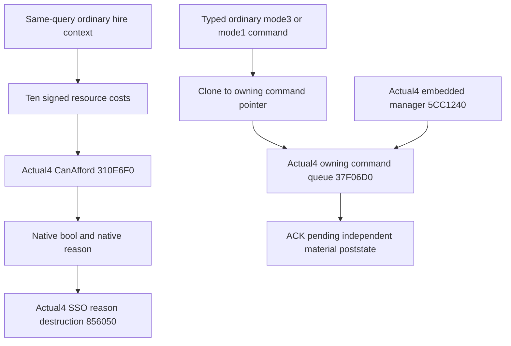

# Hired troop shared hire bindings — CK3 1.20.0.4

The adopted holy-order and mercenary families share the ten-resource affordability helper, native reason string destructor, and owning command queue. This migration binds each callable against the frozen 1.20.0.4 image; it does not call a previous build binder with an aliased SHA.

The exact build is Steam 25734779, SHA-256 `98702F88A547CDE2EAF29A85F93B85F68EE4CF8148336A4F7AFAEB75319DD518`. The retained actual4 core map proves the command manager at image + `0x5CC1240` is an embedded object. Actual4 affordability is `0x310E6F0`; reason destruction remains `0x856050`; the central actual4 command binder supplies queue `0x37F06D0` and the embedded manager.

The shared API is `xar::ck3_12004::hired_troops::BindHiredTroopSharedImage12004(base, sha)`. It returns explicit affordability, reason destruction and the centrally bound software `CommandBindings`. This family calls the central `ck3_12004::BindCommandImage12004` rather than recapturing its command source or copying a previous binder. Each hire family's native execution/clone bodies and command layout remain separate evidence obligations.

The complete affordability extent is `[0x310E6F0,0x310EDB4)`, 1732 bytes. Its 1692-byte instruction portion has one concrete nonrelative change: the indexed ten-resource dispatch table moved from `0x310EDAC` to `0x310ED8C`. The additional exact40-byte data capture proves all ten entries select the same function-relative decoded instruction boundaries. Member displacements, ordered direct edges and local control topology match. This publishes native bool and literal reasons; it does not reconstruct resource formulas or inspect transitive helper bodies. The initial partial mapper result remains preserved as the actual table operand difference.

Source closure: `shared-hire/SOURCE-CLOSED.json` under the external implementation packet. Actual new EXE cost in this parent component is1692 code+40 data=1732bytes; metadata0, oldEXE reads0, duplicateEXE bytes0. The table receipt writer initially failed after its40-byte capture with `KeyError: bytes`; the repaired receipt consumed that retained cache without another EXE read. Native SSO94B and queue250B proofs are existing actual4 evidence and add no capture cost here.

Source plan: `C:/codex-ck3-background/packets/holy-order-mercenary-12004-implementation-20261007/SHARED-BINDER-API-SOURCE-PLAN.json`. The binder source candidate and one genuinely produced whole-command-result migration fixture are prepared. Build, native fixture, registered MCP, application import and live qualification remain NOTRUN until Root's coherent actual4 freeze. Historical .3 primitive/loop outcomes are not actual4 qualification.

The joint candidate connects the adopted holy-order context and ordinary mode3 action, plus the mercenary context and ordinary mode1 action. The domain topics retain their exact native trees and operand ledgers. Shared Army source now closes the Regi tag, inherited GDbO key layout, chunk ordinal/pending fields, and the complete 1134-byte monthly-fraction getter. These proofs are reused from their owners; this family does not recapture them. The original AI chooser and unadopted total-strength/leader packages remain separate work.

The new target `xar_ck3_12004_hired_troop_migration_test` links the actual runtime and emits one JSON document with four complete production query/action result packets. Its memory and native callbacks are synthetic. Fresh actual4 metadata is rendered from the production readers/providers/serializers; no archived wire is retagged. One compiled-dependent registered MCP compound is prepared to consume those original packets. Both first validations remain NOTRUN. Holy-order current reinforcement includes a known empty persistent roster in this new scene; positive reinforcement branches retain their source evidence and receive no repeated old fixture credit here. Actual4 mercenary peace avoids the raise selector, matching the closed native zero-war branch.

Central qualification must retain the exact coherent source, genuine output, and first-attempt receipts. A later paused Robert query and independent employer/resource/army poststate are required for actual4 live credit; ordinary queue ACK remains pending until then. The source candidate does not grant live or complete-loop readiness.
