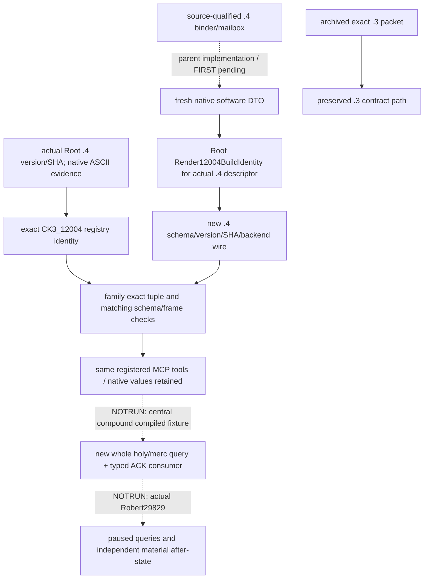

# Holy-order and mercenary strict contracts — CK3 1.20.0.4

Source plan frozen at **2026-10-07 02:42:26 Asia/Shanghai**, before family parser
implementation, against shared isolated source
`caa4adc3d1278e324cf4ec19774028e9b9138e28`. Actual identity is **CK3 1.20.0.4 /
Steam25734779 / SHA98702F88A547CDE2EAF29A85F93B85F68EE4CF8148336A4F7AFAEB75319DD518**.
Root's `ck3_12004.hpp:9,13` supplies version/SHA; its comment records the actual
ASCII version at RVA71871232/file offset71866624. This lane reuses that evidence
and reads no executable, hash or PE map. The earlier null FileVersion/ProductVersion
inventory remains historical; Root's actual version source has resolved it.

The existing same-name tools remain `ck3_query_player_holy_order_context_v1`,
`ck3_query_player_mercenary_context_v1`, `ck3_hire_holy_order_v1` and
`ck3_hire_mercenary_v1`. Parent/native owners migrate the reached `.4` binders,
mailboxes, whole serializer fixture and shared adapter/bridge. This child owns
the four family strict modules, the two holy-order/mercenary hire action JSON
contracts, this topic/operand ledger and one compiled fixture consumer. Parent
is the sole Git index/commit owner.

Root's `Render12004BuildIdentity` applies to **fresh serialized software DTOs
from the actual `.4` descriptor**. It renders schema prefixes, version/SHA and
backend metadata for `.4`; archived `.3` wires are not republished as new native
evidence. The existing global Python identity registry already contains exact
`CK3_12004`, and the shared private build/schema/provenance helper handles it.
Neither shared file needs a child edit.

| Actual input | Existing consumer change |
| --- | --- |
| Exact outer version/SHA tuple | Accept only existing registry identities CK3_12003 and CK3_12004 in these families. |
| `.4` query/action schema prefix | Match schema to that exact tuple; preserve `.3` SCHEMA constants and prior behavior. |
| Hire action JSON result contract | Correlate version, executable SHA and nested action schema in two exact `.3`/`.4` alternatives. |
| Holy-order query backend ID and snapshot hello | Existing backend suffix and snapshot identity must match the selected build. |
| Mercenary query/hire and holy-order hire frame | For `.4`, match snapshot identity to output identity; retain `.3` frame behavior. |
| Native rows, terms, full references, units and submission status | Preserve existing validation and values; no schema retag, quote calculation or policy is added. |

The prepared compound harness consumes four or more **unaltered native-produced
command_result packets** under a `samples` array: the two query steps and both
typed hire steps. Query/action schemas and every outer identity must be actual
`.4`; native result bodies pass through real protocol ingestion, registered MCP,
service, driver and family normalizers. Synthetic hello/snapshot/callback provenance
stays explicit. One native output file feeds this one harness; no fixture or test
is run by this lane. Query results are observations; action ACKs remain submission
only with `after_state_observed=false`.

Readiness at source-plan freeze was **research / implementation in progress**.
At the implementation handoff, the nine owned source files are a **source
candidate ready for central validation**; this is not a new static/live
qualification. One scoped `git diff --check` passed on the six tracked family
module/schema edits. No test, project import or compilation ran. The consumer's
CLI is `--source-root`, `--native-fixture`, `--output-dir`; the holy-order query
sample must keep its original `g2-read-` request ID, while the other samples use
the driver's existing `protocol_request_id` seam. The producer document includes
explicit synthetic provenance and all four complete command-result steps.
Parent owns that new native producer and Root owns the central FIRST.

The 02:58 Shanghai source-only producer/consumer review found no required
consumer change. Parent's new native producer supplies complete unchanged
packets for actor29829/native revision171/date53286648 and keeps the holy query's
`g2-read-holy-12004` request ID. Maintenance's actual `.4` position branch
(`26248EE` zero-war-count comparison, `26248F4` skip) makes a war-free result
legitimately report no selector attempt and a null auto-raise province, with
position ready and failure `none`. The existing `_location` contract already
accepts this shape. Parent's `.4` fixture must select the new native binding flag
and require zero selector calls; that producer edit/central execution remains
with Parent/Root. The `.3` binding's existing selector behavior is unchanged.

Build/tests/imports/native calls/game operations are **NOTRUN/0**. Existing `.3`
live/static evidence remains old-build history; e5 reinforcement/cost candidates,
total-strength/leader candidates and original AI incoming research receive no new
qualification from this strict migration. Root's combined `.4` paused query remains
one holy-order call for all adopted families, plus one mercenary call.
