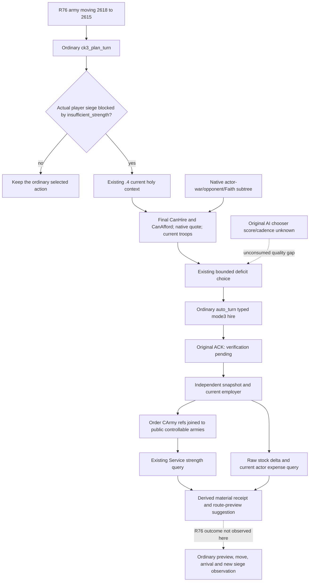

# R76: ordinary holy-order reinforcement after an observed siege deficit

Source-only cutoff: 2026-10-08 / ISO2026-W41. Input is
`cc1e6a9e249ebeffdba1e6c910615041f090bf34`. The retained actual identity is
CK3 **1.20.0.4 / Steam25734779**, executable SHA-256
`98702F88A547CDE2EAF29A85F93B85F68EE4CF8148336A4F7AFAEB75319DD518`.
Identity, native source proofs and earlier GREEN receipts are reused; this
worker performed no EXE read/hash, build, import, test, SDK, game or live query.

Root's supplied R76 frame has Robert **29829**, WarID **100663329** against
**31050**, and public army **218104048** moving **2618 -> 2615**. These are
coordination inputs, not a new paused snapshot captured by this worker. No
R76 holy-order price, CanHire answer, siege deficit or hired army is claimed.

## Native decision inputs already published

The [native chooser research](religion-holy-order-native-ai-choice-12003.md),
[war qualification tree](religion-holy-order-war-eligibility-12003.md) and
[actual .4 query/ordinary-command source](religion-holy-order-query-and-ordinary-hire-12004.md)
are the native inputs to the existing
[measured-deficit policy](holy-order-siege-reinforcement-planning-12004.md).
The .4 bindings preserve final native CanHire `2619C30`, evaluated quote
`26198C0 -> 2619960`, current soldiers `261ACF0`, independent current war
qualification `261C100`, and ordinary mode3 command validation/owning queue.
No additional observer is needed for this bounded decision.

War qualification uses actual actor wars, opposing members and bidirectional
Faith hostility. A CB name or Rite equality does not replace it. Final CanHire
retains the title-holder and other native branches. The independent war answer
is explanatory evidence; the policy consumes final CanHire directly. The
parallel holy-war NPC-join collector is a separate consumer and has no
dependency in this route.

| Existing holy-context field | Value consumed or recorded |
| --- | --- |
| `rows[].holy_order_id`, `is_military`, `employer_id` | Exact generation-bearing order identity, military kind, current employer; ID0 remains legal. |
| `military_terms.available`, `can_hire`, `can_afford` and both reason literals | Current final native legality and affordability; false differs from unavailable. |
| `military_terms.current_war_eligibility` | Independent `available`, `qualifies`, and native reason; preserve its original answer without adding a second permission rule. |
| `military_terms.resource_costs_raw`, `resource_scale` | Entire evaluated ten-slot signed quote at scale100000; slots0/1/2 are gold/prestige/piety. |
| `military_terms.hire_cost_context` | Original effective holder, dynamic patron and demanded loaded-factor evidence; undemanded nulls remain null. |
| `military_terms.troop_strength.current_soldiers` | Available current native headcount, compared with the measured deficit; no scale or arrival promise. |
| `military_terms.troop_association.rows[]` | Original regiment references and resolved full `native_carmy_id`; repeated associations and CArmyID0 remain valid. |

Original-AI chooser score, cadence, budget and isolated per-order upkeep remain
quality gaps in the linked research. The present policy ranks eligible rows by
native piety quote, then gold, prestige, full ID and source occurrence; it does
not claim the original AI's optimal choice. Actor expense totals are available
for current resource consequences and do not establish isolated order upkeep.

## Exact normal entry and tool arguments

The ordinary registered entry is **`ck3_plan_turn({})`**, followed by
**`ck3_auto_turn({})`** when Root elects to execute the newly planned turn.
`auto_turn` replans; retain its actual plan and revision instead of supplying
an archived proposal. Existing `Service.plan_turn` hooks the policy at
`bridge/service.py:1407`; `_execute_planned_turn` dispatches its typed hire at
`:3129`. Shared Service and MCP registration need no change.

The reinforcement branch requires the planner's exact
`phase="native_war_siege_exit_blocked"`, `selected_step=null`,
`siege_state.status="insufficient_strength"`,
`siege_state.player_army_besieging=true`, its real province/garrison/besieging
strength, and a `pursuit.war_id` present in the current active-war snapshot.
The measured need is **garrison_size - besieging_strength**. Moving toward 2615
alone supplies none of these siege observations. A blocked plan lacking this
measured shape retains its ordinary result; it must not be rewritten into a
synthetic reinforcement request.

Use fresh public `snapshot.revision` for `expected_revision`. Preserve native
revision and capture epoch separately. The following placeholders are values
read from that frame, not hardcoded R76 constants:

| Registered tool | Exact arguments and result use |
| --- | --- |
| `ck3_take_snapshot` | `{"include_native_command_history": false}`; save actual snapshot/actor/date/public revision/native revision and gold/prestige/piety raw stocks. |
| `ck3_query_player_holy_order_context_v1` | `{"expected_revision": R}`; whole strict .4 context, all original candidate rows, final reasons, war answer, ten-slot price and headcount. Registered by existing `allow_private_player_religion_context_query`. |
| `ck3_plan_turn` | `{}`; policy obtains the same existing current query only after the concrete siege block. Selected phase becomes `native_war_holy_order_siege_reinforcement`, step `hire-holy-order-v1`, with `holy_order_hire_proposal` and `deferred_siege_plan`. |
| `ck3_auto_turn` | `{}`; ordinary planning/typed submission/postcondition path. Keep the actual returned proposal and selected revision. |
| `ck3_hire_holy_order_v1` | Existing direct primitive is `{"holy_order_id": FULL_ORDER_ID, "expected_revision": R}`. It sends only the full order ID beyond the normal frame binding; mode3 is native. This primitive alone does not invoke the policy's derived postcondition, so use ordinary auto_turn for the policy loop. |
| `ck3_query_army_strengths` | After an independent snapshot, `{"army_ids": CURRENT_PUBLIC_PLAYER_ARMY_IDS, "expected_revision": R_AFTER, "ordered_refill_entry_mode": "observed_prepared", "ordered_besieging_entry_mode": "observed_prepared"}`. Full truth is MCP `structuredContent.army_strengths`, not its text summary. |
| `ck3_query_war_cash_current_resources_private_v1` | `{"expected_revision": R_AFTER}`; preserve original treasury, monthly flow and current/all-raised military-expense vectors. Existing registration uses `allow_private_war_cash_query`. |
| `ck3_execute_step` | For the receipt's next preview only: `{"step": NEXT_FORMAL_SELECTED_STEP, "expected_revision": NEXT_FORMAL_EXPECTED_REVISION}`. The suggested step is `preview-move-army-<publicArmyID>-to-<originalSiegeProvince>`. Save the real preview then return to `ck3_plan_turn({})` for ordinary movement/advance choices. |

The planner needs existing capability `game.command.hire-holy-order-v1`.
Current eligible troops must cover the deficit and native CanAfford must be
true; positive gold/prestige/piety quotes are checked against the actual raw
stocks. Preserve all ten price slots without combining currencies or using
stock factors to recompute a quote. The previous 106-piety price and synthetic
test price are not R76 observations. A complete available context with final
CanHire false records `native_can_hire_false` and the native reason; an
unavailable context records the actual input failure. Neither calls hire.

## Independent material receipt and source correction

Keep the original submitted command result unchanged, including
`after_state_observed=false` and verification pending. The separate
`holy_order_reinforcement_postcondition` records an independent after snapshot,
matching current context and selected full order ID. Actual employer 29829 is
the first material fact. Joining resolved association CArmy references to
available strength rows and current public controllable armies with positive
soldiers establishes `usable_army_observed`; literal army owner is recorded
and may differ from employer. Do not infer an army from the pre-hire order's
headcount or command acceptance.

Retain before/after raw stocks and signed before-minus-after deltas. The
existing `unchanged_date_quote_delta_match` is reported only when dates match,
all other quote slots are zero and all three stock deltas are known. This is an
observed agreement, not isolated causal payment attribution. Keep the original
cash result, any expense-query failure, association and material-army rows.
The strongest observed associated army produces a route-preview suggestion to
the original measured siege target; it does not execute a move or claim
arrival. `full_hire_loop_complete` remains false until the later real loop is
separately observed.

Source review found a concrete production call mismatch at the input policy's
line195: it called `driver.query_army_strengths`, but
`NativeHeadlessGameplayDriver` is a standalone class without that method.
The real normalized reader is `GameplayBridgeService.query_army_strengths`
(`bridge/service.py:4792`), which calls native `query-army-strengths-v1` and
retains the normal scope/frame/normalizer behavior. The policy now resolves
this existing Service reader when the driver has no convenience reader.
Existing drivers that supply a reader keep their original path. This only
repairs the already-selected hire's independent post-read; it adds no native
field, MCP tool, shared-file hook or gameplay restriction.

The previous sole policy compound and the repaired registered hire consumer
`2c0c75492a48724296e7b90a637f109edc023931` GREEN are reused without rerun.
That policy fixture supplied its own driver strength reader, so it did not
qualify the newly repaired NativeHeadless fallback. This source correction is
**authored / execution NOTRUN**. R76 current CanHire, price, hire, associated
army, route, arrival and siege progress remain Root-owned future material
observations; no production-live loop or new game-day credit is assigned here.

Oct8/W41 coordinator fields: existing actual4 observations sufficient;
ordinary blocked-siege entry frozen; one concrete post-read call repaired;
source-only validation; old GREEN reused; new executions/builds/EXE reads/game
operations 0; next step is Root's ordinary fresh-frame planner consumption and
the above independent material receipt. No push or live-tree mutation.
