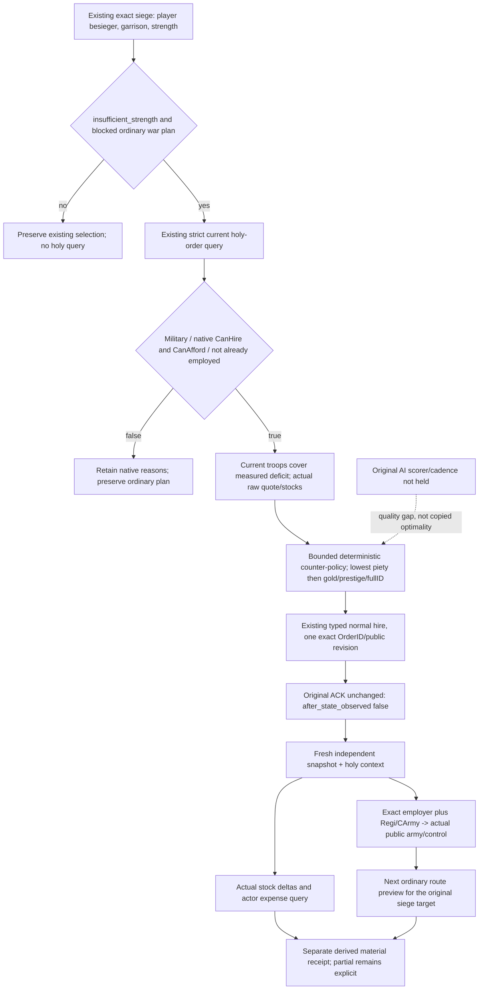

# Ordinary holy-order reinforcement for a measured siege deficit

Source-first cutoff: 2026-10-07 / ISO2026-W41. Integration input is
`6a0987082ab069176b12274e3362333fe2e746a3`, actual CK3 1.20.0.4 / Steam25734779,
retained SHA `98702F88A547CDE2EAF29A85F93B85F68EE4CF8148336A4F7AFAEB75319DD518`.
This implementation follows the [hire/army/expense tree](holy-order-hire-army-treasury-player-value-12004.md)
and [actual4 ordinary command source](religion-holy-order-query-and-ordinary-hire-12004.md).
Local CK3, SDK, injection, UI and process access remain forbidden to this worker.

## Concrete necessity and native inputs

The existing planner already observes an actual player siege's native garrison
and besieging strength. `strategy._current_exact_siege_status`15181 returns
`insufficient_strength` when the observed besieger count is below the observed
garrison, with the exact siege/province/player-besieger fields. It can produce
`native_war_siege_exit_blocked` with no selected step and the original
`siege_state` and `pursuit.war_id`. The planner does not currently consume the
already qualified holy-order rows. A presently legal order with enough
current troops provides a concrete reinforcement alternative to that measured
blocked siege; this is not a reason to manufacture a war or replace an urgent
move, event, court action, retirement or another already selected action.

The existing actual4 final CanHire/CanAfford, evaluated ten-slot price, current
soldiers, employer, full-reference association, public army/controllable and
cash methods remain the native authorities. No new EXE input is required.
The planner uses the native quote and actual same-frame gold/prestige/piety;
there is no arbitrary reserve floor, leader500/1500 budget, power-to-win-odds
conversion or guessed original-AI utility. Existing original-AI scorer/cadence
and exact per-order upkeep remain unconsumed quality gaps with the named
research entrances documented in the existing native topics.

## Exact API and two Service hooks

Owned new module `xar_autoplayer/holy_order_siege_reinforcement_v1.py` provides:

- `choose_holy_order_siege_reinforcement_v1(snapshot, plan, holy_context)`:
  pure bounded proposal using the existing strict holy normalizer, exact query
  frame, current stocks and native fields. Full ID0 is legal. Native false and
  unavailable remain different results; no invented candidates or inferred
  zero values.
- `plan_holy_order_siege_reinforcement_v1(driver, planned, snapshot,
  bridge_capabilities)`: called once after Service's ordinary planning view;
  fetches the existing strict query only for the concrete blocked siege shape.
  A proposal selects existing `hire-holy-order-v1` and carries typed OrderID,
  native price, before stocks and the original measured target value.
- `submit_holy_order_siege_reinforcement_v1(driver, plan,
  expected_revision)`: uses existing typed hire, preserves original ACK, then
  independently queries current snapshot/holy context/army strengths/current
  cash. Publishes a derived receipt and the existing preview step as next
  formal action. It never mutates the original ACK into observed hire/payment.

Only isolated `Service.plan_turn` and `_execute_planned_turn` receive the two
minimal hooks. There is no new MCP registration, build target, native DTO,
provider, generic gate, WAL or current Root/shared-file mutation. Root merges
this isolated candidate. The meaningful sole offline compound covers the
actual Service planning hook, strict query/pure value, typed submit and
independent post query, with explicit synthetic world/native outcomes. It
does not replay the old four native migration scenes or claim new native/live
qualification. Its authoring/execution status is recorded in the external
ROOT-DELIVERY rather than inferred from source.

The policy's value is present reinforcement for a measured player siege.
Candidate current troops are a potential contribution, not guaranteed arrival
or battlefield strength. The postcondition observes actual full-reference
association and public controllability; route acceptance and army arrival
remain subsequent ordinary decisions. Actor expense totals cannot establish
the order's isolated upkeep contribution, and unchanged-date stock/quote
agreement is reported as an observed match rather than unconditional causal
payment attribution.

## Existing migration consumer reused without rerun

`hire-consumer-only-fix06/registered-root-consumer-only-logs/RESULT.json` records
the real GREEN consumer with source `2c0c75492a48724296e7b90a637f109edc023931`,
exit0,3.6389565s, started2026-10-06T21:48:02.044453Z. It reused four genuine
native whole packets, wire SHA
`f48c1d1f59702616d32181675ce27ed6293a4c3c4b8c0ec71af5f8a25031aedf`.
The registered result keeps `whole_native_domain_preserved=true` and no live
credit. Root adopted the fix as
`14aac4da885632e817fa3259a6859f296c0906e5`; its test file and current6a source
both have Git blob `0d82bfecdd23509cb8fd9902874a3ec74cacda7b`.
Original FIRST02 and intervening harness RED03/04/05 remain retained. Native
producer/consumer retry executions for this reuse task are0.

## First offline Service qualification

On 2026-10-07 at 10:47:19–10:47:23 UTC (18:47 Asia/Shanghai), the sole new
`HolyOrderSiegeReinforcementServiceV1Tests.test_new_service_siege_choice_normal_hire_independent_post_and_next_formal`
case passed on its first attempt in 4.4833031 seconds. The source preimage was
`6a0987082ab069176b12274e3362333fe2e746a3` plus this isolated candidate. The
dependency-complete tools interpreter ran with `-B -X utf8`, without `-O`.

The compound exercised the two production Service hooks, production holy
context normalizer and typed hire ACK normalizer. It checked native refusal
without a hire, measured-deficit selection with full OrderID0, one normal hire,
independent employer observation, duplicate association occurrences joined to
one public controllable army with CArmyID0, literal army owner4444 distinct from
employer29829, unchanged-date piety/quote match, an independent expense query,
the next ordinary route preview, and no second hire after current CanHire=false.
The original ACK's `after_state_observed=false` remained intact.

The native world, query outcomes and callback outcomes were synthetic. This is
new policy `static-ready` evidence, not a genuine native execution, live hire,
arrival, isolated upkeep attribution or complete siege loop. New/old case
counts are1/0; native producers, native builds, EXE reads, CK3/SDK/UI/process
operations and old migration consumer reruns are all0. Root owns integration
and any later permitted production outcome.

The immutable first receipt, logs and complete Service projection are under
`C:/codex-ck3-background/packets/holy-order-siege-reinforcement-20261007/first-python/attempt01/`.
`RESULT.json` records the exact invocation and time; `SERVICE-PROJECTION.json`
retains both ordinary plans, the untouched typed ACK, derived postcondition and
driver calls. The owner delivery records the final source pin separately.
