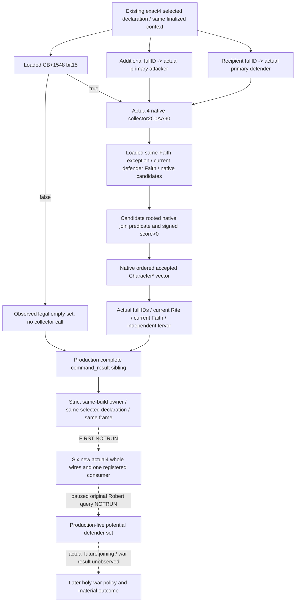

# Native potential holy-war defender set on CK3 1.20.0.4

2026-10-08 / ISO2026-W41: **source-ready candidate, FIRST0**. The frozen target
is CK3 **1.20.0.4 / Steam25734779**, EXE SHA
`98702F88A547CDE2EAF29A85F93B85F68EE4CF8148336A4F7AFAEB75319DD518`.
The native source base is qualified Runtime30 source
`4e06f9454ef9f0e8173d30d8259625d3396929b9`; the SDK overlay baseline is
`cc1e6a9e249ebeffdba1e6c910615041f090bf34`.

## Native source first, held candidate reused

The [CB-only ordinary holy-war query](ordinary-holy-war-declaration-context-12004.md)
already has a qualified actual4 context and quote factory. Its existing
selected-declaration MCP is the carrier for this independent observation.
The held `bef0af09e113a523959a3f22505f6d1e8f796b3f` exact3 candidate supplies
its existing software DTO, collection reader, strict semantics and six whole
scenes; its old source and qualification-NOTRUN artifacts are retained.

Root executed the finite recipe once at2026-10-08T03:20:12.729442Z.
`faith-g2-next/root-first-source-map/FAMILY-MAP.json` records two
`complete_instruction_span_normalized_equal` rows, **1554 new bytes /2 reads**,
and no old executable capture. The Root invocation completed exit0 in0.5697919s.
This source operation did not execute game code or a fixture.

| Exact actual4 source | Retained semantic evidence |
| --- | --- |
| `2C0AA90..2C0B057`,1479B collector | Complete native body preserves four arguments, loaded same-Faith exception operands`CB+18A8/+18B4`, native accepted NPC order, defender Faith equality, rule/value evaluation and signed-positive append. |
| `2A7F5EC..2A7F637`,75B caller witness | Reads CB`+1548` bit15; creates24B vector; actual RIP reaches allocator`54DEDE0`; actual call reaches`2C0AA90`; reads rows`+0` and signed count`+C`. The caller's later war-join mutation is not invoked or expanded. |
| Existing actual4 religion/core factories | Character Rite`28D2F70`, Character Faith`289E730`, Rite Faith`24FC540`, Faith fervor`243EA70`, full-generation resolution and current owning frame. Reused qualified source, zero duplicate capture. |

Complete instructions, actual ordered rel/RIP targets and finite local control
are in the two immutable detail receipts. The allocator is source-reached data,
not an inferred address shift. Only the collector entry is called by this new
reader; rule/value helpers and all native internal references are followed by
the game's own current collector, rather than copied into an old-image factory.
Full numeric join-score breakdown and eventual participation remain separate.

## Exact factory and minimal same-query hooks

`ck3_12004_holy_war_defender_join_inputs.hpp/.cpp` exposes
`BindHolyWarDefenderJoinInputsImage12004(base,sha,actual_existing_faith)`.
The factory accepts the actual4 identity and supplies only the source-closed
collector/allocator plus the caller's actual4 faith/core bindings. The original
exact3 factory is retained independently; it receives no alternate hash.

The copied software reader and serializer retain their historical12003 symbol
names. Their addresses come from the actual4 factory. The owning mailbox's
actual4 branch uses `BindReligionContextImage12004`; the complete production
serializer's existing `Render12004BuildIdentity` publishes the child schema
`ck3_12004_holy_war_defender_join_inputs_v1`. No post-hoc whole packet is built
by Python.

Existing step and MCP remain
`query-player-ordinary-holy-war-declaration-context-v1` and
`ck3_query_player_ordinary_holy_war_declaration_context_v1(expected_revision,declaration_id)`.
The sibling is `player_holy_war_defender_join_inputs`, with the retained25-key
DTO and8-key row. It carries actual played identity separately from finalized
attacker/defender, preserves generation bits and native order, and reports
legal empty/zero independently from failed reads. A row's failed fervor read
retains the accepted set and that row's observed identity. No new MCP, CLI,
feature flag, player action or generic readiness gate is added.

The strict leaf admits actual4 child schema only when normalized owner and
snapshot hello have the exact actual4 build/SHA. Exact3 stays compatible with
its own schema. The existing transport/NativeDriver/Service/registered tool
carry the optional sibling in one query. The four-argument selected reader is
retained, while the six-argument overload observes this child before existing
context cleanup. Old CB quote status, final CanSend and fallback semantics
remain independent from this optional set.

## Sole new qualification, not yet executed

The owned CMake leaf adds the held software collector TU and the new actual4
factory TU to the existing runtime. Its sole new target is
`xar_ck3_12004_holy_war_npc_defender_join_whole_mailbox_test`. It links the actual
runtime/protocol/user32, inherits current PUBLIC definitions and uses
`/UNDEBUG /W4 /WX /permissive- /EHsc /utf-8`. It receives one Root-created output
directory; no old main or CTest is run.

The six retained scene definitions become six new current-build whole wires:
ordered positive rows; legal zero and same-Faith exception; native empty set;
CB bit15 disabled; one fervor failure retaining the accepted set; finalized
role fallback leaving old context/CB quote observed. Synthetic callbacks and
memory remain explicit. The producer first samples the real new factory's
addresses, then substitutes its declared synthetic callbacks. Actual game
collector branches are not executed by this fixture.

The sole consumer is
`ck3_autonomous_player/tools/holy_war_defender_join12004_registered_mcp_compound.py`,
method `test_six_actual4_compiled_native_sets_registered_mcp`. It ingests the
six untouched compiled packets through the real registered MCP, Service,
NativeDriver, private query transport, protocol state and strict normalizer.
Only the outer request nonce is correlated. It writes`OBSERVED.json/RESULT.json`.
The exact argv, source pin, changed owners and Oct8/W41 fields are in
`Z:/ck3_mod_rewrite_process_assets/g2-parallel-20261008/faith-g2-next/actual4-source/`.

Worker build/test/import/SDK/game/process/new-EXE/hash counts are0. Root's
1554B source operation is the only fresh capture and is reported separately.
Source whitespace is checked once before the English source commit. This is
not static-ready or live qualification, and it adds no game days/G2 credit.
Current Robert's claim War100663329 is not reclassified as a holy war. Normal
war play proceeds independently; canonical total costs, full forecast and a
later selected holy-war action retain their own unfinished functional work.
