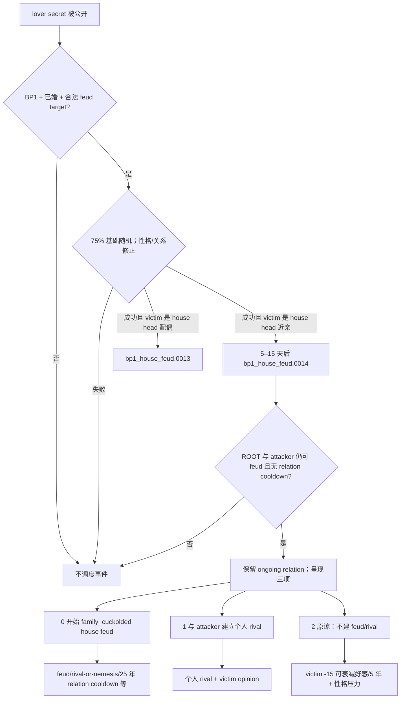

# CK3 1.19.0.6 `bp1_house_feud.0014` 家族受辱决策树

## 状态与入口

- [static-confirmed] 本专题绑定 CK3 `1.19.0.6` 与 EXE SHA-256
  `2D00FF3101EF70B566F2FCBAE292F09263199C80E9DC8F139B82D7D96F83DB86`。
- [paused live RED] R414 attempt 2 在原 PID `202268` / generation `1` 命中 instance `1066`，三项均
  shown/enabled，动作未提交。该 RED 表示 harness 缺少事件合同，未证明天朝二期产品失败。
- [counter-policy static-ready, live action pending] 恢复路线固定 authored `3` / native `2`；旧 instance
  消失或前进前不能标成 production-live primitive。

恋人秘密公开后，`house_feud_lover_exposure_effect` 检查 BP1、婚姻和 feud 目标；满足条件时，以 75% 基础
概率让有关 house head 在 5–15 天后收到事件。vengeful 增加 25，forgiving、已有坏关系各减少 25。
事件本身有五年 cooldown，并要求当前 house relation 不带 `house_feud_cooldown`。

## R414 scope 合同

实机继承了 birth/adultery 链的 15 个 saved scope。它们归并为三组不同且均非 ROOT 的人物别名：

- `mother = adulterer_check = house_feud_spouse`；
- `father = spouse = adultery_spouse = assumed_father = secret_exposer = house_feud_victim`；
- `real_father = sex_partner = house_feud_rival = house_feud_attacker`；
- `is_child_of_concubine`、`matrilineal` 为 boolean。

合同冻结这些关系与三项 native `0/1/2` 投影，不冻结 R414 的人物 ID、日期或 instance。

## 原生 AI 与我方路线

三项 `ai_chance` base 都是 25。native 0 偏向 bold/vengeful，文化参数可乘 1.25；native 1 使用
boldness `-0.5`、vengefulness `+0.5`；native 2 对两者都用 `-1`。这说明原生 AI 会按性格偏好复仇，
但不决定当前产品恢复的目标。

native 2 是唯一不创建 house feud 或个人 rival 的路线。它让 victim 对 ROOT 获得 `-15`、五年衰减的
Ignored Plight opinion；vengeful/arbitrary/wrathful/brave/ambitious/arrogant ROOT 会获得从 major 到 minor
不等的压力。当前有界终态验收接受这项明确代价，以避免启动跨家族长期冲突。

## 证据

- `events/dlc/bp1/bp1_house_feud.txt:2310-2433`，SHA-256
  `37B6E662C4FC388E51D5B8EBC6F0FBCE7AE3FDCB825BFE121D23B971966469DA`。
- `common/scripted_effects/03_bp1_scripted_effects.txt:6-120,411-420,467-529`，SHA-256
  `30F4823A7A77C3FF6D96C5E43F3F4FC3F531D4A8584EDC8E99177A2BFE468ADB`。
- R414 RED：`_runtime/p1-post-chaos-terminal-r414-20260911/live-artifacts/terminal-stages-red-attempt-02.json`，
  SHA-256 `A0837453C72CB67300AE07EB76EB2B53A75CB511838543696F2891BD2AF80346`。

