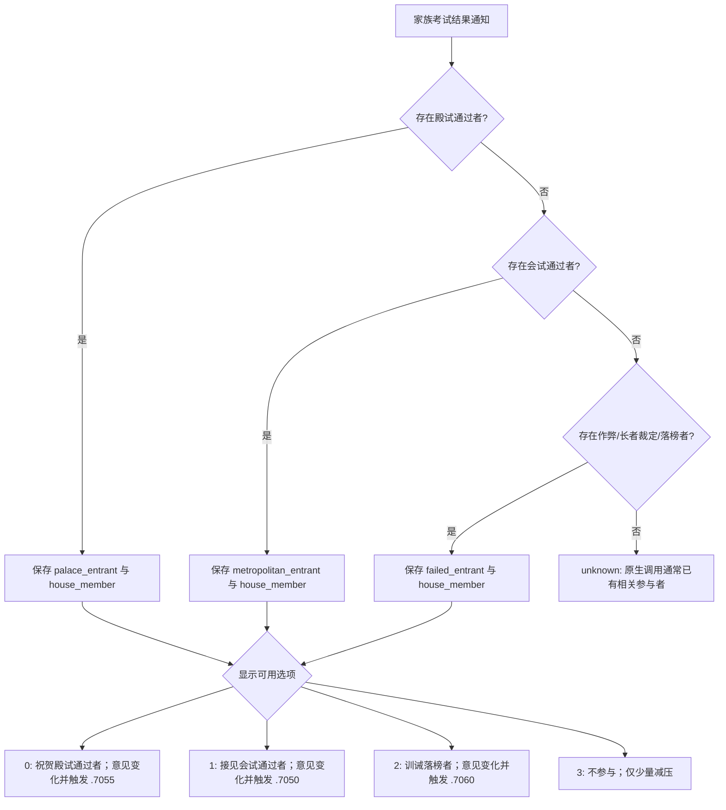

# 御前考试家族通知（`imperial_examination.7100`）

## 冻结边界

- 游戏版本：CK3 `1.19.0.6`
- EXE SHA-256：`2D00FF3101EF70B566F2FCBAE292F09263199C80E9DC8F139B82D7D96F83DB86`
- 事件定义：`game/events/activities/imperial_examination_activity/imperial_examination_events.txt`
- 定义 SHA-256：`346473CEC077E2035D364322DFDB3BE9ED20F9925EEB1D5926FDD26B9FC4726A`
- 定义位置：8627–9104 行
- 调用入口：`game/common/activities/activity_types/imperial_examination.txt`
- 入口 SHA-256：`B7FC4A23A31210DF0C43516A345D9D4A9979259848E023BAAA7DAF4D0413687A`
- 入口位置：1227–1237 行；考试活动结束时，对尚未收到家族后续通知的相关家族成员触发 `.7100`

## 原生分支

事件先统计玩家相关的考试参与者，再按下列优先级选出一个叙事人物。被选人物同时保存为 `house_member`：

`immediate` 中的选择链是互斥的，因此 `palace_entrant`、`metropolitan_entrant`、`failed_entrant` 只会出现一个；对应结果变量决定选项 0、1、2 是否显示。选项 3 始终是明确退出路径，只执行 `minor_stress_impact_loss`，没有 `trigger_event` 或 `add_opinion`。

## 自动玩家策略

终局恢复只需排空既有原生弹窗，不把家族考试结果改写成产品验收结果。策略固定选择 authored option 4 / native index 3，并对原生的互斥 saved-scope 形状做精确匹配：

- R408 instance `2161`：`palace_entrant = house_member`，渲染 native `(0, 3)`。
- R422 instance `1114`：`metropolitan_entrant = house_member`，渲染 native `(1, 3)`。

两种形状都来自同一原生优先级链，安全出口的语义相同。当前没有 `failed_entrant` 实机样本；如果以后命中，应先按同一冻结源码确认 `(2, 3)` 和 saved-scope 身份，再加入契约，不能把未观测分支当成已验证。

## 证据状态

- 原生定义与 caller：`static-ready`，已逐行审阅并冻结 SHA。
- palace 分支：`production-live primitive`，R408 已观测。
- metropolitan 分支：R422 已冻结 RED 窗口，契约补齐后仍需在同一 PID 选择 option 3 并验证弹窗实例消失，完成前不写 GREEN。
