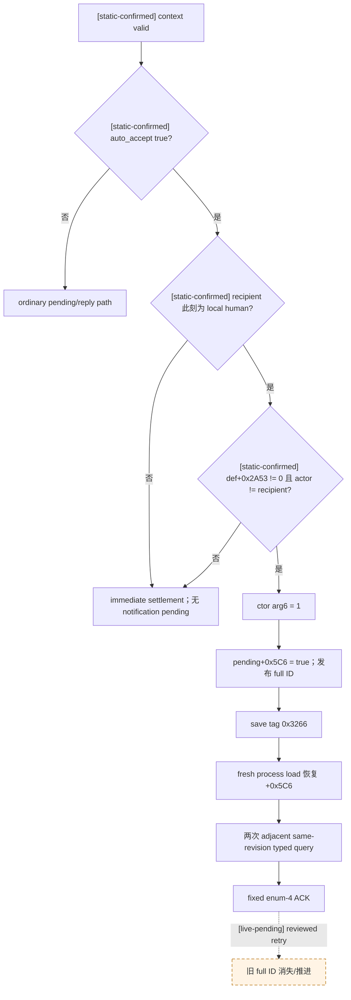

# CK3 1.19.0.6 非宗教 interaction notification 生成与 ACK 实机夹具

## 范围与结论

- [static-confirmed] 本文只绑定 CK3 `1.19.0.6` 的
  `Crusader Kings III/binaries/ck3.exe`，SHA-256
  `2D00FF3101EF70B566F2FCBAE292F09263199C80E9DC8F139B82D7D96F83DB86`。RVA
  以模块基址为零点，区间均为 start-inclusive/end-exclusive。
- [static-confirmed] `CPendingCharacterInteraction+0x5C6` 是构造时写入、随存档序列化并在冷载时恢复的
  `is_notification` 字节，不是普通 pending 生成后由 UI 补写的标记。
- [static-confirmed] notification materializer 的必要门是：auto-accept 分支、发送当下 recipient 为本地 human、
  `definition+0x2A53 != 0`、actor 与 recipient 不同。`on_auto_accept` 不是 materialize 前置条件。
- [implementation-confirmed] 最小 fixture 使用独立、只含定义的非宗教 mod；同一字节定义同时加载于 seed 与 fresh cold
  阶段。seed 另加载 disposable `mod_bridge` 发出互动；cold 阶段没有 `mod_bridge`/inbox，只由 production native bridge
  执行 typed query 与 fixed ACK。因此准确口径是 **fixture-definition playset + production native bridge**，不是 stock，
  也不是 production-only playset。
- [owner-deferred] 不读取或实现 faith、doctrine、tenet、fervor、conversion、reformation、holy-war 等宗教专用语义。

## 原生生成、持久化与清理树

### 1. dispatch：决定 auto-accept 路径

`0x2752620..0x27528F2` 先由 `0x2C43F00` 校验 `CCharacterInteractionContext`，再读取
`definition+0x2580` 的 authored trigger（调用 `0x334C510(context+8)`）或无 trigger 时的
`definition+0x2A48` scalar。结果为 true 时进入 `0x2752825` 的 immediate/auto-accept 分支，并在
`0x27528D9` 调用 `0x2752900`。

### 2. materializer：recipient 必须已经是本地玩家

`0x2752900..0x2752AF1` 的已闭合门：

1. `rdi` 是 interaction context；`rdi+0x2DC` 解析 recipient CharacterID。
2. `0x2752918..0x275295F` 用 `0x28BCEB0` 检查 recipient 是否属于 human/local player；false 直接跳到
   immediate settlement，不分配 notification pending。
3. `0x27529C1..0x27529CB` 要求 `definition+0x2A53 != 0`。
4. `0x27529D1..0x27529DD` 要求 `context+0x2D8` 的 actor CharacterID 与 recipient 不同。
5. 通过后，`0x27529E3` 把 stack `+0xA8` 设为 `1`，其地址作为构造器第六参数；`0x2752A36` 调
   `0x27541F0`，`0x2752A54` 再由 `0x2751DF0` 发布 engine-owned pending。

`on_auto_accept`/`on_accept` handler 链位于上述发布点之后，所以 handler 是否存在不能决定
`+0x5C6` 是否创建。fixture 仍保留两个仅写 `debug_log` 的 handler，作用只是证明引擎已走完整 auto-accept 路径；
它们没有游戏状态副作用。

### 3. constructor：一次写入完整 ID 与 notification flag

`0x27541F0..0x27543BE` 使用 `0x5C8` component stride，并在 `+0x10` 写 generation-bearing full ID。
`0x27542F7..0x2754300` 读取第六参数，`0x275438C..0x2754392` 执行
`cmp ebp,1; sete cl; mov [pending+0x5C6],cl`。同一调用还把两个 auto-accept 结果写入 `+0x5C4/+0x5C5`；
它们与 notification flag 是三个不同字节。

### 4. save/load：`is_notification` 跨冷载恢复

- `0x2750E8F..0x2750ED1` 检查 `pending+0x5C6`；仅在非零时写 tag `0x3266` 及 bool 值。该段所在 exact
  `.pdata` row 是 `0x2750E01..0x2750EE1`。
- `0x2750EF0..0x275102A` 的 loader switch 在 `0x2750F69..0x2751007` 识别 tag `0x3266`，把 bool parser
  的目标地址设为 `pending+0x5C6`。
- EXE file offset `0x429E4C8` 存在 interned string `is_notification`。tag 与字符串的注册/互映入口仍未单独闭合，
  但 writer、reader 和字段两端已经闭合。

这证明只要 cold playset 仍能解析相同 interaction definition，notification flag 设计上就会随 checkpoint
保留；Attempt 2 移除定义后丢失 pending 不能用来否定该字段的存档能力。

### 5. lifetime/removal 与 reply-days 边界

- `0x2751310..0x275140F` 按 low-24-bit slot 查表后再次比较 full generation ID，析构完整 `0x5C8` component，
  将槽位回收到 freelist。
- `0x2751810..0x2751C3C` 的 lifecycle sweep 先 generation-resolve，再调用 `0x2C42A30` 做当前回复状态/对象有效性
  检查；失败时调用 `0x2751310` 删除。definition 在 cold stage 缺失是可导致 pending 无法继续有效解析的边界之一。
- `+0x5B8/+0x5BC` reply-day 计数参与后续寿命，但不是 notification 构造门。fixture 在 paused、同日 cold load后
  立即 query/ACK，不靠推进日期触发。



## exact-build 证据

| 语义 | RVA | 边界 | file-backed SHA-256 |
|---|---:|---|---|
| interaction dispatch / auto-accept branch | `0x2752620..0x27528F2` | exact `.pdata` | `2C2941F025AC7C0DF1617F5BF9A266362E5246C8CA326ACC20D9DEE38646E808` |
| human-recipient notification materializer | `0x2752900..0x2752AF1` | exact `.pdata` | `F284B496FD9BE7E2E28C7E56C1C4C0ADC5D1C03335D9091826BB5ED61D41C134` |
| pending constructor / `+0x5C6` write | `0x27541F0..0x27543BE` | exact `.pdata` | `5F7FCA209ECE701F45E6E578C794A163E1C0E0E22C5F7F3CC19788C91D903C20` |
| save writer containing `+0x5C6` tag | `0x2750E01..0x2750EE1` | exact `.pdata` | `6E44A00F080E717FCF4A1CE53C4E6A513E8A7565FB9CDF6C2B5E0DA0029DF28D` |
| load switch restoring `+0x5C6` | `0x2750EF0..0x275102A` | exact `.pdata` | `5A5C4C38116D0BD5762C2E0E1B51F7895C3739D5DDC707B8FBECA653182F28F9` |
| generation-safe component deletion | `0x2751310..0x275140F` | audited code span | `8376277D32C404AB57DC43C2ACF69EBE3F7267DC91BC55899D93010BFEB9E75E` |
| pending lifecycle sweep | `0x2751810..0x2751C3C` | exact `.pdata` | `0312C79CE0CD4B55E069D9FDC5745B023E27E94A4F2543DB796EBE214BEFC7CF` |

脚本端 schema：

- `_character_interactions.info` SHA-256
  `F360C05B72CD2B0D87885E570FA55E70E41089DEFB4675BE5A82E390940D5D10`，定义
  `auto_accept = yes/no/trigger`，并说明 `force_notification` 在 auto-accept 时强制生成 diplomatic item。
- [unknown] `force_notification` token 到 `CCharacterInteraction+0x2A53` 的 reflection/member-table writer 尚未单独定位。
  schema 语义、materializer read gate 与端到端 live fixture 足以支持本次能力；不能把未定位 writer 标成已闭合。

## bounded stock 候选审计与 RED 账本

`force_notification=yes` 的 stock 非宗教定义主要分成：succession vote/hook、faction/hook、contract subtype/terms、
tributary subtype/terms、council/court-position 专用入口，以及两个已实跑的普通候选。前几类都要求额外 target、hook、
subtype 或 contract payload，不能用当前无 options/target 的最小 disposable save 确定性建立；宗教文件和 witch 专用候选
按 owner-deferred 直接排除，不继续研究。

| Attempt | artifact SHA-256 | 已确认事实 | cleanup |
|---:|---|---|---|
| 1 | `76CF9670B38F0B80018E3C384C0AA61663FB454301C0F810227BFBA60C143343` | `execute_threshold=accept` 没有留下 pending；该入口不证明“发送请求”。 | managed GREEN |
| 2 | `E640F9ED431EB4C071805BA5B9306E420A57121BC1A9D3264753FEA116F3B3AB` | synthetic 非宗教 override 真实生成 full ID `738197506`、`+0x5C6=true`；移除定义后 production-only cold load 丢失 pending。 | managed GREEN |
| 3 | `F7A07CE8A6FD84519A2AA3723AA46BA908AEBE2306412F051E447FBC103EAB3B` | stock `grant_independence_interaction` 关系存在，但完整 validity/send 未闭合。 | managed GREEN |
| 4 | `7B42CCDD1F4C4FFACD21BC93D2F224C323AEFFB1DEB2D8282F6516DD4EFB4AAF` | stock validity gates 全 true；recipient-root `run_interaction` 未执行 `on_accept`。 | managed GREEN |
| 5 | `C8EE5E2C1F354DA38D137260FB28DF2C895D3A872E0F8ADDDF3EEBA46FA39E74` | validity 全 true、actor-scope send 仍被 stock `ai_will_do base=0` 阻断。 | managed GREEN |
| 6 | `726F468A46C39462370A8422B7CBC15093310A7F34E769AE7D78C01E1E9DC607` | stock `remove_guardian_interaction` gates 全 true 且 `on_accept` 移除关系；发送时玩家是 actor、ward 是 NPC recipient，因此命中 native non-human-recipient immediate settlement，正确地没有 `+0x5C6`。 | managed GREEN |
| 7 | `F2B93511495648FA43AACD04EE6C25A77329C8B00C647B93ED7897B8EA98EC72` | definition-only fixture 的 seed GREEN：full ID `738197506`、sender `29829`、`+0x5C6=true`、date `53175816`、public/native revision `6/5`；cold CK3 启动前被通用 singleton profile verifier 拒绝双 mod playset，未执行 query/ACK。 | seed managed GREEN；cold 未拉起；见下方外部精确 cleanup |

结论：不再逐个盲跑 stock candidate。Attempt 7 使用 truthfully labeled definition-only fixture，NPC actor `29829` 发给已切为
local human 的 recipient `36108`；同一定义跨 seed/cold，直接覆盖 native audit 证明的缺口。

### Attempt 7 RED 的冻结证据与 cleanup

- immutable artifact：
  `artifacts/pending-notification-ack-70bf8e6-live-attempt7-fixture-definition.json`，46802 bytes，SHA-256
  `F2B93511495648FA43AACD04EE6C25A77329C8B00C647B93ED7897B8EA98EC72`；artifact 未被事后改写。
- seed PID `98768` 受管退出；checkpoint SHA-256
  `4DBF8249876F63753D86FF62916C7395B99D5336015652A5542FB880D42B826B`。cold continue/last_save 与该 checkpoint
  size/hash 全相等，且 cold fixture definition 仍为
  `76AD6E5337366E86851F1A51B6EED2A910B85BD3181B492059DC37362B637501`。
- blocker 是 cold supervisor 误用通用 `native_session`：其 production contract 正确要求 enabled mods singleton，故在 CK3
  启动前拒绝 `xar_autoplayer.mod + xar_notification_ack_fixture.mod`。这是 harness 入口不匹配，不是 native cold-load
  或 pending lifetime 失败。
- artifact 内 cleanup 保持原始 RED：cold supervisor thread 已开始但 child CK3 未启动，通用 cleanup 因无法证明该 stage
  而保留 nonce root。artifact 冻结后，另行验证 CK3 count `0`、marker kind+nonce、精确绝对路径，以及 source
  SHA/size/mtime 未变，再调用项目 nonce-aware cleanup helper；结果 `removed=true`、root 不存在、CK3 count `0`，source SHA
  仍为 `5BA2136911EAD0CAF1F7D2F3DE02EAFBD8039861C46F01F35F698B3B5CFFFC5F`。
- [implementation-confirmed] runner 修复为：seed/cold supervisor 都先执行 stage-specific
  `_fixture_projection_proof`，仅在 exact production+fixture playset、byte-identical definition、cold 无 mod_bridge/inbox
  时，才委托现有 fixture-aware supervised launch seam。通用 production singleton verifier 未修改、未放宽。

## 确定性两阶段 fixture（Attempt 7 seed 已证，cold 待 reviewed retry）

冻结输入：

| 项 | 值 |
|---|---|
| immutable profile | `C:\Users\xenoa\AppData\Local\Temp\xar-war-entry-known-good-profile-control\profile` |
| immutable save | `save games\xar_checkpoint_pre_white_peace_53175816.ck3` |
| save SHA-256 | `5BA2136911EAD0CAF1F7D2F3DE02EAFBD8039861C46F01F35F698B3B5CFFFC5F` |
| actor | Character `29829`，由 `Province 2619.owner` 动态取得 |
| recipient | Character `36108`，由 `Province 2543.owner` 动态取得 |
| interaction key | `xar_notification_ack_fixture_interaction` |
| fixture definition SHA-256 | `76AD6E5337366E86851F1A51B6EED2A910B85BD3181B492059DC37362B637501` |
| reviewed source commit | `70bf8e6b689780b459b361af5edf57c0f7521fca` |
| reviewed DLL SHA-256 | `BFB1E38FCA879681074C4AB64C077F0111A7A828EA3E5284D21E0B362F40D9A9` |
| reviewed injector SHA-256 | `1F418FFD2D765278C4EF749D3C389447FC0141FD52BDEBF79D536F1DEBAACD5C` |

### Stage A：seed generation

1. clone immutable profile/save；加载 production native bridge、disposable `mod_bridge`、definition-only fixture。
2. paused 下先单独执行 `set_player_character=Province:2543.owner`；native snapshot 必须稳定为 Character `36108`，
   同日且无既有 pending。
3. 第二次 inbox 才在 `Province:2619.owner` actor scope 内执行 `run_interaction`，显式 actor/recipient，
   `send_threshold=decline`；要求 actor `is_ai=yes`、recipient `is_ai=no`、二者不同。
4. 只接受 sender `29829`、canonical fixture key、`auto_accept_notification=true` 的 positive full ID；普通 pending 立即 RED。
5. inbox 切回 no-op，双 poll 后 native `save-checkpoint`；seed 不 ACK，不 accept/reject/block。

### Stage B：fresh cold query → ACK

1. checkpoint bytes 复制到 fresh profile；加载 production native bridge 与 byte-identical definition-only fixture，明确不加载
   `mod_bridge`、outer descriptor 或 inbox。
2. distinct managed PID cold-load；paused snapshot 必须恢复同一 full ID、sender `29829`、recipient player `36108`、
   notification flag 与同一日期。
3. 用同一 public revision/full ID 连续两次 `query-pending-character-interaction-context-v1`；除相邻
   `query_sequence` 外 typed frame 必须相等。
4. frame 必须证明 canonical fixture key、roles、空 target/options、recipient route kind `0`、fresh deadline、
   `auto_accept=true`，以及 accept/reject/block 全 false、acknowledge true。definition/terms 只证明 fixture authored 语义，
   不冒充 stock 玩法语义。
5. 只执行一次 `acknowledge-pending-character-interaction`；要求 native result 为 acknowledged，且 fresh snapshot 中旧 full ID
   已消失或推进。仅 queue submitted 不算 GREEN。
6. 全程日期不变、paused、player 仍为 `36108`；两个 CK3 进程 managed shutdown，nonce root 删除，immutable source 的
   SHA/size/mtime 不变。

```mermaid
sequenceDiagram
    participant I as Immutable source
    participant S as Seed: fixture + mod_bridge + production native bridge
    participant C as Cold: fixture + production native bridge
    I->>S: clone bytes; source never launched in place
    S->>S: switch local player to 36108
    S->>S: NPC 29829 sends fixture interaction
    S->>S: prove +0x5C6/full ID; save; managed shutdown
    S->>C: copy checkpoint; keep identical definition bytes
    C->>C: cold load same full ID/date
    C->>C: typed query R/X
    C->>C: adjacent typed query R/X
    C->>C: fixed enum-4 ACK R/X
    C->>C: prove old X gone/advanced; managed shutdown
```

## 测试与实机命令

Focused static/unit：

```powershell
& "tools\.venv\Scripts\python.exe" -m pytest -q `
  "ck3_autonomous_player\tests\unit\test_pending_character_interaction_notification_ack_live_acceptance.py"
```

实机必须把 Python consumer 也绑定到隔离 commit `70bf8e6`，不能只冻结 DLL 后从共享 dirty source 导入：

```powershell
$env:XAR_ACK_ISOLATED_SOURCE_ROOT = `
  "C:\Users\xenoa\AppData\Local\Temp\xar-ack-source-70bf8e6"
& "tools\.venv\Scripts\python.exe" `
  "ck3_autonomous_player\native_bridge\research\run_pending_character_interaction_notification_ack_live_acceptance.py" `
  --game-dir "Crusader Kings III" `
  --bridge-pipe "\\.\pipe\xar-ck3-notification-ack-70bf8e6-attempt8" `
  --bridge-dll "ck3_autonomous_player\native_bridge\.build-pending-interaction-v1-review-msvc\xar_ck3_bridge.dll" `
  --expected-bridge-dll-sha256 "BFB1E38FCA879681074C4AB64C077F0111A7A828EA3E5284D21E0B362F40D9A9" `
  --bridge-injector "ck3_autonomous_player\native_bridge\.build-pending-interaction-v1-review-msvc\xar_ck3_bridge_injector.exe" `
  --output "artifacts\pending-notification-ack-70bf8e6-live-attempt8-fixture-definition.json"
```

无论 GREEN/RED，artifact 都必须保留 stage、旧/新 full ID、public/native revision、date、EXE/DLL/injector 完整 hash、
source commit、fixture key/角色/definition hash、日志摘录及 cleanup invariants。

## 尚待闭合

- [live-confirmed] Attempt 7 seed 已真实生成 `+0x5C6=true` 与 full ID `738197506`。
- [live-pending] reviewed retry 是否以相同 full ID 跨 byte-identical fixture cold reload，并在两次 adjacent
  same-revision typed query 后用 fixed ACK 让旧 ID 消失/推进，同时保持 date/pause/player。
- [unknown] route kind `1` intermediary notification 不由本 fixture 代替，需独立 fixture。
- [owner-deferred] 宗教专用 interaction 不进入本矩阵。
