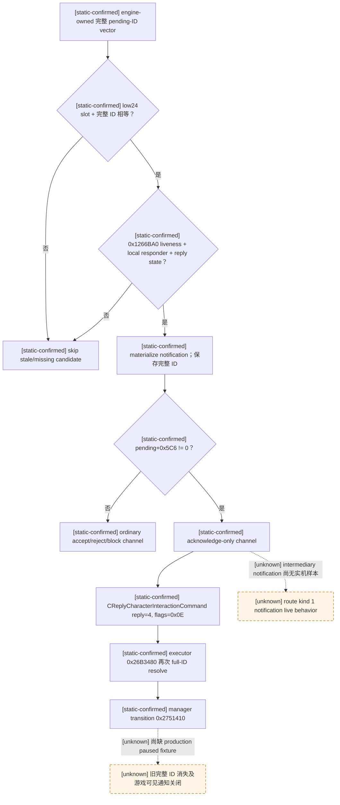
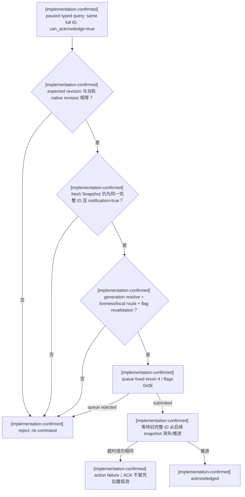

# CK3 1.19.0.6 人物互动通知发现与 ACK 决策树

## 范围、版本与证据边界

- [static-confirmed] 本文只绑定 CK3 `1.19.0.6` 的
  `Crusader Kings III/binaries/ck3.exe`，SHA-256 为
  `2D00FF3101EF70B566F2FCBAE292F09263199C80E9DC8F139B82D7D96F83DB86`；RVA 均以模块基址为零点。
- [static-confirmed] 本文只冻结通用 `CPendingCharacterInteraction` notification 发现、只读查询和
  `CReplyCharacterInteractionCommand(reply=4)` acknowledge 路径。互动的 costs、exchange、effect preview 和
  generic target typed payload 不在 ACK 合法性内，也不因通知可关闭而变成已知语义。
- [owner-deferred] 宗教、信仰、教义、信条、热情、改宗、改革与圣战语义继续保持 opaque compatibility；本文没有读取、
  分类或实现任何宗教专用分支。
- [implementation-confirmed] production bridge 的普通 accept/reject 行为保持不变；新增能力只让已经自动结算、
  `+0x5C6 != 0` 的本地通知可被发现、typed query 和严格 ACK。它不是通用 reply/mutator 入口。
- [unknown] 本轮按要求不启动 CK3，因此 notification 生成、ACK 提交和旧完整 pending ID 消失的 production paused
  实机链仍未 live-confirmed；下文不会把 queue ACK 当成 gameplay 后置条件。

## 原生 notification 发现树

### engine-owned 枚举没有过滤 auto-accept notification

- [static-confirmed] notification 枚举 RVA `0xD9DAE0..0xD9DD92` 从 engine-owned pending-ID vector 按原顺序取
  `int32` 完整 component ID；每个 ID 先以低 24 位选 `module+0x57BF1C8` storage slot，再要求
  `pending+0x10 == complete_id`。
- [static-confirmed] 每个 generation-valid candidate 都调用 `0x1266BA0(pending, played_character)`。该 predicate
  先要求 component liveness，再按 route kind `0/2 -> recipient+0x2F4`、`1 -> intermediary+0x300` 选择 responder，
  比较玩家完整 `CharacterID`，最后要求 reply-state predicate `0x2C42A30(context,false,false,false)`。
- [static-confirmed] `0xD9DAE0` 在调用 local-route predicate 前后均不读取 `pending+0x5C6`。因此原生发现集合同时包含
  ordinary pending request 和 auto-accept notification；旧 bridge 在 `ck3_11906.cpp` 中跳过 flag 非零项是我方旧限制，
  不是原生枚举规则。
- [static-confirmed] materializer `0xF06030..0xF061DF` 再次 generation-resolve 完整 ID，并把该 ID 原样保存到
  notification object `+0x20`。通知携带的不是低 24 位 slot number。

### UI 对 notification flag 与 reply channel 的处理

- [static-confirmed] getter `0x12680E0..0x1268136` 从其 UI/context object `+0xF8` 取得完整 pending ID，按相同
  low-24-bit slot + full-ID equality 规则解析对象，返回 `pending+0x5C6`。该 leaf thunk 没有独立 `.pdata` row。
- [static-confirmed] UI legality mirror `0x1268140..0x1268266` 构造完整 `0x28`-byte reply command；当 reply enum
  为 `4` 时直接返回 true，不做 generation、liveness 或 reply-state 检查。因此它和 command validator
  `0x26B3540` 的 enum-4 early-true 一样，只是一个 false seam，不能作为 ACK legality。
- [static-confirmed] UI submit helper `0x1268270..0x12682D6` 写入主/次 vtable
  `0x4082930/0x4082900`、完整 pending ID、reply enum，并用 channel flags `0x0E` 调用公共 command queue wrapper
  `0x973E00`。
- [static-confirmed] notification close/auto-reply path `0xF06B50..0xF06C3A` 从 notification object `+0x20`
  generation-resolve pending；若 `pending+0x5C6 != 0`，构造 reply `4`，否则构造 reply `1`，两者都以 flags
  `0x0E` 入队。这个分支独立证明 notification 对应 ACK enum，而不是从按钮文案推断。

## ACK executor 与 manager transition

- [static-confirmed] executor `0x26B3480..0x26B353F` 从 command `+0x20` 取完整 pending ID并再次做
  storage bounds/full-generation equality。route kind `1` 时把 command reply 放入 intermediary 参数；其它 route kind
  放入 recipient 参数，然后 tail-call manager `0x2751410`。
- [static-confirmed] manager `0x2751410..0x27514F4` 对 intermediary accept 可写 route kind `2` 并继续 recipient
  流程；terminal replies 会进入 response handling 并删除旧 pending component。ACK 使用的 enum `4` 已由
  `0xF06B50` 原生通知路径直接证明。
- [static-confirmed] validator `0x26B3540` 在检查 command `+0x24 == 4` 后立即返回 true，发生在任何 pending-storage
  resolve 之前。production ACK 的前置必须由 bridge 自己完成：完整 generation、liveness、local route、
  `auto_accept_notification=true`；禁止调用 enum-4 validator 来补证。
- [inference] ACK 仅关闭已经执行完 auto-accept effects 后留下的通知，不是重新执行 `on_auto_accept`。静态调用链支持
  “回复 pending notification”而不是“再次执行 interaction”的解释，但仍需 live fixture 以可见后置状态互证。

## 我方最小 production 合同

### discovery 与只读 query

- [implementation-confirmed] `ReadSnapshot` 保持 storage 原顺序和本地 route 选择。ordinary candidate 继续构造 enum-0
  command 并调用 `0x26B3540`；notification candidate 不调用 enum-0/4 validator，只在 full-ID/liveness/local-route
  成立后发布相同 `instance_id/sender_character_id`，并令 `auto_accept_notification=true`。
- [implementation-confirmed] 这使既有 paused application-main
  `query-pending-character-interaction-context-v1` 能以完整 ID 通过 mailbox capture gate。typed reader 对 notification
  发布 `accept/reject/block=false`、`acknowledge=true`；structured terms 仍保持 unavailable，
  `interaction_semantic_decision_ready=false`。

### 严格 ACK action

- [implementation-confirmed] 新 step 为 `acknowledge-pending-character-interaction`，capability 为
  `game.command.acknowledge-pending-character-interaction`。请求必须同时携带正数
  `expected_revision` 和正数完整 `pending_interaction_id`。
- [implementation-confirmed] bridge 只在当前 action revision 相等时进入 adapter；adapter fresh-read snapshot 后要求
  paused、当前发现项完整 ID 等于请求、`+0x5C6 != 0`，再 generation-resolve pending 与 played Character、重跑
  `0x1266BA0`，并在入队前复验完整 ID 与 flag。任何 mismatch、ordinary channel、route drift 或 queue rejection 都返回
  typed failure，不会降级为 accept/reject。
- [implementation-confirmed] ACK action 只构造固定 `reply=4` 的既有 native command，不接受调用者提供任意 reply enum，
  不暴露 block 或 manager/executor 直调入口，也不调用 validator enum 4。
- [implementation-confirmed] native driver 在 command queue 返回后继续等待 snapshot 中旧完整 pending ID 消失或推进；
  只有该 postcondition 成立才返回 `interaction_result.status=acknowledged`。原始 command result 的 `submitted` 单独看不算成功。

## exact-build 证据表

范围均为 start-inclusive/end-exclusive，哈希来自冻结 EXE 的 file-backed bytes：

| 语义 | RVA | `.pdata` 边界 | SHA-256 |
|---|---:|---|---|
| notification enumeration/local-route filter | `0xD9DAE0..0xD9DD92` | exact | `3E228EBAAB9ED7D46F39DFC914F1EDC0501FC1FB48A6E22E54220905C7105E1C` |
| notification materializer/full-ID storage | `0xF06030..0xF061DF` | exact | `E95D2BDF76BF16B0DA30C665E39DD5CB252AE7A3E7784471EF84259DA96F8BC8` |
| auto-accept-notification getter | `0x12680E0..0x1268136` | leaf, no `.pdata` row | `1FAC7C0F4CFF6DDA4EDD1070BD951A92A438E6593878A7BDCA9FE2910865A978` |
| UI reply legality mirror | `0x1268140..0x1268266` | exact | `8B92815F0DE6162D03F5CD9BF12E51643C9385739A59DDB42FC2810D932392EC` |
| UI reply construct/submit | `0x1268270..0x12682D6` | exact | `3C549F1D03F69B34A0E84281A6369117E86DBB1F53AC4016968618105EBB057F` |
| notification close/auto-reply | `0xF06B50..0xF06C3A` | exact | `818022CC31DF365C9D6A72C4029851A464EA443A26763D15F4DDEB89FA381848` |
| reply executor/channel projection | `0x26B3480..0x26B353F` | exact | `C89C990578A570B3467F8E33A88380C790767D2AD1B0FBB101AE0B9D530EFE2D` |
| reply validator enum-4 false seam | `0x26B3540..0x26B3644` | exact | `8A4FD3CD51CF0079A6AB0785DD0E43EAD46647E8D57C9FBA66331277D38CA5AC` |
| pending manager response transition | `0x2751410..0x27514F4` | exact | `E4B3EC7A721B3CE61565C027228D30B23623B7C216918905B2B65DACB3CF7F83` |

## unknown 与下一验收入口

- [unknown] 非宗教 auto-accept interaction 的 deterministic paused checkpoint 尚未生成；下一步 live runner 应先只读双查询
  同一 notification，确认 full ID、flag、route 与 `can_acknowledge=true` 稳定，再提交一次严格 ACK。
- [unknown] ACK live 后置必须至少证明旧完整 ID generation-safe 不再 resolve、snapshot 中该通知消失或推进，并记录相关
  可见状态没有重复应用；queue result 本身不计。
- [unknown] route kind `1` intermediary notification 尚无 live fixture。static executor 的 channel projection已闭合，但不能由
  ordinary route `0/2` fixture替代。
- [unknown] 多个同时本地 pending 的原生 UI 展示/优先级 tie-break 尚未单独闭合；当前 bridge 与原生 pending-ID vector/slot
  迭代都保持稳定先见顺序，不据此声称 UI 排序策略。
- [owner-deferred] 宗教专项 interaction 不进入上述 fixture 矩阵；解除暂缓前只保留通用 opaque 行为。
