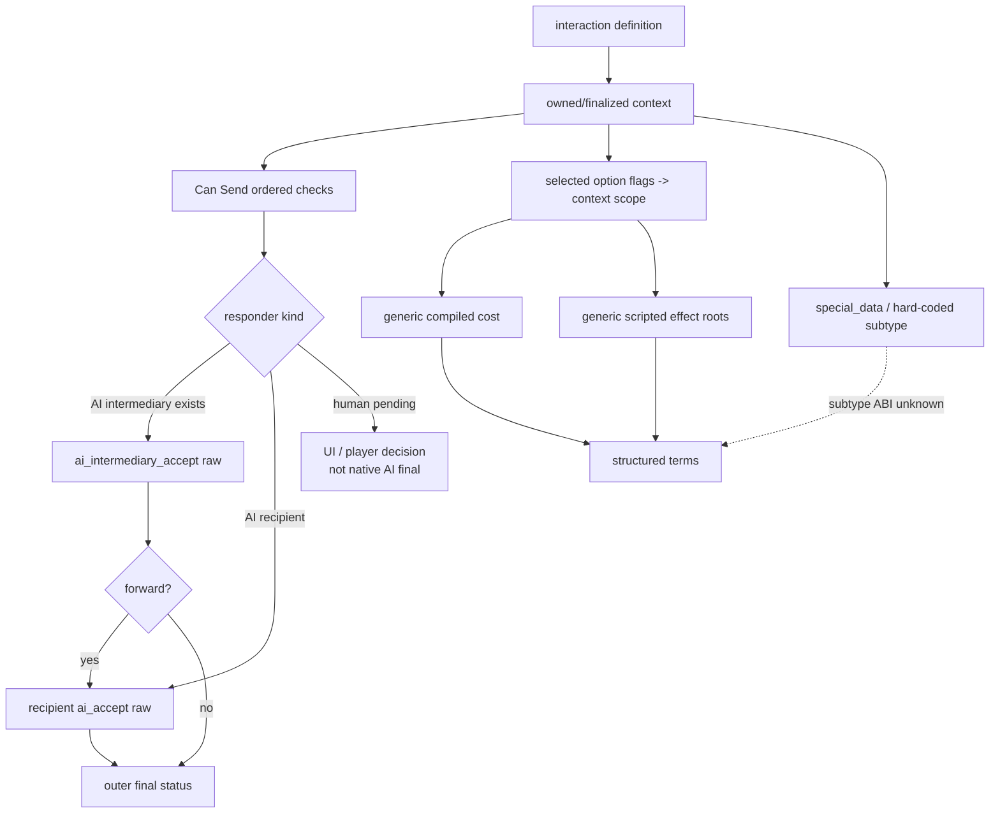
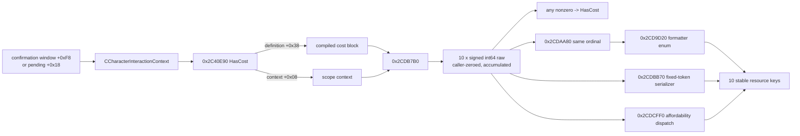
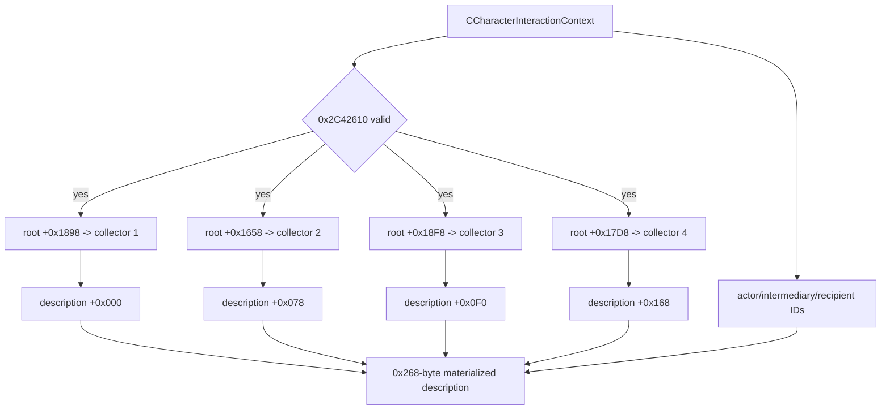
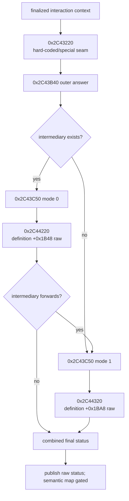
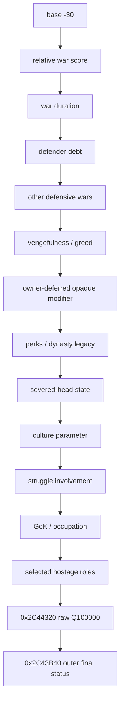

# CK3 1.19.0.6 普通角色互动：结构化条款、效果预览与原生 AI 接受输入

> 状态：2026-08-26，docs-first / exact-build Slice A 静态闭合并接入 production query；
> generic costs 尚未新增实机验证。
>
> 本文只研究普通、非宗教角色互动的 engine-generic 能力，并以普通白和平互动作为优先
> fixture。宗教专用域由项目所有者暂缓；原生总分里可能存在的该域修正只保留为 opaque
> owner-deferred 节点，本文不读取、不拆解、不实现。

## 1. 结论先行

当前证据闭合了三个此前缺失的 engine-generic seam，但还不能把
`structured_terms_ready` 改成 `true`：

1. [static-confirmed] 普通互动成本不是 tooltip 文本。confirmation window 内嵌的
   `CCharacterInteractionContext` 位于 `+0xF8`；`0x2C40E90(context)` 从 definition
   `+0x38` 的 compiled-cost block，经 `0x2CDB7B0` 求出一个十槽 `int64`/Q100000
   向量，再将其折叠为 `HasCost`。同 ordinal renderer/formatter、固定 token serializer 与
   affordability dispatch 已把十槽 **slot → stable resource key** 全部交叉闭合；production
   只发布十个稳定 key，不发布 `slot_N`。
2. [static-confirmed] `0x24B1B20(out, context)` 使用四个真实 native collector、完整
   `context+0x08` scope 与只读 loaded-effect helper `0x3380170`，物化四组互动效果视图。
   [static-inference] 它的输出就是 GUI 注册名 `InteractionEffectsDescription` 对应的
   `0x268` 字节对象；pending 对象 `+0x350..+0x5B8` 恰好内嵌一份。四个 compiled root
   与 `on_accept` / `on_decline` 等作者语义的逐项映射、typed row ABI 和所有权仍未闭合。
3. [static-confirmed] 原生 AI 接受链已从“单一 recipient 分数”细化为：
   intermediary raw `0x2C44220`、recipient raw `0x2C44320`，再由外层
   `0x2C43B40` 顺序求值并合并最终 status。`0x2C43F00` 的 Can Send validator 使用
   mode 0，不能代替 outbound proposal 的 mode-1 最终答复。

因此，Slice A 已成为可独立使用的只读 production query 子域：它不调用任何 effect helper，
也不依赖 `special_data`；剩余验收是 paused white-peace 全零与普通非宗教非零成本实机 fixture。
effect preview 的下一步应优先
解码 pending 中引擎已经物化的 `0x268` 字节借用对象，而不是重放 effect evaluator。
白和平的 `special_data` subtype 与 WarID 绑定已经在
[pending-interaction-special-war-binding.md](pending-interaction-special-war-binding.md) 静态闭合：八字节
special object 只是 exact subtype tag，WarID 来自 actor/recipient 的共同战争关系。production reader
已接入 application-main/full-generation/same-frame pending query，paused live 尚未完成；该 binding 仍不能
用 generic description 假装已经覆盖实际停战/战果条款。

## 2. 范围与证据规则

### 2.1 本文覆盖

- engine-generic `CCharacterInteractionContext`、definition、selected send options；
- scripted cost 的数值向量；
- engine-owned materialized effect description；
- intermediary / recipient 原生 AI acceptance raw 与 outer final status；
- 普通白和平 fixture 中与宗教无关的原生 `ai_accept` 输入；
- 下一只读 bridge/MCP 切片的 full-generation、same-frame 与线程门禁。

### 2.2 本文明确不覆盖

- owner-deferred 宗教专用树、字段、bridge、策略或实机矩阵；
- 三种已闭合 war-exit subtype 以外的 `special_data` 虚函数、布局或 mutator；
- notification/tooltip/localization 文本到条款的反推；
- `0x3380410` effect executor，或任何回复、发送、战争结算 mutator；
- 使用旧 war-exit 自造 `WarEffectContext` 重放 generic effect preview；
- special subtype transfer、effect root 或 description row 的猜名；
- 本轮启动 CK3 或进行 live 取证。

### 2.3 证据等级

- **source-confirmed**：pinned 原版脚本或 `_character_interactions.info` 明文；
- **static-confirmed**：pinned EXE 的确定指令、`.pdata` 边界与 exact byte span；
- **static-inference**：多个确定布局/调用点唯一吻合，但尚无 RTTI 或 live fixture 互证；
- **live-confirmed**：沿用已有文档记录的 paused production fixture；本文没有新增 live 运行；
- **unknown**：不得进入 production semantic wire。

## 3. 冻结构建与来源

| 证据 | SHA-256 | 用途 |
|---|---|---|
| `Crusader Kings III/binaries/ck3.exe` | `2D00FF3101EF70B566F2FCBAE292F09263199C80E9DC8F139B82D7D96F83DB86` | exact build 1.19.0.6 静态调用链与布局 |
| `game/common/character_interactions/_character_interactions.info` | `F360C05B72CD2B0D87885E570FA55E70E41089DEFB4675BE5A82E390940D5D10` | 作者 schema、Can Send 顺序、AI 三类输入 |
| `game/common/character_interactions/00_adoption.txt` | `E70DA0677D32672E83F5DB588A8BB3BC3D5AFEB89E8818BB7C9903BDDA65AAEC` | 非宗教 `renown` / `influence` cost 作者实例 |
| `game/common/character_interactions/00_prison_interactions.txt` | `3E05C94CDCE4D42CCE8256D2D79CD78FEB1C9D5B79DAA64AA8243AA0C658F22B` | 非宗教 `treasury` cost 作者实例 |
| `game/common/character_interactions/00_tribal_interactions.txt` | `2EB46B8A66080C189AD955E4B7511195B3A51C3FEA540DDE6085D276FB80C282` | 非宗教 `treasury_or_gold` cost 作者实例 |
| `game/common/scripted_costs/00_costs.txt` | `E83855B1B09752BCF1D8CD8D6965D466548DC8A97ADCC1772D46EB05CA0D3710` | 通用 scripted-cost 作者实例 |
| `game/common/character_interactions/00_war.txt` | `5C99B8F14893929A9BC2DBB5B258CDD2D4233D5805091952209413DE876EE09F` | white-peace fixture 与非宗教接受树 |
| `native_bridge/research/pending_character_interaction_context_v1_abi.json` | `5E515D4142BA0A45EE51DACA4F8534464C873909154E3261D6499F9174395BD5` | 文档自检时的 pending/context ABI 基线 |

相关既有边界：

- [events-and-interactions.md](./events-and-interactions.md) 冻结通用 Can Send、pending/reply
  状态机与普通 white-peace live fixture；
- [player-war-exit-policy.md](./player-war-exit-policy.md) 记录旧 loaded-effect preview 在
  `0x334C668` 的两次 live crash 及 production rollback；
- `pending_character_interaction_context_v1_abi.json` 冻结 pending stride、embedded context、
  generation-bearing instance ID、roles、options、routing 与 legality。

本轮 exact EXE span：

| 入口 | `.pdata` `[begin,end)` | SHA-256 | 已确认作用 |
|---|---:|---|---|
| `0x2C40E90` | `[0x2C40E90,0x2C40F4A)` | `ACA4B8FF934DBC602B3EC3EB9F95E1A3A903AD619B8A70B6E5C1B36A4C6F28A8` | generic `HasCost` 与十槽临时向量 |
| `0x2CDB7B0` | `[0x2CDB7B0,0x2CDB9C1)` | `50B06EB5A730BF0962B9B2A782F1566A86CCE39B131282E7714B10A465AC01F6` | compiled cost 求值/累加 |
| `0x2CD9D20` | `[0x2CD9D20,0x2CDA9D4)` | `37D30768693AF083B8D67908A88849FB9C33B16EC809262A1345F2E96A53B5A1` | 十槽 formatter enum dispatch |
| `0x2CDAA80` | `[0x2CDAA80,0x2CDB552)` | `8D89DE114321AD18474443F7310F0850AE5C4C5187B009D7CB1FB5F26145AF28` | 同 ordinal compiled row → formatter 调用 |
| `0x2CDBB70` | `[0x2CDBB70,0x2CDBE24)` | `988DB7F261BE88BE4DBA77DAFB1D73460907C902DCE6DE3CEF9B420C3307AEF4` | 十槽 fixed-token serializer |
| `0x2CDCFF0` | `[0x2CDCFF0,0x2CDD6BC)` | `119C6D85299B865659AC0255C074D5EC45A7F93ACF0BFDA2CBF6318F301FB3A0` | 十槽 affordability 与 slot 7 路由 |
| `0x24B1B20` | `[0x24B1B20,0x24B20D6)` | `BB06B4DF46AE835C1B6FE97874078BB8E00759A92866A2A1C03362ACD03DF52F` | materialize interaction effects description |
| `0x2C44220` | `[0x2C44220,0x2C44315)` | `81E6487D6D76AEE82A3D5B0462C4B138E16DEFF1DB4AD19F4402E07FDFE4192F` | intermediary AI raw |
| `0x2C44320` | `[0x2C44320,0x2C4440B)` | `745E0C0F6FC5283A340F5C55881C972E51D5DE5E24644D3D0F16AD917F5EE91F` | recipient AI raw |
| `0x2C43B40` | `[0x2C43B40,0x2C43C43)` | `4612EB20D719EDF889097B6FE45313CBCB90A2EE6686CA6F8174EF7B5647C7A7` | outer final answer |
| `0x2C43C50` | `[0x2C43C50,0x2C43EF6)` | `2918AF12BBAD6B34049B74FA3F892D6368098EAD4AFD7A41195AC72FC4274012` | intermediary/recipient inner branch |
| `0x2C43F00` | `[0x2C43F00,0x2C44070)` | `3B9A75EC79B4C93DE7C1E3F9D45ADA2518048611EFCF7C0475F243C93086ED54` | Can Send acceptance validator |

`0xFE1CE0`、`0xFE3BD0`、`0xFE4710` 是无 `.pdata` row 的 leaf/thunk；本文只用其短指令
作字段交叉验证，不把它们伪装成完整 runtime-function span。

## 4. 原版作者模型：状态、条款与 AI 输入是三层

`_character_interactions.info` 明确把这三层分开：

1. **能否发送**：lines 679-692 依次检查 setup、range、special shown、`is_shown`、
   duplicate consideration、两个 showing-failure trigger、`can_send`、`is_valid`、target、
   special can-send；需要对方接受且对方为 AI 时，最后还要求原生 AI 会接受。
2. **发送的结构化输入**：definition-level `cost` 在 lines 467-477；send option 在
   lines 311-355。option 自身写 flag，选中状态经 context scope 投影后可以间接影响成本、
   trigger、AI 分数和 effect。
3. **答复与结果**：`ai_intermediary_accept`、`ai_accept`、`ai_will_do` 分别在
   lines 558-570；`on_send`、接受、拒绝、block、auto-accept、intermediary 两路 effect
   在 lines 360-392。发送方选不选择与接收方接不接受不是同一模型。



原生 AI `ai_will_do` 负责主动选择 interaction/target/options；`ai_accept` 负责收到请求后的
答复。自动玩家不能拿 acceptance score 代替发送方效用，也不能拿 ACK/queue success 代替状态观测。

## 5. Generic context 与生命周期基线

已有 pending ABI 冻结：

- `CPendingCharacterInteraction` stride `0x5C8`，完整 generation-bearing instance ID
  在 `+0x10`；
- embedded `CCharacterInteractionContext` 在 pending `+0x18`，大小 `0x338`；
- context definition `+0x00`，primary scope/context `+0x08`；
- actor / recipient / secondary actor / secondary recipient / intermediary IDs 在
  `+0x2D8..+0x2E8`，generic target 在 `+0x2F0`，selected option vector 在 `+0x300`，
  `special_data` 在 `+0x330`；
- `0x2C40950` 将 selected flags 投影进 primary scope，`0x2C40B20` finalize 并验证
  option count、selection 和 exclusive 规则。

新的 GUI 交叉验证：

| GUI seam | exact 指令结论 |
|---|---|
| `GetEffectsDescription` underlying `0xFE1CE0` | `lea rax,[rcx+0x430]; ret` |
| `HasCost` underlying `0xFE3BD0` | `rcx += 0xF8; jmp 0x2C40E90` |
| `GetCostDescription` `0xFE3BE0` | definition=`*(window+0xF8)`，scope=`window+0x100`，调用 `0x2C38560` |
| `GetCostTooltip` `0xFE3C10` | context=`window+0xF8`，调用 `0x2C40F50` |

所以 confirmation window 的 context 正好是 `[+0xF8,+0x430)` 的 `0x338` 字节，effects
description 紧随在 `+0x430`。这是对 pending embedded context 形状的独立 engine-generic
交叉验证，不授权 bridge 解引用 GUI window 或读取 presentation text。

## 6. 结构化成本：十槽语义已闭合

### 6.1 确定调用链



[static-confirmed] `0x2C40E90`：

- 先清零一个 `0x50` 字节临时区，即十个 `int64`；
- 取 `definition=*(context+0x00)`；
- 调 `0x2CDB7B0(definition+0x38, context+0x08, out10)`；
- 只要任一槽非零就返回 `HasCost=true`，不返回向量本身。

[static-confirmed] `0x2CDB7B0`：

- 固定循环十次；
- compiled row 从 cost block `+0x38` 开始，stride `0x108`；
- 每行经 `0x9698B0` 对传入 scope context 求值，并 **累加** 到对应 `int64`；
- raw 使用 Q100000 尺度；cost block `+0xAB0` 分支执行 `100000` 粒度量化；
- `+0xAB1` 是 **条件性** 负值 clamp。该 flag 未启用时负 raw 可以保留，所以 wire 必须是
  signed `int64`，不得把负数擅自判 malformed。

### 6.2 slot → stable key 的无猜测闭环

决定性证据不是 `_info` 中四个旧 key 的排列顺序，而是三条 exact-build 交叉链：

1. `0x2CDAA80` 在同一循环中以同一个 ordinal 访问 compiled row，并把该 ordinal 作为 enum
   传给 `0x2CD9D20`；两者一起递增到 10。
2. `0x2CDBB70` 按相同 qword 顺序使用十个固定 script token ID 序列化。
3. `0x2CDCFF0` 的十路 jump table 以 `RESOURCE_MISSING_*` 分支独立确认余额类型。

| slot | stable `resource_key` | formatter key | serializer token |
|---:|---|---|---:|
| 0 | `gold` | `GOLD_COST` | `0x2875` |
| 1 | `prestige` | `PRESTIGE_COST` | `0x0001` |
| 2 | `piety` | `PIETY_COST` | `0x2B26` |
| 3 | `renown` | `DYNASTY_PRESTIGE_COST` | `0x2B27` |
| 4 | `influence` | `INFLUENCE_COST` | `0x318D` |
| 5 | `herd` | `HERD_COST` | `0x29F5` |
| 6 | `treasury` | `TREASURY_COST` | `0x3B32` |
| 7 | `treasury_or_gold` | actor 条件决定 `TREASURY_COST` / `GOLD_COST` | `0x3D24` |
| 8 | `merit` | `MERIT_COST` | `0x3E42` |
| 9 | `barter_goods` | `BARTER_GOODS_COST` | `0x3D30` |

表中的 `piety` 只是一项 engine-generic 已付资源 key/raw；本文不展开其 faith、doctrine、tenet、
fervor、conversion、reformation 或 holy-war 含义，也不据此进入 owner-deferred 宗教树。

slot 7 不是独立余额。`0x2CDCFF0` 在 actor 具有 treasury 时把它加到 slot 6，否则加到
slot 0；随后跳过 slot 7 自身的余额检查。它的稳定作者 key 因而必须保留为
`treasury_or_gold`，不能提前折叠成一个固定 effective resource。

非宗教 source 实例进一步确认 engine schema 的实际覆盖面：`00_adoption.txt` 使用
`renown`/`influence`，`00_prison_interactions.txt` 使用 `treasury`，`00_tribal_interactions.txt`
使用 `treasury_or_gold`。这些 source 只作作者 key 存在性互证，不承担 slot ordinal 证明。

### 6.3 pending payment 语义与 production wire

`_character_interactions.info` lines 467-470 明确规定：成本由 **actor** 支付，并在互动
**发送时**扣除。查询的是已经发送并进入 pending manager 的对象，因此该向量描述历史上已经
应用的 generic authored cost，不是“当前 responder 接受后还要支付”的未来负债。wire 必须把
这层语义显式携带：

```json
{
  "status": "available",
  "value": {
    "raw_scale": 100000,
    "payer_role": "actor",
    "application_timing": "on_send",
    "pending_payment_state": "already_applied",
    "entries": [
      {"resource_key": "gold", "raw": 0},
      {"resource_key": "prestige", "raw": 0},
      {"resource_key": "piety", "raw": 0},
      {"resource_key": "renown", "raw": 0},
      {"resource_key": "influence", "raw": 0},
      {"resource_key": "herd", "raw": 0},
      {"resource_key": "treasury", "raw": 0},
      {"resource_key": "treasury_or_gold", "raw": 0},
      {"resource_key": "merit", "raw": 0},
      {"resource_key": "barter_goods", "raw": 0}
    ]
  },
  "reason": null
}
```

production reader 在 paused application-main mailbox 中，用 full generation-bearing pending ID
解析 context，连续求值并复制两次完整十槽；任一槽、definition、roles、target、options、
`special_data` 或 outer frame 漂移都返回 typed `state_changed`。该向量只覆盖 engine-generic
authored cost，不声称覆盖 special subtype transfer 或 effect outcome。

## 7. Engine-owned effect description：优先读已物化对象

### 7.1 确定 materializer

`0x24B1B20(out, context)` 有以下静态确定行为：

1. 四次调用 `0x10803E0` 构造真实 native collector；
2. 每一路先调用 `0x2C42610(context)`；通过后，用同一个完整 `context+0x08`
   调只读 loaded-effect helper `0x3380170`；
3. 四个 compiled effect root 分别是 definition `+0x1898`、`+0x1658`、
   `+0x18F8`、`+0x17D8`；
4. `0x24B11D0` 将四份 collector 物化到 output `+0x000`、`+0x078`、
   `+0x0F0`、`+0x168`，形成四个 `0x78` 字节视图；
5. output `+0x250/+0x254/+0x258` 写 actor/intermediary/recipient ID；
6. output 还包含 `+0x1F0/+0x210/+0x230` 三个 string-like owned field 与
   `+0x25C/+0x264` flags；它们的稳定语义尚未闭合；
7. 函数末尾按 native ownership 规则 teardown 四份临时 collector。



[static-inference] output 类型/尺寸的证据闭环是：

- EXE 中 GUI type name `InteractionEffectsDescription` 唯一；
- `CharacterInteractionConfirmationWindow.GetEffectsDescription` 返回 window `+0x430`；
- window context `[+0xF8,+0x430)` 正好 `0x338`；
- pending `+0x350` 到 age field `+0x5B8` 正好 `0x268`；
- `0x24B1B20` 明确写到 output `+0x264` 并生成四个 `0x78` 视图。

这把旧 ABI 中的“materialized notification description bundle”缩窄为高置信度的
engine-owned interaction effects description，但还 **没有** 闭合：

- 四个 root 分别对应哪一个 authored effect 名；
- 每个 `0x78` view 内 typed rows、stable key、数值与 actor/recipient polarity；
- hard-coded `special_interaction` 的额外结果是否、如何并入；
- borrowed pending object 的并发更新点与逐字段稳定性；
- 独立 owned description 的 constructor/destructor 契约。

### 7.2 与旧 war-exit crash 的边界

旧 `claim_cb_exit_terms_v2` live preview 使用自造 war effect context，第二 scope resolver 在
`0x334C668` 两次崩溃。该失败不能证明 engine-generic materializer 必然崩溃，但明确禁止：

- 把旧 `WarEffectContext` cast 成 `CCharacterInteractionContext`；
- 把 custom CB effect root 传给 generic collector；
- 只补几个 scope pointer 就重试；
- 在 production 调 `0x3380410` executor；
- 为了拿结构化条款而执行 effect 或解析 presentation text。

最安全的下一效果切片是 **只读解析 pending 已拥有的 `+0x350` 对象**。bridge 不构造、
不销毁、不缓存内部 pointer，不重跑 `0x3380170`；只有 typed row ABI 与 root mapping 完整冻结后，
才讨论对 owned/finalized outbound context 调 materializer。

## 8. 原生 AI acceptance：raw、intermediary 与 final 必须分开

### 8.1 exact-build 调用链



[static-confirmed] intermediary raw `0x2C44220(context,out_raw)`：

- intermediary 缺失，或等于 actor 时，写 `10,000,000` raw；
- 否则以 intermediary responder scope、`context+0x08` 求 definition `+0x1B48`。

[static-confirmed] recipient raw `0x2C44320(context,out_raw)`：

- actor 等于 recipient 时，写 `10,000,000` raw；
- 否则以 recipient responder scope、`context+0x08` 求 definition `+0x1BA8`。

[static-confirmed] outer `0x2C43B40`：

- 先进入 `0x2C43220` 的 hard-coded/special seam；其精确语义名仍是 unknown；
- intermediary 存在时先走 inner mode 0，再走 recipient mode 1；
- final status 是组合结果，不能只用 recipient raw 自行重算；
- 已闭合普通分支中 status `0/1` 为接受、`2` 为拒绝；其它 raw status 在 generic wire
  必须保留为 unavailable/unknown，除非 caller contract 另行闭合。

`0x2C43F00` 在 Can Send validation 中调用 outer answer mode 0，并有 definition `+0x2A4A`
bypass。它证明源码“需要接受的 interaction 发给 AI 前必须会被接受”的顺序，但 **不是**
mode-1 outbound final answer 的替代品。

### 8.2 GUI acceptance 不是可直接抄取的 authority

- `GetAcceptanceValue` underlying `0xFE4710` 从 confirmation candidate row `+0x340`
  读取缓存 raw；row stride 为 `0x450`，default 值在 window `+0xE78`。
- `GetAcceptanceBreakdown` `0xFE4760` 选择 default 或 candidate context，然后调用
  `0x2C43B40(...,answer_mode=1,...)` 并传 native sink。

这证明 GUI breakdown 由 authoritative outer chain 生成，但 candidate row identity、sink object
ABI 与 lifetime 尚未闭合。bridge 不应扫 GUI cache，也不应把 breakdown 文本当结构化输入。

### 8.3 inbound 与 outbound 的适用性

- **我方发给 AI 的 outbound proposal**：只有在 exact context 构造、redirect、option refresh、
  finalize 完成后，intermediary raw、recipient raw 与 outer mode-1 final 才有决策意义。
- **玩家作为当前 responder 的 inbound pending**：原生 AI final 不适用；自动玩家要根据条款与
  自己策略答复。对人类 recipient 强行求 `ai_accept` 最多是反事实 heuristic，不能命名为
  `opponent_would_accept_now`。
- **有 intermediary**：必须发布 intermediary 与 recipient 两个 raw 以及 outer final；只发布
  recipient raw 会把“未转交”误写成“接收方拒绝”。

## 9. White-peace fixture：原生非宗教接受树

已有 live fixture（详见 `events-and-interactions.md`）是普通 recipient pending：

- stable key `end_war_attacker_white_peace_interaction`；
- deterministic hash `3450334569`，runtime ordinal `294`；
- actor `29829` → recipient `36108`；
- route `0`、generic target absent、send option count `0`；
- age/cutoff/expiration `0/60/60`；accept/reject/block legal，ACK 不可达；
- `structured_terms_ready=false`，没有提交 reply。

`00_war.txt` lines 1574-1910 的 `ai_accept` 非宗教部分如下。这里记录的是 **原生输入树**，
不是我方 counter-policy：

| 顺序 | 原生输入 | source 语义 |
|---:|---|---|
| 1 | base | `-30` |
| 2 | 当前战分 | recipient 为 defender 时取 attacker war score；recipient 为 attacker 时取 defender war score |
| 3 | 战争持续时间 | `war_days >= 365` 后加入 `war_days / 91` |
| 4 | 防守方债务 | `war_days >= 182` 且 recipient 为 primary defender；debt level × `20` |
| 5 | 进攻方顾虑其它防御战争 | recipient 为 primary attacker 且另有自己为 primary defender 的战争，`+10` |
| 6 | personality | recipient 为 defender 时 vengefulness 以 `-0.25` 系数参与；为 attacker 时 greed 以 `-0.25` 参与 |
| 7 | owner-deferred opaque subtree | 原生总分仍会计算；本文不拆解、不复制、不为 bridge 建字段 |
| 8 | peacemaker / nomad legacy | 对应对手具备条件时加入 scripted perk value 或 `+10` |
| 9 | severed-head state | 对应临时变量匹配时 `+30` |
| 10 | cultural parameter | 对手 culture parameter 满足时 `+10` |
| 11 | struggle involvement | actor/recipient 满足 phase parameter 时 `+10` |
| 12 | GoK onslaught special cases | 基础 `-70`；符合占领条件时按已占 county `+2`，最多 `200` |
| 13 | selected hostages | secondary actor/recipient 存在时分别加入 actor/recipient hostage value 的 `0.5` |



white peace 对 generic terms 的价值与局限：

- 无 generic target、无 send options，适合做 zero-cost/empty-option 基线；
- secondary actor/recipient 仍可能表达 selected hostages，必须保留完整五角色 identity；
- 战争、CB、战分和实际停战结果属于 special war context；generic description 可能描述 authored
  interaction effects，但没有证据证明它覆盖全部 hard-coded/CB outcome；
- 三种 war-exit pending 的 stable WarID 原生关系链与 production reader 已静态闭合；paused live 尚未完成，
  且任何其它 subtype 仍不能从裸 pointer、notification 文本或目标缺失推断 WarID；
- 原生 total raw 会包含 owner-deferred opaque 节点。可以调用原生总分，但不能谎称 breakdown 已完整结构化。

### 9.1 首轮玩家 inbound fallback 与债务边界

[implementation-confirmed / static-ready / live=false] 在本篇先闭合原生 `ai_accept` 输入树、human responder 不适用边界、四路
reply legality 与 special-war typed binding 后，首轮一代人策略允许采用最小 `ordinary-reject-unique-accept-v1`，而不等待所有
structured terms 完成：

- ordinary non-war 的分类必须同时满足 exact same-frame/full-generation identity、完整 roles/routing/deadline/legality、
  `special_war_binding_not_applicable + special_data_present=false + 非三个 war-exit exact key`，并命中 exact-build 显式非战争非宗教
  allowlist。当前只有 `spar_with_knight_interaction`：原版 `00_tradition_interactions.txt` 完整文件 SHA-256
  `E3B7330D8DFD9C82522D65629B6DD991D319B76B41C388CE483E351D829391E3`，其第 1–200 行完整 block 明确 popup/pause、双方不在
  战争、accept 只启动 `FATALITY=no` bout，且没有 faith/religion/marriage、`special_interaction`、`target_type`、`auto_accept` 或
  `on_decline` 字段。
  `invite_to_activity_interaction` 因同 key 可覆盖 `activity_wedding`、当前 bridge 又没有 activity subtype，已明确移出 allowlist；前述
  special-war 三项**不是**通用 ordinary classifier。其它 definition 必须 `definition_unclassified` fail-closed，等待 typed classification
  或逐项 exact-definition 审计；不在本 fallback 中扩展宗教域；
- reject 原生合法且 reject action reachable 时确定性拒绝。reject action 不可达时 blocked，不能因为 accept action 恰好存在就接受；
- accept 只在 reject、block、acknowledge 都由 native legality 明确判为非法，且 accept 是唯一合法并可执行的回复时使用；
- stale、legality unknown、identity mismatch、opaque special 或没有可执行合法 channel 均不提交；notification 保持 ACK-only；
- known war-exit 只记录 exact subtype/outcome/WarID/primary roles/revision 与 active-war row 互证；在
  `special_outcome_terms_ready=false` 时继续 blocked，绝不把绑定本身扩义为应接受或应拒绝。
- active war 与 pending 并存时，100% war-score `enforce-demands` 检查无条件先于 allowlisted degraded reply；pending plan 只暂存到该
  优先级检查之后，不能提前 accept/reject。

plan 与 strict-run artifact 保存 full ID/key/roles/deadline/legality/special binding、definition classification evidence、缺失语义、全部
reply candidates、action
reachability、rule ID 与 recommended/selected action。fallback 永远标记 `native_ai_equivalent=false`、`semantic_optimal=false`、policy
`semantic_decision_ready=false`；context 报告的 readiness 另栏原样保留，不能由 fallback 升级。

runner 的动作后置门还要求 before/after pending semantic digest 真正变化；typed `interaction_result.status` 必须与 accept/reject/ACK
step 对应并引用 before 的 old full ID/sender，bounded `remaining_pending_character_interaction` 必须与 after mirror 相等且不再引用旧 ID。
只有这组条件同时成立，reply 才计入 visible gameplay/dirty checkpoint；裸 command ACK、revision 变化或 result 字段缺失都会停在
`pending_interaction_lifecycle_postcondition_failed`。

未采用的原生输入与质量债：interaction-specific target/exchange/effect、完整 campaign utility、intermediary/recipient raw/final
acceptance，以及 war-exit 的 resource/claim/truce/prisoner/hostage dynamic terms。后续以 typed terms + 按类型效用 policy 替换该规则；
不得把 reject-first 逐步堆叠成一个假装完整的语义模型。

## 10. Production readiness gates

任何 generic terms 查询进入 production 前至少满足：

1. **exact build**：EXE SHA 与 ABI/source-contract hash 全匹配；不支持构建 typed unavailable；
2. **application-main**：所有 context refresh/finalize/evaluator/borrowed-object 读取只在现有
   application-main mailbox 执行；不得从 MCP/HTTP/后台线程直读游戏对象；
3. **full generation**：入口和出口再次解析同一个完整 pending instance ID；禁止只比低位 index；
4. **same frame**：读取前后核对 revision、definition pointer/key/hash、actor/intermediary/recipient、
   target discriminator、selected option count/flags 与 `special_data` pointer；任一变化整包 unavailable；
5. **full construction**：outbound context 必须完成 redirect、option scope projection 与 finalize；
   ACK 或 command success 不能充当完成证据；
6. **typed mapping**：成本 resource key、effect branch/row/polarity、special subtype 分别有版本绑定 fixture；
   任一关键项 unknown 时对应子树 unavailable；
7. **ownership**：pending inline description 只借用读取，不 destroy、不保存 pointer；临时 output
   由调用方清零并在同帧复制成 POD；
8. **no mutator**：禁止 effect executor、reply/send/war-resolution 命令、unknown vfunc；
9. **readiness composition**：`interaction_semantic_decision_ready` 只能在当前 interaction 所需的
   generic costs、effects 与 special terms 全部 ready 时为 true；存在 schema 但长期 null 不算完成。

建议的 readiness 拆分：

| gate | white-peace 当前状态 | 变为 true 的条件 |
|---|---|---|
| `generic_costs_ready` | static/query true；新增 live 尚未验 | 十槽映射、signed wire 与 same-frame reader 已闭合；paused fixture 后升级 live |
| `generic_effects_ready` | false | pending inline typed row/root/polarity mapping + paused fixture |
| `special_war_binding_ready` | static/query true；新增 live 尚未验 | 三个 exact subtype、WarID、primary sides 与 same-frame reader 已闭合；paused fixture 后升级 live |
| `special_outcome_terms_ready` | false | 完整 dynamic resource/claim/truce/prisoner/hostage typed rows + paused fixtures |
| `native_ai_acceptance_ready` | outbound only / pending human N/A | finalized AI-responder context + raw/final live fixture |
| `interaction_semantic_decision_ready` | false | 当前互动所需上述子门全部 true |

## 11. 最小下一实现切片

### Slice A：`interaction-cost-vector-v1`（static/query 已完成）

目标：发布第一个独立有用、完全 engine-generic 的结构化条款读口，不触碰 effect preview。

1. [done] 由同 ordinal formatter、fixed-token serializer 与 affordability dispatch 闭合十槽
   stable key，并保存 exact byte spans/source hashes/mapping fixture；未按 `_info` 顺序猜 index。
2. [done] native POD evaluator wrapper 先清零十个 `int64`，在同帧 borrowed pending context 上调用
   `0x2CDB7B0`，立即复制稳定 key/signed raw，不保存 native pointer。
3. [done] 接入 application-main mailbox；实施 exact build、full-generation、双 observation 与 outer
   same-frame gate。
4. [done] native/Python fixture 覆盖多槽非零、合法负 raw、Q100000、十 key/order、payment state 与
   cost 向量同帧漂移。量化/clamp 的 native 指令由 exact span hash 冻结；条件 clamp 不被伪写为恒成立。
5. [remaining live] 先用 white peace 证明 zero-cost 基线，再用一个普通非宗教、至少一项非零成本的互动
   证明 stable key/raw；全程不提交互动。
6. [done] 现有 native driver/service/MCP 只发布 stable entries，并显式标记
   actor / on-send / already-applied；effects 与 special terms 仍保持 unavailable。

### Slice B：pending inline effects decoder（随后做）

1. 静态闭合四个 definition root 到 authored effect branch 的映射；
2. 闭合每个 `0x78` view 的 typed rows、stable key、数量、polarity 与 owned string 边界；
3. 只解码 pending `+0x350` 已物化对象，不调用 `0x3380170`，不 teardown borrowed memory；
4. 用一个普通非宗教、至少一条可见 effect 的 paused pending fixture 验证；
5. 证明 generic effect 与 hard-coded `special_interaction` 的覆盖边界后才设 ready。

### Slice C：white-peace special terms 与 acceptance

1. [done static] 按 [pending-interaction-special-war-binding.md](pending-interaction-special-war-binding.md)
   闭合三种 war-exit `special_data` exact subtype、actor/recipient relation WarID 与 active CWar 绑定；
2. [done static/query] 实现 full-generation/same-frame typed reader，发布 absolute outcome、active WarID 与双方
   primary war role；known definition 缺失/错配 special identity 时 fail-closed，未知 subtype 不进入 relation lookup；
3. [remaining live] 用 fresh production DLL 完成 paused ordinary white-peace 双查询，并与同 revision war context
   的 WarID/primary leaders 互证；不提交 reply；
4. outbound AI fixture 在完整 context 生命周期内同时发布 intermediary raw、recipient raw、
   outer mode-1 status；inbound human pending 明确标记 acceptance `not_applicable`；
5. 只有 generic 与 special 两部分均 ready，才允许 white-peace 策略做接受/拒绝动作并验证状态转换；首轮 ordinary
   reject-first fallback 不适用于这三个 war-exit subtype。

## 12. Unknown 账本

| 优先级 | unknown | 下一确定入口 | 未闭合时行为 |
|---:|---|---|---|
| P0 | 四个 compiled effect root → authored branch | definition parser registration + known one-effect fixtures | `generic_effects` unavailable |
| P0 | `0x78` effect view typed row ABI/polarity | `0x24B11D0` consumers、typed GUI registration、offline fixture | 不发布 row/text |
| P1 | generic outer status 非 `0/1/2` 值语义 | exact callers 与 paused AI-responder fixture | 保留 raw，semantic unavailable |
| P1 | `0x2C43220` hard-coded/special seam | definition subtype callers 与无 special 对照 fixture | final 只信 outer raw status |
| P1 | description `+0x1F0/+0x210/+0x230/+0x25C/+0x264` | typed getters/consumers | 保持 opaque |
| P2 | owned outbound effects description lifecycle | constructor/destructor `.pdata` 与 source-contract tests | 只读 pending inline，不主动 materialize |

这些 `unknown` 是明确的逆向施工入口，不是把字段长期留为 null 的完成状态。owner-deferred 宗教域
不在本账本中排队，直至项目所有者解除暂缓。
