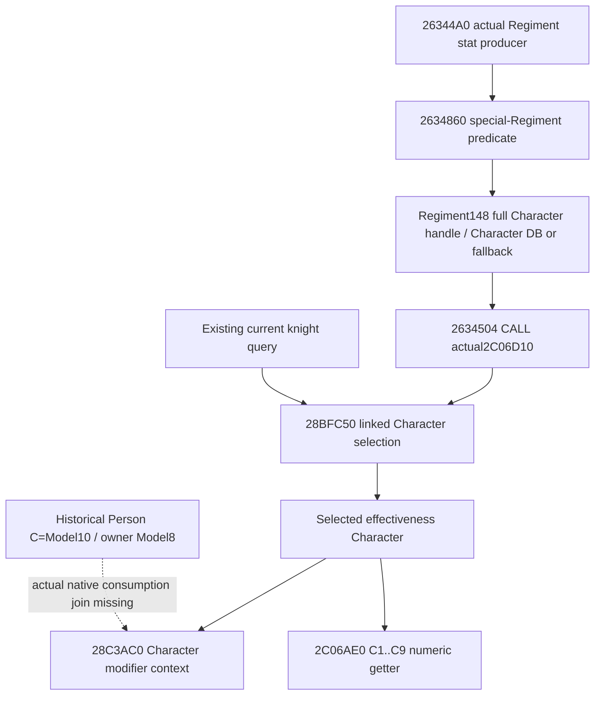

# Knight effectiveness receiver association in 1.20.0.4

This source-only packet separates the selected Character, its modifier context, and the historical Person preparation stage. It closes the actual wrapper argument transfer and a bounded actual-consumption observation seam; it does not claim a historical Entry consumer association or a new live capability.

The frozen identity is CK3 **1.20.0.4 / Steam25734779**, EXE SHA-256 `98702F88A547CDE2EAF29A85F93B85F68EE4CF8148336A4F7AFAEB75319DD518`, reused from the existing build freeze without rehashing. The inspected Native65 source is `eb0eeba0074f7a9ebccb59c2cdf51ce2cd6bf908` at `D:/pModel65`. Native65 qualification and historical Model ownership are existing upstream evidence, not new executions by this packet.

## Actual cached call tree

`native_bridge/research/ck3_1_20_0_4_general_combat.json` records these complete actual4 spans:

| Role | Actual range | Held proof |
| --- | --- | --- |
| Regiment stat producer | `[26344A0,26346FB)`, 603 B | `existing-mcp-factories-12004/general-combat/base06/regiment_stats_at_province-DETAIL.json` |
| Knight effectiveness numeric getter | `[2C06AE0,2C06D0E)`, 558 B | Same directory, `knight_effectiveness-DETAIL.json` |
| Immediate effectiveness Character selection | `[28BFC50,28BFCC6)`, 118 B | `g2-parallel-20261007/adopted-lifestyle-building-faction-12004/faction/leaf01/immediate_liege-DETAIL.json` |

The first two paths are below `Z:/ck3_mod_rewrite_process_assets/g2-background-20261007/`. Their mapping status is `complete_instruction_span_normalized_equal`; the Character-selection leaf is `complete_leaf_instruction_span_normalized_equal`. These are actual cached instruction streams, not merely current binder constants.

At `26344CD`, the special branch reads the full DWORD `Regiment+148`, resolves its unsigned low24 index through the Character database, and compares the complete handle with resolved `Character+18`. Failure selects the native Character fallback. At `2634501`, RCX is the output cache; `2634504` calls **actual `2C06D10`**, with RDX holding that resolved linked Character.

The `base06/FAMILY-MAP.json` row `regiment_stats_at_province`, `ordered_rel_rip_target_pairs[8]`, independently records old target `2C06D30` and actual target `2C06D10`, matching cached runtime ordinal and interval offset. This supplies a direct current entry; it is not an address-shift assumption. The six named base06 rows do not contain the wrapper body. No broad cache or EXE search was performed.

Root subsequently captured only the verified wrapper's 128-byte prefix, one image read, in `D:/codex-ck3-background-spill/native65-knight-context-association/actual-prefix01/`. The source transfer is now closed: `2C06D1A` reads the incoming linked Character's signed `+EC` prowess; `D20` preserves the original output-cache pointer in RDI; `D23` passes the linked Character to `28BFC50` at `D26`; `D2B` transfers its actual returned Character from RAX to RDX; `D33` selects mode zero; `D36` calls `2C06AE0` with a local raw output. This prefix suffices for the receiver transfer. The wrapper's remaining output arithmetic is not claimed closed by that prefix and is not needed for the association seam.

## Typed getter boundary

The complete `2C06AE0` body establishes RCX=output pointer, RDX=Character receiver, R8=operand/mode, and RAX=the output pointer on return. It never calls `28BFC50`. It invokes `28C3AC0(Character)` for each C1..C9 weighted request, then `2C4D660`, forwarding the supplied mode as R9. Its non-property operands are 100000, the receiver's linked `+1C0` values `+350/+358` or zero, and signed receiver values `EC/D8/E4/E8/DC/E0` multiplied by 100000. This reuses the existing numerical source; no Person computation needs to be repeated.

The complete `28BFC50` body returns a **Character pointer**. Its `+1C0` branch follows `+1C0 -> +28`, checks the Character tag and non-sentinel full ID, and otherwise returns the original Character. Its alternate `+1B8 -> +C8` full-handle path resolves through the native Character database/fallback. It does not return a Model or a PropertyCollection.

The existing software ABI in `ck3_12002_combat.hpp` agrees with these roles. `ReadCombatSimulationInputs` calls `28BFC50(linkedCharacter)` and then `2C06AE0(&out, selectedCharacter, 0)`. `ReadKnightEffectivenessContextSources` separately calls `28C3AC0(selectedCharacter)` to obtain `model_context`. Therefore preparation **C=Model+10 must be compared with the modifier context**, not with the Character pointer returned by `28BFC50`.

## Minimal actual-consumption handoff

The completed prefix request, actual source and authored Root-only reader are in `D:/codex-ck3-background-spill/native65-knight-context-association/`. Do not recapture the prefix or the three completed bodies. No further source bytes are needed to observe the proven transfer.

The smallest scoped actual-consumption design uses a `2C06D10` wrapper scope to retain its real linked Character/output-cache identity while calling the original exactly once. An observation around the actual `28C3AC0` getter retains its actual Character input and original returned C, only at the held `2C06AE0` return sites while that wrapper scope is active. C1..C9 return sites are `2C06B03`, `2C06B51`, `2C06B8D`, `2C06BC4`, `2C06BFB`, `2C06C32`, `2C06C69`, `2C06CA0`, `2C06CD7`. Preserve each actual returned context separately; do not manufacture a single common C if the returns differ. The prefix already proves that this getter's Character is the selection propagated from `28BFC50`; calling either getter again would only produce a current proxy and is unnecessary.

A literal `28BFC50` getter-return observation at return site `2C06D2B` can retain the selected-stage event directly, but by itself does not identify consumed C. The two-stage design above is a source plan, not implemented hook code or a fixture result. The final physical Entry/output-cache relationship must be taken from an actual Entry producer/row seam; an arbitrary wrapper output buffer must not be labelled Entry. The functional package must join actual consumed C to the historical preparation's source Model, C, owner and sequence, keeping unmatched/ambiguous rows explicit. The existing `current_model_association_v1` remains a separate current diagnostic. No extra Person decomposition or duplicate current leaf is proposed.

The Entry owner confirmed that no physical Entry/output-cache association is held in its bounded packet. The existing query's `ReadEncounterEffectiveStats` allocates a caller-local `alignas(8) std::array<std::byte,0x38>` at `ck3_12002_combat.cpp:456` and passes that scratch buffer to `26344A0`. This query invokes the same native wrapper through `2634504`, so a future observation must retain its bridge-query origin separately from a natural native consumption. The complete producer only forwards its incoming output pointer; its already closed body cannot determine the caller's physical Entry layout. The next Entry association source seam is the actual caller/row producer, not another read of `26344A0` or a guess that its incoming output is always an Entry subobject.

The owned Native65 aggregate is already sufficient material for the existing `compute_knight_stat_cache_at_stage_12003` C1..C9 mode0 consumer under its explicit operands. A current identity match, equal numeric values or held-current operands must not be promoted to evidence that a historical Entry consumed a particular preparation. The pending wrapper transfer is a concrete source seam, not a new readiness gate.

This packet reused 1,279 B of already decoded actual body coverage. Root's separately authorized wrapper capture read **128 B once**; worker EXE reads/metadata/hash/Game/SDK/process/build/test/production imports: **0**. Readiness remains **research** for the historical Entry join. Root's Native65 qualification remains unchanged.
