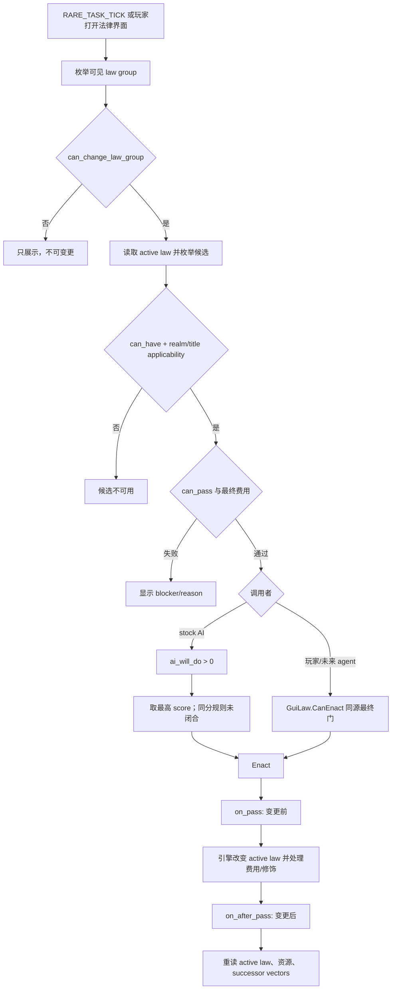
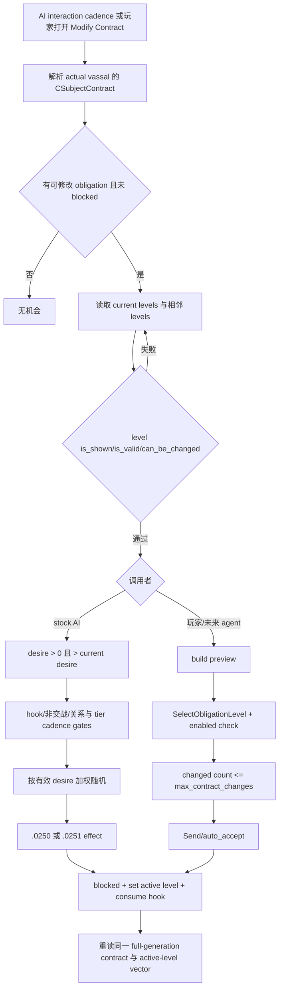
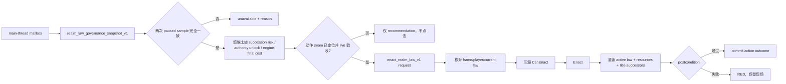

# 非宗教法律、封臣契约与继承法原生决策树（CK3 1.19.0.6）

> 状态：`static-ready`；2026-09-14；未启动 CK3，未形成 live artifact。
> 冻结对象：`ck3.exe` 95,206,008 bytes，SHA-256
> `2D00FF3101EF70B566F2FCBAE292F09263199C80E9DC8F139B82D7D96F83DB86`。
> 机器可读契约：
> `ck3_autonomous_player/native_bridge/research/fixtures/g2_nonreligious_law_contract_succession_native_tree_v1.json`。

## 结论和施工顺序

当前自动玩家已经能读到现任玩家的头衔与当前继承人向量，但还不能回答“当前实行哪条法律、哪条候选法现在真的能通过、要付多少、通过后继承结构是否改变”。这使它能看见继承风险，却不能选择合法的治理动作。下一刀应先做只读 `realm_law_governance_snapshot_v1`：用引擎最终结果发布当前法、候选法、合法性、费用和继承形状。它 live 后才设计 `enact_realm_law_v1`。封臣契约随后做 `subject_contract_governance_snapshot_v1`，可直接复用已有的 `CSubjectContract` 存储与布局证据。

这个顺序比先点 GUI 更短：原版 GUI 已证明存在 `CanEnact` / `Enact` 表面，但其底层 evaluator 与命令编码器尚未定位。先获得同源只读结果，策略才能区分“资源不足”“冷却中”“制度不允许”和“已经生效”，也才能为动作建立可靠的前置条件和后置验证。

## 范围与宗教域排除

本专题包含一般 realm law、继承顺序、单头衔继承法和 subject contract。P0 只覆盖玩家当前 realm law 与 `succession_order_laws`，不实现信仰、教义、教条、热诚、改宗、宗教改革、宗教法组或 holy order 策略。性别继承法以及费用里受 faith/doctrine 影响的部分也不展开成通用宗教模型；observer 应读取引擎最终合法性与最终费用，把这些输入保持为 opaque reason。战争中的圣战和婚姻的窄例外不属于本专题。

## exact-build 证据账本

所有相对路径均位于 `Crusader Kings III/game/`。聚焦 verifier 会重新核对文件大小、SHA-256 和语义锚点。

| 原版资产 | SHA-256 | 本专题使用的锚点 |
|---|---|---|
| `common/laws/_laws.info` | `E3BBC856...ADB124` | 28–99：组、`can_have`、`can_pass`、费用；141–167：通过/撤销钩子；300–306：AI 选法；315–349：继承、默认法与 active-law getter |
| `common/laws/00_realm_laws.txt` | `EC96F526...06E2DF` | 19–283：crown authority 代表链 |
| `common/laws/00_succession_laws.txt` | `F4140755...B9C532` | 1–342：分割、高分割、单继承人代表链 |
| `common/laws/01_title_succession_laws.txt` | `D398C523...8095F` | 单头衔 elective 法的适用、选举语义与费用 |
| `common/defines/ai/00_ai.txt` | `C78F9CD8...30293` | 32–39：`RARE_TASK_TICK` 七个 tier 值 |
| `common/script_values/00_law_values.txt` | `53667D7F...4AF90` | 63–106：crown authority 动态费用；447–566：realm/title succession 动态费用 |
| `common/subject_contracts/contracts/_subject_contracts.info` | `E1D06D1D...5794` | 7–73：可见、可改、level 与 desire；106–112：AI 相邻层级选择算法 |
| `common/subject_contracts/contracts/feudal.txt` | `41F3CB96...C5D0F` | feudal 税与兵役 level 的双边 desire 代表数据 |
| `common/character_interactions/00_modifiy_vassal_contract.txt` | `B00006A1...9407` | 1–305：玩家交互；587–670 与 742–813：AI 双向交互 |
| `events/interaction_events/character_interaction_events.txt` | `D238E0A3...7A150` | 1891–1944：`.0250/.0251` 的最终 AI contract effects |
| `common/scripted_triggers/00_scripted_triggers.txt` | `490C3784...95B5E` | 372–403：modifiable 与 changed-obligation gates |
| `gui/window_my_realm.gui` | `0FBC3B5E...56567` | `GetRealmLaws -> GetLaws -> GuiLaw -> CanEnact/Enact` |
| `gui/window_succession_change_law.gui` | `272E75BC...094F5` | 四类候选列表、选择、最终合法性描述 |
| `gui/window_title_add_law.gui` | `7A18C1ED...82732` | title law items 与玩家最终费用 |
| `gui/interaction_modify_vassal_window.gui` | `AE9BC963...244DF` | preview、level enablement、select 与 Send |

完整 64 位哈希、文件大小和 required tokens 保存在机器可读契约中，表内缩写只用于阅读。

## 法律机会、合法性和执行

`_laws.info` 给出了执行语义的权威边界：组可以可见但不能改；`can_have` 决定某法能否成为候选，`can_pass` 表达当前临时条件，realm/title 还分别受 `can_realm_have` / `can_title_have` 约束。费用是 ruler scope 下的 scripted cost。原版 AI 只考虑 `ai_will_do > 0` 且“able”的候选，并在 `RARE_TASK_TICK` 选择最高分。exact define 的 raw per-tier 天数是 `180/720/360/180/180/180/180`（最后一项标注 Hegemony）；内部 tier index 顺序没有在本专题另行逆向。相同最高分的 tie-break 与 scheduler 的具体 callsite 尚未闭合。



默认法与主动 enact 必须分开理解。新 ruler 每组取一个默认法：先检查 group default，否则按定义顺序取第一个满足 `should_start_with` 的法；这个过程忽略 `can_pass`，也不跑 `on_pass`。继承升 tier 的继承人直接取得死者法律，而且当前不会重新检查 law conditions。普通 active law 若后来不再满足 `can_keep`，schema 说明它会在一个月内被默认法替换。自动玩家不能把这些初始化、继承或自动替换误记成自己成功执行了一次 law action。

### crown authority 代表链

`crown_authority` 是 cumulative 且带 `realm_law` flag。CA1 只在当前 CA0 时给 stock AI 分数 1；CA2 只在当前 CA1 时给分数 1，并新增 `can_change_succession_laws` 与 titles-cannot-leave-realm 等 flag。CA3 要求当前 CA2、冷却与其它 trigger 通过，但定义内没有 `ai_will_do`，因此不能依据 generic positive-score 规则声称 stock AI 会自动升到 CA3。三次主动变更都使用以 100 prestige 为 base 的动态费用，并在 `on_pass` 处理冷却与 modifiers。

P0 不应在 native 外复刻这些 trigger 或动态费用。它要调用与 GUI 同源的引擎最终判断，同时保留 law key 和不可用理由，避免版本更新时 Python 策略与游戏规则分叉。

### realm succession 代表链

代表性非宗教结构如下：

| law | 继承形状 | stock `ai_will_do` |
|---|---|---|
| `confederate_partition_succession_law` | inheritance / children / oldest / partition，并创建 primary-tier titles | 未定义 |
| `partition_succession_law` | inheritance / children / oldest / partition | 当前为 confederate 时 1 |
| `high_partition_succession_law` | partition，`primary_heir_minimum_share = 0.5` | 当前为 confederate 或 partition 时 2 |
| `single_heir_succession_law` | inheritance / children / oldest / single_heir | 3 |

这不是我方策略。它只冻结原版 opportunity/weight 输入。单继承人法仍受 government、innovation、authority、锁定分割契约和其它 trigger 制约；有些路线还增加额外货币。realm succession prestige 动态值以 500 为 base。费用实现含 faith/doctrine modifiers，但本专题按宗教域排除规则只请求 engine-final cost，不向 planner 展开宗教字段。

单头衔继承法属于独立路径。`_laws.info` 区分 title-only、realm-only 和两者皆可的 succession order；`feudal_elective_succession_law` 等候选用 `can_title_have`、选举 succession 结构和 `change_title_succession_law_prestige_cost`。后者基准为 realm succession base 的三倍。代表性 elective 定义没有 `ai_will_do`，因此这里只冻结玩家机会面，不推断隐藏 AI enact 行为。

## 封臣契约原生树

subject contract 不是 law group 的别名。它有独立对象、term/level、preview 和 character interaction。obligation `score` 用于判断一次交易偏向 subject 还是 liege；AI 候选选择另用 `ai_liege_desire` / `ai_subject_desire`。`_subject_contracts.info` 明确：AI 只看当前 active level 的相邻 level；新 level 的 desire 必须大于零且严格高于当前 level desire。所有有效改进项最终按 desire 做 weighted random。因此“最想要”effect 的结果不是确定性 argmax。



AI liege 交互的 tier frequency 是 `0/12/12/24/24/36`，AI vassal 是 `0/24/24/24/36/0`；两条路径都要求 hook，并在交战时禁用。关系与 greed 可以把 `ai_will_do` 乘为零。玩家交互会计算公平性/tyranny/hook，随后逐个执行 `vassal_contract_set_obligation_level`。脚本注释说最多改三项，但实际 gate 是 `list_size:changed_obligations <= max_contract_changes`，exact value 为 **4**；自动化应遵循执行值，不遵循漂移的注释。

## exact-build GUI / EXE 链

原版 GUI 给出了这两条完整的公开表面链：

- realm law：`MyRealmWindow.GetRealmLaws -> GuiLawGroup.GetLaws -> GuiLaw.GetLaw -> GuiLaw.CanEnact -> GuiLaw.Enact`；succession window 另按 partition / appointment / single-heir / other 分类，并用 `GetCanEnactDescription` 返回最终失败描述。
- contract：`ModifySubjectContractInteractionWindow.GetContractPreview -> IsObligationLevelEnabled -> SelectObligationLevel -> Send`。

PE 静态证据进一步把对象/入口名绑定到 exact build：

| 反射表面 | 字符串 RVA | 注册引用 RVA |
|---|---:|---:|
| `OpenSuccessionLawChangeWindow` | `0x40D60D0` | `0xC444E6` |
| `MyRealmWindow` | `0x4129B60` | `0x113CE60` |
| `SuccessionLawChangeWindow` | `0x4158210` | `0x1424820` |
| `ModifySubjectContractInteractionWindow` | `0x41186A8` | `0x104BD30` |
| `GuiLaw` | `0x4590CEC` | `0x3DE0DF0` |

这些 xref 位于反射注册函数；它们证明当前 EXE 暴露这些 GUI 类型/名字，**不是**底层 legality evaluator 或 mutation routine 的地址。method 字符串也已冻结：`IsEnacted 0x4590CF8`、`GetCanEnactDescription 0x4590D08`、`GetShortCostString 0x4590D20`、`Enact 0x4590D34`、`ShouldBeApproved 0x4590D40`、`GetRealmLaws 0x412A320`、四类 succession getters `0x41581B8/0x41581D0/0x41581F8/0x4158258`。`GuiLaw.CanEnact` 没有找到可安全归属的独立字符串 RVA；不能据此编造函数地址。

RTTI 字符串为 `.?AVCLaw@@ 0x50C22A8`、`.?AVCLawGroup@@ 0x50DEDE8`、`.?AVCLawDatabase@@ 0x5549040`、`.?AVCSubjectContract@@ 0x522F780`。已有 `prewar_scope_v1_abi.json` 还冻结了 `CSubjectContract`：storage slot `0x570CCA0`、fallback `0x570CC50`、object size `0xD8`、主/次 vtable `0x42F9C40/0x42F9C08`，以及 `+0x08` full ID、`+0x20/+0x28` subject/liege、`+0x38/+0x44` term array/count、`+0x68` active-level index array。这个对象证据可直接服务下一阶段 contract observer，但不能把 tributary reader 的业务过滤原样套到普通封臣。

## P0 observer 与后续 action seam



`realm_law_governance_snapshot_v1` 的最小字段：

1. frame/date、玩家 full-generation `CharacterID`。
2. group key、active law key、每个候选 law key。
3. engine-final `can_have`、`can_pass`、`can_enact` 与 unavailable reason。
4. engine-final currency costs；不在 bridge 外重算动态 modifiers。
5. succession 的 order、division、traversal、rank 与可选 primary-heir minimum share。
6. 复用现有 campaign-root reader 的 primary title 与 held-title successor vectors，作为当前基线。

验收要求是 frozen build 上 main thread、paused、同 date 两次全量一致；active law 非空；至少保留一个当前不可 enact 的候选及原因；全过程无 effect、无命令、无 GUI click。只有这个 observer 达到 `production-live primitive` 后，才进入 action 逆向。

`enact_realm_law_v1` 请求应携带 expected frame/date、玩家 full-generation ID、group key、expected current law key 和 target law key。执行前在 main thread 重跑同源 `CanEnact`，成功后必须重读 active law、资源变化和受影响 title successor vectors。默认法变化或继承导致的 active-law 改变不能匹配该 action receipt。

contract 是下一片：`subject_contract_governance_snapshot_v1` 先发布 full contract ID、subject/liege、每个 term key/current level、相邻候选、最终 enabled/blocked reason、desire 与 preview delta。完成前不设计 mutation command。其动作最终应走和 character interaction 相同的 preview / Send 语义，并以同一 full-generation contract 的 active levels 作为 postcondition。

## 未闭合与唯一后续入口

仍未闭合的内容必须保持 unknown，不能用 GUI ACK 或静态字符串冒充状态观测：

- `CLaw` / `CLawGroup` 的 storage ownership、玩家 active law 对象链与稳定 key 提取；
- `GuiLaw.CanEnact` / `GetCanEnactDescription` 背后的 exact evaluator；
- `GuiLaw.Enact` 背后的 mutation routine / command serializer；
- `RARE_TASK_TICK` 的 scheduler callsite、具体 phase 和同分 tie-break；
- `ShouldBeApproved` 是否在最终 legality 外再施加执行门；
- 不执行变更时计算候选法 hypothetical successor distribution 的 native 入口；
- contract candidate enumeration、final enablement、preview 与 `Send` 的 native 地址；
- 可把 law/contract 变更与稍后无关状态变化区分开的 mutation receipt。

唯一最高优先级逆向入口是：从 `MyRealmWindow.GetRealmLaws` / `GuiLaw` 反射注册对象向下定位当前玩家的 `CLawGroup -> active CLaw -> key` 只读链，再定位与界面相同的最终 `CanEnact` evaluator。只完成 RTTI 或只返回 `null/unknown` 不算 observer 完成。定位期间不触碰 shared bridge、CMake、public schema 或 planner；实现要另开工作包。

## 聚焦验证

本冻结只需要运行下面两条，二者同时核对 EXE、原版脚本、PE RVA、已有 ABI substrate、机器可读契约与本文关键结论；不启动 CK3，也不扩大到全仓验收：

```powershell
py ck3_autonomous_player/native_bridge/research/test_nonreligious_law_contract_succession_native_tree_v1.py --ck3-executable "Z:\ck3_mod_rewrite\Crusader Kings III\binaries\ck3.exe" --game-root "Z:\ck3_mod_rewrite\Crusader Kings III\game"
py -O ck3_autonomous_player/native_bridge/research/test_nonreligious_law_contract_succession_native_tree_v1.py --ck3-executable "Z:\ck3_mod_rewrite\Crusader Kings III\binaries\ck3.exe" --game-root "Z:\ck3_mod_rewrite\Crusader Kings III\game"
```

GREEN 只代表 exact-build 静态树被冻结，不代表 observer、action、自动治理循环或完整游玩已 live。
