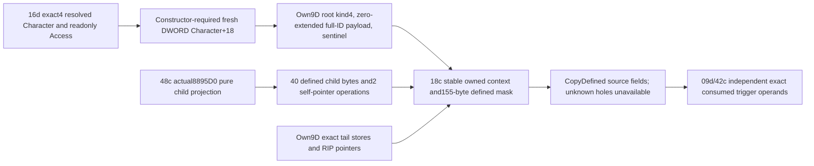

# Lifestyle Character scope projection9D78D0, actual1.20.0.4

The current selected-perk31EBE50 path calls9D78D0 with RCX pointing to its
destination context and RDX pointing to its saved entry Character pointer.
The seven pushes prove RBP+138=entryRSP+10, so this operand is the actual saved
RDX. The constructor returns the destination in RAX, which62c passes to the
null-reporter37998D0 truth path. This source path supplies a pure owned context
projection; it does not invoke a native constructor or evaluate a trigger.

Exact source is CK3 1.20.0.4 / Steam25734779, held EXE SHA
98702F88A547CDE2EAF29A85F93B85F68EE4CF8148336A4F7AFAEB75319DD518.
Constructor [9D78D0,9D79A9) is217B, source SHA
4f5dde0408a43680c16fa19ae7bbe616a934840755565a84a2cbd9fb4e781ade.
Its retained pdata/unwind row is reused. Cache-first lookup found no covering
named main-body cache; the one authorized217B read went to the shared D cache.
No previous image, full hash/PE/pdata scan or game operation occurred.

Actual root initialization clears DWORD+0 then sets WORD+0=4, writes QWORD+8
from the zero-extended full DWORD Character ID at+18, and DWORD+10=FFFFFFFF.
Bytes4..7 and14..17 remain undefined. All generation bits are retained. The
constructor adds no Character magic or sentinel decision;16d/62c retain their
own exact source qualification and admission before supplying the Character.

The one child call8895D0 receives destination+18. This leaf reuses only48c's
ProjectM4FactorActorInnerInit12004 child operations and exact mask, not08's
parent actor tag/layout. Child0..1F and E0..E7 are defined: data pointer→self20,
capacity8,count0, allocator pointer→self18, vptr=module+448D2A0 and
backing=module+54DE2E0. Inline storage and other holes remain undefined. Both
self pointers are rebased into the final18c owned context, never into the
temporary child DTO. No child constructor or allocator executes.

Own9D tail stores are source closed independently:

| Offsets | Values |
| --- | --- |
|100,108,128,130,148,150|zero QWORD|
|110,158|module+54DE270|
|118|module+448D1F8|
|120|module+448D268|
|138|module+54DE278|
|140|zero DWORD|
|160|FFFFFFFF DWORD|
|164|zero WORD|
|166|zero BYTE|

The complete source projection defines155B, with highest explicit byte166 and
minimum extent167. An aligned170-byte software buffer supplies room/alignment;
this is not a claimed native C++ sizeof. LifestyleCharacterScope12004 is
noncopyable and nonmovable so self pointers keep their final storage lifetime.
Physically zeroed raw holes still have mask0. CopyDefinedLifestyleCharacterScopeBytes12004
rejects any request crossing an undefined byte and performs no source read.

ProjectLifestyleCharacterScope9D78D012004 takes only16d's Access, resolved
Character and stable output. Its only guarded source read is Character+18
DWORD; image-relative constants are source-derived addresses. Access already
qualifies the actual4 binding. The projection invents no native frame/source-pin
prerequisite.48c receives its exact held pin and audit frame0, which is neither
a native operand nor a natural event coordinate. The boolean means the owned
source projection is available. Failed guarded reads remain unavailable and
do not return a false selected-perk truth result.

09d's null-R8 wrapper37998D0 reads no context fields before tail-jumping to
372DF10. Exact trigger operands and boolean behavior belong to09d/42c/63c's
separate source consumers. Unknown holes remain unknown even if that consumer
needs them. This projection is not an actual native stack-context witness and
does not establish a final native truth result by itself.

Source-first packet: continuation-18c/SOURCE-9D78D0.json, SOURCE-TREE.md and
SOURCE-FROZEN.json; child closure is continuation-48c/SOURCE-FROZEN.json and
its current production inner projection. The initial16d Access header later
added optional TLS metadata;18c consumes only its unchanged module/read fields.

New no-main export RunLifestyleCharacterScope9D78D0NewCases12004 joins the
unique16/62→10 connected M5 compound. Its four new cases cover full-generation
ID zero-extension, stable child-pointer rebasing and reprojection, undefined
hole rejection without source reads, and failed guarded-read availability.
It invokes no native code or old18b/48 qualification fragment. At author
delivery this fragment is NOT_RUN; central10 owns the sole execution and Root
owns adoption. No live constructor/evaluator observation is claimed.
