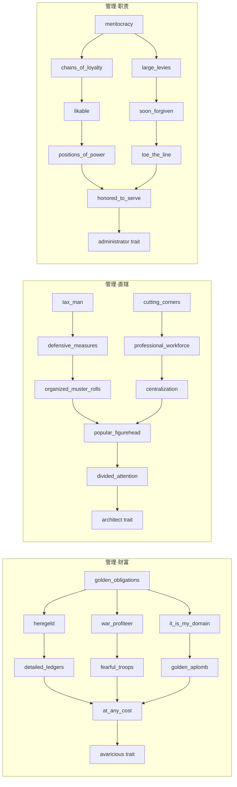
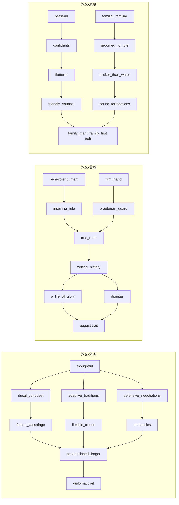
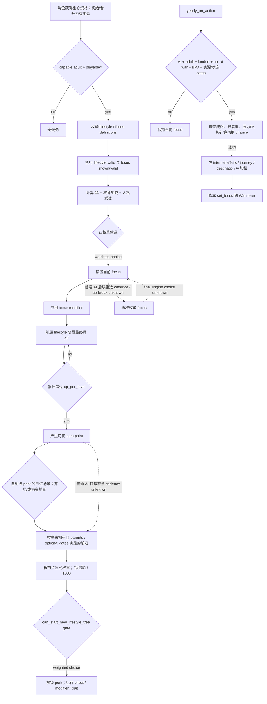

# 生活方式、重心与技能：原生 AI 决策树和 LIFE1 施工边界

## 状态与适用范围

- **证据状态**：`static-confirmed`。本文冻结原版脚本、GUI 反射注册、只读 getter 和角色内存树；没有启动 CK3，也没有 paused live artifact。
- **游戏构建**：CK3 `1.19.0.6`。
- **EXE**：`Crusader Kings III/binaries/ck3.exe`，95,206,008 bytes，SHA-256
  `2D00FF3101EF70B566F2FCBAE292F09263199C80E9DC8F139B82D7D96F83DB86`。
- **目标场景**：当前玩家是有地、可游玩的封建成年统治者；优先解锁和平治理中的收入、直辖、健康、发展和最低限度派系应对。
- **明确非目标**：不把固定 2560×1440 中文界面的“权威重心”点击当成通用能力；不扩展宗教域；不研究所有 DLC/政府的完整技能收益；不实现技能重置；不把引擎命令 ACK 当作状态改变。
- **当前能力结论**：原版决策输入、候选、脚本权重以及只读角色结构已经足以施工第一个 native observer；动作最终提交链和真实 paused 后置验证仍未闭合，所以 LIFE1 目前是 `static-confirmed`，不是 `production-live primitive`。

本文中的证据等级沿用本目录约定：`static-confirmed` 表示 exact-build 文件或 EXE 直接支持；`inference` 表示多项静态事实共同支持、但尚缺执行点或实机互证；`unknown` 只保留确实位于引擎内部且尚未闭合的分支。

## Exact-build 证据账本

下列路径均相对于 `Crusader Kings III/game/`。行号绑定 CK3 1.19.0.6 随附文件；升级游戏后必须重新计算哈希和定位。

| 资产 | SHA-256 | 直接支持的结论 |
|---|---|---|
| `common/lifestyles/_lifestyles.info` | `827D9297E067E70B7F38DE1FEC6DA5E7B1B808AB8C7B4777F2C54B81B5E4BD38` | 生活方式定义、每级经验、基础月经验 |
| `common/lifestyles/00_lifestyles.txt` | `13BAEF069A7CA562AEF9673C79490F74ECE8E53E3EE734E9061B91B0ADC78B98` | 五个核心生活方式均为 1000 XP/级、25 基础月 XP；游历生活方式的 DLC gate |
| `common/focuses/_focuses.info` | `A0EF25FBABD3A06C9215BD4CCE23D8CAE64389FEAB076FC490EEAA584D5E2750` | `is_shown`、`is_valid`、所属生活方式、持续 modifier、`auto_selection_weight` 语义 |
| `common/focuses/00_lifestyle_focuses.txt` | `DF55AA0F96A7085817D0884A401A208786FA0C57E8BBD2BA40115F8C37CBABD2` | 候选重心、脚本合法性、AI 权重和持续收益 |
| `common/lifestyle_perks/_lifestyle_perks.info` | `759CB7EC655FBAC47B0C7F7F3CCCC18FC4ED9A430FA367D0BE4D21489AD98C63` | parent、`can_be_picked`、`can_be_auto_selected`、一次性 effect、持续 modifier、默认权重 1000 |
| `common/scripted_triggers/00_lifestyle_triggers.txt` | `4FCEE4D24FC31C4384D0FB14A80B758736989471647028606EE52D2541AF4AE4` | 新技能树 gate、单树/整类完成判定 |
| `common/scripted_triggers/00_available_for_events_triggers.txt` | `5566A89A7D93BFB80DCF5A2F065BE0F058BE13E0B84470D1182B82D8D6384A44` | `can_select_lifestyle_focus` 的 capable-adult + playable 脚本门 |
| `common/scripted_effects/00_lifestyle_focus_effects.txt` | `6891063B67F9954B01C54BC6201B9551A722F22437AEC0104746232622034C70` | 和平有地 AI 转入游历重心的显式权重和 `set_focus` 输出 |
| `common/on_action/yearly_on_actions.txt` | `0FC85A284224A68D1CA0A4EF071D4F4A4F49896753AEC463975A12EE4E1116FA` | 游历转向 effect 的年度调用 |
| `common/important_actions/00_lifestyle.txt` | `4D3C887C733254017C840DC741650F4D812F0E5CF31482C7C7DA360FB8625BB7` | 玩家无重心/有未花技能点的提醒条件；不是 AI 调度器 |
| `common/defines/00_defines.txt` | `C1ECA141C71EC1E741CA5336E01BB538EEFAEC05B0684EDEC477CFC9053C3807` | 成年重心更换冷却 60 个月 |
| `gui/window_character_lifestyle.gui` | `C506945C15D57BDDF79179E97739151334B03249544BA6FD8243B1E657669B07` | 引擎查询、合法性检查和动作方法名 |
| `gui/hud.gui` | `1AE3F1371E0A9C43D0B62FC1C1F3A0CDBB0EAB9CF08B85545556CBF3D7386312` | 成年玩家打开生活方式窗口的入口 |
| `localization/english/gui/lifestyle_window_l_english.yml` | `99482844675CC535804E4160025E461B528AA85B166CFF4F21DF78E68EC1132E` | 重心/技能选择的玩家可见拒绝原因 |

和平治理六棵技能树的冻结哈希如下：

| 技能树文件 | SHA-256 |
|---|---|
| `common/lifestyle_perks/00_diplomacy_1_foreign_affairs_tree_perks.txt` | `11CD0804DCB859748569D083245F2EC614E5DCCB7AB5915415FA7775A147B510` |
| `common/lifestyle_perks/00_diplomacy_2_majesty_tree_perks.txt` | `AB42A969ED549571FD1B3DCD8994EDC2D993E49244192B0ACF8E3FBA9C631DC3` |
| `common/lifestyle_perks/00_diplomacy_3_family_tree_perks.txt` | `86CDF9EB1EA6F08D5410C5D40CAC9DCB5721B670B5CEEF0F319805F1E2C36292` |
| `common/lifestyle_perks/00_stewardship_1_wealth_tree_perks.txt` | `4D13283515D4131151AC6CF0AA7A9D6F9044DF5765DFB332C2A31FDFF9BAD2F3` |
| `common/lifestyle_perks/00_stewardship_2_domain_tree_perks.txt` | `ADB3EF30EBE3DA37FC02F8F132815173987527B6E82C19FB738A8EB8D3635C21` |
| `common/lifestyle_perks/00_stewardship_3_duty_tree_perks.txt` | `DA193ECE7C99B41CCC5C350D1D94F7AA3B86C29CA4779ED1A14C10EAAE5D8F0E` |

## 原版状态模型

### 生活方式与经验

`common/lifestyles/_lifestyles.info:1-10` 说明：当前重心属于一个生活方式，并向该生活方式提供经验。`00_lifestyles.txt:1-52` 令外交、军事、管理、谋略、学识五类的 `xp_per_level=1000`、`base_xp_gain=25`。因此在没有其他修正时，一个技能点需要 40 个月。实际月增量仍须读取引擎最终值，不能用 25 常量替代角色修正后的结果。

`window_character_lifestyle.gui:1368-1393` 直接消费 `Character.GetLifestyleXp`、`GetPerkPoints` 和 `GetPerkPointsUsed`。EXE 中相应 exact-build getter 已定位：

| 语义 | 反射字符串/注册 | wrapper / direct | 静态结构事实 |
|---|---|---|---|
| `GetPerkPoints` | string RVA `0x4328630`，reg `0x516149` | `0x2669890` / `0x2668A00` | 从生活方式 XP map 求值并除以 `Lifestyle+0x138` 的每级 XP |
| `GetPerkPointsUsed` | `0x4328640`，reg `0x5162D3` | `0x2669940` / `0x2668A80` | 按 perk `+0x468` 的 lifestyle 指针统计已解锁项 |
| `GetLifestyleXp` | `0x4328620`，reg `0x516449` | `0x26699F0` / `0x2668B80` | 返回 raw 或按布尔参数返回当前级余数 |
| `HasPerk` | `0x42F4A40`，reg `0x5165CD` | `0x2669B10` / `0x2668EA0` | 经 `0x2669170` 取得向量，再由 `0x9A3C20` 做指针成员判断 |

角色生活方式动态数据从 `CCharacter+0x1A8` 的 living-data 开始：

- XP map：living-data `+0x208` 数据、`+0x214` 数量；每项 16 bytes，形如 `{Lifestyle*, fixedpoint}`。
- 已解锁 perk vector：accessor `0x2669170` 返回 living-data `+0x220`，其中 data pointer 在 `+0x0`、count 在 `+0xC`，元素为 `Perk*`。
- 当前重心：`CCharacter+0x1A8 -> +0x280 -> +0x8`。
- 当前生活方式：当前重心对象 `+0x880`。

这些地址只对本文 exact EXE 有效。它们证明第一个只读 observer 有确定入口，不证明任何写入 ABI。

### 重心候选与原版权重

`_focuses.info:28-45,120-146` 明确把 `auto_selection_weight` 定义为主要供 AI 使用，并在角色初次获得重心资格时用于自动选择。`00_available_for_events_triggers.txt:720-738` 的提醒级脚本门是 `is_capable_adult=yes` 且 `is_playable_character=yes`。十五个普通重心又在各自 `is_shown/is_valid` 中排除 landless adventurer；它们没有封建专属门，所以能覆盖当前有地封建统治者。

十五个普通候选都先取 `11`；相应能力教育特质 1–5 级任一命中便加 `1989`，即人格乘数前为 `2000`。教育集合定义在 `common/scripted_triggers/00_scripted_triggers.txt:45-92`。下表列出脚本中的全部额外乘数和持续输出：

| 生活方式 / 重心 | exact 行 | AI 权重（教育加成后再乘） | 持续输出 |
|---|---:|---|---|
| 外交 / foreign affairs | `00_lifestyle_focuses.txt:3-42` | `×0` shy | diplomacy +3 |
| 外交 / majesty | `:45-91` | `×5` arrogant，`×2` ambitious | diplomacy +1，monthly prestige +1 |
| 外交 / family | `:94-128` | 无额外人格乘数 | diplomacy +2，fertility +0.2 |
| 军事 / strategy | `:163-196` | 无额外人格乘数 | martial +3 |
| 军事 / authority | `:199-246` | `×2` arrogant，`×0` shy | martial +1，monthly county control +0.3，dread gain +20% |
| 军事 / chivalry | `:249-302` | `×5` brave，`×2` honest，`×1.5` chaste | advantage +5，prowess +3，attraction opinion +10 |
| 谋略 / skulduggery | `:337-395` | `×2` deceitful，`×5` paranoid，`×0.1` trusting，`×0.1` honest | intrigue +3，owned-scheme secrecy +15 |
| 谋略 / temptation | `:398-449` | `×7` lustful，`×0` celibate/chaste | attraction opinion +10，fertility +0.2，seduce phase duration bonus |
| 谋略 / intimidation | `:451-515` | `×3` callous，`×2` wrathful，`×2` vengeful，`×0` craven/compassionate/forgiving | intrigue +2，dread baseline +30，dread loss -25% |
| 管理 / wealth | `:550-595` | `×5` greedy，`×0` generous | monthly income +10% |
| 管理 / domain | `:598-637` | `×2` diligent | stewardship +3 |
| 管理 / duty | `:640-679` | `×5` just | stewardship +1 |
| 学识 / medicine | `:714-749` | 无额外人格乘数 | learning +1，health +0.25 |
| 学识 / scholarship | `:751-786` | 无额外人格乘数 | learning +3，development growth +15% |
| 学识 / theology | `:788-836` | `×5` zealous，`×0` cynical | religious-head opinion +10，learning +2，monthly piety +1 |

宗教重心只是为了完整记录原版候选；本项目的宗教域仍明确暂缓，当前治理 planner 不研究或选择 theology。

### 技能候选、父图和评分

`_lifestyle_perks.info:1-19,38` 给出通用规则：候选属于一个生活方式和技能树，必须满足全部 `parent`，还可带 `can_be_picked` 和 `can_be_auto_selected`。自动选择默认权重为 `1000`。本节六棵和平治理树未声明额外的 `can_be_picked/can_be_auto_selected`，因此脚本级候选由父图决定；最终合法性仍必须调用引擎 `CanSelectPerk`。

每棵树的根节点采用同一主公式：

```text
root_weight = 11
            + 1989  if matching education rank 1..5
root_weight *= 5    if current focus matches the tree
root_weight *= 0    if can_start_new_lifestyle_tree_trigger = no
```

`00_lifestyle_triggers.txt:5-117` 的最后一项避免 AI 在同一生活方式已有未完结树时另开新树；带双根的树在已持有另一根时有配对例外。Majesty 和 Wealth 的根节点还在上述乘零之后对 conqueror 加 `10000`，因此 conqueror 可以重新得到非零候选。获得父节点后，后继节点没有显式权重，使用 schema 默认 `1000`；同一前沿的多个后继拥有相等的声明权重，最终 tie-break 属于引擎。

六棵当前治理相关原版父图如下。括号中的末节点是获得的终点 trait；每个箭头表示 parent 依赖。



对应 exact 锚点：Wealth `00_stewardship_1_wealth_tree_perks.txt:6-361`；Domain `00_stewardship_2_domain_tree_perks.txt:6-436`；Duty `00_stewardship_3_duty_tree_perks.txt:6-433`。明确 root 权重分别在 Wealth `:12-38`、Domain `:12-31,183-202`、Duty `:12-30`。



对应 exact 锚点：Foreign `00_diplomacy_1_foreign_affairs_tree_perks.txt:1-394`；Majesty `00_diplomacy_2_majesty_tree_perks.txt:1-453`；Family `00_diplomacy_3_family_tree_perks.txt:1-341`。明确 root 权重分别在 Foreign `:7-25`、Majesty `:8-33,136-161`、Family `:7-28,200-221`。

上述图冻结了候选依赖，不等于建议我方逐字复制原版选择。每个 perk 还可能含一次性 `effect`、持续 modifier 或终点 trait；首个 planner 应使用经逐项审阅的治理 allowlist，而不是把任意前沿节点都当作可互换收益。

### 冷却、费用、合法性和可验证输出

| 动作 | 脚本/引擎前置 | 冷却与费用 | 成功后必须读回的结果 |
|---|---|---|---|
| 选择/更换重心 | capable adult、playable；focus shown/valid；最终 `CharacterLifestyleWindow.CanSelectFocus(FocusType)` | 成年更换冷却 `FOCUS_ADULT_COOLDOWN_MONTHS=60`（`00_defines.txt:240-242`）；未发现金钱、威望、虔诚成本 | `Character.GetFocus.GetKey` 等于目标；所属 lifestyle 与最终月 XP 更新；冷却状态/截止日更新 |
| 解锁技能 | 当前重心属于该生活方式；有未花点数；尚未拥有；所有 parent 满足；可选 trigger 满足；最终 `CanSelectPerk` | 没有逐 perk 资源 cost 或 cooldown 字段；一次解锁消耗一个同生活方式点数是 GUI/getter/命令共同支持的 `inference`，不是脚本常量 | `HasPerk=true`；该生活方式 available points 减一且 used 加一；目标 trait/modifier/关键一次性 effect 按静态清单验证 |

本地化 `lifestyle_window_l_english.yml:20-29,44-46` 明确列出重心冷却截止、仅雇主可变更、无同生活方式重心、无点数、已拥有和缺父节点等拒绝原因。`CanSelectPerkIgnoreCost` 只供技能连线/可达状态显示（`window_character_lifestyle.gui:994-1004`），不得用它代替真正动作 gate。

技能重置会返还技能、施加基值 100 的压力、写入一次性 `has_refunded_perks` flag，并清理若干终点 trait/modifier；历史一次性 perk effect 未证明可全部回滚。因此 reset 不进入首个 LIFE1 observer/action/planner。

## 原版 AI 决策树

下面把脚本已经闭合的分支画为实线，只把真正仍在引擎内的部分画为虚线 `unknown`。



`_focuses.info` 和 `_lifestyle_perks.info` 只明确保证初始/成为有地时的自动选择语义，不能据此声称普通 AI 每月、每年或获得点数当日都会执行相同加权。玩家 important-action 提醒也只是 UI 提醒，不是 AI 调度证据。

### 和平有地 AI 的显式 Wanderer 分支

这一分支不是 unknown。`yearly_on_actions.txt:2300` 每年调用 `ai_chance_to_switch_to_travel_focus_effect`；`00_lifestyle_focus_effects.txt:935-1064` 的 gate 包括 AI、成年、有地、不在战争、BP3、金币至少 `minor_gold_value`、county+、当前生活方式至少完成一棵树，并排除已经游历、reclusive/incapable/isolating。

触发 chance 从 5 开始：当前生活方式三树全完加 75；traveler travel-track 达 25/50 各加 20；temptation focus 减 20；若 shy、压力至少 150、或符合 sociability/boldness 条件，相应分支还按已分配 perk 点数每点加 3。触发后：

- internal affairs：基础 1；经济繁荣人格、当前管理重心或 greedy 时加 99（`:1019-1029`）。
- journey：基础 1；压力至少 50 或低 sociability 且非 impatient 时加 99；压力至少 150 且非 impatient 再加 100（`:1031-1049`）。
- destination：基础 1；当前学识重心、impatient 或 ambitious 时加 99（`:1051-1060`）。

候选定义在 `00_lifestyle_focuses.txt:870-983`。它们本身的通用自动权重从 0 开始：BP3 且 traveler travel-track 至少 50 加 500，BP3 且有 adventurer trait 再加 500。Wanderer lifestyle 另由 `00_lifestyles.txt:54-64` 绑定 Wandering Nobles feature。首个我方治理 OODA 不需要复刻此长期分流，但 observer 应能准确发布当前 focus/lifestyle，避免把合法 Wanderer 状态误判为读取失败。

## exact-build GUI/native 查询与动作边界

HUD `hud.gui:3606` 通过 `OpenGameViewData('lifestyle', GetPlayer.GetID)` 打开生活方式窗口。窗口根上下文在 `window_character_lifestyle.gui:15-16`，候选分别来自 `GetFocuses`（`:599`）和 `GetPerkTrees`（`:919`）。真正的 GUI gate/action 为：

| 方法 | string RVA → registration → wrapper → direct |
|---|---|
| `CanSelectPerk` | `0x41479A8 -> 0x1EC459 -> 0x132F310 -> 0x132D640` |
| `CanSelectPerkIgnoreCost` | `0x41479B8 -> 0x1EC5E3 -> 0x132F3C0 -> 0x132D700` |
| `SelectPerk` | `0x4147998 -> 0x1EC8F9 -> 0x132F520 -> 0x132D1A0` |
| `CanSelectFocus` | `0x4147768 -> 0x1ECA69 -> 0x132F5C0 -> 0x132D4A0` |
| `SelectFocus` | `0x4147748 -> 0x1ECD79 -> 0x132F720 -> 0x132D320` |
| `GetLifestyles` | `0x4147820 -> 0x1EDAD9 -> 0x132F930 -> 0xB755D0` |
| `GetPerkTrees` | `0x41477E8 -> 0x1EDC49 -> 0x132F990 -> 0xCCC4D0` |
| `GetFocuses` | `0x41477F8 -> 0x1EDDA9 -> 0x132F9F0 -> 0xCEBE10` |

角色反射 `GetLifestyle` 的 string RVA/registration 为 `0x41866C8/0x516752`，callbacks `0x2669BC0/0x2669BD0`，direct `0x26691F0`；`GetFocus` 在 registration `0x516932` 内以内联 `movabs` 字节构造 `GetFocus` 字符串，callbacks `0x2669C10/0x2669C20`，direct `0x26692F0`。三个列表包装器的末端被调函数已经定位，但其独立类型语义尚未闭合，不能仅凭地址把返回容器布局写入 bridge。

EXE RTTI 同时存在 `CSetCharacterFocusCommand`、`CAddLifestylePerkCommand` 和 `CRefundPerksCommand`。然而 `SelectPerk 0x132D1A0` 与 `SelectFocus 0x132D320` 会先在 window `+0x158/+0x160` 安装确认对象；当前尚未闭合确认 callback 到最终 gameplay command 的构造参数和提交点。因此：

- 上述 getter 和角色结构可用于只读 native bridge。
- `SelectFocus/SelectPerk` 是高可信原生动作入口候选，但不是“调用即同帧 world-write”的证据。
- 任何动作实现都要走原生 preflight、确认/提交机制和下一 paused revision 后置读回；禁止直接改 `+0x280` 或 perk vector。

## 当前项目能力与缺口

现有 `opening_smoke.py` 只有固定 Robert 1066、中文 2560×1440 下的 Military → Authority OCR/点击路径，且明确标为 `policy_boundary="player-visible OCR only"`。它没有原生 focus identity、最终合法性、候选列表或语义后置验证。历史月报因此正确地把生活方式标为 `visual-narrow`。

已有资产中可以直接复用的部分：

- `CharacterPerk` 数据库、owned span、stable key 和 pointer-membership ABI 已在 `combat-phase-events.md:885-925` 静态闭合。
- `ck3_query_campaign_root_context_v1` 与 `ck3_query_turn_bundle_v1` 已能提供当前封建玩家的 identity/government、金币/月收入、health、domain size/limit、targeting-faction count 和当前 council task；无需另建一套统治者聚合。
- `ck3_query_loaded_feature_manifest_v1` 已能读取当前进程实际 gameplay feature/DLC gates，可用于 Wanderer/DLC 候选解释。
- `steward-develop-county-ai.md:29-40` 已证明 `stewardship_wealth_focus` 和 `tax_man_perk` 会进入 Collect Taxes 原版权重；这说明 LIFE1 会直接改变和平治理决策质量，但该 council 候选/action 当前仍不能替代 lifestyle 状态和动作。

当前没有 lifestyle 专用 MCP/query/action，也没有通用当前玩家 focus、lifestyle XP、perk points、owned perks、合法 focus/perk candidates 或语义选择 receipt。公共工具名或固定视觉点击不能填补这些字段。

## 最小 bridge/MCP 合同与施工优先级

### P0：当前玩家生活方式快照和合法候选

这是最高价值缺口；它把“固定画面点权威”升级为可在任意当前封建玩家上决策的原生状态。

建议单一只读 `query-player-lifestyle-state-v1`，沿用 campaign-root 的 player/revision/date binding：

```text
player_character_id
snapshot_revision / in_game_date / exact_build
current_focus_key
current_lifestyle_key
focus_change_allowed
focus_change_block_reason
focus_change_cooldown_end_date / remaining_months

lifestyles[]:
  key, valid
  xp_raw, xp_within_level, xp_per_level, monthly_gain
  available_perk_points, used_perk_points

focus_candidates[]:
  key, lifestyle_key
  shown, valid, can_select, block_reason
  auto_selection_weight

owned_perk_keys[]
perk_frontier[]:
  key, lifestyle_key, tree_key, parent_keys, is_finisher
  can_select_ignore_cost, can_select, block_reason
  auto_selection_weight
```

定义元数据和收益摘要应作为 exact-build 静态 catalog/fixture 发布，动态帧只返回 stable key、最终 engine gate 和数值状态，避免每帧重复序列化所有脚本描述。`null` 只能表示一次读取失败或构建不支持；不能让 `current_focus_key`、点数或合法前沿长期为 null 后宣称 observer 完成。

首个 observer 不需要人格/教育 AI 原始权重也能产生玩家价值。若保留 `auto_selection_weight`，必须标明它是原版 opponent-model/explanation，不是我方最终效用分。`focus_change_allowed` 与 `can_select` 应优先复用引擎 final evaluator，而不是仅在 Python 重写脚本门。

### P1：解锁一个治理技能

技能点已经存在时，花点能立即改变治理能力，且不承担 60 个月重心锁。动作 `select-player-lifestyle-perk-v1` 应：

1. 接收 exact perk stable key、player/full-generation identity、来源 snapshot revision/date、预期可用点数和父节点摘要。
2. 在 application-main 重新解析 key 并调用 `CanSelectPerk`，不接受 `CanSelectPerkIgnoreCost` 作为授权。
3. 通过闭合后的原生确认/command 提交；提交 ACK 只表示受理。
4. 在更新的 paused snapshot 验证 `HasPerk=true`、同类 available points `-1`、used `+1`，再按该 allowlisted perk 验证关键 trait/modifier/effect。

首个 allowlist 优先管理 Wealth/Domain/Duty 根和当前已开始树的唯一合法前沿。复杂一次性 effect 未审阅的 perk 保持不可自动选择，而不是泛化动作安全结论。

### P2：选择或更换重心

动作 `select-player-lifestyle-focus-v1` 应绑定同一 snapshot identity/revision，application-main 重新调用 `CanSelectFocus`，通过原生确认/command 提交，并在新 paused frame 验证：

- `GetFocus.GetKey` 等于目标；
- current lifestyle 和最终 monthly gain 与目标一致；
- 60 个月冷却状态已按引擎更新。

第一条 live OODA 优先处理“当前无重心”的合法初选；已有重心的主动切换只有在净收益足以承受五年锁定时才执行。直接脚本 `set_focus` 不得用作 production 玩家动作，因为它是否遵守 GUI 冷却没有静态证明。

### P3：当前封建和平治理 planner

首个 bounded planner 复用已 production-live 的 health、gold/monthly income、domain size/limit、targeting-faction count 和 council state：

1. 若已有未花点数，优先在**当前已开始的治理树**选择合法 allowlisted 前沿，避免五年重心锁。
2. 若没有重心：health 低于现有 turn-bundle 的 fine 阈值时优先 medicine；直辖超限/接近上限时优先 domain；持续预算不足时优先 wealth；均不触发时以 scholarship/wealth 作为发展与收入基线。
3. 只有当前 focus 可变更且五年期收益明确高于维持收益时才切换；只知道“有派系”而不知道类型/力量/期限时，不据此切到 intimidation/authority。
4. 宗教专用 theology 保持排除；战争期间的军事重心属于战争 OODA，不由 LIFE1 和平 planner 扩展。
5. 每轮最多提交一个动作，随后以新 paused snapshot 验证，再继续规划。

该策略是最小可玩 counter-policy，并不照抄原版的教育/人格权重。未使用的原版人格输入保留为质量差距，不阻塞第一条可见 OODA。

## 真实 unknown 与下一施工入口

以下缺口尚无 exact-build 静态闭合或 live 证据，必须保持 unknown：

1. **普通 AI cadence**：初始/成为有地之外，普通 AI 何时重新选择重心、何时花新获得的 perk 点，脚本没有给出引擎调度周期。
2. **weighted choice 细节**：同权重 tie-break、PRNG 流和候选枚举顺序位于引擎内；没有 paused 角色状态时也无法断言实际赢家。
3. **动作最终提交 ABI**：`SelectFocus/SelectPerk` 到确认 callback、`CSetCharacterFocusCommand/CAddLifestylePerkCommand` 构造参数、序列化和安全调用入口尚未闭合。
4. **冷却存储与首次选择语义**：60 个月 define 和 GUI 拒绝文本已证，但冷却截止字段、首次从无重心到有重心是否立即写同一冷却尚未闭合。
5. **引擎隐藏合法性**：脚本/本地化未枚举的 `CanSelectFocus/CanSelectPerk` 全部内部条件仍需 final evaluator，而不是假定不存在。
6. **任意 perk 一次性 effect 的回滚/后置**：首个动作只验证 allowlist 的已知输出；不能从 `HasPerk=true` 推断所有世界状态副作用均已理解。
7. **live readiness**：当前没有 exact-build paused lifestyle snapshot，也没有动作前后 receipt；完成 P0 后仍须一次 bounded live 才能把 observer 升为 production-live。

下一项施工应直接从 `CCharacter+0x1A8` 的 focus/XP/perk 只读树和现有 `CharacterPerk` stable-key 解析开始，先交付 P0 observer + fixture。P0 的真实 paused snapshot 通过后，再闭合两个原生 action 的确认/command 链。继续用 OCR 扩分辨率或把 unknown 留成长期 null 都不会解除当前阻点。

## 验收边界

本文完成的是 exact-build 原生树和施工合同，不是实机能力。后续每一层的最低验收如下：

- **P0 static/fixture**：known zero、合法空数组、读失败、无重心、已有重心、跨级 XP、多个未花点、双根树和缺 parent fixture；stable key/hash round-trip；同帧双采样。
- **P0 live**：同一 paused frame 的视觉当前重心/点数与 native snapshot 对照；重复查询稳定；一次 cold restore。
- **P1/P2 action**：source → ACK → later paused state 三段分离；过期 revision 拒绝；原生 final preflight；后置状态变化；managed cleanup。
- **planner**：当前封建玩家在 bounded scene 中完成一次“观察 → 选择合法 focus 或 perk → 提交 → 新帧验证”；不要求为单个路径进行永久长跑。

在这些证据出现以前，诚实状态保持：native tree `static-confirmed`；observer/action/planner `not implemented`；固定视觉路径 `visual-narrow`。

## LIFE2 P0 私有 observer core（2026-09-14）

LIFE2 已把 LIFE1 的 current-state 入口实现为私有、未接线的 `g2_player_lifestyle_snapshot_v1`。当前状态是
`static-ready-private-core-unwired`：没有注册进共享 bridge、CMake 或公共 MCP，也没有启动 CK3，因此不能写成
`production-live primitive`。ABI 账本位于
`ck3_autonomous_player/native_bridge/research/player_lifestyle_snapshot_v1_abi.json`。

已经实现并由 normal/O 双模式 fixture 覆盖的读取语义如下：

- 当前 focus 使用 `GetFocus` direct `0x26692F0`；返回值等于 `module+0x570CB90` 所存 fallback 指针时，发布
  `presence=absent`。getter、fallback slot 或内存读取失败会令整份 snapshot `unavailable`，不会伪装成“无重心”。
- focus 存在时，以 `GetLifestyle` direct `0x26691F0` 读取所属 lifestyle，并要求它与 `Focus+0x880` 的指针一致；
  stable key 从对象 `+0x18` 的 bounded MSVC string 复制，只接受 `[a-z0-9_]`，native pointer 不进入输出。
- XP、当前等级余量、每级 XP、可花点和已花点分别绑定 direct `0x2668B80`、`Lifestyle+0x138`、
  `0x2668A00` 和 `0x2668A80`。数值零是已知值，读取或范围校验失败是 typed unavailable。
- 已解锁 perk 从 direct `0x2669170` 的 `{data,+0xC count}` span 读取，每个 `Perk*+0x18` 解析 stable key。
  `count=0` 发布 `owned_perk_keys=[]`；span 读取失败使整份 snapshot unavailable。
- 事务在相同 paused frame 边界内读取两份完整 source sample；只有两份逐字段相等，且之后的
  snapshot/revision/proof epoch/date/player identity 仍与之前一致，才排序 copied key 并原子发布。

候选与最终合法性仍有一个真实、局部的边界。`GetFocuses`、`GetPerkTrees`、`CanSelectFocus` 和
`CanSelectPerk` 都依赖经过验证的当前玩家 `CCharacterLifestyleWindow` owner；当前没有该 owner 的生命周期和身份
证据。生产读取因此明确发布：

```json
{"legal_focus_candidates":{"status":"unavailable","reason":"lifestyle_window_unavailable","items":[]},"legal_perk_candidates":{"status":"unavailable","reason":"lifestyle_window_unavailable","items":[]}}
```

这里的空 `items` 只是 unavailable 分量不携带残留行，不能解释为“已知没有合法候选”。offline fixture 另外覆盖了
`status=available, items=[]` 的 known-empty 语义，以保证未来接入 enumerator 后不会混淆。下一项唯一集成入口是先闭合
current-player lifestyle window owner，再调用 exact enumerator 和 final evaluator；在此之前不得用 null/伪造 window，
也不得把脚本门或 `CanSelectPerkIgnoreCost` 当作最终合法性。

本包的静态证据不影响 open_kaishek：没有公共 capability、schema、协议、依赖或版本变更。后续接共享 bridge/MCP 时才会
触发兼容层配对工作包；接线后仍须用一次 bounded paused snapshot 验证无重心、已有重心、已解锁 perk 与候选边界。
