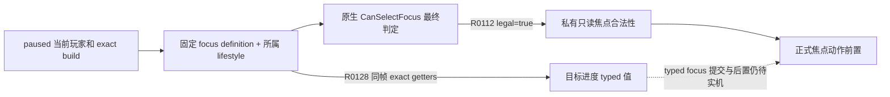
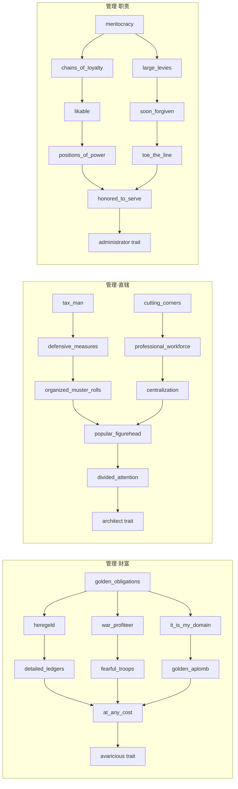
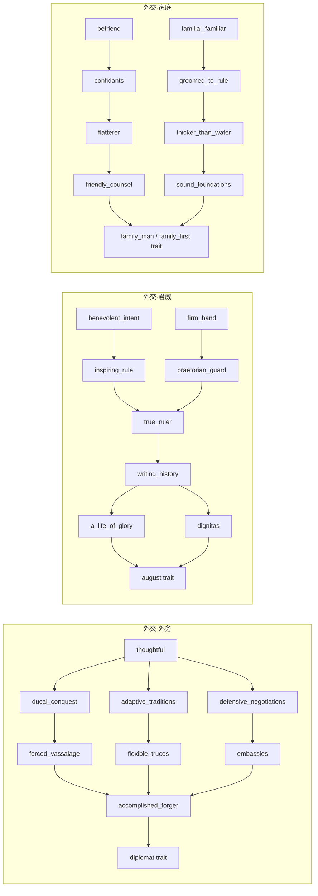
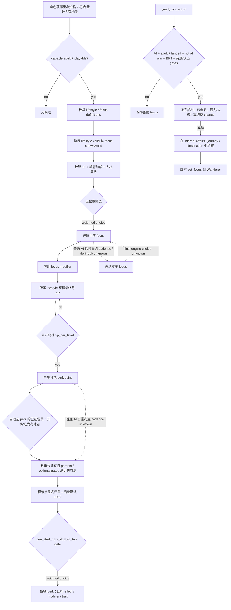
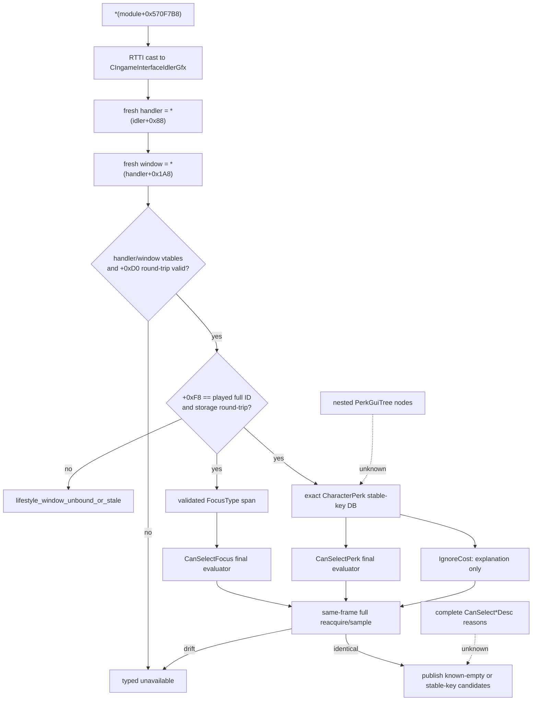
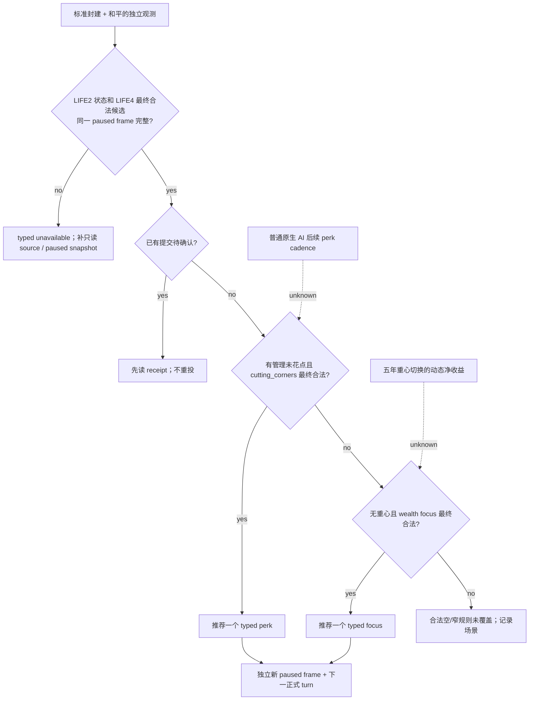
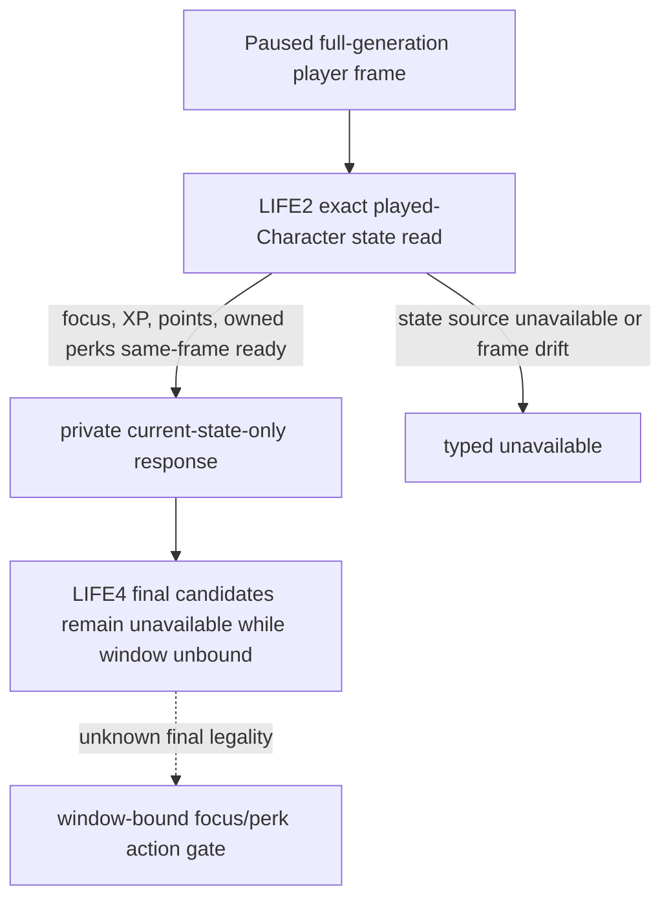
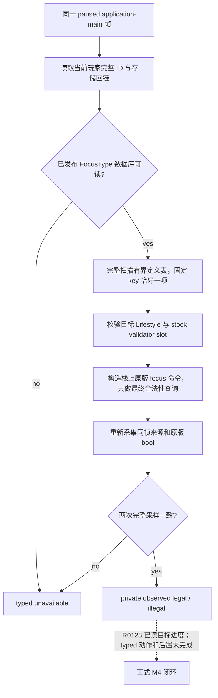
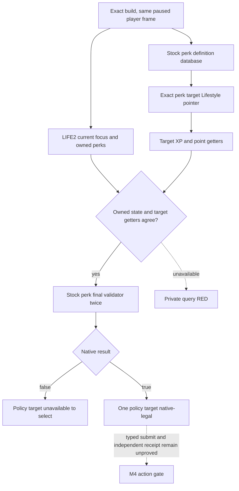

# 生活方式、重心与技能：原生 AI 决策树和 LIFE1 施工边界

## 状态与适用范围

- **证据状态**：原版选择树仍为 `static-confirmed`；R0112 对当前玩家的固定财富重心最终合法性有一条 `production-live primitive` 私有只读证据，不等于原版 NPC 排名、正式策略消费或动作。
- **游戏构建**：CK3 `1.19.0.6`。
- **EXE**：`Crusader Kings III/binaries/ck3.exe`，95,206,008 bytes，SHA-256
  `2D00FF3101EF70B566F2FCBAE292F09263199C80E9DC8F139B82D7D96F83DB86`。
- **目标场景**：当前玩家是有地、可游玩的封建成年统治者；优先解锁和平治理中的收入、直辖、健康、发展和最低限度派系应对。
- **明确非目标**：不把固定 2560×1440 中文界面的“权威重心”点击当成通用能力；不扩展宗教域；不研究所有 DLC/政府的完整技能收益；不实现技能重置；不把引擎命令 ACK 当作状态改变。
- **当前能力结论**：LIFE2 当前状态、固定财富重心最终合法性及目标管理生活方式 XP/点数已有私有 paused 观测；R0128 仅关闭该角色和 exact build 的目标进度只读子门。正式 focus/perk 动作、后置与下一轮消费仍未闭合，不得称为完整 LIFE1/M4。

本文中的证据等级沿用本目录约定：`static-confirmed` 表示 exact-build 文件或 EXE 直接支持；`inference` 表示多项静态事实共同支持、但尚缺执行点或实机互证；`unknown` 只保留确实位于引擎内部且尚未闭合的分支。

## Exact-build 证据账本

下列路径均相对于 `Crusader Kings III/game/`。行号绑定 CK3 1.19.0.6 随附文件；升级游戏后必须重新计算哈希和定位。

| 资产 | SHA-256 | 直接支持的结论 |
|---|---|---|
| `common/lifestyles/_lifestyles.info` | `827D9297E067E70B7F38DE1FEC6DA5E7B1B808AB8C7B4777F2C54B81B5E4BD38` | 生活方式定义、每级经验、基础月经验 |
| `common/lifestyles/00_lifestyles.txt` | `13BAEF069A7CA562AEF9673C79490F74ECE8E53E3EE734E9061B91B0ADC78B98` | 五个核心生活方式均为 1000 XP/级、25 基础月 XP；游历生活方式的 DLC gate |
| `common/focuses/_focuses.info` | `A0EF25FBABD3A06C9215BD4CCE23D8CAE64389FEAB076FC490EEAA584D5E2750` | `is_shown`、`is_valid`、所属生活方式、持续 modifier、`auto_selection_weight` 语义 |
| `common/focuses/00_lifestyle_focuses.txt` | `DF55AA0F96A7085817D0884A401A208786FA0C57E8BBD2BA40115F8C37CBABD2` | 候选重心、脚本合法性、AI 权重和持续收益 |
| `common/lifestyle_perks/_lifestyle_perks.info` | `759CB7EC655FBAC47B0C7F7F3CCCC18FC4ED9A430FA367D0BE4D21489AD98C63` | parent、`can_be_picked`、`can_be_auto_selected`、一次性 effect、持续 modifier、默认权重 1000 |
| `common/scripted_triggers/00_lifestyle_triggers.txt` | `4FCEE4D24FC31C4384D0FB14A80B758736989471647028606EE52D2541AF4AE4` | 新技能树 gate、单树/整类完成判定 |
| `common/scripted_triggers/00_available_for_events_triggers.txt` | `5566A89A7D93BFB80DCF5A2F065BE0F058BE13E0B84470D1182B82D8D6384A44` | `can_select_lifestyle_focus` 的 capable-adult + playable 脚本门 |
| `common/scripted_effects/00_lifestyle_focus_effects.txt` | `6891063B67F9954B01C54BC6201B9551A722F22437AEC0104746232622034C70` | 和平有地 AI 转入游历重心的显式权重和 `set_focus` 输出 |
| `common/on_action/yearly_on_actions.txt` | `0FC85A284224A68D1CA0A4EF071D4F4A4F49896753AEC463975A12EE4E1116FA` | 游历转向 effect 的年度调用 |
| `common/important_actions/00_lifestyle.txt` | `4D3C887C733254017C840DC741650F4D812F0E5CF31482C7C7DA360FB8625BB7` | 玩家无重心/有未花技能点的提醒条件；不是 AI 调度器 |
| `common/defines/00_defines.txt` | `C1ECA141C71EC1E741CA5336E01BB538EEFAEC05B0684EDEC477CFC9053C3807` | 成年重心更换冷却 60 个月 |
| `gui/window_character_lifestyle.gui` | `C506945C15D57BDDF79179E97739151334B03249544BA6FD8243B1E657669B07` | 引擎查询、合法性检查和动作方法名 |
| `gui/hud.gui` | `1AE3F1371E0A9C43D0B62FC1C1F3A0CDBB0EAB9CF08B85545556CBF3D7386312` | 成年玩家打开生活方式窗口的入口 |
| `localization/english/gui/lifestyle_window_l_english.yml` | `99482844675CC535804E4160025E461B528AA85B166CFF4F21DF78E68EC1132E` | 重心/技能选择的玩家可见拒绝原因 |

和平治理六棵技能树的冻结哈希如下：

| 技能树文件 | SHA-256 |
|---|---|
| `common/lifestyle_perks/00_diplomacy_1_foreign_affairs_tree_perks.txt` | `11CD0804DCB859748569D083245F2EC614E5DCCB7AB5915415FA7775A147B510` |
| `common/lifestyle_perks/00_diplomacy_2_majesty_tree_perks.txt` | `AB42A969ED549571FD1B3DCD8994EDC2D993E49244192B0ACF8E3FBA9C631DC3` |
| `common/lifestyle_perks/00_diplomacy_3_family_tree_perks.txt` | `86CDF9EB1EA6F08D5410C5D40CAC9DCB5721B670B5CEEF0F319805F1E2C36292` |
| `common/lifestyle_perks/00_stewardship_1_wealth_tree_perks.txt` | `4D13283515D4131151AC6CF0AA7A9D6F9044DF5765DFB332C2A31FDFF9BAD2F3` |
| `common/lifestyle_perks/00_stewardship_2_domain_tree_perks.txt` | `ADB3EF30EBE3DA37FC02F8F132815173987527B6E82C19FB738A8EB8D3635C21` |
| `common/lifestyle_perks/00_stewardship_3_duty_tree_perks.txt` | `DA193ECE7C99B41CCC5C350D1D94F7AA3B86C29CA4779ED1A14C10EAAE5D8F0E` |

## 原版状态模型

### 生活方式与经验

`common/lifestyles/_lifestyles.info:1-10` 说明：当前重心属于一个生活方式，并向该生活方式提供经验。`00_lifestyles.txt:1-52` 令外交、军事、管理、谋略、学识五类的 `xp_per_level=1000`、`base_xp_gain=25`。因此在没有其他修正时，一个技能点需要 40 个月。实际月增量仍须读取引擎最终值，不能用 25 常量替代角色修正后的结果。

`window_character_lifestyle.gui:1368-1393` 直接消费 `Character.GetLifestyleXp`、`GetPerkPoints` 和 `GetPerkPointsUsed`。EXE 中相应 exact-build getter 已定位：

| 语义 | 反射字符串/注册 | wrapper / direct | 静态结构事实 |
|---|---|---|---|
| `GetPerkPoints` | string RVA `0x4328630`，reg `0x516149` | `0x2669890` / `0x2668A00` | 从生活方式 XP map 求值并除以 `Lifestyle+0x138` 的每级 XP |
| `GetPerkPointsUsed` | `0x4328640`，reg `0x5162D3` | `0x2669940` / `0x2668A80` | 按 perk `+0x468` 的 lifestyle 指针统计已解锁项 |
| `GetLifestyleXp` | `0x4328620`，reg `0x516449` | `0x26699F0` / `0x2668B80` | 返回 raw 或按布尔参数返回当前级余数 |
| `HasPerk` | `0x42F4A40`，reg `0x5165CD` | `0x2669B10` / `0x2668EA0` | 经 `0x2669170` 取得向量，再由 `0x9A3C20` 做指针成员判断 |

角色生活方式动态数据从 `CCharacter+0x1A8` 的 living-data 开始：

- XP map：living-data `+0x208` 数据、`+0x214` 数量；每项 16 bytes，形如 `{Lifestyle*, fixedpoint}`。
- 已解锁 perk vector：accessor `0x2669170` 返回 living-data `+0x220`，其中 data pointer 在 `+0x0`、count 在 `+0xC`，元素为 `Perk*`。
- 当前重心：`CCharacter+0x1A8 -> +0x280 -> +0x8`。
- 当前生活方式：当前重心对象 `+0x880`。

这些地址只对本文 exact EXE 有效。它们证明第一个只读 observer 有确定入口，不证明任何写入 ABI。

### R0112 玩家焦点合法性与目标生活方式进度缺口

R0112 在冻结 EXE `2D00FF31...F83DB86`、私有 native DLL `C9466D35...F4D0FE`、普通 `xar_off` h1094 checkpoint 中，对玩家角色 `36403` 的同一 paused `native:3` 帧读到：当前重心与**当前**生活方式进度均为 typed `absent`，已拥有七项军事 perk；固定目标 `stewardship_wealth_focus` 经原生最终 validator 判为 legal（扫描 23 行定义），独立 after-frame 未变化。证据见 `Z:/ck3_mod_rewrite/.task-tmp/M4-LIFE-NEXT-CANDIDATE/R0112-live/R0112-evidence-manifest.json`，SHA-256 `EDC2D6150476079E0A5606C358A7D277820FFF1070FB927492196FC7C71F9900`。这只证明该玩家在此帧可选该重心，不证明已选择、目标 XP/点数、NPC AI 选择或下一循环消费。

精确源码路径为固定 focus definition 数据库 → 同帧键与所属 lifestyle 核对 → exact `CanSelectFocus` validator。当前 stock 查询把 native definition 指针限制在一次事务中，不能跨帧交给动作；LIFE2 的 `current_lifestyle_progress` 在无重心时 absent，不能把它当作**目标** `stewardship_lifestyle` 的零 XP/零点数。目标值的确切原生入口已有 `GetLifestyleXp`、`GetPerkPoints`、`GetPerkPointsUsed` 和 lifestyle 的 `xp_per_level`；R0128 已按当前玩家身份和目标 definition 指针在同一 paused 事务内读取并复读 typed 值。研究计划 `docs/ck3-native-ai/research/m4-focus-target-progress-plan.json` 的 `check --for-observation` 仅通过记录结构与文件哈希，不验证语义、也不授权启动游戏。

The [generated research graph](research/m4-focus-target-progress-generated.md)
is rendered from the checked plan above (plan SHA-256
`65CD8E9164F43734B66FBEAEEC01F076BEBF330A51895EEE545FD7F3B408725D`).
R0128 closed the target-progress readback edge for actor 36403 at h1094 on the
frozen build. The generated graph remains a historical pre-live plan; the
current evidence and the still-open action edge are recorded in
[the R0128 live readback note](lifestyle-r0128-readback.md).



### 重心候选与原版权重

`_focuses.info:28-45,120-146` 明确把 `auto_selection_weight` 定义为主要供 AI 使用，并在角色初次获得重心资格时用于自动选择。`00_available_for_events_triggers.txt:720-738` 的提醒级脚本门是 `is_capable_adult=yes` 且 `is_playable_character=yes`。十五个普通重心又在各自 `is_shown/is_valid` 中排除 landless adventurer；它们没有封建专属门，所以能覆盖当前有地封建统治者。

十五个普通候选都先取 `11`；相应能力教育特质 1–5 级任一命中便加 `1989`，即人格乘数前为 `2000`。教育集合定义在 `common/scripted_triggers/00_scripted_triggers.txt:45-92`。下表列出脚本中的全部额外乘数和持续输出：

| 生活方式 / 重心 | exact 行 | AI 权重（教育加成后再乘） | 持续输出 |
|---|---:|---|---|
| 外交 / foreign affairs | `00_lifestyle_focuses.txt:3-42` | `×0` shy | diplomacy +3 |
| 外交 / majesty | `:45-91` | `×5` arrogant，`×2` ambitious | diplomacy +1，monthly prestige +1 |
| 外交 / family | `:94-128` | 无额外人格乘数 | diplomacy +2，fertility +0.2 |
| 军事 / strategy | `:163-196` | 无额外人格乘数 | martial +3 |
| 军事 / authority | `:199-246` | `×2` arrogant，`×0` shy | martial +1，monthly county control +0.3，dread gain +20% |
| 军事 / chivalry | `:249-302` | `×5` brave，`×2` honest，`×1.5` chaste | advantage +5，prowess +3，attraction opinion +10 |
| 谋略 / skulduggery | `:337-395` | `×2` deceitful，`×5` paranoid，`×0.1` trusting，`×0.1` honest | intrigue +3，owned-scheme secrecy +15 |
| 谋略 / temptation | `:398-449` | `×7` lustful，`×0` celibate/chaste | attraction opinion +10，fertility +0.2，seduce phase duration bonus |
| 谋略 / intimidation | `:451-515` | `×3` callous，`×2` wrathful，`×2` vengeful，`×0` craven/compassionate/forgiving | intrigue +2，dread baseline +30，dread loss -25% |
| 管理 / wealth | `:550-595` | `×5` greedy，`×0` generous | monthly income +10% |
| 管理 / domain | `:598-637` | `×2` diligent | stewardship +3 |
| 管理 / duty | `:640-679` | `×5` just | stewardship +1 |
| 学识 / medicine | `:714-749` | 无额外人格乘数 | learning +1，health +0.25 |
| 学识 / scholarship | `:751-786` | 无额外人格乘数 | learning +3，development growth +15% |
| 学识 / theology | `:788-836` | `×5` zealous，`×0` cynical | religious-head opinion +10，learning +2，monthly piety +1 |

宗教重心只是为了完整记录原版候选；本项目的宗教域仍明确暂缓，当前治理 planner 不研究或选择 theology。

### 技能候选、父图和评分

`_lifestyle_perks.info:1-19,38` 给出通用规则：候选属于一个生活方式和技能树，必须满足全部 `parent`，还可带 `can_be_picked` 和 `can_be_auto_selected`。自动选择默认权重为 `1000`。本节六棵和平治理树未声明额外的 `can_be_picked/can_be_auto_selected`，因此脚本级候选由父图决定；最终合法性仍必须调用引擎 `CanSelectPerk`。

每棵树的根节点采用同一主公式：

```text
root_weight = 11
            + 1989  if matching education rank 1..5
root_weight *= 5    if current focus matches the tree
root_weight *= 0    if can_start_new_lifestyle_tree_trigger = no
```

`00_lifestyle_triggers.txt:5-117` 的最后一项避免 AI 在同一生活方式已有未完结树时另开新树；带双根的树在已持有另一根时有配对例外。Majesty 和 Wealth 的根节点还在上述乘零之后对 conqueror 加 `10000`，因此 conqueror 可以重新得到非零候选。获得父节点后，后继节点没有显式权重，使用 schema 默认 `1000`；同一前沿的多个后继拥有相等的声明权重，最终 tie-break 属于引擎。

六棵当前治理相关原版父图如下。括号中的末节点是获得的终点 trait；每个箭头表示 parent 依赖。



对应 exact 锚点：Wealth `00_stewardship_1_wealth_tree_perks.txt:6-361`；Domain `00_stewardship_2_domain_tree_perks.txt:6-436`；Duty `00_stewardship_3_duty_tree_perks.txt:6-433`。明确 root 权重分别在 Wealth `:12-38`、Domain `:12-31,183-202`、Duty `:12-30`。



对应 exact 锚点：Foreign `00_diplomacy_1_foreign_affairs_tree_perks.txt:1-394`；Majesty `00_diplomacy_2_majesty_tree_perks.txt:1-453`；Family `00_diplomacy_3_family_tree_perks.txt:1-341`。明确 root 权重分别在 Foreign `:7-25`、Majesty `:8-33,136-161`、Family `:7-28,200-221`。

上述图冻结了候选依赖，不等于建议我方逐字复制原版选择。每个 perk 还可能含一次性 `effect`、持续 modifier 或终点 trait；首个 planner 应使用经逐项审阅的治理 allowlist，而不是把任意前沿节点都当作可互换收益。

### 冷却、费用、合法性和可验证输出

| 动作 | 脚本/引擎前置 | 冷却与费用 | 成功后必须读回的结果 |
|---|---|---|---|
| 选择/更换重心 | capable adult、playable；focus shown/valid；最终 `CharacterLifestyleWindow.CanSelectFocus(FocusType)` | 成年更换冷却 `FOCUS_ADULT_COOLDOWN_MONTHS=60`（`00_defines.txt:240-242`）；未发现金钱、威望、虔诚成本 | `Character.GetFocus.GetKey` 等于目标；所属 lifestyle 与最终月 XP 更新；冷却状态/截止日更新 |
| 解锁技能 | 当前重心属于该生活方式；有未花点数；尚未拥有；所有 parent 满足；可选 trigger 满足；最终 `CanSelectPerk` | 没有逐 perk 资源 cost 或 cooldown 字段；一次解锁消耗一个同生活方式点数是 GUI/getter/命令共同支持的 `inference`，不是脚本常量 | `HasPerk=true`；该生活方式 available points 减一且 used 加一；目标 trait/modifier/关键一次性 effect 按静态清单验证 |

本地化 `lifestyle_window_l_english.yml:20-29,44-46` 明确列出重心冷却截止、仅雇主可变更、无同生活方式重心、无点数、已拥有和缺父节点等拒绝原因。`CanSelectPerkIgnoreCost` 只供技能连线/可达状态显示（`window_character_lifestyle.gui:994-1004`），不得用它代替真正动作 gate。

技能重置会返还技能、施加基值 100 的压力、写入一次性 `has_refunded_perks` flag，并清理若干终点 trait/modifier；历史一次性 perk effect 未证明可全部回滚。因此 reset 不进入首个 LIFE1 observer/action/planner。

## 原版 AI 决策树

下面把脚本已经闭合的分支画为实线，只把真正仍在引擎内的部分画为虚线 `unknown`。



`_focuses.info` 和 `_lifestyle_perks.info` 只明确保证初始/成为有地时的自动选择语义，不能据此声称普通 AI 每月、每年或获得点数当日都会执行相同加权。玩家 important-action 提醒也只是 UI 提醒，不是 AI 调度证据。

### 和平有地 AI 的显式 Wanderer 分支

这一分支不是 unknown。`yearly_on_actions.txt:2300` 每年调用 `ai_chance_to_switch_to_travel_focus_effect`；`00_lifestyle_focus_effects.txt:935-1064` 的 gate 包括 AI、成年、有地、不在战争、BP3、金币至少 `minor_gold_value`、county+、当前生活方式至少完成一棵树，并排除已经游历、reclusive/incapable/isolating。

触发 chance 从 5 开始：当前生活方式三树全完加 75；traveler travel-track 达 25/50 各加 20；temptation focus 减 20；若 shy、压力至少 150、或符合 sociability/boldness 条件，相应分支还按已分配 perk 点数每点加 3。触发后：

- internal affairs：基础 1；经济繁荣人格、当前管理重心或 greedy 时加 99（`:1019-1029`）。
- journey：基础 1；压力至少 50 或低 sociability 且非 impatient 时加 99；压力至少 150 且非 impatient 再加 100（`:1031-1049`）。
- destination：基础 1；当前学识重心、impatient 或 ambitious 时加 99（`:1051-1060`）。

候选定义在 `00_lifestyle_focuses.txt:870-983`。它们本身的通用自动权重从 0 开始：BP3 且 traveler travel-track 至少 50 加 500，BP3 且有 adventurer trait 再加 500。Wanderer lifestyle 另由 `00_lifestyles.txt:54-64` 绑定 Wandering Nobles feature。首个我方治理 OODA 不需要复刻此长期分流，但 observer 应能准确发布当前 focus/lifestyle，避免把合法 Wanderer 状态误判为读取失败。

## exact-build GUI/native 查询与动作边界

HUD `hud.gui:3606` 通过 `OpenGameViewData('lifestyle', GetPlayer.GetID)` 打开生活方式窗口。窗口根上下文在 `window_character_lifestyle.gui:15-16`，候选分别来自 `GetFocuses`（`:599`）和 `GetPerkTrees`（`:919`）。真正的 GUI gate/action 为：

| 方法 | string RVA → registration → wrapper → direct |
|---|---|
| `CanSelectPerk` | `0x41479A8 -> 0x1EC459 -> 0x132F310 -> 0x132D640` |
| `CanSelectPerkIgnoreCost` | `0x41479B8 -> 0x1EC5E3 -> 0x132F3C0 -> 0x132D700` |
| `SelectPerk` | `0x4147998 -> 0x1EC8F9 -> 0x132F520 -> 0x132D1A0` |
| `CanSelectFocus` | `0x4147768 -> 0x1ECA69 -> 0x132F5C0 -> 0x132D4A0` |
| `SelectFocus` | `0x4147748 -> 0x1ECD79 -> 0x132F720 -> 0x132D320` |
| `GetLifestyles` | `0x4147820 -> 0x1EDAD9 -> 0x132F930 -> 0xB755D0` |
| `GetPerkTrees` | `0x41477E8 -> 0x1EDC49 -> 0x132F990 -> 0xCCC4D0` |
| `GetFocuses` | `0x41477F8 -> 0x1EDDA9 -> 0x132F9F0 -> 0xCEBE10` |

角色反射 `GetLifestyle` 的 string RVA/registration 为 `0x41866C8/0x516752`，callbacks `0x2669BC0/0x2669BD0`，direct `0x26691F0`；`GetFocus` 在 registration `0x516932` 内以内联 `movabs` 字节构造 `GetFocus` 字符串，callbacks `0x2669C10/0x2669C20`，direct `0x26692F0`。三个列表包装器的末端被调函数已经定位，但其独立类型语义尚未闭合，不能仅凭地址把返回容器布局写入 bridge。

EXE RTTI 同时存在 `CSetCharacterFocusCommand`、`CAddLifestylePerkCommand` 和 `CRefundPerksCommand`。然而 `SelectPerk 0x132D1A0` 与 `SelectFocus 0x132D320` 会先在 window `+0x158/+0x160` 安装确认对象；当前尚未闭合确认 callback 到最终 gameplay command 的构造参数和提交点。因此：

- 上述 getter 和角色结构可用于只读 native bridge。
- `SelectFocus/SelectPerk` 是高可信原生动作入口候选，但不是“调用即同帧 world-write”的证据。
- 任何动作实现都要走原生 preflight、确认/提交机制和下一 paused revision 后置读回；禁止直接改 `+0x280` 或 perk vector。

## 当前项目能力与缺口

现有 `opening_smoke.py` 只有固定 Robert 1066、中文 2560×1440 下的 Military → Authority OCR/点击路径，且明确标为 `policy_boundary="player-visible OCR only"`。它没有原生 focus identity、最终合法性、候选列表或语义后置验证。历史月报因此正确地把生活方式标为 `visual-narrow`。

已有资产中可以直接复用的部分：

- `CharacterPerk` 数据库、owned span、stable key 和 pointer-membership ABI 已在 `combat-phase-events.md:885-925` 静态闭合。
- `ck3_query_campaign_root_context_v1` 与 `ck3_query_turn_bundle_v1` 已能提供当前封建玩家的 identity/government、金币/月收入、health、domain size/limit、targeting-faction count 和当前 council task；无需另建一套统治者聚合。
- `ck3_query_loaded_feature_manifest_v1` 已能读取当前进程实际 gameplay feature/DLC gates，可用于 Wanderer/DLC 候选解释。
- `steward-develop-county-ai.md:29-40` 已证明 `stewardship_wealth_focus` 和 `tax_man_perk` 会进入 Collect Taxes 原版权重；这说明 LIFE1 会直接改变和平治理决策质量，但该 council 候选/action 当前仍不能替代 lifestyle 状态和动作。

当前没有 lifestyle 专用 MCP/query/action，也没有通用当前玩家 focus、lifestyle XP、perk points、owned perks、合法 focus/perk candidates 或语义选择 receipt。公共工具名或固定视觉点击不能填补这些字段。

## 最小 bridge/MCP 合同与施工优先级

### P0：当前玩家生活方式快照和合法候选

这是最高价值缺口；它把“固定画面点权威”升级为可在任意当前封建玩家上决策的原生状态。

建议单一只读 `query-player-lifestyle-state-v1`，沿用 campaign-root 的 player/revision/date binding：

```text
player_character_id
snapshot_revision / in_game_date / exact_build
current_focus_key
current_lifestyle_key
focus_change_allowed
focus_change_block_reason
focus_change_cooldown_end_date / remaining_months

lifestyles[]:
  key, valid
  xp_raw, xp_within_level, xp_per_level, monthly_gain
  available_perk_points, used_perk_points

focus_candidates[]:
  key, lifestyle_key
  shown, valid, can_select, block_reason
  auto_selection_weight

owned_perk_keys[]
perk_frontier[]:
  key, lifestyle_key, tree_key, parent_keys, is_finisher
  can_select_ignore_cost, can_select, block_reason
  auto_selection_weight
```

定义元数据和收益摘要应作为 exact-build 静态 catalog/fixture 发布，动态帧只返回 stable key、最终 engine gate 和数值状态，避免每帧重复序列化所有脚本描述。`null` 只能表示一次读取失败或构建不支持；不能让 `current_focus_key`、点数或合法前沿长期为 null 后宣称 observer 完成。

首个 observer 不需要人格/教育 AI 原始权重也能产生玩家价值。若保留 `auto_selection_weight`，必须标明它是原版 opponent-model/explanation，不是我方最终效用分。`focus_change_allowed` 与 `can_select` 应优先复用引擎 final evaluator，而不是仅在 Python 重写脚本门。

### P1：解锁一个治理技能

技能点已经存在时，花点能立即改变治理能力，且不承担 60 个月重心锁。动作 `select-player-lifestyle-perk-v1` 应：

1. 接收 exact perk stable key、player/full-generation identity、来源 snapshot revision/date、预期可用点数和父节点摘要。
2. 在 application-main 重新解析 key 并调用 `CanSelectPerk`，不接受 `CanSelectPerkIgnoreCost` 作为授权。
3. 通过闭合后的原生确认/command 提交；提交 ACK 只表示受理。
4. 在更新的 paused snapshot 验证 `HasPerk=true`、同类 available points `-1`、used `+1`，再按该 allowlisted perk 验证关键 trait/modifier/effect。

首个 allowlist 优先管理 Wealth/Domain/Duty 根和当前已开始树的唯一合法前沿。复杂一次性 effect 未审阅的 perk 保持不可自动选择，而不是泛化动作安全结论。

### P2：选择或更换重心

动作 `select-player-lifestyle-focus-v1` 应绑定同一 snapshot identity/revision，application-main 重新调用 `CanSelectFocus`，通过原生确认/command 提交，并在新 paused frame 验证：

- `GetFocus.GetKey` 等于目标；
- current lifestyle 和最终 monthly gain 与目标一致；
- 60 个月冷却状态已按引擎更新。

第一条 live OODA 优先处理“当前无重心”的合法初选；已有重心的主动切换只有在净收益足以承受五年锁定时才执行。直接脚本 `set_focus` 不得用作 production 玩家动作，因为它是否遵守 GUI 冷却没有静态证明。

### P3：当前封建和平治理 planner

首个 bounded planner 复用已 production-live 的 health、gold/monthly income、domain size/limit、targeting-faction count 和 council state：

1. 若已有未花点数，优先在**当前已开始的治理树**选择合法 allowlisted 前沿，避免五年重心锁。
2. 若没有重心：health 低于现有 turn-bundle 的 fine 阈值时优先 medicine；直辖超限/接近上限时优先 domain；持续预算不足时优先 wealth；均不触发时以 scholarship/wealth 作为发展与收入基线。
3. 只有当前 focus 可变更且五年期收益明确高于维持收益时才切换；只知道“有派系”而不知道类型/力量/期限时，不据此切到 intimidation/authority。
4. 宗教专用 theology 保持排除；战争期间的军事重心属于战争 OODA，不由 LIFE1 和平 planner 扩展。
5. 每轮最多提交一个动作，随后以新 paused snapshot 验证，再继续规划。

该策略是最小可玩 counter-policy，并不照抄原版的教育/人格权重。未使用的原版人格输入保留为质量差距，不阻塞第一条可见 OODA。

## 真实 unknown 与下一施工入口

以下缺口尚无 exact-build 静态闭合或 live 证据，必须保持 unknown：

1. **普通 AI cadence**：初始/成为有地之外，普通 AI 何时重新选择重心、何时花新获得的 perk 点，脚本没有给出引擎调度周期。
2. **weighted choice 细节**：同权重 tie-break、PRNG 流和候选枚举顺序位于引擎内；没有 paused 角色状态时也无法断言实际赢家。
3. **动作最终提交 ABI**：`SelectFocus/SelectPerk` 到确认 callback、`CSetCharacterFocusCommand/CAddLifestylePerkCommand` 构造参数、序列化和安全调用入口尚未闭合。
4. **冷却存储与首次选择语义**：60 个月 define 和 GUI 拒绝文本已证，但冷却截止字段、首次从无重心到有重心是否立即写同一冷却尚未闭合。
5. **引擎隐藏合法性**：脚本/本地化未枚举的 `CanSelectFocus/CanSelectPerk` 全部内部条件仍需 final evaluator，而不是假定不存在。
6. **任意 perk 一次性 effect 的回滚/后置**：首个动作只验证 allowlist 的已知输出；不能从 `HasPerk=true` 推断所有世界状态副作用均已理解。
7. **live readiness**：当前没有 exact-build paused lifestyle snapshot，也没有动作前后 receipt；完成 P0 后仍须一次 bounded live 才能把 observer 升为 production-live。

下一项施工应直接从 `CCharacter+0x1A8` 的 focus/XP/perk 只读树和现有 `CharacterPerk` stable-key 解析开始，先交付 P0 observer + fixture。P0 的真实 paused snapshot 通过后，再闭合两个原生 action 的确认/command 链。继续用 OCR 扩分辨率或把 unknown 留成长期 null 都不会解除当前阻点。

## 验收边界

本文完成的是 exact-build 原生树和施工合同，不是实机能力。后续每一层的最低验收如下：

- **P0 static/fixture**：known zero、合法空数组、读失败、无重心、已有重心、跨级 XP、多个未花点、双根树和缺 parent fixture；stable key/hash round-trip；同帧双采样。
- **P0 live**：同一 paused frame 的视觉当前重心/点数与 native snapshot 对照；重复查询稳定；一次 cold restore。
- **P1/P2 action**：source → ACK → later paused state 三段分离；过期 revision 拒绝；原生 final preflight；后置状态变化；managed cleanup。
- **planner**：当前封建玩家在 bounded scene 中完成一次“观察 → 选择合法 focus 或 perk → 提交 → 新帧验证”；不要求为单个路径进行永久长跑。

在这些证据出现以前，诚实状态保持：native tree `static-confirmed`；observer/action/planner `not implemented`；固定视觉路径 `visual-narrow`。

## LIFE2 P0 私有 observer core（2026-09-14）

LIFE2 已把 LIFE1 的 current-state 入口实现为私有、未接线的 `g2_player_lifestyle_snapshot_v1`。当前状态是
`static-ready-private-core-unwired`：没有注册进共享 bridge、CMake 或公共 MCP，也没有启动 CK3，因此不能写成
`production-live primitive`。ABI 账本位于
`ck3_autonomous_player/native_bridge/research/player_lifestyle_snapshot_v1_abi.json`。

已经实现并由 normal/O 双模式 fixture 覆盖的读取语义如下：

- 当前 focus 使用 `GetFocus` direct `0x26692F0`；返回值等于 `module+0x570CB90` 所存 fallback 指针时，发布
  `presence=absent`。getter、fallback slot 或内存读取失败会令整份 snapshot `unavailable`，不会伪装成“无重心”。
- focus 存在时，以 `GetLifestyle` direct `0x26691F0` 读取所属 lifestyle，并要求它与 `Focus+0x880` 的指针一致；
  stable key 从对象 `+0x18` 的 bounded MSVC string 复制，只接受 `[a-z0-9_]`，native pointer 不进入输出。
- XP、当前等级余量、每级 XP、可花点和已花点分别绑定 direct `0x2668B80`、`Lifestyle+0x138`、
  `0x2668A00` 和 `0x2668A80`。数值零是已知值，读取或范围校验失败是 typed unavailable。
- 已解锁 perk 从 direct `0x2669170` 的 `{data,+0xC count}` span 读取，每个 `Perk*+0x18` 解析 stable key。
  `count=0` 发布 `owned_perk_keys=[]`；span 读取失败使整份 snapshot unavailable。
- 事务在相同 paused frame 边界内读取两份完整 source sample；只有两份逐字段相等，且之后的
  snapshot/revision/proof epoch/date/player identity 仍与之前一致，才排序 copied key 并原子发布。

候选与最终合法性仍有一个真实、局部的边界。`GetFocuses`、`GetPerkTrees`、`CanSelectFocus` 和
`CanSelectPerk` 都依赖经过验证的当前玩家 `CCharacterLifestyleWindow` owner；当前没有该 owner 的生命周期和身份
证据。生产读取因此明确发布：

```json
{"legal_focus_candidates":{"status":"unavailable","reason":"lifestyle_window_unavailable","items":[]},"legal_perk_candidates":{"status":"unavailable","reason":"lifestyle_window_unavailable","items":[]}}
```

这里的空 `items` 只是 unavailable 分量不携带残留行，不能解释为“已知没有合法候选”。offline fixture 另外覆盖了
`status=available, items=[]` 的 known-empty 语义，以保证未来接入 enumerator 后不会混淆。下一项唯一集成入口是先闭合
current-player lifestyle window owner，再调用 exact enumerator 和 final evaluator；在此之前不得用 null/伪造 window，
也不得把脚本门或 `CanSelectPerkIgnoreCost` 当作最终合法性。

本包的静态证据不影响 open_kaishek：没有公共 capability、schema、协议、依赖或版本变更。后续接共享 bridge/MCP 时才会
触发兼容层配对工作包；接线后仍须用一次 bounded paused snapshot 验证无重心、已有重心、已解锁 perk 与候选边界。
## G2-M4-LIFE3-WINDOW-OWNER-RESEARCH：真实窗口 owner 与最终合法性入口

> 状态：`static-confirmed`。本节只冻结 CK3 1.19.0.6 的原版窗口实例、生命周期与只读调用前置；没有启动 CK3，也没有把静态 fixture 当作 live。机器可复核合同为 `ck3_autonomous_player/native_bridge/research/player_lifestyle_window_owner_v1_abi.json`。

### exact-build 输入

| 输入 | bytes | SHA-256 | 本节用途 |
|---|---:|---|---|
| `binaries/ck3.exe` | 95,206,008 | `2D00FF3101EF70B566F2FCBAE292F09263199C80E9DC8F139B82D7D96F83DB86` | owner、RTTI、容器与 evaluator |
| `game/gui/window_character_lifestyle.gui` | 43,297 | `C506945C15D57BDDF79179E97739151334B03249544BA6FD8243B1E657669B07` | 窗口上下文、候选列表和 GUI gate |
| `game/gui/hud.gui` | 215,506 | `1AE3F1371E0A9C43D0B62FC1C1F3A0CDBB0EAB9CF08B85545556CBF3D7386312` | 当前玩家 CharacterID 的打开参数 |
| `game/gui/shared/cooltip.gui` | 214,381 | `702A1135D22B28C7A73B902A730D906481C5EFB003C6929FE9DCF4350BE74A34` | perk 最终 gate 与原因文本调用 |
| `game/localization/english/gui/lifestyle_window_l_english.yml` | 5,828 | `99482844675CC535804E4160025E461B528AA85B166CFF4F21DF78E68EC1132E` | `CanSelect*Desc` 原因接口 |

`hud.gui:3613` 调用 `OpenGameViewData('lifestyle', GetPlayer.GetID)`。窗口根在 `window_character_lifestyle.gui:15-16` 取得 `GetCharacter` 和已选 lifestyle；focus 列表来自 `:599`，focus 按钮用 `CanSelectFocus/SelectFocus`（`:639-641`）；perk tree 来自 `:919`，perk 按钮用 `CanSelectPerk`（`:1043-1045`）。`:996` 的 `CanSelectPerkIgnoreCost` 只解释技能树前沿，不能授权花点。

### 从进程根到真实 owner

RTTI type descriptor `module+0x527E7B8` 是 `CCharacterLifestyleWindow`；主 vtable 为 `module+0x4148BE8`，`this+0x10` 的次 vtable 为 `module+0x4148BC0`，对象大小 `0x170`。静态闭合的可达路径是：

```text
root = *(module + 0x570F7B8)
idler_base = *(root + 0x10)
idler_gfx = __RTDynamicCast(idler_base, CIngameInterfaceIdlerGfx)
handler = *(idler_gfx + 0x88)
window = *(handler + 0x1A8)
```

`0xAA43C0..0xAA440A` 覆盖 root、`+0x10`、exact RTTI cast 和 `+0x88` 取 handler；handler 主 vtable 为 `module+0x40AF630`。初始化函数 `0xA8C020..0xA8C1D1` 构造名为 `character_lifestyle_window`、来源为 `gui/window_character_lifestyle.gui` 的对象，在 `0xA8C171..0xA8C18E` 替换 `handler+0x1A8`，并写入 `window+0xD0=handler`。

`handler+0x1A8` 是 lifestyle window owner slot；它与 LIFE2 角色状态树的 `CCharacter+0x1A8` 没有关系。每次完整采样都必须重新解析 root、idler、handler、window，并验证窗口双 vtable 与 `window+0xD0` 回链。不得分配 `0x170`、复制注册对象、手装 vtable、伪造窗口或缓存 native pointer 到下一次采样。

三个 getter 没有动态类型保护，只返回字段地址：

- `GetLifestyles 0xB755D0` → `this+0x100`
- `GetPerkTrees 0xCCC4D0` → `this+0x118`
- `GetFocuses 0xCEBE10` → `this+0x130`

所以非空 `this` 并不等于正确窗口；真实 owner、vtable、回链和完整 CharacterID 缺一不可。

### 打开、绑定、刷新与销毁

`OpenGameViewData` 的 lifestyle 注册点 `0xA1494B` 绑定 callback `0xA02CD0`。callback 把 lifestyle 映射成 view enum `0x22`；handler 视图数组基址是 `+0x98`，因此 `0x98 + 0x22*8 = 0x1A8`。队列由 `0xA794D0` 排空，`0xA942C0` 找到 slot，`0xA795D2` 调用窗口 vtable `+0x90`。该 slot 18 是 `0xF48780`：解码 typed full CharacterID，写 `window+0xF8`，再调用 slot 3 `0x132C970` 刷新。

| 阶段 | exact RVA | 已闭合行为 |
|---|---|---|
| construct/publish | `0xA8C020` | 双 vtable；`+0xF8=-1`；三个 model 为空；发布到 `handler+0x1A8` |
| attach | `0x132C670` | 查找 stock widget 写 `+0x78`，存在时初始化 |
| bind data | `0xF48780` | 解码 full CharacterID，写 `+0xF8`，调用 refresh |
| compare data | `0xF48800` | 比较 typed payload 与 `+0xF8`，不改绑定 |
| refresh | `0x132C970` / `0x132CB70` | 重建 lifestyle；`+0x148` 所选 lifestyle 改变时重建 perk rows 和 focus vector |
| detach | `0xF3EB10` | 释放并清零 `+0x78` widget |
| destroy | `0x132C570` | 释放三个 model 和窗口 |
| handler cleanup | `0xA756B0` | 在 `[handler+0x98, handler+0x5B8)` 先清 owner slot 再 virtual delete |

GUI reload 也会替换 `handler+0x1A8` 并析构旧窗口，因此任一上轮指针都不得复用。反过来，`+0x78` 只是 stock widget 的挂接诊断：三个 getter 与两个最终 evaluator 都不解引用它。窗口关闭或 detach 后 `+0x78=null` 本身不构成只读 observer 的拒绝理由。

顶层 model 布局：

| model | data | capacity | count | allocator | element |
|---|---:|---:|---:|---:|---|
| lifestyles | `+0x100` | `+0x108` | `+0x10C` | `+0x110` | 8-byte definition pointer |
| perk trees | `+0x118` | `+0x120` | `+0x124` | `+0x128` | `0x78`-byte GUI row |
| focuses | `+0x130` | `+0x138` | `+0x13C` | `+0x140` | 8-byte `FocusType*` |

perk row `+0x68` 与 definition `+0x5E0` 的整数 identity 在刷新中参与对照。嵌套 perk-node row 仍是 unknown；首版私有 observer 应复用 exact-build `CharacterPerk` stable-key database 和 pointer membership，不依赖该嵌套布局。

### 最终合法性与最小只读 seam

`window+0xF8` 是完整 CharacterID。下列入口都先要求它等于 `*(module+0x4FE7EE0)` 当前玩家 ID，不等就在构造 evaluator 前返回 false：

- `CanSelectFocus 0x132D4A0` → `*(module+0x4323C10) = module+0x25DF570`
- `CanSelectPerk 0x132D640` → `*(module+0x4323A80) = module+0x25DFAF0`
- `CanSelectPerkIgnoreCost 0x132D700` → `module+0x25DFEA0`，仅作解释

这三个入口会使用原版 allocator/evaluator，只允许在 application-main 调用。私有 observer 的最小顺序为：

1. 在 paused transaction 取得 snapshot revision/date 与当前玩家完整 ID；重新解析完整 root → idler → handler → window。
2. 验证 handler vtable、窗口双 vtable、`window+0xD0=handler`、`window+0xF8` 等于当前玩家，并通过 Character storage 与 `CCharacter+0x18` 做 generation round-trip。
3. 验证所有 span 的 signed count 非负、`count<=capacity`，非空时 data 和完整区间可读。focus 参数只能来自本次 focus span；perk 参数只能来自 exact stable-key database 且通过 pointer membership。
4. 调用最终 `CanSelectFocus` / `CanSelectPerk`；`IgnoreCost` 只提供前沿解释。
5. 不推进 paused frame，重新解析完整路径并第二次采样。owner、vtable、ID、revision/date、span、候选和 gate 全部稳定才发布 semantic key。

`+0xF8` 不匹配时返回 `lifestyle_window_unbound_or_stale`；span 无效或未物化使用独立的 container/materialization unavailable reason。只有完整稳定扫描得到零候选才是 `known-empty`。observer 不得主动调用 binder、refresh、open 或 close 来制造可观测状态。



### resolved、unknown 与下一施工入口

本轮 resolved：portable exact-build root → `CIngameInterfaceHandler` → 注册窗口路径、handler/window vtable、owner 回链、open/bind/refresh/detach/destroy 生命周期、`+0xF8` 完整 ID gate、focus span、perk-tree 顶层 row span、最终 focus/perk evaluator，以及 ignore-cost 非授权边界。

真实 unknown：

- 构造时 `+0xF8=-1`，只有 bind-data `0xF48780` 写入；静态证据不能证明从未打开 lifestyle view 时已经绑定当前玩家。
- `+0x118` 的嵌套 perk-node row 尚未完整冻结；首版用 exact stable-key database 绕开。
- `CanSelectFocusDesc/CanSelectPerkDesc` 的完整人类可读原因映射尚未闭合；最终布尔 gate 已闭合。
- 尚无 paused live artifact，需要验证窗口已打开及随后关闭/detach 时的 `+0xF8`、候选容器与同帧双采样稳定性。

下一最小施工是专属 `player_lifestyle_window_candidates_v1` 私有 observer：复用现有 root/current-player/snapshot 环境，只读返回 focus/perk stable key、`can_select` 和 `can_select_ignore_cost`。它不得调用 `0xF48780`、`0x132C970`、`SelectFocus` 或 `SelectPerk`，也不得扩公共 MCP/schema。static/fixture GREEN 后，仍需在唯一 CK3 轮次中取得 bounded paused artifact，才能从 `static-ready` 升为 `production-live primitive`。

## G2-M4-LIFE4-PRIVATE-OBSERVER：私有窗口候选核心

> 状态：`static-ready`。本节对应的实现与独立测试为
> `player_lifestyle_window_candidates_v1.hpp/.cpp/_test.cpp`。本轮没有启动
> CK3，没有接入公共 bridge/MCP/schema，也没有产生 paused live artifact。

LIFE4 把 LIFE3 的 owner seam 固定成一个默认不发布的只读核心。调用者每次
`read_source` 都必须从 `*(module+0x570F7B8)` 重新解析 root、exact RTTI idler、
`handler+0x1A8` 窗口，并递增 `root_acquisition_serial`；核心会拒绝第二次序号未
严格递增的样本。每次样本同时验证 handler/窗口双 vtable、`window+0xD0`
owner 回链、`window+0xF8` 当前完整玩家 ID、Character storage round-trip、三个
窗口 span、focus-span pointer membership、exact CharacterPerk database membership
以及三个 final evaluator 的实际调用证明。

输出只含 stable key、所属 lifestyle key 与只读 gate。`CanSelectPerkIgnoreCost`
仍只是解释技能树前沿，不能授权动作。完整、稳定的零行扫描分别发布为
`known_empty`；窗口尚未绑定当前玩家或角色 generation 回链失效时发布 typed
`lifestyle_window_unbound_or_stale`；owner、container、materialization、evaluator、
provenance 与同帧漂移各有独立 failure key。access surface 没有 open、bind、
refresh、close、`SelectFocus` 或 `SelectPerk` 回调，因此 fixture 不能借主动刷新
制造可观测状态。

独立 fixture 覆盖完整 unsigned CharacterID、两次 fresh root acquisition、
owner/vtable/F8、合法非空与 `known_empty`、container/materialization、candidate
provenance、final gate、stable-key 去重、owner/gate/frame drift 和 typed source
失败。它证明的是核心合同与静态候选物化，production adapter、公共 snapshot glue
和唯一 CK3 轮次中的 paused 对照仍是后续工作；在 live artifact 出现前状态不得写成
`production-live primitive`。

## G2-M4-LIFESTYLE-MIN：标准封建和平治理的一个正式动作候选（2026-09-16）

> 状态：`static-ready / private policy / live pending`。本节只新增独立的
> `ck3_autonomous_player/src/xar_autoplayer/lifestyle_min_policy.py` 和聚焦测试；
> 未注册公共 query/action，未接入 `ck3_auto_turn`，也未启动 CK3。

原生树、候选门和最终判定已经由本文 LIFE1–LIFE4 与版本绑定的
LIFE6/LIFE7 ABI 冻结。
本包只使用其中两个经过 exact-build 原版脚本确认、对标准封建治理直接有用的叶子：

| 叶子 | exact-build 定义 | 当前最小收益 | 正式动作后置门 |
|---|---|---|---|
| `cutting_corners_perk` | `common/lifestyle_perks/00_stewardship_2_domain_tree_perks.txt:163-228`，SHA `ADB3EF30EBE3DA37FC02F8F132815173987527B6E82C19FB738A8EB8D3635C21` | 非无地政府的 holding/build 金币、威望、虔诚费用修正各 `-0.05`；使两年窗口的真实建设更省预算 | 引擎 `CanSelectPerk` 真、同帧有未花管理点、typed 提交一次、独立后续 paused frame `HasPerk=true`，下一正式 turn 消费；后续真实建设单独验收 |
| `stewardship_wealth_focus` | `common/focuses/00_lifestyle_focuses.txt:550-595`，SHA `DF55AA0F96A7085817D0884A401A208786FA0C57E8BBD2BA40115F8C37CBABD2` | 当前无重心时持续 `monthly_income_mult=0.1`，有利于建设预算 | 引擎 `CanSelectFocus` 真、typed 提交一次、独立后续 paused frame 当前 focus 等于目标，下一正式 turn 消费；不能从 ACK 推断收入变化 |

纯策略输入是 LIFE2 `SerializePlayerLifestyleSnapshotV1` 的 exact 私有 JSON
字段：`status`、完整 revision/date/player binding、当前 focus、当前生活方式未花
点、owned perk、两类已完成最终判定的合法候选和六个 readiness bit。
另由独立 campaign-root/war 状态提供已确认的标准封建范围和和平状态。
`null`、unavailable 候选、未知和平状态不进入 typed 动作；合法空候选才返回
`no_legal_minimum`。已有提交待确认时返回 `verify_pending_receipt`，回执
不明时返回 `action_state_unknown`，已生效回执先由下一 turn 消费，不重投。

当管理生活方式有未花点且 `cutting_corners_perk` 出现在原生最终合法候选，
策略只推荐该 perk；当前没有重心且 `stewardship_wealth_focus` 合法，
只推荐该 focus。目标 key 和 action request 所需的 snapshot/revision/date/
player binding 原样输出，request ID 必须由正式消费者按现有机制生成。
这是优先把建设预算链解锁的窄规则。人格、教育加权、已有其他管理树的
前沿、健康优先级以及五年重心切换净收益仍是本文原生树中的质量差距，
首个有界治理动作后按 production outcome 校准，不借此包扩展优化框架。



缺少的直接接线是 LIFE2 状态、LIFE4 当前窗口最终合法候选和 LIFE7
提交适配进入 application-main shared glue/typed wire，然后由正式
`choose_one_life_turn` 在强制事件、pending interaction 与战争优先分支后调用
本纯策略。接线前不能把 private fixture 当作 production 消费；接线后也必须
由唯一 CK3 负责人取得同版本普通存档的真实 paused 观测、一次 native typed
动作、独立结果、下一 turn 消费及 checkpoint/cold restore。当前用户保留了
Windows CK3 和屏幕作人工使用，因此本包离线阶段不消耗实机轮次。

### G2-M4-LIFESTYLE-FORMAL-WIRE 静态接线边界（2026-09-16）

正式 bridge 的 `StateSnapshotFrame` 在 exact 1.19.0.6 制品内以
`native:<revision>` 为每一帧的真实 `snapshot_id`。既有 LIFE6 receipt
曾同时要求后续 `snapshot_id` 等于 ACK 中的旧值、而 public revision 增长；
真实独立 paused frame 因此必然被误判。修正后保留旧帧作提交前置条件，
receipt 必须来自不同的 `native:<n+1>` 帧且 public revision 增长；
连续性另外使用正式 driver 的已观测 `episode_run_id` 与完整角色 ID，
不是凭 ACK 推断效果。R695/R735 配对 driver-state 均有实际
`episode_run_id`，但这些 artifact 没有生活方式动作后置结果。

LIFE2 单独读到无重心和完整 owned-perk 集合时，不提供目标
stewardship lifestyle 的 XP/未花点；LIFE6 的 typed 前后状态需要目标
progress row。R0128 的独立 stock-focus 查询已从同一 exact focus
definition 的 `+0x880` target lifestyle 指针读取 getters，并在真实
paused 帧核验目标 XP/点数为零。现有
`player_lifestyle_formal_precondition_v1` 仍只从 LIFE2 当前生活方式
进度与 LIFE4 最终合法候选构造 perk 路径；无当前重心时该 perk 路径不可用。
下一施工入口是消费 stock-focus 的私有 typed focus 提交和独立后置，
不能把只读零值当作已选择重心或可花的 perk 点。

本包内部字段变化限于 LIFE6 私有 state/request/ACK/receipt 的
`episode_run_id` 与 receipt `post_snapshot_id`，不改变 public
command 或 MCP schema。open_kaishek 当前 main64cd 没有 LIFE
私有 consumer；将来冻结 public typed receipt 后仍须给它被动适配，
再考虑能力广告。静态 `/Od`、`/O2` LIFE6 各 7/7、同帧
precondition 各 4/4 与 Python 普通/`-O` 各 6/6 只证明
源合同和私有策略；正式入口、实机 material result、下一 turn 与
cold restore 仍待唯一 CK3 负责人在用户释放实例后验收。

#### 受控 application-main 候选，仍未形成 production 能力

新增默认 OFF 的
`XAR_CK3_ENABLE_G2_PLAYER_LIFESTYLE_FORMAL_WIRE_PRIVATE_V1` 只为
同版本受控验收接入三个不广告的 typed 步骤：
`private-query-player-lifestyle-formal-v1`、
`private-select-player-lifestyle-perk-v1`、
`private-query-player-lifestyle-receipt-v1`。固定 mailbox slot43
仅接受 `ExecutePlayerLifestyleFormalWireMailboxV1`，不暴露一般
native-call 入口。每次 query/action 在 application-main 重新读
CK3 paused snapshot、完整角色 storage 回链与 LIFE2/LIFE4 source；
同一 published revision 的 query/action 即使落在不同主线程 pump，
`proof_epoch` 仍绑定真实 published revision，source 本身保持两次
fresh root/sample。action 只接受上一次相同 episode/frame/player
query 中的最终合法 perk；任何未确认提交阻塞下一次提交。
若 LIFE6 在执行器完成且同帧稳定的 typed ACK 中明确给出
`request_contract`、`exact_build_binding`、`snapshot_binding`、
`final_legality` 或 `state_observation` 的提交前拒绝，则清除
本次 queue 的“可能已提交”标记，并要求重新查询后才能重试；
`native_command_dispatch` 或未知终态仍保持阻塞，先观测实际状态，
不从错误消息猜测是否生效。
receipt 从后续真实 `native:<n+1>` paused frame 重新读 LIFE2
focus、owned-perk、XP 与点数，material `HasPerk` 才可确认 applied。

这条私有 route 是下一场实机的合法入口准备，**没有**注册公共
query/action，也没有接进 `native_auto_run` 正式策略循环。
LIFE4 的最终判定目前仍需 `window+0xF8` 已绑定玩家；普通
production 起点若未打开该原生窗口，query 会如实返回
`lifestyle_window_unbound_or_stale`，不能靠文案把它称为可用。
另一个同版本事实是 bridge generic Snapshot 尚不包含 focus/perk，
同日同帧没有新 checkpoint 时发布器会去重；receipt 必须等待
正式自动运行自然推进产生新的 paused published frame，不能改日期
或自造 post frame。窗口独立最终判定/自动绑定的 exact-build
只读源、正式 Python 消费、实机 action/result/next turn 与
cold restore 仍分别待核验。受控运行后须把 ACK、receipt、
checkpoint 的版本及 pending action 关联落盘；当前内存 pending ACK
不满足 cold restore 门。

接口兼容：此开关 OFF 时现有 public API 不变；ON 时只添加
私有 slot43、三个私有步骤及 LIFE6 私有 episode/frame receipt
字段。open_kaishek main64cd 没有现成 LIFE 私有 consumer，
本候选不要求下游立即改 schema；若未来公开能力，需先冻结
typed 查询/动作/回执格式并派发被动 profile/资产适配。

## G2-M4-LIFE-STATE-READONLY-B0: unbound-window current state seam (2026-09-16)

Exact CK3 1.19.0.6, EXE SHA-256 `2D00FF3101EF70B566F2FCBAE292F09263199C80E9DC8F139B82D7D96F83DB86`. The existing LIFE2 `ReadPlayerLifestyleSnapshotV1` reads played-Character focus, lifestyle XP, perk points, and owned perks through the exact source. This does not require a bound LIFE4 lifestyle window; LIFE4 final focus/perk candidates do. Slot43's original formal query required both sources, so a normal window-unbound frame reported `native_lifestyle_state_or_final_candidates_unavailable` and erased usable LIFE2 state from the caller's view.



The new private `query_state_only` mode of the existing slot43 executor reads LIFE2 only and serializes the existing typed snapshot. It never calls the LIFE4 candidate reader, precondition evaluator, or native selection action. An unavailable candidate set remains `unavailable`, never a legal or known-empty set. The exact request binding, private response, and default-OFF admission are in `research/player_lifestyle_current_state_only_v1_contract.json`.

Status: `static-ready`. The LIFE2 source fixture and formal wire compile pass focused `/Od` and `/O2`; the state-only step is now routed from `bridge.cpp` only in a candidate compiled with the existing default-OFF private LIFE flag. The bridge route itself passes focused `/Od` and `/O2` `/W4 /WX` compilation. It remains unregistered publicly and unadvertised. A real paused native readback and next production turn consumption remain required. The original window-bound candidate/action gate remains unknown in ordinary production frames until independently observed.

### R755 canonical snapshot-ID RED (2026-09-16)

The bounded paused LIFE2 query reached actor `29829`, date raw `53178312`, and
snapshot `native:3`, then failed as
`native_lifestyle_current_state_invalid_request` before source capture. The
frozen report is
`C:/ck3_mod_rewrite_process_assets/g2-m4-life2-typed-stage-candidate-final3cc-20260916/candidate/live-R755/report.json`
(SHA-256 `B9FA0254D25D23300C23A09BA959A050D14B93535D8B4AB45193B0631CB50F98`).
The exact source mismatch was deterministic: application-main supplies
`native:<revision>`, but the LIFE2 validator admitted only colon-free IDs.
The narrow repair accepts canonical `native:<positive uint64>` only when the
number equals `expected_native_revision`, retaining the prior fixture grammar
and rejecting all other colon forms. Public registration and advertising stay
OFF; a new frozen private candidate and paused requery are still required.

### R757 LIFE2 live state and LIFE4 formal-query gate (2026-09-16)

R757 proved the current-state half on the frozen exact build: the private
state-only step read actor `29829` at date raw `53178312`, snapshot `native:3`,
with `martial_authority_focus`, `martial_lifestyle`, one unspent point,
thirteen used points, and seventeen owned perks. It performed zero gameplay
actions and reclaimed CK3. The report is
`C:/ck3_mod_rewrite_process_assets/g2-m4-life2-r757-canonical-id-candidate-final86b2-20260916/candidate/live-R757/report.json`
(SHA-256 `794EDBE59ADDE6F38849D07140D8B248F1ADEE2F117AF8E7071A1FD55E7D88EB`).
Because R757 deliberately called only the LIFE2 state step, its
`lifestyle_window_unavailable` candidate fields do not establish whether the
LIFE4 owner is bound.

The next formal-query attempt had a deterministic pre-owner blocker in source.
The formal wire passes the same production snapshot identity
`native:<revision>` to LIFE2 and LIFE4. LIFE2 admitted that canonical form
after the R755 repair, but LIFE4 still rejected every colon before frame
capture, so a real formal query could never reach the exact window owner path.
LIFE4 now accepts only `native:<positive uint64>` whose number equals
`expected_native_revision`, keeps the previous colon-free fixture grammar,
and rejects zero, leading zero, extra separators, overflow, foreign prefixes,
and revision mismatch before any native read.

Formal query failures are now stage-specific:
`native_lifestyle_current_state_<reason>` for LIFE2 and
`native_lifestyle_final_candidates_<reason>` for LIFE4. The next bounded
private paused query therefore either returns the exact final legal candidate
set or names the first real LIFE4 failure such as `owner_path_unavailable`,
`lifestyle_window_unbound_or_stale`, `invalid_container`, or
`materialization_unavailable`. This patch does not open, bind, refresh, or
close the stock window. Public registration and advertising remain OFF, and
the owner route remains `static-ready` until that private formal query is run.

### R760 public/native revision mapping RED (2026-09-16)

R760 reached a healthy paused production frame for actor `29829` at date raw
`53178312`, with Python/public revision `4`, native revision `3`, and canonical
snapshot ID `native:3`. It stopped as `ineligible_scene` before the private
formal query was sent. The report is
`C:/ck3_mod_rewrite_process_assets/g2-m4-life4-r760-formal-query-candidate-final671e-20260916/candidate/live-R760/report.json`
(SHA-256 `C105C49A03D17855E130E735F758E4315089F0A34F54CE31A1774B3270575D36`),
and the read artifact is
`C:/ck3_mod_rewrite_process_assets/g2-m4-life4-r760-formal-query-candidate-final671e-20260916/candidate/live-R760/paused-life4-formal-query.json`
(SHA-256 `7447F9D742A877F32E8748F9964648BECAF27C866B4EB2701227B289C8CBD41A`).
The bridge mailbox recorded `executed_requests=0`, so there is no raw pipe
reply and none of the native LIFE2/LIFE4 typed precondition branches ran.

The deterministic source error was a conflation of two revision domains. The
runner and `query_player_lifestyle_private_v1` required public revision to
equal native revision and formed the native snapshot identity from the public
counter. A restored or republished Python snapshot can legitimately have a
newer public counter while retaining the same native frame. The fixed private
transport keeps the caller's expected public revision as its stale-plan guard,
but sends `expected_revision=3` and `expected_snapshot_id=native:3` to the
native mailbox. It validates the native formal snapshot's revision fields
against native revision `3`, then independently requires the Python ending
frame to remain at public revision `4` and native revision `3`. Public
registration and advertising remain OFF. A rebuilt bounded candidate must
also remove the old equality check from its external zero-action runner before
the native LIFE4 owner-path stage can be observed.

### R764 ordinary map-paused window binding RED and private fallback (2026-09-16)

R764 used the private formal query on exact CK3 `1.19.0.6` / EXE SHA-256
`2D00FF3101EF70B566F2FCBAE292F09263199C80E9DC8F139B82D7D96F83DB86`.
Actor `29829` remained paused and alive at date raw `53178312`, with native
snapshot `native:3`, public/native counters `4/3`, zero gameplay actions,
zero UI inputs, and no date movement. The typed result was
`native_lifestyle_final_candidates_lifestyle_window_unbound_or_stale`.
The report is
`C:/ck3_mod_rewrite_process_assets/g2-m4-life4-r764-formal-query-candidate-final545d-20260916/candidate/live-R764/report.json`
(SHA-256 `50E63DF8955A6D315E4974E952785294A8B16AE71D9E266F5B2F0AE9BF996012`);
the query artifact is `paused-life4-formal-query.json` in the same live root
(SHA-256 `0175D2A1788F25EA9A788C0E278DC1198ABD748A3CFFAC32EBEBA15E22842033`).
PID `33508` was fully reclaimed. This is a capability RED, not a Python
revision/request mapping failure.

The exact call chain explains the failure. `CCharacterLifestyleWindow` starts
with `+0xF8 = -1`; only the stock `OpenGameViewData('lifestyle', GetPlayer.GetID)`
binder at RVA `0xF48780` writes the character ID and refreshes the window.
`CanSelectPerk` at RVA `0x132D640` rejects before command construction when
that owner is unbound. A normal map-paused production frame therefore cannot
use the GUI wrapper without first opening or mutating the window.

The private fallback now uses the already frozen stock-command path instead:
it resolves `cutting_corners_perk` from the exact CharacterPerk database getter
RVA `0x88EC20`, binds current player identity and LIFE2 owned/point state in
the same paused transaction, and evaluates the stock command validator RVA
`0x25DFAF0` twice. The focus collection remains explicitly unavailable; it is
not reported as an empty legal set. A legal target is revalidated once more
immediately before one typed command-manager submit, after LIFE6 has captured
two byte-equivalent preconditions. The pointer is transaction-local and is
neither serialized nor retained across a later capture.

This private source is `static-ready` and public registration/advertising stay
OFF. MSVC `/W4 /WX /permissive-` focused fixtures pass in `/Od` and `/O2` for
the stock resolver, partial formal precondition, and resolved-perk native
adapter. The private bridge target also builds in Debug and Release. A new
paused candidate must still prove the fallback result; a legal target then
still needs typed submit, an independent later owned-perk/point receipt, and
next-turn consumption. Window-independent focus enumeration remains unknown.

## 2026-09-22：M4-FOCUS-OBS 固定重心的窗口独立只读来源

本节是对上面 R764 时点 `unknown` 的增量收口，不改写当时的实机
RED。冻结 EXE 仍为 CK3 `1.19.0.6`，95,206,008 bytes，SHA-256
`2D00FF3101EF70B566F2FCBAE292F09263199C80E9DC8F139B82D7D96F83DB86`。
本次**没有启动 CK3**；只证明一个固定政策目标的静态原生来源，
不声称完整焦点列表、正式动作或 M4 实机闭环。

窗口候选刷新 `0x132CB70` 在 `0x132CE0A..0x132CF78` 直接读取
`module+0x570BDE8` 的 FocusType 数据库指针，再从数据库
`+0xF20` / `+0xF28` / `+0xF2C` 取得 `{data, capacity, count}`，
以 8-byte `FocusType*` 遍历。该区域 SHA-256 为
`600047B1A4C8CB9C8ED688190127C422D9043EA345956F24EF4BDA2884EE2708`。
定义的稳定 key 位于 `+0x18`，所属 Lifestyle 指针在 `+0x880`；
`stewardship_wealth_focus` 的原版定义在
`common/focuses/00_lifestyle_focuses.txt:550`。窗口刷新只为当前选中的
Lifestyle 构造视图，但数据库本身不依赖窗口 `+0xF8` 已绑定。
只读 observer 不调用可能懒初始化的数据库构造路径：指针为空就返回
`unavailable_database`，不会把它解释为零个合法重心。

原版 focus 命令最终校验 `0x25DF570` 是窗口独立的：输入是
0x38-byte 命令，`+0x20` 为完整玩家 CharacterID，`+0x28` 为
`FocusType*`，`+0x30` 为当前玩家 ID；primary/secondary vtable
分别是 `0x4323BE0`、`0x4323BB0`，校验槽在 `0x4323C10`。
校验器通过角色存储回链，并调用 `0x26694A0` 与 FocusType gate
`0x2D88E60`；后者调用 `0x334C510` 求值脚本 shown/valid。
校验器 `0x25DF570..0x25DF90F` 区域 SHA-256 为
`97D454A99D9C0162B2A563F5DC1A7E678587CC5C322AE729AB3366E580FE1805`。
`CharacterLifestyleWindow.CanSelectFocus` 的窗口绑定前置因此不是
唯一合法性来源。此结论仅针对 exact build、上述固定 key 及
原版校验调用链，不外推其它版本或模组新重心。



新私有 step `private-query-player-lifestyle-stock-focus-v1` 仅在既有默认
OFF 的 `XAR_CK3_ENABLE_G2_PLAYER_LIFESTYLE_FORMAL_WIRE_PRIVATE_V1`
候选构建中接入 slot43；返回 fixed key、typed status、同帧身份和
原生布尔，不序列化指针，不修改现有完整 LIFE4 候选集合，也不注册/
广告公共能力。`observed_native_illegal` 是原版明确拒绝；读失败、
ABI 不匹配、定义缺失/重复、身份漂移均为各自 `unavailable_*`，
不当成 false。源码合同见
`native_bridge/research/player_lifestyle_stock_focus_legality_v1_abi.json`。
离线 `/Od` 与 `/O2` 独立夹具各 4/4 GREEN；完整 private bridge
Debug/Release 构建 GREEN；现有 Python 正式消费者及最小策略单测
normal/`-O` 分别 6/6 与 7/7 GREEN。下一次唯一 CK3 负责人应在普通
paused 帧调用该只读 step，并与 LIFE2 当前状态同帧配对；R0128 已完成
该场景的目标 Lifestyle XP/点数只读子门，之后仍需 typed focus 提交、独立结果、下一 turn
消费及 checkpoint/cold restore，不能由本静态来源推断已经完成。

## M4-STOCK-FOCUS private typed path candidate

The new private code candidate consumes LIFE2 current state and the exact
stock-focus target progress from one paused application-main frame. LIFE6
requires two equivalent preconditions. Its resolved-focus adapter repeats
the final `CanSelectFocus` validator immediately before one command-manager
submit; the definition pointer never leaves that transaction. A later paused
LIFE2 frame must materially show `stewardship_wealth_focus`, and a following
formal turn must consume the applied receipt. The exact ABI and remaining
live boundary are in
[`research/m4-stock-focus-typed-submit-v1.md`](research/m4-stock-focus-typed-submit-v1.md)
and `native_bridge/research/player_lifestyle_selection_native_adapter_v1_abi.json`.
The candidate has no typed CK3 action evidence yet. R0128 remains the earlier
read-only input result; it was wartime and cannot satisfy the peaceful feudal
policy admission.

## R0135 windowless stock-perk readback boundary (2026-09-22)

The frozen CK3 `1.19.0.6-steam23530548` EXE is SHA-256
`2D00FF3101EF70B566F2FCBAE292F09263199C80E9DC8F139B82D7D96F83DB86`.
R0135 used native source `d77152275f00a8690af2a3b18be71b34c82e1664`
and DLL SHA-256 `0432DF8DBA9B9D6F3DEA49F2987554BB5C66D658C36B6A72D094ADC617C2BDB7`.
Its retained read-only report is
`Z:/ck3_mod_rewrite_process_assets/g2-m4-h2479-readback-20260922/live-R0135/report.json`
(SHA-256 `764FAD6D217DFE22634B708D9AEC12014661DD7AFBB8DD2AABBFF92E953CBF2C`).
At actor `36403`, date raw `53437416`, native frame `native:3`, LIFE2 again
observed no current focus and no current-lifestyle progress, while reading
seven owned perks. The fixed stock `stewardship_wealth_focus` validator was
native-legal and its target `stewardship_lifestyle` getters returned XP `0`
and unspent/used points `0/0`. The formal perk query returned
`native_lifestyle_windowless_policy_perk_unavailable_state`, with zero actions
and zero date advance. CK3 and its owner were reclaimed.

This is a source-selection failure in the private bridge, before the native
perk validator: `ReadStockPerkPlayerState` currently demands LIFE2
`current_lifestyle_progress_present`. A no-focus state legitimately lacks
that row. The exact perk definition database supplies the target perk's own
Lifestyle pointer at `+0x468`; the already frozen target progress getters are
`GetLifestyleXp` RVA `0x2668B80`, `GetPerkPoints` RVA `0x2668A00`, and
`GetPerkPointsUsed` RVA `0x2668A80`. The window-independent stock perk
validator at RVA `0x25DFAF0` consumes the target definition and player ID,
not a bound lifestyle window. Read target-lifestyle progress from that exact
pointer and LIFE2 owned perks in the same paused application-main frame,
then evaluate the stock validator. A native false at zero points is an
observed rejection; it is not an unavailable source. A native true with
inconsistent target points or ownership remains unavailable.



The fixed stock focus query is a separately proven policy target, not a
complete focus enumeration. LIFE2's `legal_focus_candidates` remains
`lifestyle_window_unavailable`; the new perk result must remain private and
policy-scoped. R0135 does not prove a typed focus/perk action, a following
turn, or M4 completion. The next bounded read-only candidate must cold-load
a fresh official pair with a matching rebuilt DLL and query LIFE2, fixed
stock focus, and formal perk in one paused frame before any typed action.

The source repair was checked without CK3 in MSVC `/Od` and `/O2`: the
windowless stock-perk fixture passed 7/7 in each mode, and the affected
private bridge objects compiled in Debug and Release. The existing focus
precondition fixture passed 11/11 and native adapter fixture 9/9 in each
mode. A full Release private DLL linked, SHA-256
`48E940A9237B62F4C4E623A700FE253EEE52C1F66241C3135CCAA5299541C4A3`;
the matched injector SHA-256 is
`B0E940B47AE2D28BCDDED0367A738BFD02C1B262D2CB4F2BBE2D1F7BEA382F42`.
These are static candidate artifacts, not a live result. The formal response
still reports current-lifestyle progress as absent and labels the perk set
`policy_target`; target XP is also exposed by the separate stock-focus query.

## R0137 windowless perk result and opening focus gate (2026-09-23)

R0137 loaded the matching post-merge slot43 DLL from source
`0f0a06195d2bf7bfbea10e8c76722e2eca849bb0` into the same h2479
paired paused scene. Its retained report is
`Z:/ck3_mod_rewrite_process_assets/g2-m4-postmerge-h2479-readback-20260923/live-R0137/report.json`
(SHA-256 `6D91FF56F34BD14C5660CC3E8528744731DD20BE4D11166776AB4BC6DE8BCA0C`).
The native perk fallback now publishes a policy-scoped available collection
with zero legal items. In that exact frame target points are zero, so this is
an observed native rejection of `cutting_corners_perk`, not a missing perk
candidate source. The formal typed-perk precondition separately reports
`target_progress_unavailable` because LIFE2 legitimately has no current focus
or current-lifestyle progress. The stock-focus query's target XP/points are
not current progress and cannot satisfy that perk precondition. All three
queries remain read-only; no date or action advanced.

The existing private focus submit path can consume the separately observed
native-legal `stewardship_wealth_focus` only on a fresh same-frame admitted
scene. For a new 1066 opening, the first date advance needs an explicit
bounded gate: a single typed focus submit, a later independent paused frame
showing the exact focus and LIFE2 current-lifestyle XP/point row, a following
formal turn that consumes that receipt, and a paired checkpoint. The runner
previously checked every LIFE receipt as
a perk `HasPerk` result, so a true focus result would fail its postcondition.
That runner defect is separate from R0137's legitimate zero-point perk result.
