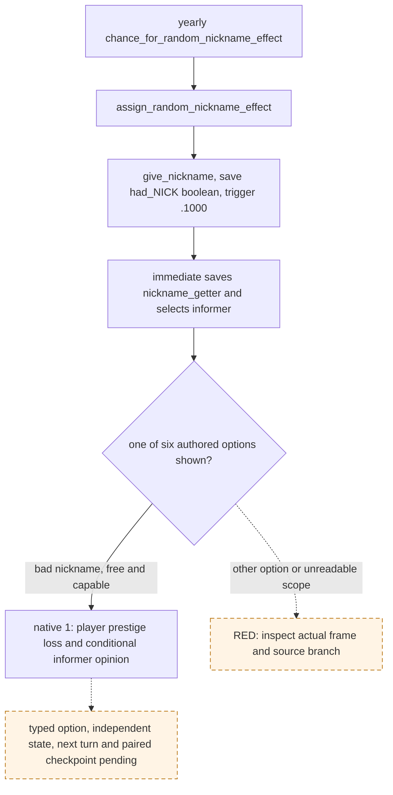

# `lifestyle_nicknames.1000` random nickname notice

Status: exact-build source and R0136 paused-frame evidence. R0136 stopped before an option was submitted; the proposed consumer has no live acceptance yet.

## Frozen source and production frame

- CK3 `1.19.0.6-steam23530548`, EXE SHA-256 `2D00FF3101EF70B566F2FCBAE292F09263199C80E9DC8F139B82D7D96F83DB86`.
- `game/events/nickname_events/nickname_events.txt:1242-1785`, SHA-256 `C0DCEC2649DC0021C6B17E8BEECAA71BFFA4AE19ACB7C5158FD035212F848448`; `game/common/scripted_effects/00_nickname_effects.txt:17-565`, SHA-256 `5E7259ED1C50C843E4C49F73842F2B11F10CDDD5C56D231FED35AF492E8D48C0`; `game/common/on_action/yearly_on_actions.txt:2299`, SHA-256 `0FC85A284224A68D1CA0A4EF071D4F4A4F49896753AEC463975A12EE4E1116FA`.
- R0136 formal report `Z:/ck3_mod_rewrite_process_assets/g2-war-h2675-continued-20260922/live-R0136/formal-report.txt`, SHA-256 `BE11AFD7CBB95F56BE3D9F70B893AD65FFB1027F122CB793FBB5A8AF130091CF`; original final driver `Z:/ck3_mod_rewrite/.task-tmp/RUN-001/war-h2675-continuation-sourcea092d6e-nolaunch-20260922-v2/state-final/native-session/driver-state.json`, SHA-256 `BF1584C1D1DC0E38BFDED7F8325788E4A7E7440C8E606C938D26361D65A7FAAE`. Last paired checkpoint h2894/raw `53501928`; subsequent driver tail remains unpaired. At turn 162, the naturally delivered event instance 32 was paused at raw `53503128`, snapshot `native:524`/revision 525, root Character 36403. The only shown and enabled option was native index 1. No option was submitted.
- The six saved scopes were player aliases `possible_conqueror`, `nickname_root_scope`, `nickname_getter` (Character 36403), `toggle_null_result` and `had_nick_the_drunkard` (boolean), and third-party `informer` (Character 36567). The old R193 fixture used `had_nick_the_mad`; the nickname batch flag is source-generated from `NICK`, so the suffix is not a fixed event role.

## Source tree and bounded choice

The nickname is granted before the notice opens. The exact source's native 1 branch does not assign another nickname, begin a scheme, or alter focus/perks. It has a player prestige loss and conditional informer opinion. The consumer may recommend native 1 only when it is the sole shown/enabled option; all six saved scope names and native types match the source shape; the three player aliases resolve to the current player; the informer resolves to a different character; and exactly one `had_nick_*` boolean appears. The old `max_occurrences=1` is legacy fixture metadata: the source can deliver future random nicknames, so it is not a general once-per-campaign rule. Source hashes and the legacy contract shape pin this narrow projection. A different option or scope shape remains blocked.

The R0136 frozen frame supports offline selection only. Formal acceptance still needs fresh paused observation after official cold restore, one typed choice, independently observed material result, next turn consumption, and a paired checkpoint. No unpaired date is credited.
