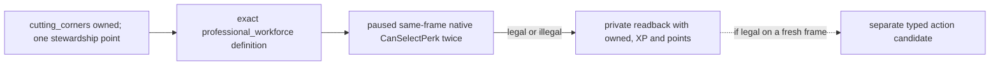

# M4-B0: professional workforce final-legality readback

Status: **production-live private readback for one exact target**. This is not
full perk enumeration, a typed perk action, or a public capability.
The existing M4 two-year peaceful-governance gate remains open.

## Why this target

R0179 on the Robert mainline applied `cutting_corners_perk` once with an
independent `HasPerk=true` receipt, changed stewardship points from 2 unspent /
4 used to 1 unspent / 5 used, and consumed the result on the next formal turn.
The bounded private formal query only contained the now-owned
`cutting_corners_perk` policy target. It did not prove which other perk could
spend the remaining point. The original R0179 report is under
`Z:/ck3_mod_rewrite_process_assets/g2-m4-r0179-robert-perk-live-20260923/`;
its report SHA-256 is
`A586D30588FF6546731A790DC6DB1ACE1A76F37530E960BE5D780DD99545493B`.

On frozen CK3 `1.19.0.6-steam23530548`, EXE SHA-256
`2D00FF3101EF70B566F2FCBAE292F09263199C80E9DC8F139B82D7D96F83DB86`,
`common/lifestyle_perks/00_stewardship_2_domain_tree_perks.txt:236-279`
defines `professional_workforce_perk` with parent `cutting_corners_perk` and
ordinary-landed building-speed modifiers `-0.3`. Exact file SHA-256:
`ADB3EF30EBE3DA37FC02F8F132815173987527B6E82C19FB738A8EB8D3635C21`.
This makes it a useful next query. Parent ownership alone does not prove the
engine's final legality.

## Bounded entry

`native_bridge/research/run_player_lifestyle_three_query_readback.py` reuses
the existing official prepare/rebind, profile, exact build, DLL/source and
checkpoint preflight. With `--professional-workforce`, it creates a distinct
`xar.ck3.g2_m4_professional_workforce_readback_candidate_v1` manifest and
sends exactly one allowlisted private step:
`private-query-player-lifestyle-professional-workforce-v1`. The step reads
LIFE2 state, the exact target definition, same-frame ownership, stewardship
XP/point getters and the native final validator twice. It records the raw
response plus a separate paused after-frame. It submits no gameplay action
and advances no date. The sole CK3 owner must allocate a fresh round and use
the runner's generated prepare, preflight and live commands; no particular
checkpoint or actor ID is embedded in the policy.

The response distinguishes `observed_native_legal`,
`observed_native_illegal`, and typed `unavailable_*`. Only the first can feed
a later, separately admitted typed perk candidate on a fresh matching frame.
This B0 change does not add `professional_workforce_perk` to the submit
gate or change the existing `cutting_corners_perk` action path. R0179's
cutting-corners verdict cannot certify this different target or a later frame.

The exact ABI and offsets are in
`native_bridge/research/player_lifestyle_stock_perk_legality_v1_abi.json`.
`lifestyle-focus-perk-ai.md` remains the decision-tree source. The still-open
branch is typed action/receipt/next-turn on a fresh matching frame.

## R0183 exact-build result and next action boundary

R0183 restored the official R0181 Robert h2120/raw53215920 frozen pair in an
independent `ordinary_campaign_succession/xar_off` profile under the frozen
game directory. The private query returned `observed_native_legal` for
`professional_workforce_perk`, `target_perk_owned=false`, stewardship
`unspent_perk_points=2`, `used_perk_points=5`, and `validator_invoked_twice=true`
on paused `native:3` for actor 29829. The independent after-frame retained
the same actor, date, episode and native revision. Gameplay actions and date
advance were both zero; the CK3/job/watchdog tree was reclaimed and owner
released. Report:
`Z:/ck3_mod_rewrite_process_assets/g2-m4-professional-workforce-r0183-robert-readonly-20260923/runner-evidence/report.json`,
SHA-256 `D60B4555E935A739FC0199F151CDE7F2F0B2DD34951557526E53A02535E9B8E7`.
The exact readback step SHA-256 is
`C50277EA1F6632BDD1BDDE9EE77C35A7415E7E14704C2DA8299CDD5F352D7835`.
The response identifies `stewardship_lifestyle`; it does not by itself return
the exact current focus key.

The typed path must obtain a new formal same-frame LIFE2 state and final
legal candidate, then submit one `professional_workforce_perk` action through
the existing private typed step. ACK remains pending until an independently
captured paused HasPerk and point-count receipt, followed by next-turn
consumption and official paired checkpoint/recovery. R0183's read-only
verdict cannot be reused as the submit frame. The existing two-year M4 gate
and public query/action advertisement remain open/OFF.

The bounded private wartime runner requires the explicit
`--expected-perk professional_workforce_perk` opt-in for this second target;
its default remains `cutting_corners_perk`. Its candidate must be prepared and
preflighted from a clean official pair with the matching newly built DLL. If
the fresh formal query selects another target, the runner returns without a
typed submit. The existing action ID, native ACK, later paused receipt,
LIFE2 point readback, next-turn consumption and paired checkpoint path are
reused, not replaced by this read-only result.

## Private typed candidate impact

The source change adds only the second exact-build stewardship target to the
existing private formal query/action path. Windowless formal queries choose
`cutting_corners_perk` until owned, then independently read the native final
legality of its `professional_workforce_perk` child on the current paused
frame. The typed step recomputes that precondition and dispatches the resolved
definition only for the matching allowed key. The policy still selects one
action at a time and gives the war planner its existing priority. Public
query/action capabilities and the M4 peaceful two-year gate do not change.

A live candidate needs a new DLL and a fresh official prepare/rebind from a
clean paired checkpoint; the loaded DLL cannot be replaced in an existing
process. The immutable R0181 source pair and R0183 read-only evidence remain
separate. On ACK without an independent material receipt, the durable action
ID remains pending and the operator must check actual state before any retry.
After a verified typed action, the official paired checkpoint must be cold
restored in a later new-PID round before treating it as resumed mainline state.
