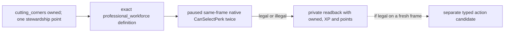

# M4-B0: professional workforce final-legality readback

Status: **static-ready, live readback pending**. This is one private read-only
target, not full perk enumeration, a typed perk action, or a public capability.
The existing M4 two-year peaceful-governance gate remains open.

## Why this target

R0179 on the Robert mainline applied `cutting_corners_perk` once with an
independent `HasPerk=true` receipt, changed stewardship points from 2 unspent /
4 used to 1 unspent / 5 used, and consumed the result on the next formal turn.
The bounded private formal query only contained the now-owned
`cutting_corners_perk` policy target. It did not prove which other perk could
spend the remaining point. The original R0179 report is under
`Z:/ck3_mod_rewrite_process_assets/g2-m4-r0179-robert-perk-live-20260923/`;
its report SHA-256 is
`A586D30588FF6546731A790DC6DB1ACE1A76F37530E960BE5D780DD99545493B`.

On frozen CK3 `1.19.0.6-steam23530548`, EXE SHA-256
`2D00FF3101EF70B566F2FCBAE292F09263199C80E9DC8F139B82D7D96F83DB86`,
`common/lifestyle_perks/00_stewardship_2_domain_tree_perks.txt:236-279`
defines `professional_workforce_perk` with parent `cutting_corners_perk` and
ordinary-landed building-speed modifiers `-0.3`. Exact file SHA-256:
`ADB3EF30EBE3DA37FC02F8F132815173987527B6E82C19FB738A8EB8D3635C21`.
This makes it a useful next query. Parent ownership alone does not prove the
engine's final legality.

## Bounded entry

`native_bridge/research/run_player_lifestyle_three_query_readback.py` reuses
the existing official prepare/rebind, profile, exact build, DLL/source and
checkpoint preflight. With `--professional-workforce`, it creates a distinct
`xar.ck3.g2_m4_professional_workforce_readback_candidate_v1` manifest and
sends exactly one allowlisted private step:
`private-query-player-lifestyle-professional-workforce-v1`. The step reads
LIFE2 state, the exact target definition, same-frame ownership, stewardship
XP/point getters and the native final validator twice. It records the raw
response plus a separate paused after-frame. It submits no gameplay action
and advances no date. The sole CK3 owner must allocate a fresh round and use
the runner's generated prepare, preflight and live commands; no particular
checkpoint or actor ID is embedded in the policy.

The response distinguishes `observed_native_legal`,
`observed_native_illegal`, and typed `unavailable_*`. Only the first can feed
a later, separately admitted typed perk candidate on a fresh matching frame.
This B0 change does not add `professional_workforce_perk` to the submit
gate or change the existing `cutting_corners_perk` action path. R0179's
cutting-corners verdict cannot certify this different target or a later frame.

The exact ABI and offsets are in
`native_bridge/research/player_lifestyle_stock_perk_legality_v1_abi.json`.
`lifestyle-focus-perk-ai.md` remains the decision-tree source. The still-open
branch is live final legality on the next paired Robert checkpoint, followed
only if legal by a distinct typed-action/receipt/next-turn package.
