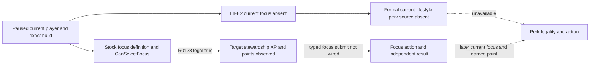

# R0128 private lifestyle readback: target progress observed, formal perk pending

R0128 was a bounded read-only cold load of the R0101 h1094 ordinary campaign
checkpoint on CK3 `1.19.0.6-steam23530548`. The EXE SHA-256 was
`2D00FF3101EF70B566F2FCBAE292F09263199C80E9DC8F139B82D7D96F83DB86`;
the private DLL SHA-256 was
`3778DBE7BBE5C62BCD7A50F93E82FF1B337E34160F6E821F21215B2599C39460`.
Python source was `073b60fcc753073cf5a32a4387b04fb8450dafbe`, and the
native DLL source was `1a8890d565f237e6153e1f9125774d9028af0a3f`.
The source pair was the original h1094 save
`2F6F3DCA9E9CD92D87FDE1CD296A581F6A3A38F11E2781765E99815B7769C39A`
and post-RED driver
`95959FB66C457B12E38690B0B1D05E208DC08FB28A80AAC9A393C4C70712536E`.
The official ordinary `xar_off` rebind yielded environment SHA-256
`18FF98068E221C91A432E9FA10D068FCFEC48D9FF4EB99752FDF2CF70D67E5C2`
and pre-run driver SHA-256
`A190F6804EC88378B2ADFBE7C2C2492670FEB6FE6FE869A3AB9DE8FBC1134653`.

## Frozen live evidence

All paths below are retained under
`Z:/ck3_mod_rewrite_process_assets/g2-m4-h1094-readback-20260922/live-R0128/`.
They are machine-local evidence paths, not a portable release package.

| File | SHA-256 |
| --- | --- |
| `report.json` | `C0C7C9FBFB12CC45643B72D3B995F6EBDEAD572CC36842BB143B4917443F3F35` |
| `paused-life2-current-state.json` | `8A184B02BEC2A3829553EE894E74E07BA85670634FF6D5AE78CE7C11CA62348A` |
| `private-query-player-lifestyle-stock-focus-v1.json` | `3D3504D23E942AE9B7F71388D834506590E241E7E2BD67FF68A5964A3680F8E9` |
| `private-query-player-lifestyle-formal-v1.json` | `98ED153AB8AC7C801E845DE4E419376137825794DCE014A5747756CEAB257BE7` |
| `round-ownership.json` | `99AC81677D798D3A2D460FEAC9C7DF625F5E0933214FFE90AB47775E03BFA493` |

The starting and ending paused frame was `native:3`, actor `36403`, episode
`native-36403-2b4b233056bd`, date raw `53368176`. The LIFE2 native state
reported `current_focus.presence=absent` and
`current_lifestyle_progress.presence=absent`, while listing seven already-owned
military perks. These are distinct state fields: past owned perks do not prove
a currently selected focus. This is a stable typed no-focus state, also covered
by the LIFE2 no-focus fixture; the evidence does not establish why the focus
became absent.

The fixed stock-focus query scanned 23 definition rows and returned native
`legal=true` for `stewardship_wealth_focus`. In the same paused native frame it
read **target** `stewardship_lifestyle` progress with
`presence=present`, `source=exact_native_getters`, total XP `0`, within-level
XP `0`, XP per level `1000`, unspent perk points `0`, and used points `0`.
The independent after-frame was unchanged. This closes the **private target
progress input readback** for this actor, frame, and exact build at
`production-live primitive`; it does not assert all candidate enumeration or
a focus selection.

The formal perk query returned
`native_lifestyle_windowless_policy_perk_unavailable_state`. The runner tied
that exact error to the same-frame absent current lifestyle progress and
recorded `typed_legal_unavailable`. Its overall status was
`evidence_insufficient`, with zero gameplay actions and zero date advance.
The existing exact-build `ReadStockPerkPlayerState` requires
`current_lifestyle_progress_present`; the target stewardship value from a
separate stock-focus query cannot be substituted into that callback. The
observed target has zero unspent points, so this frame gives no reason to
submit a perk. Formal perk legality, the full three-query gate, any typed
focus/perk action, independent material result, and next-turn consumption
remain open. Public query/action/advertisement remain OFF; G2 M4 stays in
progress.

The runner used CK3 PID `174812` and watchdog PID `160732` for 124.764 seconds.
Its report records `cleanup.ok=true`, `cleanup_proven=true`, `tree_gone=true`,
final job active processes `0`, postflight CK3 inventory empty, and
`ck3_reclaimed=true`. The state owner marker was absent after the run. The
source save stayed byte-identical. The mutable prepared driver acquired a live
restore tail and now hashes to
`9AA51AED5009C7DB07B96C2DBD67C9EC9E55D9E201633A9223C0E90457839036`;
it is **not** a fresh h1094 input for another run. Preserve R0128 and rebuild
a later candidate from the original source pair through official prepare and
rebind. Do not edit its tail or relabel it as a paired checkpoint.

## Native decision edge and next bounded candidate

The minimum next implementation is a **private typed focus** path. It must
consume a fresh same-frame stock-focus legality and target-progress read;
re-resolve the native definition and final `CanSelectFocus` at submission
instead of retaining a pointer across frames; bind episode, actor, revision,
date, and target key; submit one `kind=focus` action; then read an independent
later paused `current_focus` and a following formal turn. The current bridge
submit branch explicitly rejects every kind except `perk`, and the current
Python formal consumer only routes a perk. LIFE2's window collection is
unavailable in this scene, so the focus policy must consume the validated
stock-focus query directly rather than present that collection as available.
The existing `PlayerLifestyleSelectionActionV1` focus branch is a native
implementation starting point, not live proof of a wired focus submit.

The M4 minimum governance policy also requires an independently observed
peaceful feudal scope. h1094 was retained from a defense-war continuation and
has no same-frame peaceful-scope proof in R0128. A typed focus run therefore
needs a legitimate paused peaceful feudal source pair with no current focus,
or must wait for one during the normal campaign. It should first verify the
scope and fresh native focus legality; no action occurs if either is missing.
A perk candidate follows only after a current lifestyle and an actual
unspent point are observed. R0128 should not be rerun merely to turn its
already known zero target points into a candidate count.
