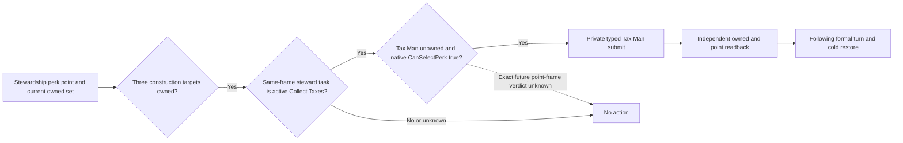

# NW-LIFE-C149: Collect Taxes as the next bounded stewardship perk

This note extends the [lifestyle native decision tree](lifestyle-focus-perk-ai.md)
for one exact build and one private policy target. Source work is underway; it
does not qualify a new live perk action or a public capability.

## Exact native input

- CK3 `1.19.0.6-steam23530548`, EXE SHA-256
  `2D00FF3101EF70B566F2FCBAE292F09263199C80E9DC8F139B82D7D96F83DB86`.
- `common/lifestyle_perks/00_stewardship_2_domain_tree_perks.txt:6-63`
  (SHA-256 `ADB3EF30EBE3DA37FC02F8F132815173987527B6E82C19FB738A8EB8D3635C21`)
  defines `tax_man_perk` as a stewardship/domain root with no `parent` and no
  extra `can_be_picked` clause. Stewardship education adds 1989 to the native
  AI root weight; `stewardship_domain_focus` multiplies that weight by five.
  Robert's wealth focus supplies neither bonus. These are AI weights, not a
  substitute for the exact `CanSelectPerk` verdict.
- `common/council_tasks/00_steward_tasks.txt:18,104`
  (SHA-256 `B3087378E04D0CDF7B1C1BEBF97FD17E36D8684DDD157D4FB0647B1D5681FC4B`)
  makes the ruler's `tax_man_perk` affect `task_collect_taxes`.
  `common/script_values/00_lifestyle_values.txt:181` defines the 25% bonus
  (SHA-256 `9777E31BB8F2629FC02D9646049C1A452267E33592263EF409E7D0D6882011E0`);
  `common/script_values/99_steward_values.txt:68-73` applies it to the base
  Collect Taxes task effectiveness (SHA-256
  `6A4AC7C1E575E54FBA4A3BE06F58146F753629622491FDDAE25D09C439699C3B`).
  It is not a proven 25% increase to Robert's total income.

## Observed scene and missing proof

R0187's independent current-state read for Robert `29829` lists
`cutting_corners_perk`, `professional_workforce_perk`, `meritocracy_perk`,
`large_levies_perk`, `soon_forgiven_perk`, and `toe_the_line_perk`, but no
`tax_man_perk`. Its source is the private
`g2-robert-r0186-combat-v3-readonly-R0187-20260923/lifestyle-current-state.json`
artifact, SHA-256 `23EEC778AEF620E825FE07E979BECAC72A74CD4561C2E64B5F08CADB1500B388`.
Later Robert evidence independently verifies `centralization_perk` and the
R0254 opening focus. The R0254 formal report, SHA-256
`467CD9F78DB0771BCB953C1D4A3679BFA97558E543BD75FC4F722E31FE4AD161`,
opens at `raw53216232` with stewardship unspent `0`, used `7`, and all three
current construction policy targets owned. At `raw53216424`, the paired
campaign-root read shows feudal Robert, steward `32716` working
`task_collect_taxes`, and monthly income raw `419674/100000`. This is a
valuable scene for the next point, not a present action opportunity.

The existing native windowless query selects `centralization_perk` again
after it is owned, so its `policy_target` count of zero cannot classify any
other perk as illegal. C149 adds exactly one next target to the private native
legality and typed selection allowlists. Python chooses it only when the
same-frame campaign-root confirms a non-frozen active Collect Taxes steward,
the LIFE snapshot shows an unspent point and unowned target, and the native
candidate collection contains `tax_man_perk`. The policy does not infer a
point from XP, a task from historical state, or legality from the script tree.

The next matched CK3 candidate still needs the actual point-frame native
verdict, one typed submit, independent owned/point readback, following formal
turn, and contract cold restore. Existing R0254 zero-point turns remain
correctly action-free. No date or Robert highwater is gained by this source
change.
