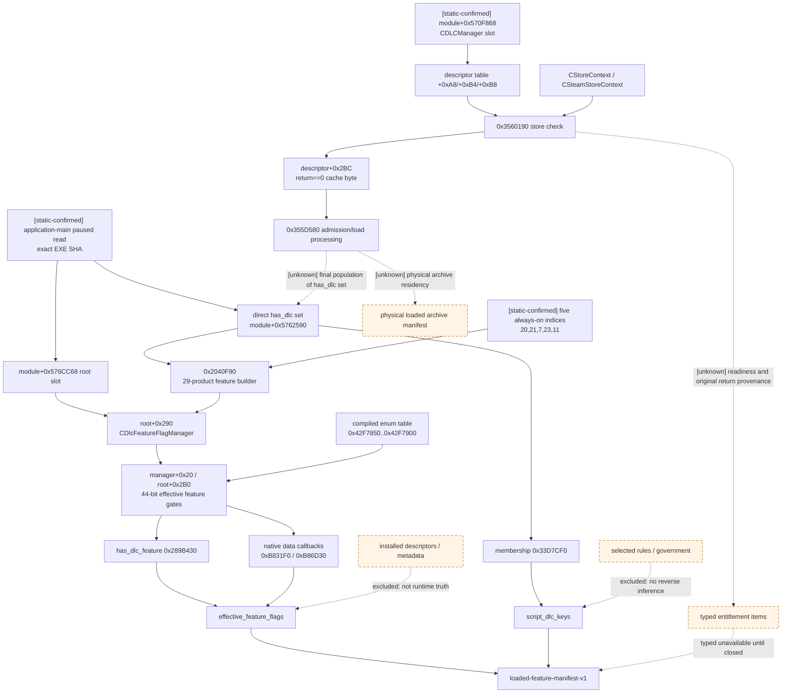

# CK3 1.19.0.6 loaded/enabled/entitled feature manifest

## 结论与语义边界

- **[static-confirmed]** 本文只绑定 CK3 `1.19.0.6 (Scribe)` 的
  `Crusader Kings III/binaries/ck3.exe`，文件大小 `95,206,008` bytes，SHA-256
  `2D00FF3101EF70B566F2FCBAE292F09263199C80E9DC8F139B82D7D96F83DB86`。所有 RVA 都以模块基址为零点。
- **原生 AI 决策树：N/A。** 当前进程拥有哪些有效 gameplay feature、脚本 `has_dlc` 能看见哪些 DLC，以及商店服务是否
  判定账户 entitled，都是 runtime capability resolution，不是 CK3 AI 在一次策略决策中选择的分支。本文因此记录原生
  **状态解析树**，不伪造 AI 权重或评分树。
- **[static-confirmed]** actionable gameplay feature truth 已找到稳定原生源：
  `module+0x576CC68 -> root+0x290 CDlcFeatureFlagManager<EDLCFeatureFlag>`，其 `+0x20` bitset（即
  `root+0x2B0`）同时被 `has_dlc_feature` trigger 和原生 data refresh/filter callback 消费。冻结构建共有 44 个 feature
  index；compiled token table 是 `[0x42F7850, 0x42F7900)`。builder `0x2040F90` 又静态闭合了 runtime
  `has_dlc` set 到该 bitset 的 29-product 映射和 5 个 always-on gate。
- **[static-confirmed]** script-visible DLC truth 是独立的当前进程集合：`has_dlc` evaluator 在 direct object
  `module+0x5762590` 上执行字符串 membership。它不是磁盘 descriptor 列表，也不能被命名成账户 ownership。
- **[implementation + production-live, 2026-08-26]** `game.command.query-loaded-feature-manifest-v1` 与 MCP
  `ck3_query_loaded_feature_manifest_v1` 已发布。第十个 application-main mailbox 槽在同一 paused/map-ready frame
  双读 feature root、44-entry registry 与 runtime `has_dlc` set；C++、Python 和 service 均拒绝跨帧或 registry drift。
- **[static-confirmed]** entitlement 是另一套 runtime service：`module+0x570F868 -> CDLCManager`，manager 经
  `CStoreContext` / `CSteamStoreContext` backend 查询 product verdict，并把结果缓存到 runtime descriptor。这个服务与上述
  feature bitset、`has_dlc` set 不能互相反推。
- **[unknown]** `CDLCManager` 当前缓存 byte 把“明确 not entitled”和“store backend/product 不可达”都折叠成 false；稳定的
  readiness/provenance 字段尚未闭合。因此第一版 wire 必须把 entitlement 分栏并返回 typed `unavailable`，不能把 false
  冒充 `not_entitled`。
- **[unknown]** 尚未找到一份与有效 gameplay gate 分离、可稳定枚举的“物理 archive 已驻留内存”清单。本文的
  `effective_feature_flags` 表示引擎实际上用于脚本和 data filtering 的 loaded/enabled gameplay gate，不声称每个 pack file
  的物理装载状态。

证据标签沿用[本目录索引](README.md)。`static-confirmed` 只表示冻结 EXE/同构建 stock schema 直接支持；本专题另有下述
单 PID production-live 双查询。该实机值只证明当次 playset 的 runtime truth，不把 key 推断成账户 ownership，也不完成
尚未执行的 disabled/offline/cold-restore 矩阵。

## 明确排除的伪 truth source

| 候选 | 本文用途 | 为什么不能回答当前进程 truth |
|---|---|---|
| `game/dlc_metadata/00_dlc_metadata.txt` | 只作产品显示名、store ID 与 stock key 的命名参考 | 文件存在只证明安装包含 metadata；不证明当前 playset enabled、当前进程已建立 feature gate，或当前账户 entitled。 |
| launcher / `.dlc` descriptor / workshop 文件 | 不作为本文证据 | installed 与当前 runtime state 是不同时间层；禁止扫描后填充 native query。 |
| effective government key/flags | 不使用 | 政体可能依赖 feature，但结果政体不能反推 feature、DLC 或 ownership。 |
| selected game-rule setting tokens | 不使用 | rule selection 只证明 selection service 当前值；不能反推父 rule、DLC、feature 或 entitlement。 |
| stock `requires_dlc_flag` / `has_dlc_feature` 文本出现次数 | 只作 parser consumer 交叉证据 | source declaration 证明某数据请求一个 gate，不证明该 gate 在当前进程为 true。 |

冻结的 stock metadata 仅用于复现命名边界，不进入 runtime result：

| 输入 | bytes | SHA-256 |
|---|---:|---|
| `game/dlc_metadata/00_dlc_metadata.txt` | 3,763 | `5B56AF6E3EF35453818D34F5FD6524E3C4093304E8D14079B73534A4094BF725` |
| `game/dlc_metadata/_dlc_metadata.info` | 1,072 | `32365CCA59331905F0BDB1843CDFAC1D5D08BADE70D7181CB8618C2E732E1F92` |

## Effective gameplay feature registry

### Trigger parser 与 leaf evaluator

**[static-confirmed]** `CHasDLCFeatureTrigger` 的 RTTI type descriptor 是 `0x5517CE8`，COL `0x49E9A18`，
vtable `0x43B8C10`；`has_dlc_feature` registration string 位于 `0x42A4C88`，注册 xref 是 `0x5549D1`。

parser `0x289B350` 的闭合路径是：

```text
parsed token CStringId = *(uint32_t*)input
begin = module+0x42F7850
end   = module+0x42F7900
native search over uint32_t entries
found -> trigger+0x50 = (found-begin)/4
miss  -> trigger+0x50 = 44
```

其中 `0x289B395` 明确比较 `index == 0x2C`。leaf `0x289B430` 则原样执行：

```text
index = sign_extend(*(int32_t*)(trigger+0x50))
if index >= 44: return false
word = index >> 6
bit  = index & 63
root = *(module+0x576CC68)
return bit_test(*(uint64_t*)(root+0x2B0+word*8), bit)
```

关键指令是 `0x289B44A mov rax,[rip+...]`（目标 slot `0x576CC68`）、
`0x289B451 mov rcx,[rax+rcx*8+0x2B0]` 和 `0x289B459 bt rcx,rdx`。因此 bridge 不需要执行 trigger，
只需在 application-main paused query 中只读同一 bitset，并保留 exact-build binding。

### Manager identity 与 data filtering 交叉证据

**[static-confirmed]** RTTI 中存在 `CDlcFeatureFlagManager<EDLCFeatureFlag>` callback/allocator：type descriptors
`0x51B3900`、`0x51B4190`、`0x5465600`。callers `0xB82EBF..0xB82ED5` 与
`0xB869CF..0xB869E5` 都读取 `module+0x576CC68`、判空、`add rdx,0x290`，再把该对象作为 manager 参数传给
callback；bitset 位于 manager `+0x20`，所以 manager 本体确实嵌在 root `+0x290`。

这不是只被一个 UI trigger 读取的孤立 bool：

- callback `0xB831F0` 在 `0xB83293` 读取 loaded object `+0x13C` 的 feature index，在
  `0xB832B7` 测试 `manager+0x20` 对应位；false 时跳过该对象；sentinel 44 表示不受 feature gate 限制；
- callback `0xB86D30` 在 `0xB86DD3` 读取另一类 loaded object `+0x138`，在 `0xB86DF7` 测试同一 bitset，采用相同
  sentinel/skip 语义；
- `SDlcBasedTradition@CCultureTemplate`（type `0x55B9118`、vtable `0x4411868`、visitor `0x2D2DBA0`）和
  `SDlcPillarFallback@CCultureTemplate`（type `0x55B90D8`、vtable `0x44118A0`、visitor `0x2D2DC60`）都把
  field CStringId `0x3589`（compiled string `requires_dlc_flag`）映射到完全相同的 44-entry table，miss 写 sentinel 44。

所以这 44 bits 可以稳定命名为**当前进程的 effective gameplay feature gates**：原生脚本判断和原生数据筛选都以它为准。
它不等同于磁盘 pack 清单，也不提供账户购买来源。

### Runtime builder：`has_dlc` set 到 feature bitset

**[static-confirmed]** function `0x2040F90..0x2041B80` 以 campaign root 为 RCX，构造 29 个 compiled
`{runtime DLC key, feature-index vector}` record（record stride `0x58`），随后：

1. `0x20419D1` 取得 `root+0x290` manager；`0x20419DA/0x20419DE` 清零 `root+0x2B0` bitset 和
   `root+0x2B8` enabled-bit counter；
2. `0x20419F0..0x2041A61` 逐 record 调 `0x33D7CF0(module+0x5762590, key)`；命中才遍历该 record 的
   feature index vector，set 尚未存在的 bit 并递增 `root+0x2B8`；
3. `0x2041A63..0x2041AAD` 以完整 manager 通知已注册 callback；
4. `0x2041AB1..0x2041B47` 再确保 index `20,21,7,23,11` 为 true，同样只在新置位时递增 counter。

call xrefs `0x203F18B`、`0x2049502` 与 `0x2322DFA` 证明它既用于 root 初始化也用于后续 refresh；后二者在调用前
直接取得当前 root。下面是 EXE 指令流中的完整映射，不从 `dlc_metadata` 生成：

| runtime `has_dlc` key | compiled feature index/key vector |
|---|---|
| `Garments of the Holy Roman Empire` | `0 garments_of_the_hre` |
| `Fashion of the Abbasid Court` | `1 fashion_of_the_abbasid_court` |
| `The Northern Lords` | `2 the_northern_lords` |
| `The Royal Court` | `4 diverge_culture`, `3 hybridize_culture`, `5 royal_court`, `23 court_room_view`, `6 reform_culture`, `7 court_artifacts` |
| `The Fate of Iberia` | `8 the_fate_of_iberia` |
| `Friends and Foes` | `9 friends_and_foes` |
| `Tours and Tournaments` | `10 tours_and_tournaments`, `11 advanced_activities`, `12 accolades` |
| `Legacy of Persia` | `13 legacy_of_persia` |
| `Elegance of the Empire` | `14 elegance_of_the_empire` |
| `Wards and Wardens` | `15 wards_and_wardens` |
| `Legends of the Dead` | `16 legends_of_the_dead`, `17 legends` |
| `North African Attire` | `18 north_african_attire` |
| `Couture of the Capets` | `19 couture_of_the_capets` |
| `Roads to Power` | `20 landless_playable`, `31 landless_adventurer`, `21 admin_gov`, `35 advanced_aspirations`, `22 roads_to_power` |
| `Wandering Nobles` | `24 wandering_nobles` |
| `West Slavic Attire` | `25 west_slavic_attire` |
| `Medieval Monuments` | `26 medieval_monuments` |
| `Arctic Attire` | `29 arctic_attire` |
| `Crowns of the World` | `30 crowns_of_the_world` |
| `Khans of the Steppe` | `27 khans_of_the_steppe`, `28 nomads`, `20 landless_playable` |
| `Coronations` | `32 coronations` |
| `All Under Heaven` | `20 landless_playable`, `33 all_under_heaven`, `34 merit_admin`, `35 advanced_aspirations`, `36 barter_troops` |
| `High Medieval Warfare Attire` | `37 high_medieval_warfare_attire` |
| `Holy Buildings` | `38 holy_buildings` |
| `North Pacific Attire` | `39 north_pacific_attire` |
| `East Asian Wonders` | `40 east_asian_wonders` |
| `Celestial Court Attire` | `41 celestial_court_attire` |
| `Symbols of Authority` | `42 symbols_of_authority` |
| `Songs of the Realm` | `43 songs_of_the_realm` |

always-on 的五项依次是 `20 landless_playable`、`21 admin_gov`、`7 court_artifacts`、`23 court_room_view`、
`11 advanced_activities`。这说明 feature bit 与 product key 本来就不是一对一关系；planner 应直接消费最终 bitset，不应由
`has_dlc` key 自己重算。reader 可把 `popcount(root+0x2B0)` 与 `root+0x2B8` 做同帧完整性检查，但 wire 的 44 个 explicit
boolean 才是业务 truth。

### 冻结构建的完整 44-token vocabulary

**[static-confirmed]** `0xB84480..0xB84504` 从 `0x42F7850` 开始精确循环 `0x2C` 次，并对每个 CStringId
调用 `0x3B58970` 取得 stable UTF-8 name。运行时 string registry pointer slot 是 `module+0x5772AB8`；registry
pointer array/max-id 位于 `+0x48/+0x54`。下面映射也已由 EXE 内 compiled CStringId-to-string records 逐项对照，不来自
DLC descriptor：

| index | CStringId | stable feature key | index | CStringId | stable feature key |
|---:|---:|---|---:|---:|---|
| 0 | `0x3587` | `garments_of_the_hre` | 22 | `0x3A02` | `roads_to_power` |
| 1 | `0x3588` | `fashion_of_the_abbasid_court` | 23 | `0x3A01` | `court_room_view` |
| 2 | `0x34A7` | `the_northern_lords` | 24 | `0x39DA` | `wandering_nobles` |
| 3 | `0x3538` | `hybridize_culture` | 25 | `0x3CBB` | `west_slavic_attire` |
| 4 | `0x3539` | `diverge_culture` | 26 | `0x3A07` | `medieval_monuments` |
| 5 | `0x3270` | `royal_court` | 27 | `0x3C98` | `khans_of_the_steppe` |
| 6 | `0x366D` | `reform_culture` | 28 | `0x3CA1` | `nomads` |
| 7 | `0x34DC` | `court_artifacts` | 29 | `0x3A06` | `arctic_attire` |
| 8 | `0x3773` | `the_fate_of_iberia` | 30 | `0x39F7` | `crowns_of_the_world` |
| 9 | `0x3608` | `friends_and_foes` | 31 | `0x3D67` | `landless_adventurer` |
| 10 | `0x37CF` | `tours_and_tournaments` | 32 | `0x39ED` | `coronations` |
| 11 | `0x37CE` | `advanced_activities` | 33 | `0x39EE` | `all_under_heaven` |
| 12 | `0x36C4` | `accolades` | 34 | `0x39EF` | `merit_admin` |
| 13 | `0x377A` | `legacy_of_persia` | 35 | `0x39F0` | `advanced_aspirations` |
| 14 | `0x35E0` | `elegance_of_the_empire` | 36 | `0x39F1` | `barter_troops` |
| 15 | `0x394A` | `wards_and_wardens` | 37 | `0x39DB` | `high_medieval_warfare_attire` |
| 16 | `0x3B0A` | `legends_of_the_dead` | 38 | `0x39DC` | `holy_buildings` |
| 17 | `0x3A5B` | `legends` | 39 | `0x39DD` | `north_pacific_attire` |
| 18 | `0x3A09` | `north_african_attire` | 40 | `0x39DE` | `east_asian_wonders` |
| 19 | `0x3A08` | `couture_of_the_capets` | 41 | `0x39DF` | `celestial_court_attire` |
| 20 | `0x3953` | `landless_playable` | 42 | `0x4101` | `symbols_of_authority` |
| 21 | `0x3A00` | `admin_gov` | 43 | `0x4102` | `songs_of_the_realm` |

wire 必须保留 native index，并发布全部 44 项的 explicit boolean；只发布 true key 会丢失“合法 false”和“读取失败”的区别。
runtime name lookup 可作一致性验证，但 exact-build fixture 应冻结上述 index/CStringId/key 三元组，不能从磁盘 metadata 重建。

## Script-visible `has_dlc` registry

**[static-confirmed]** `CHasDLCTrigger` 的 RTTI type descriptor 是 `0x5517CC0`，COL `0x49E9A40`，vtable
`0x43B8930`；`has_dlc` registration string 位于 `0x43B87E0`，注册 xref `0x554931`。leaf
`0x289B0B0` 在 `0x289B0D3` 以 `lea` 取得 **direct object** `module+0x5762590`，随后在 `0x289B0EA`
调用 membership `0x33D7CF0`。它不是 pointer slot。

`0x33D7CF0` 的只读 robin-hood string-set layout 已闭合：

| offset | meaning |
|---:|---|
| set `+0x08` | bucket base pointer |
| set `+0x14` | bucket mask (`capacity - 1`) |
| set `+0x18` | max spill/probe byte |
| bucket stride `0x28` | next bucket |
| bucket `+0x04` | control/probe byte；物理枚举范围内 `0` 为空、非零为 occupied，`0xFF` 是 range-end miss sentinel |
| bucket `+0x08` | `CString` key；length/capacity 在 bucket `+0x18/+0x20` |

`0x33D7D2A` 先 hash，`0x33D7D2F..0x33D7DAB` 按 mask/probe 搜索，最后以 control byte 是否为 `0xFF`
返回 membership。第一版 reader 应按 `[bucket_base, bucket_base + (mask + 1 + spill) * 0x28)` 半开物理范围枚举
control 非零的 occupied bucket、复制合法字符串，再以
**unsigned UTF-8 bytewise lexical order** canonicalize。set `+0x10` 的业务名/可信 count 尚未闭合，不能把它作为唯一边界；
合法空集合是 `[]`，读取失败则是 component-level `unavailable`/`null`。

该集合的语义只能锁为“当前进程中原生 `has_dlc = <key>` 会命中哪些 key”。它比 installed descriptor 更接近运行时 truth，
但静态证据尚未闭合 descriptor loader 最终如何写入它，因而不能把集合 key 改名成 `owned_dlcs` 或 `entitled_dlcs`。

## Entitlement service：独立且必须保留三态

### CDLCManager lifetime 与 descriptor table

**[static-confirmed]** singleton pointer slot 是 `module+0x570F868`。初始化 caller
`0x3456FF0..0x3457773` 在 `0x3457031` 读取 slot；为 null 时分配 `0x120` bytes，并在 `0x3457166` 写回。
同一 caller 在 `0x34576EC` 调 `0x3560550(CDLCManager*)` 更新 entitlement cache，紧接着在 `0x34576F4`
调 `0x355D580(CDLCManager*)` 进入后续 DLC selection/load processing。

manager 与 descriptor robin-hood table 的静态布局是：

| offset | meaning |
|---:|---|
| manager `+0x00` | store backend/context pointer copied from owning context |
| manager `+0xA0` | descriptor robin-hood map object |
| manager `+0xA8` | descriptor bucket base |
| manager `+0xB4` | bucket mask |
| manager `+0xB8` | max spill/probe byte |
| bucket stride `0x2F0` | next descriptor bucket |
| bucket `+0x04` | control byte |
| bucket `+0x28` | embedded `CDLCDescriptor` value |
| descriptor `+0x2BC` | entitlement/cache admission byte written by `0x3560550` |

`CDLCDescriptor` RTTI type descriptor 是 `0x5683078`，COL `0x4B7C8A0`，vtable `0x44F5278`。
`CHasDLCTrigger` 的辅助/description path `0x289B100` 也从 `module+0x570F868` 的 map `+0xA0` 调
descriptor lookup `0x35623A0`；这只交叉证明 runtime key 与 manager descriptor 的 identity 服务，不改变 leaf evaluator
仍从独立 `module+0x5762590` set 取 truth 的事实。

### Store verdict 与 false-collapse

**[static-confirmed]** checker `0x3560190(CDLCManager*, CDLCDescriptor*)` 读取 manager `+0x00` backend，
通过 backend vcall `+0x98` 取得 product，再调用 product vcall `+0x20` 得到 bool。其返回值在当前调用链中的静态语义为：

| return | 已闭合含义 |
|---:|---|
| `0` | product object 存在且 bool 为 true |
| `2` | product object 存在且 bool 为 false |
| `1` | 没有 backend/product 的路径；其中无 backend 路径记录 `Could not connect to store backend to verify DLC.` |
| `3` | 另一个 descriptor/pre-check failure path；完整业务名 [unknown] |

日志字符串位于 `0x44F4E80`，xref `0x35604D1`。caller `0x3560550` 在 `0x3560A78` 调 checker，随后
`test eax,eax; sete al; mov [bucket+0x2E4],al`，即只保存 `return == 0`。所以 descriptor `+0x2BC == 0`
至少可能表示 `2`、`1` 或 `3` 三类结果，单 byte 无法证明 `not_entitled`。

**[static-confirmed]** `0x355D580` 从 `0x355D623` 枚举 manager descriptor table，并在
`0x355D674` 检查 descriptor `+0x2BC`；false 时于 `0x355D67C` 跳过该 descriptor，true 才进入后续 selection/load
处理。这证明 entitlement verdict 会影响 runtime admission，但没有消除 false-collapse。

RTTI 进一步证明 store 是独立服务：`CStoreContext` type `0x56DCB30`、COL `0x4BDDFC0`、vtable `0x453E8B0`；
`CSteamStoreContext` type `0x56DCAB0`、COL `0x4BDDF48`、vtable `0x453E9A0`，并有 Steam
`DlcInstalled_t` callback RTTI。不能从 feature bit、`has_dlc` set 或 metadata 反推出这层状态。

## 原生状态解析树（非 AI 决策树）



## 最小 read-only wire

下面是已实现并由 production-live 验收的 wire 形状。top-level `status=available` 只说明两个 actionable
runtime components（effective feature bits 与 script `has_dlc` set）在同一个 paused frame 中完整可读；它**不**表示
`entitlements.status=available`。

```json
{
  "schema": "loaded-feature-manifest-v1",
  "status": "available",
  "unavailable_reason": null,
  "build": {
    "version": "1.19.0.6",
    "exe_sha256": "2D00FF3101EF70B566F2FCBAE292F09263199C80E9DC8F139B82D7D96F83DB86"
  },
  "effective_feature_flags": {
    "status": "available",
    "unavailable_reason": null,
    "native_count": 44,
    "items": [
      {
        "native_index": 0,
        "cstring_id": 13703,
        "key": "garments_of_the_hre",
        "enabled": true
      }
    ]
  },
  "script_dlc_keys": {
    "status": "available",
    "unavailable_reason": null,
    "enumerated_count": 1,
    "keys": [
      "The Royal Court"
    ]
  },
  "entitlements": {
    "status": "unavailable",
    "unavailable_reason": "store_verdict_provenance_unclosed",
    "items": null
  }
}
```

示例值只是形状，不声称当前机器的 live feature/DLC 值。契约边界固定为：

- `effective_feature_flags.items` 成功时必须按 `native_index=0..43` 发布全部 44 项；boolean false 是合法值。
  component unavailable 时 `native_count/items` 必须为 `null`，不能返回 44 个 false；
- `script_dlc_keys.keys` 成功时复制集合中的全部 key，以 unsigned UTF-8 bytewise lexical order 排序；合法空集合是 `[]`。
  component unavailable 时 `enumerated_count/keys` 为 `null`，不能回退到磁盘 descriptor；
- `entitlements` 独立 typed。未闭合前整个 component 是 `unavailable/items=null`；未来只允许逐项
  `entitled | not_entitled | unavailable`，且必须携带 store readiness/provenance，不能用 descriptor `+0x2BC` 单 byte 直接分类；
- query 开始和结束都重读 root slot、feature bitset、DLC set bucket pointer/mask/spill，并对复制后的 key 做长度/地址验证。
  任一根变化则整份 actionable manifest `unavailable`，不拼接两帧；
- exact-build SHA mismatch、菜单期 root 缺失、feature manager 缺失、DLC set 结构无效和 snapshot drift 必须是稳定、非空的
  typed unavailable reason；不要把它们压成合法空集合。

## Production-live 证据与待补矩阵

**[production-live, 2026-08-26]** production DLL SHA-256
`F05C7DACB657114B1F85CB1C93925409906E1606F5847E16A6F9D98C5452D60D` 在受管 PID `13232`、`date_raw=53178264`
完成 query sequence `1 -> 2`。两次结果绑定同一 public/native revision `4/3` 并严格相等：44 个 registry row 全部存在，
当次 playset 的 44 个 flag 均为 true，runtime `has_dlc` set 有 29 个 opaque key；`entitlements` 保持
`unavailable/store_verdict_provenance_unclosed`。源存档 `9104CCB...12CC63` 的 67,287,758 bytes 前后不变，受管进程树与
nonce disposable root 均清理完成。artifact 为
`C:\Users\xenoa\AppData\Local\Temp\xar-loaded-feature-manifest-live-v1.json`，SHA-256
`2B1C8CA495A3A03F39C8C27351411B5AED2285D732946AACF5AFE89D8B3C2F2D`。这个“全 true”结果是本机当次 runtime 值，
不是 hard-coded 预期，也不能反推购买状态。

以下仍是 **[unknown / planned]**；只有 production、非 debug、正式 bridge/session 的 paused snapshot 才能升级为
`live-confirmed`：

| fixture | 必须证明的区分 |
|---|---|
| owned + launcher enabled 的 major DLC | 相关 effective feature bits 与 script `has_dlc` key 同帧可见；相邻双查询完全一致。 |
| installed/owned 但 launcher disabled | 磁盘 descriptor 仍存在，但 runtime feature/set 不得由磁盘补回；这是最重要的反推反例。 |
| enabled flavor/content pack | `has_dlc` product key 与 feature token 可能不同；两层分别发布，不做一对一猜测。 |
| entitlement false 的产品 | 只有 store verdict provenance 已闭合时才允许 `not_entitled`；否则保持 typed unavailable。 |
| Steam/store backend offline 或 product lookup 失败 | 不得把返回 `1`/缓存 false 写成 `not_entitled`；actionable feature/set 仍应独立可读。 |
| save -> fresh managed PID cold restore | 同一 playset 的 44 rows、script key set 与状态完全一致；source save SHA 不变并完成 managed cleanup。 |
| 菜单期与 exact-build mismatch | 返回 typed unavailable，不访问 root-relative bitset，不回退到 metadata。 |
| enabled mod 增加/改变 gated content | 固定 44-entry native enum 不越界；script set 枚举仍复制 runtime keys，不以 stock allowlist 截断。 |

fixture artifact 必须保存：EXE SHA、production DLL SHA、PID、date/revision、前后 root identity、44-row payload、完整 DLC key set、
entitlement component status、相邻双查询结果与 cleanup 证明。命令 ACK、launcher 截图或 descriptor diff 都不能替代 native 值。

## Evidence / unknown 账本与精确施工入口

### 已闭合并已实现的只读 reader

1. **Feature root：** pointer slot `module+0x576CC68`；embedded manager `root+0x290`；bitset
   `root+0x2B0`、enabled-bit counter `root+0x2B8`；compiled enum
   `[module+0x42F7850, module+0x42F7900)`，exact count `44`。
2. **Feature names：** frozen index/CStringId/key 三元组用上表做 source-contract fixture；runtime cross-check 走
   `0x3B58970` 的 read-only lookup（registry slot `module+0x5772AB8`），绝不调用 interner `0x3B58330`。
3. **Script DLC set：** direct object `module+0x5762590`；layout `+0x08/+0x14/+0x18`，bucket stride `0x28`，
   control `+0x04`、key `+0x08`。枚举以 mask/spill physical bound 为准，不依赖未命名的 `+0x10`。
4. **Execution boundary：** application-main paused mailbox 第十槽；query 前后重读 roots/layout，完整复制后才序列化。第一版只读，
   不调用任何 mutator、trigger evaluator、store virtual 或 DLC loader。

### 未闭合，下一轮从这些 RVA 继续

1. **Entitlement provenance/readiness：** 从 `0x3560190..0x3560547` 的 return `0/1/2/3` 所有 caller 开始，闭合
   `CStoreContext` 的连接/初始化 readiness 与 product identity；保留原始 verdict，不能只读 descriptor `+0x2BC`。
2. **Descriptor stable identity/flags：** 继续标注 `CDLCDescriptor` `+0x2BD/+0x2C0/+0x268/+0x290` 的 writer/reader，
   冻结 descriptor key 到 store product key 的 exact 映射。当前不得猜这些字段业务名。
3. **CDLCManager -> `has_dlc` set final writer：** feature builder `0x2040F90` 已闭合 set -> bitset；仍需从
   `0x34576EC` 的 `0x3560550`、紧邻 `0x355D580` 继续向下跟踪 string-set mutator，闭合 entitlement/admission 到
   `module+0x5762590` 的最终写入顺序及 cache/launcher-enable 分支。
4. **Enabled reporting secondary xref：** `0x34244F0` 的 callers `0x32BE36C/0x32C5556/0x32C5F73` 会输出
   `Enabled DLC: `（string `0x44E0A58`）和 `Enabled DLC (Cache): `（`0x44E0A40`）。其两个 string-vector owner
   identity 尚未闭合，只作为下一入口，不能先于稳定 registry 用作 bridge ABI。
5. **Physical archive residency：** 若未来 agent 确实需要区分“effective gate true”和“pack file 已驻留”，从
   `0x355D580` 后续 loader callbacks/asset package service 继续定位；当前保持虚线 unknown，不妨碍先发布 actionable gate。

复现静态证据的只读命令：

```powershell
Get-FileHash "Crusader Kings III/binaries/ck3.exe" -Algorithm SHA256
& "tools/.venv/Scripts/python.exe" "ck3_autonomous_player/native_bridge/research/find_rtti.py" `
  "CHasDLCFeatureTrigger|CHasDLCTrigger|CDLCDescriptor|C(Steam)?StoreContext"
& "tools/.venv/Scripts/python.exe" "ck3_autonomous_player/native_bridge/research/find_rtti.py" `
  "CDlcFeatureFlagManager|SDlcBasedTradition|SDlcPillarFallback"
& "tools/.venv/Scripts/python.exe" "ck3_autonomous_player/native_bridge/research/disasm_ck3.py" 0x289B350 --size 0x120
& "tools/.venv/Scripts/python.exe" "ck3_autonomous_player/native_bridge/research/disasm_ck3.py" 0x33D7CF0 --size 0x120
& "tools/.venv/Scripts/python.exe" "ck3_autonomous_player/native_bridge/research/disasm_ck3.py" 0x2040F90 --size 0xBF0
& "tools/.venv/Scripts/python.exe" "ck3_autonomous_player/native_bridge/research/disasm_ck3.py" 0x3560190 --size 0x3C0
& "tools/.venv/Scripts/python.exe" "ck3_autonomous_player/native_bridge/research/disasm_ck3.py" 0x355D580 --size 0x120
& "tools/.venv/Scripts/python.exe" "ck3_autonomous_player/native_bridge/research/find_xrefs.py" `
  0x3560550 0x355D580 0x5762590 0x570F868 0x44E0A58 0x44E0A40
```

## 下一项可见施工

`loaded-feature-manifest-v1` 的 reader、source contract、serializer、mailbox、typed bridge/service/MCP 与第一场 production-live
已经完成。上层 capability ledger 现在应直接消费 44 个 effective flag，而不是从 descriptor、government 或 selected rules
猜可用域；entitlement component 继续明确 `unavailable`。本专题的后续增量是“installed 但 runtime disabled”、store offline 与
fresh-PID cold restore 反例矩阵，它们不再阻塞通用事件/人物互动 typed observation 的下一项可见施工。
