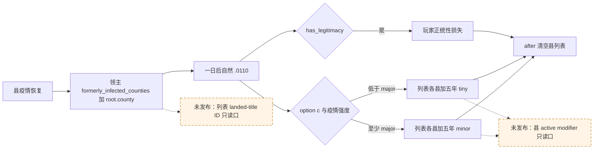

# CK3 1.19.0.6 `.0110` 县修正只读观测口：ABI 缺口

状态：`research`；本包没有启动 CK3、注入器或操作者，也没有新增 native/MCP 查询。绑定 EXE SHA-256 `2D00FF3101EF70B566F2FCBAE292F09263199C80E9DC8F139B82D7D96F83DB86`。目标仅是为下一次**自然** `epidemic_events.0110.c` 提供同一 paused 日期的物质读数；现有 R0101 动作与 R0113–R0116 的 15 日间隔正统性读数仍不能证明独占因果。

## 已闭合的原版效果路径

`game/common/scripted_effects/06_dlc_ce1_epidemics_effects.txt:854-885` 的 `plague_recovery_event_effect` 在县疫情恢复时，将 `root.county` 作为 **landed title** 加到 `county.holder.liege` 的 `formerly_infected_counties` 变量列表（十年），并从 `scope:epidemic` 排队一日后发 `epidemic_events.0110`。源文件 SHA-256 `0E27972D9F66348E462130F1EF0351BB18A4C646DB6E23DB237D79068E65DE98`。

`game/events/dlc/ce1/epidemic_events.txt:368-412` 的 option `c`/authored3/native2 在疫情强度至少 major 时，对列表中的县添加五年 `county_epidemic_recovered_minor_modifier`；否则添加五年 `county_epidemic_recovered_tiny_modifier`。`has_legitimacy = yes` 时同一 option 还施加 `miniscule_legitimacy_loss`，`after` 随即清空 `formerly_infected_counties`。事件文件 SHA-256 `FEF2972BD4F778818CD3A414C337D036F5132C1598FEBAB0E2623E0252DB7A1E`。修正定义在 `game/common/modifiers/06_ce1_modifiers.txt:26-34`，分别是 `development_growth = 2` 与 `1`；SHA-256 `63FEB33C8C5BF825E3D186E841D07235C98D6AED27C47375E495EA832255C52B`。这说明要在动作**前**保留原生列表和 exact 县身份，动作后仅从清空的列表无法重建目标集合。

## 当前 bridge/MCP 可用性

| 同帧字段 | 当前证据 | 结论 |
| --- | --- | --- |
| 玩家正统性 | `query-campaign-root-context-v1` 已发布可选 `player_legitimacy_v1`，从 Character `+0x1C0` 数据指针 `+0x28` 读 Q100000；R0113–R0116 在两个真实 paused 锚点均 `available` | 观测口已存在；原 R0101 动作时没有同日值，不能补写 |
| `formerly_infected_counties` | current-event 窗口只有 `epidemic` scope 和可选 `new_preferred_capital`；`combat_v3.cpp` 的 scalar Character variable context/row 读取只证明标量变量，没有列表元素布局、到期时间或 LandedTitleID 投影 | 没有可用 native/MCP 列表读口 |
| 县 recovery modifier | `player_epidemic_treatment_presence_v1.cpp` 读取的是 Character modifier extension `+0x1A8`；`combat_v3.cpp` 的省份 modifier getter 只返回战斗数值修正，不读取 LandedTitle active modifier 定义/有效期 | 不能由角色/省份读取器推断县 modifier 存在 |

现有 `campaign_root_context_v1_abi.json` 绑定正统性偏移与同帧双样本。`combat_v3.cpp:1330-1365` 通过 RVA `0x3329A40` 取得 Character 变量 context，`FindVariableValue` 将 `+0x10` 数据、`+0x1C` 计数及每行 `0x20` 中的 scalar kind/payload 用于标量变量；这没有证明变量列表的容器语义。冻结 EXE 的 `clear_variable_list` ASCII 字符串在 RVA `0x44CFF08`，找到 `lea` 引用 RVA `0x6B9B71`；`has_county_modifier` 字符串在 RVA `0x41A7607`。这些是后续静态逆向的定位入口，**不是**可调用函数地址或已闭合的 ABI。

## 下一项可施工入口

1. 在上述 exact EXE 内，从 `clear_variable_list`/`add_to_variable_list` 的注册与执行链确认 Character 变量列表的实际容器、元素类型、过期处理；用原版 `root.county` 路径核对列表元素是完整 LandedTitleID，并找到读 list 而不触发清空的 native 路径。
2. 从 `has_county_modifier` 的注册/触发链确认 LandedTitleID → exact county 对象、active modifier 定义匹配及剩余时长的只读路径。不能复用 Character modifier 行布局或把数值型 province modifier 当作存在性。
3. ABI 函数、结构偏移、返回约定和 exact-build 字节证据闭合后，新增仅针对 `.0110` 的私有只读 native/MCP 查询：同 paused revision 输入玩家 CharacterID 与事件 instance，输出列出带完整 LandedTitleID 的目标县及 pre modifier 状态；动作后按冻结的县 ID 再查 minor/tiny presence/expiry。缺字段返回 `unavailable`，合法不存在返回 `absent`。配合现有 `player_legitimacy_v1` 与同日事件消费，不改公共能力广告或策略动作。
4. 对新查询做聚焦 native fixture/序列化与 Python 合同测试，再在真实自然事件 paused 快照上读回。R0101 旧动作已过去且列表被清空，不能以旧存档的 15 日差值充当该新口的实机验收。

本研究没有为理论安全情形新增门禁。缺失的两个原生读口直接阻止 `.0110` 县修正物质结果被观察，故暂不发布虚构实现。
