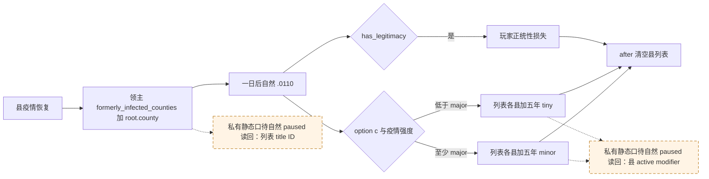

# CK3 1.19.0.6 `.0110` 县修正只读观测口：ABI 与私有静态候选

状态：私有 `static-ready`，尚无新 paused 实机读回；本包没有启动 CK3、注入器或操作者。绑定 EXE SHA-256 `2D00FF3101EF70B566F2FCBAE292F09263199C80E9DC8F139B82D7D96F83DB86`。目标仅是为下一次**自然** `epidemic_events.0110.c` 提供同一 paused 日期的物质读数；现有 R0101 动作与 R0113–R0116 的 15 日间隔正统性读数仍不能证明独占因果。

## 已闭合的原版效果路径

`game/common/scripted_effects/06_dlc_ce1_epidemics_effects.txt:854-885` 的 `plague_recovery_event_effect` 在县疫情恢复时，将 `root.county` 作为 **landed title** 加到 `county.holder.liege` 的 `formerly_infected_counties` 变量列表（十年），并从 `scope:epidemic` 排队一日后发 `epidemic_events.0110`。源文件 SHA-256 `0E27972D9F66348E462130F1EF0351BB18A4C646DB6E23DB237D79068E65DE98`。

`game/events/dlc/ce1/epidemic_events.txt:368-412` 的 option `c`/authored3/native2 在疫情强度至少 major 时，对列表中的县添加五年 `county_epidemic_recovered_minor_modifier`；否则添加五年 `county_epidemic_recovered_tiny_modifier`。`has_legitimacy = yes` 时同一 option 还施加 `miniscule_legitimacy_loss`，`after` 随即清空 `formerly_infected_counties`。事件文件 SHA-256 `FEF2972BD4F778818CD3A414C337D036F5132C1598FEBAB0E2623E0252DB7A1E`。修正定义在 `game/common/modifiers/06_ce1_modifiers.txt:26-34`，分别是 `development_growth = 2` 与 `1`；SHA-256 `63FEB33C8C5BF825E3D186E841D07235C98D6AED27C47375E495EA832255C52B`。这说明要在动作**前**保留原生列表和 exact 县身份，动作后仅从清空的列表无法重建目标集合。

## PR90 施工前 bridge/MCP 基线

| 同帧字段 | 当前证据 | 结论 |
| --- | --- | --- |
| 玩家正统性 | `query-campaign-root-context-v1` 已发布可选 `player_legitimacy_v1`，从 Character `+0x1C0` 数据指针 `+0x28` 读 Q100000；R0113–R0116 在两个真实 paused 锚点均 `available` | 观测口已存在；原 R0101 动作时没有同日值，不能补写 |
| `formerly_infected_counties` | current-event 窗口只有 `epidemic` scope 和可选 `new_preferred_capital`；`combat_v3.cpp` 的 scalar Character variable context/row 读取只证明标量变量，没有列表元素布局、到期时间或 LandedTitleID 投影 | 没有可用 native/MCP 列表读口 |
| 县 recovery modifier | `player_epidemic_treatment_presence_v1.cpp` 读取的是 Character modifier extension `+0x1A8`；`combat_v3.cpp` 的省份 modifier getter 只返回战斗数值修正，不读取 LandedTitle active modifier 定义/有效期 | 不能由角色/省份读取器推断县 modifier 存在 |

现有 `campaign_root_context_v1_abi.json` 绑定正统性偏移与同帧双样本。`combat_v3.cpp:1330-1365` 通过 RVA `0x3329A40` 取得 Character 变量 context，`FindVariableValue` 将 `+0x10` 数据、`+0x1C` 计数及每行 `0x20` 中的 scalar kind/payload 用于标量变量；这没有证明变量列表的容器语义。冻结 EXE 的 `clear_variable_list` ASCII 字符串在 RVA `0x44CFF08`，找到 `lea` 引用 RVA `0x6B9B71`；`has_county_modifier` 字符串在 RVA `0x41A7607`。这些是后续静态逆向的定位入口，**不是**可调用函数地址或已闭合的 ABI。

## PR90 当时的可施工入口（本包按此执行）

1. 在上述 exact EXE 内，从 `clear_variable_list`/`add_to_variable_list` 的注册与执行链确认 Character 变量列表的实际容器、元素类型、过期处理；用原版 `root.county` 路径核对列表元素是完整 LandedTitleID，并找到读 list 而不触发清空的 native 路径。
2. 从 `has_county_modifier` 的注册/触发链确认 LandedTitleID → exact county 对象、active modifier 定义匹配及剩余时长的只读路径。不能复用 Character modifier 行布局或把数值型 province modifier 当作存在性。
3. ABI 函数、结构偏移、返回约定和 exact-build 字节证据闭合后，新增仅针对 `.0110` 的私有只读 native/MCP 查询：同 paused revision 输入玩家 CharacterID 与事件 instance，输出列出带完整 LandedTitleID 的目标县及 pre modifier 状态；动作后按冻结的县 ID 再查 minor/tiny presence/expiry。缺字段返回 `unavailable`，合法不存在返回 `absent`。配合现有 `player_legitimacy_v1` 与同日事件消费，不改公共能力广告或策略动作。
4. 对新查询做聚焦 native fixture/序列化与 Python 合同测试，再在真实自然事件 paused 快照上读回。R0101 旧动作已过去且列表被清空，不能以旧存档的 15 日差值充当该新口的实机验收。

本研究没有为理论安全情形新增门禁。缺失的两个原生读口直接阻止 `.0110` 县修正物质结果被观察；下述私有静态实现仍须真实自然 paused 读回才可称 live。

## 2026-09-22 后续：冻结 EXE 静态 ABI 证据

以下 RVA 均相对 SHA-256 `2D00FF3101EF70B566F2FCBAE292F09263199C80E9DC8F139B82D7D96F83DB86` 的 `ck3.exe`。这是静态反汇编证据，尚无新 paused 实机读回。

| 原生入口 | 已确认的机器码路径与布局 |
| --- | --- |
| `clear_variable_list` | 注册引用 `0x6B9B71` → effect factory `0x338B410` → vtable `0x44D30F8` slot 22 执行器 `0x33939B0`；执行器以 `0x3329A40` 获取角色 scope 的 variable context，以 list identifier 调用 `0x3346510` 清空对应行。 |
| `has_variable_list` | 注册引用 `0x6BB9D1` → trigger factory `0x33C0090` → vtable `0x44D8860` slot 25 执行器 `0x33C0E40`；context `+0x30` 为 list 行数组、`+0x3C` 为计数、行步长 `0x48`、key 在行 `+0x08`。 |
| `add_to_variable_list` | 注册引用 `0x6BA1A1` → effect factory `0x338B920` → vtable `0x44D3760` slot 22 执行器 `0x33914A0`；`0x33915D0` 调用 `0x33463D0(context, list_identifier, EventTarget16*, duration)`，后者定位或建立 list 行并调用 `0x33DD720` 插入元素。 |
| list 元素 | 行 `+0x10` 为元素数组，`+0x1C` 为计数；元素步长 `0x10`。`0x3346610` 与 `0x33DD720` 均按 `word[0]`、`word[+2]`、`qword[+8]` 比较完整 EventTarget16。原版 effect 的 `root.county` 因而应作为 kind 5 的完整 LandedTitleID payload 读出；仍需在新 paused 自然事件帧核对实值。 |
| `has_county_modifier` | 注册引用 `0x31B171` → factory `0x19449B0` → vtable `0x41A9AE8` slot 25 执行器 `0x1945AD0`。执行器要求 kind 5，读 EventTarget16 `+8` 的完整 LandedTitleID，按 title 对象 `+0x10` 核对 generation；以已解析 modifier definition 调 `0x1942CB0`。 |
| county active modifier | `0x1942CB0` 要求 title tier 2，经原生 province/holding 路径取得对象 `+0x850`；active modifier 数组在该对象 `+0x320`、计数 `+0x32C`、行步长 `0x48`，行 `+0` 与 exact modifier definition 指针比较。找到时行 `+8` 被复制到结果基址，结果 `+8` 的 presence byte 置 1；未找到时 presence byte 置 0。此处只确认存在性 ABI，行 `+8` 的时间语义尚未证明。 |

可复核字节窗口 SHA-256：`0x3346510..0x334660F` = `A37CE1F4E51E95B45D96613A90B15062C58C1E3F1BB10924C34804538DE7229A`；`0x3346610..0x334669F` = `BE71BD4FDFA0F9F61183C3A3B85D214E7F0967B6CC8F435F8C84074205781D85`；`0x33DD720..0x33DD82F` = `88AAF17CB055A008AE81C6249F1B6C4073180B3E7895E01B2921A4DEDD7567DF`；`0x1942CB0..0x1942E6F` = `B7D6763BB432D0D24D942D35C29D6401DD32EFEDEAEB04EBC0D9F689343F936E`。这些是明确范围的字节窗口指纹，并不声称每个窗口恰好覆盖完整函数。

实现应复用 `combat_v3.cpp` 的 stable variable identifier 双向核对与 `0x3329A40` scope context 路径，并复用现有 epidemic treatment 查询的 modifier DB stable key 双向核对。只读返回 `formerly_infected_counties` 中 kind 5 的完整 title IDs 与两种 recovery modifier 的 presence；其他 kind、失效 title、损坏行分别报 unavailable，不将其当作空列表。`remaining_days` 保持 unavailable，直到时间字段 ABI 和实机值核实。

## 私有只读实现入口（静态施工中）

`has_county_modifier` 执行器 `0x1945AF5..0x1945B2E` 使用 title storage slot RVA `0x570C410`，按 ID 低 24 位取存储槽，再以对象 `+0x10` 的完整 ID 核对 generation。原生 getter `0x1942CB0` 在读取 active modifier 前也以 title template `+0x5C == 2` 检查 county tier。实现据此验证 full ID 和县 tier，避免把错误 title 的 false 当作修正不存在。modifier 定义经现有 `0x88F370` 数据库、`0x3B8B000` stable hash、`0xA41F10` 查找和定义本名回读取得；查询两项固定原版 key，不由请求任意指定。

上述 modifier DB 组合还在同一冻结 EXE 的 `has_county_modifier` factory `0x1944EB0` 中直接复核：`0x1944ECA` 调 `0x88F370`、`0x1944F02` 调 `0x3B8B000`、`0x1944F0C` 调 `0xA41F10`，结果写入 trigger `+0x70`。因此 county query 不借用 Character modifier 的行布局，只复用同一原生定义查找过程。

原版事件的 `after` 会清空 `formerly_infected_counties`。因此新查询分两种明确模式：事件前 `query-player-epidemic-recovery-v1` 从同帧角色 list 返回县 full IDs 与当前 minor/tiny presence；事件后 `query-player-epidemic-recovery-v1-title-<full LandedTitleID>` 从动作前冻结的 ID 逐县读取 presence。后者不依赖已被清空的列表，也不反推旧目标。两种模式只在 paused main-thread mailbox 执行，绑定 exact build、同帧 revision/角色/日期；私有 Python driver 与 MCP 内部 seam 不在公共 tool/capability 清单中，CMake option 默认 OFF。空列表与读取失败分开，时间剩余值仍标 unavailable。

私有实现经 Visual Studio 18 2026 / MSVC 19.51.36257.0 的 Debug 与 Release 聚焦 native fixture 各 `1/1`，Python 传输 fixture `5/5`，开启 `XAR_CK3_ENABLE_G2_CE1_RECOVERY_PRIVATE_V1=ON` 的完整 Release bridge 编译/链接成功。该独立构建 DLL SHA-256 `B711DD36F2B5F280B5C4BE4A71EFE5F8A95B20CF0223FA82D304F867E9350AA6`，只属于本候选，不覆盖 PRV008 或正在运行的 DLL。这些静态结果不能替代下一次自然 `.0110` 的事件前后同帧实机读回。R0101 历史 `283→263` 仍隔 15 天且县 modifier 未读，不据此闭合独占因果。

下一自然 paused `.0110` 的最小配对：先以公开 event-window query 核对 exact key、instance、player root、scope 与 option `c`，冻结同帧合法性及玩家同角色 legitimacy；再以该 instance 调私有 list 模式，保存每个县 full ID 及两种 modifier 的前值。正式策略提交一个 typed 选项后，先独立确认旧 event instance 消失、同角色同日 legitimacy 后值，再按已冻结的每个 ID 用 explicit-title 模式读取后值，并由下一正式 turn 消费、写入配对 checkpoint。若任一县只有动作后 presence 而缺动作前读数，或者两项 modifier 之前已存在、没有时间字段可证明续期，则该县的独占物质变化仍未闭合；不要由旧 15 天差值或 source 脚本代替实测后置。
