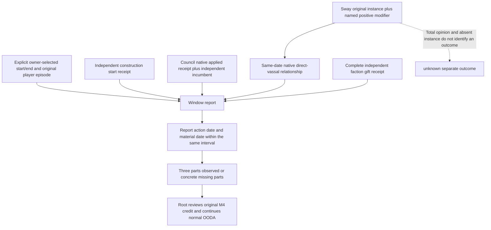

# Explicit M4 material window on CK3 1.20.0.4

2026-10-07 / ISO 2026-W41. Source baseline is frozen26b
`0d22c7efd1ae76a8ced52130f11cf201935520c9`. The installed target is
CK3 1.20.0.4 / Steam 25734779, EXE SHA
`98702F88A547CDE2EAF29A85F93B85F68EE4CF8148336A4F7AFAEB75319DD518`.
The package is **source prepared / AUTHORED_NOTRUN**. Root owns its first check.
The current user prohibition on local CK3 remains effective.

The original [M4 requirement](../autonomous-agent-progress/g2-requirements-v1.json)
asks for one construction, one useful Council adjustment and one real vassal or
faction intervention within two game years. The production source has separate
material ledgers but no explicit shared M4 window. Episode seed and last
checkpoint date do not establish such a window. Historical Council around
raw 53220000 and first-beneficial Sway 53249664 are about 1,236 game days apart;
their independent narrow proofs cannot establish the shared two-year result.
The latest supplied Root baseline is H9658/raw 53288472/saved 6006, G2 5/8,
NW2 2/4 and M4 false. This worker has not read a live frame or the large Driver.

## Native and producer inputs before the report

The [exact4 CDate writer](army-next-full-cdate-calendar-12004.md) retains the
native arithmetic `raw hours / 24`, then `days / 365`. The report therefore
permits an explicitly selected interval of at most 17,520 raw hours. A supplied
snapshot binds the selection to the real player and original episode. Both
window dates are explicit arguments; selection is recorded at its actual
snapshot date rather than claimed to have happened at an older start date.

The reviewed [Council tree](council-composition-ai.md),
[current Council adapter](council-government-12004-adopted-mcp-port.md),
[construction tree](domain-construction-ai.md),
[Sway material tree](sway-material-formal-consumer-12004.md) and
[native faction response](faction-selected-gift-stock-response-12004.md)
remain the decision inputs. This package changes the report of their material
outputs, not their policy weights or action selection.

| Existing producer | Material used by the window report |
| --- | --- |
| `construction-formal-pending-v1.json` | Applied, independently verified original start receipt with actor/episode/pre/post dates. `in_progress` is sufficient construction material; completion and ROI remain separate observations. |
| `private-council-formal-v1.json` | Applied native receipt plus independent matching incumbent. The ACK supplies the original action date; the receipt supplies the material date. Existing following-turn fields are retained. |
| `active-scheme-sway-formal-private-v1.json` | Original action/full instance/generation and dedicated positive `scheme_sway_opinion`; a same-date native campaign root establishes that the target is a direct landed vassal. Total opinion does not supply this material. Original action and later material dates are shown separately. |
| Complete faction receipt sidecar | Existing verified `mitigated`/`left` receipt with player/request/faction identity, dedicated gift material, original pre date and independently observed post date. The gift pending ledger's result string has no material date. |

The report preserves the difference between original action date, material
date, following-turn consumption and historical narrow capability. A fresh
read cannot relabel an old action into a new window. An existing positive Sway
sample likewise retains its original material date. A useful new observation
can be reviewed by Root without issuing another Start or manufacturing a
Council change. The report writes no authoritative milestone status and sends
zero game commands. It is an observation beside normal gameplay, not an
execution prerequisite.

## Root entry and first check

The new module is `src/xar_autoplayer/m4_material_window_v1.py`. The file-only
entry is `tools/project_m4_material_window.py`; it accepts decoded small JSON
objects, the three existing small ledger files and optional complete faction
receipt sidecars. It never scans Driver history. `--window-ledger` and
`--output` are explicit Root artifact paths. The selected ledger should be
retained beside the existing episode artifacts across normal restores; the
official ten-stream restore contract is unchanged.

For first selection, Root supplies `--source-root`, `--state-dir`,
`--window-ledger`, `--output`, `--snapshot-json`, `--window-id`,
`--start-date-raw` and `--end-date-raw`. Refresh omits the four selection
arguments, retains the selected ledger and can add `--campaign-root-json` or
repeat `--faction-receipt-json`. Current H9658 is a planning baseline, not an
already selected window. The restored owner chooses actual dates after a
fresh permitted paused snapshot.

One authored compound method,
`M4MaterialWindowV1Tests.test_first_three_original_materials_share_an_explicit_window`,
covers all three verified materials, applied construction before completion,
ACK-only Council, old-window action, differing incumbent, absent named Sway
material, missing vassal relationship, complete Gift and a result-string-only
Gift. Its fixture values are synthetic. Root can run this single method once;
there is no native TU, new bridge query, DLL, native fixture or new Service
route to build or qualify. Existing native/source qualifications are reused.

The restored execution recipe is external at
`Z:/ck3_mod_rewrite_process_assets/g2-parallel-20261007/m4-window-readiness/formal-recipe/`.
Private construction and Council planned steps use the existing typed planned
dispatcher, not `ck3_execute_step`. Council's planner is currently called by
`plan_nonwar_turn`; Root may call that existing service method for a useful
Council opportunity and then return to the ordinary war planner. This does
not reinstate historical nonwar authorization limits. Construction's current
new-quote peace scope remains a real implementation boundary; wartime source
observation and material follow-up remain available. Its existing cash input
includes army expense, reserve 200 gold, commitment 0 and horizon 1 month.

Sway following consumption runs in the native runner. For an MCP-driven
ordinary turn, Root reuses `tools/record_sway_intervention_material.py` with the
actual after snapshot. The window report labels Construction and Gift
following consumption unknown when their ledger does not contain it, rather
than inventing a generic `next_turn_consumed` field.

This package performs zero game/SDK/UI/process operations, builds, tests,
production imports, EXE reads or hashes. It does not change saved days,
natural successions, G2/NW counts or M4 credit. Oct7/W41 fields are delivered
to the coordinator for the shared reports.
