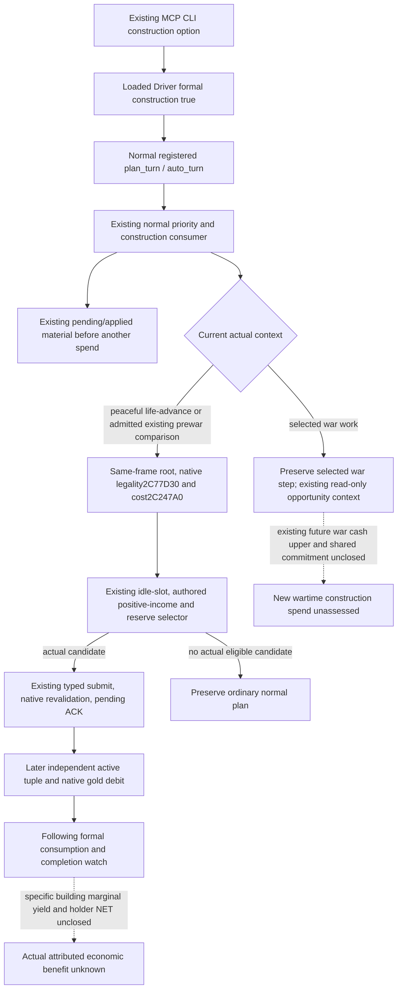

# Normal MCP construction configuration on CK3 1.20.0.4

The normal Service already calls `plan_construction_private` when the existing
Driver option `allow_private_construction_formal_trial` is true. The official
`native-auto-run` parser exposes `--allow-private-construction-formal-trial`,
but the MCP parser and its Driver configuration did not expose that option.
Consequently the restored normal MCP campaign could query construction through
the qualified primitive while never entering its existing formal consumer.

This package, based on `35ddda4ee4531709a69371a05f493e90ad4ef993`, adds the
same existing option to the MCP parser and passes it to the loaded Driver. It
uses the existing native-headless/stdio private-route condition. It adds no
tool, DTO, Renderer, native source, candidate selector or budget policy.
`nonwar_only` remains false unless the caller separately selected it.

## Native inputs before the configuration change

The frozen identity remains CK3 **1.20.0.4**, Steam **25734779**, EXE SHA-256
`98702F88A547CDE2EAF29A85F93B85F68EE4CF8148336A4F7AFAEB75319DD518`.
This package reuses [the adopted building source](building-adopted-mcp-migration-12004.md),
[the native construction tree](domain-construction-ai.md), and
[the existing economic consumers](construction-economic-consumers-12004.md).
No EXE read or new native qualification is performed here.

Actual `.4` final legality is `2C77D30`; the ten-component effective cost is
`2C247A0`. Personally held full-generation titles resolve through `2BB11C0`
and the held `Title+128` holder proof. Current completed slots and active
construction use `Province+620`. Existing typed construction uses validator
`2982420`, materializer `2985DA0`, and shared receiver `37F06D0`. A receiver
ACK remains pending until the independent active tuple and native gold spend
are observed. The named `2B41FB0` income field is a province aggregate; its
scale, individual building attribution and holder transfer remain separate.

The `.4` query already has a production-live primitive. Its held actual Robert
frame at date53288256 had 69 legal native-cost samples and a selected empty
slot, but that old opportunity is not a selection or action at the new R76
frame. Historical R0081 construction material is retained under its original
build/date and is not relabelled as fresh `.4` material.

The existing narrow selector uses same-frame identity, native final legality,
ten costs, an idle slot and positive authored income, while retaining 200 gold.
The existing current-cash projection is consumed when the Driver supplies it.
Authored income is a decision input, not realized marginal gain or an optimal
stock AI utility. The native stock combined-pool weighting and complete
building ROI are unclosed; this change does not invent their values.

This preserves the existing wartime read-only observation and the selected war
step. War research and execution remain authorized; the unclosed construction
cash comparison is a current capability boundary, not a permanent nonwar
restriction. Applied/pending construction still follows its existing material
and completion path during war.

## Sole Root FIRST and actual milestone boundary

`test_g2_normal_construction_cli_service_compound_v1.py` contains one
registered compound. It exercises real `main`/parser/Driver configuration and
real in-memory registered normal MCP calls, with only the game I/O factory,
stdio lifetime, fixture process identity and baseline chooser replaced. The
outer construction reply seam reuses the existing construction fixture Driver;
the new hello/date bindings are source-shaped synthetic inputs, not live data.
It covers default-off, explicit-on selection and one submit, independent
material receipt, following consumption, no positive target and selected war
priority. The policy, transport, cost selection and ledger remain unchanged.
Root executes this one node; this author runs no tests, imports, compiler,
Game, SDK, process operations or native reads.

Root must enable the explicit option in its new SDK argv and consume actual
R76 source fields. An empty target, incomplete coverage, native rejection or
an unassessed wartime spend remains its observed outcome. Source or flag
qualification earns no M4 credit. M4 still requires actual new construction,
useful Council adjustment and vassal/faction material in one explicitly chosen
interval of at most17520 rawhours; the historical materials do not share that
interval. The Gift formal MCP configuration remains a separate concrete gap.
