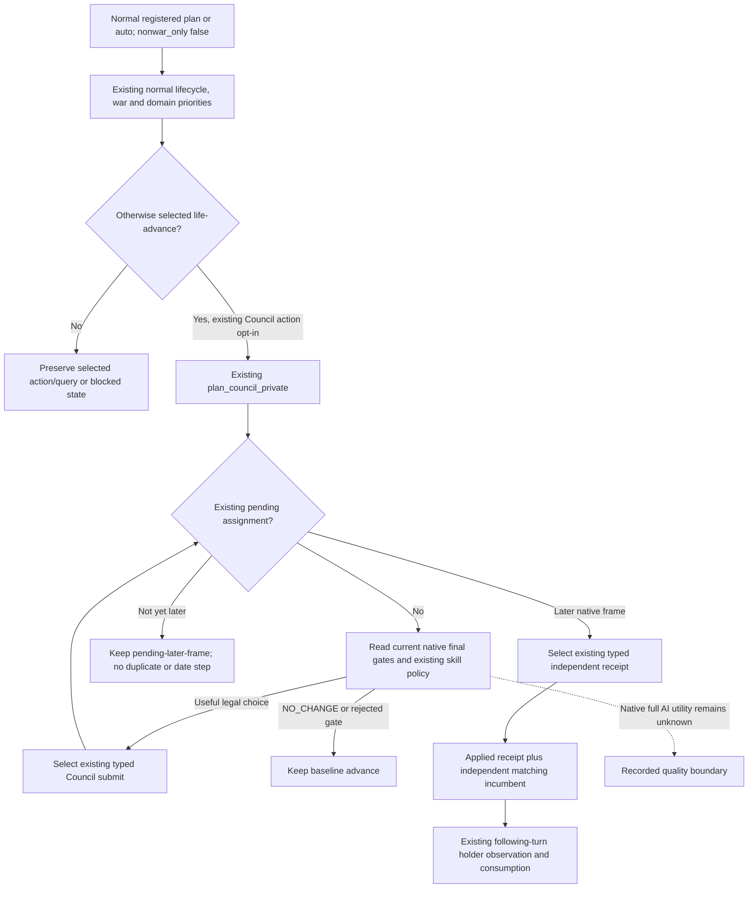

# M4 Council through the ordinary planner on 1.20.0.4

2026-10-08 / 2026-W41. Candidate parent is SDK087,
`08709ee77115ac602d8185bc982abef8768e4c04`. The engine input remains CK3
1.20.0.4 / Steam25734779, EXE SHA
`98702f88a547cde2eaf29a85f93b85f68ee4cf8148336a4f7afaeb75319dd518`.
The work reuses the existing qualified Council primitive. It reads no EXE,
introduces no native body, flag, schema, MCP tool or planning framework, and
has **authored source / FIRST NOTRUN** status. Root owns the one new compound
and the future actual paused query/action/receipt.

## Native inputs before the wiring change

[Council composition](council-composition-ai.md) records the native candidate
collection, position main skill, valid-character and fire/reassign rules.
[The actual4 adopted port](council-government-12004-adopted-mcp-port.md) binds
these inputs to the current executable; the historical namespace and old
DTOs are not a new .4 live claim. The
[existing formal consumer](ck3-1.20.0.2-council-private-formal-consumer.md)
uses the current exact native final gates, ranks only legal higher-skill
Steward choices or a legal vacancy, and retains its typed submit, independent
receipt and fresh campaign-root incumbent observation. Chancellor vacancy
fallback and its existing explicit-role handling are unchanged. Native AI's
full utility weights remain unknown; this candidate reuses the already
implemented skill policy and does not guess a replacement score.

The source087 registered `ck3_plan_turn` and `ck3_auto_turn` choose
`GameplayBridgeService.plan_turn` / `auto_turn` when `nonwar_only=false`.
Previously `plan_council_private` was called only by `plan_nonwar_turn`.
Consequently a successful independent Council final-gates query did not make
the normal planner select its typed Council action or pending receipt.

## Minimum source change and remaining scope

The normal planning view retains its already collected snapshot/history for
the Council consumer. After the existing domain and prisoner/release
priorities, the consumer runs only when `life-advance` is still selected.
The existing wartime-return path uses the same final dispatch rule. A selected
war action/query, opening focus, lifecycle/modal or other domain action keeps
its priority; the change neither sets `nonwar_only` nor requests another
nonwar service. The normal dispatcher already handles the private Council
submit and receipt tokens, so its existing implementation is reused.

An assignment ACK remains pending. An unchanged native revision retains the
existing `council_pending_later_frame` state; Root obtains the actual later
frame before material verification. No predicted date or synthetic receipt
is used. The consumer's current-holder and following-turn semantics remain
unchanged. This wiring does not promise a useful current candidate: Root's
fresh gates may lawfully produce `NO_CHANGE`.

The sole new registered compound is
`test_g2_normal_council_service_compound_v1.py::test_registered_normal_council_submit_receipt_following_failgate_and_war_priority`.
It uses real registered MCP callbacks, the real normal Service and existing
Council consumer with the preserved historical DTO Driver seam. Only the
baseline chooser is a fixture seam. It covers typed submit once, pending
frame, independent applied receipt, following holder consumption, a native
fireability rejection and a selected war-query priority. All these are
offline fixture facts; no new .4 Native or Game execution is claimed. The
compound is authored but has not been run by this worker.

M4 itself remains false. Historical Robert construction
53178312–53181984, Council53220000 and first useful Sway material53249664
cannot join one interval of at most17520 raw hours. The
[explicit window reporter](m4-explicit-material-window-12004.md) retains
their actual dates. Root needs useful current construction, Council and
vassal/faction material in a newly selected actual window. Gift and
construction formal opt-ins are not set by the current SDK CLI; those are
separate source/configuration gaps, not completed actions. Current war scope
for new construction and the existing normal gift arbitration remain
separate inputs. No timestamp relabeling, forced appointment, manual Sway
consume or M4 counter update is introduced.
