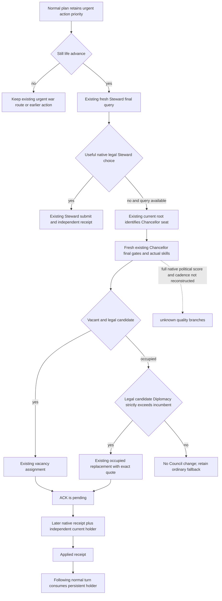

# Occupied Chancellor improvement in the ordinary Council fallback

2026-10-08 / 2026-W41. Exact game CK3 1.20.0.4, Steam25734779,
EXE SHA98702F88A547CDE2EAF29A85F93B85F68EE4CF8148336A4F7AFAEB75319DD518.
Private candidate is based on the already delivered Crown normal source
`a55e0d23b80fc9b029b3f03e05fe8a3437b548bb`. No new EXE read, native
build, test, project import, SDK or game action occurs in this work package.
The new registered compound is FIRST0 for Root execution. The seven shared
progress/report files remain Root/ally-owned; Oct8/W41 fields are external.

## Source tree and actual gap before this change

Reuse [Council composition](council-composition-ai.md), the
[covered role and material receipt paths](ck3-1.20.0.3-council-role-coverage.md),
the [actual4 adopted provider/action port](council-government-12004-adopted-mcp-port.md)
and [ordinary Council Service integration](m4-normal-council-planner-12004.md).
The original native composition scorer, political weighting and reordering
cadence remain unknown. This is the existing minimum measurable skill policy,
not a reconstruction of that full AI scorer or a new powerful-vassal weight.

The actual4 input ledger already closes the shared requested-seat producer
2C47EA0, seat lookup2684EE0, current task2916CC0 and effective skill28B1690.
Native final-gate inputs cover current councillor2917540, guest1A8F760/28C1670,
pending115CA80/2A30790 and occupied confirmation11604A0. Existing typed
assignment helper115AAA0 and command validator2968280→complete CanSend307C020
retain current exact source admission. The helper ACK remains verification
pending; the later native receipt and independent current holder determine
material application. These already sealed sources are reused without another
native scan or fixture/build replay.

Root's saved R76 Steward004 has incumbent32440 with skill11; the17 final-legal
replacement candidates have maximum11 (32716). This is correctly `NO_CHANGE`.
There is no gain and no reason to displace the current holder just to count
an appointment. The already extracted small fields in
`g2-parallel-20261008/m4-normal-institution-next/r76-current-fields/CURRENT-004-005-FIELDS.json`
are reused; the original004/005 bodies are not reopened here.

The missing ordinary behavior is concrete. `plan_council_private` first queries
Steward. Its old fallback queried `councillor_chancellor` only when the root
reported a **vacant** seat. In contrast, explicit-role planning already used
`select_council_candidate_v1(...allow_occupied_chancellor=True)`. The existing
selector and typed action contract already cover occupied Chancellor replacement
with strictly greater observed Diplomacy. An occupied seat could therefore
contain a useful current improvement that the ordinary path never observed.

## Minimum normal fallback

After Steward has no selected assignment and its final query is available,
the consumer reuses the same independent root to identify the supported
Chancellor seat. If present, it queries the existing complete final gates for
that seat, including its actual incumbent and effective Diplomacy. It passes
the existing `allow_occupied_chancellor=True` selector option and routes either
a legal vacancy assignment or a legal **strictly higher Diplomacy** replacement.
It introduces no new threshold, schema, MCP tool, CLI flag or native branch.

Equal or lower skill remains `NO_CHANGE`. Already councillor, guest, pending
interaction, unavailable final gate or non-fireable incumbent rows retain their
existing exclusions. Actual Native CanSend is still rechecked by the unchanged
typed action. A useful Steward action keeps first priority and does not trigger
a second-role query. The Service's selected urgent war/route step never enters
this life-advance fallback; normal Council/Construction/Crown ordering is unchanged.



## Root's one fresh current request

Use the latest paused snapshot's **public** revision, not the old004 or022
revision:

```json
{
  "tool": "ck3_query_council_final_gates_private_v1",
  "arguments": {
    "expected_revision": "<latest paused public revision>",
    "position_key": "councillor_chancellor"
  }
}
```

The literal revision placeholder is a recipe parameter, not an executable
integer. Existing `mcp_server.py::ck3_query_council_final_gates_private_v1`
forwards these two arguments. The returned full native payload supplies
current seat/incumbent main skill, candidate main skills and matching complete
final-gate rows. Preserve the full quote for the existing typed submit; do not
construct an action from these small report fields.

If a current final-legal candidate improves Diplomacy, the actual visible path
is normal plan → normal auto submit once → later independent paused frame →
normal auto receipt → normal plan holder consumption → normal save. If no
candidate improves the seat, report the actual no-change result and continue
normal play. No actual candidate or appointment is predicted from this source.

## Sole new compound and milestone boundary

`test_g2_normal_occupied_chancellor_compound_v1.py::test_registered_normal_occupied_chancellor_gain_receipt_consume_equal_gate_and_priority`
is ONE new registered normal-Service compound. It reuses the existing outer
Council DTO/Driver fixture shape and exercises the real consumer, selector,
typed action contract and Service dispatch. Chancellor skill/gate/holder
poststates and baseline choice are explicit synthetic input seams, not new
native or live qualification. Its positive loop verifies one occupied
replacement, pending ACK, independent material holder and following consumption.
Equal Diplomacy, native replacement denial, useful Steward precedence and
urgent war precedence remain in this same node. Old GREEN modules are not run.

M4 still needs its genuine construction material, useful Council intervention
and vassal/faction benefit within one declared two-year interval. Historical
receipts at dates outside that interval cannot be recombined. This current
Council observer/fallback is one concrete way to discover its missing useful
institutional step; it does not grant M4 credit from source or fixtures. Root's
actual Crown CA1→CA2 law/resources receipt is a separate M7 result. Construction
war-frame policy/binding is independently owned by `entry_next_stage_research`;
this change does not edit that provider, budget or action path.
