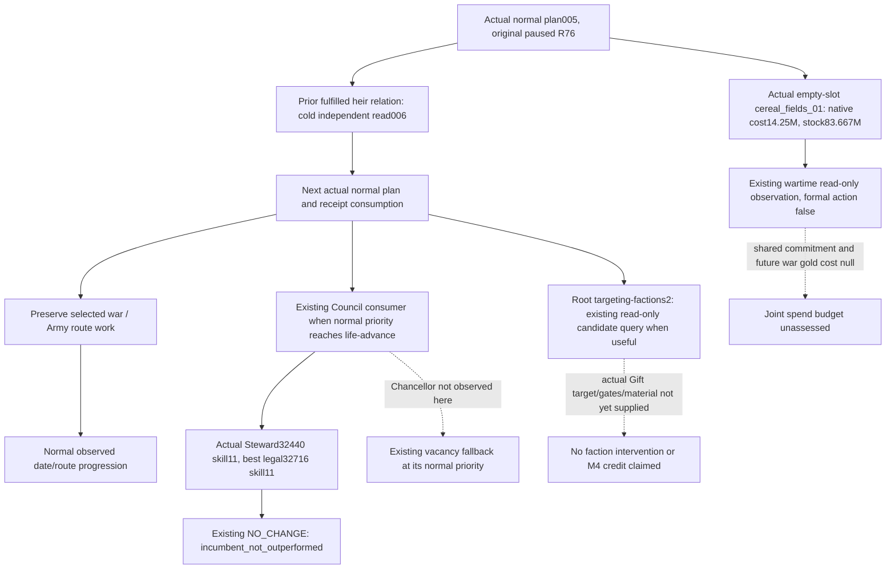

# R76 current normal M4 institution observations

Root supplied the accepted actual Runtime30 paused startup at 2026-10-08
02:54:33 UTC: original Robert29829, date53288472, original episode
`native-29829-2bc2d599f7f9`, saved-normal6006 baseline, paused and minimized.
The separate Native4e DLL was actually loaded; the old startup stack overflow
did not recur. These startup facts are Root evidence, not a new check by this
author. The existing normal Council and construction CLI source checks were
offline GREEN5.7834902s and GREEN6.0983578s respectively. Neither gives M4 credit.

The exact engine remains CK3 **1.20.0.4**, Steam **25734779**, EXE SHA-256
`98702F88A547CDE2EAF29A85F93B85F68EE4CF8148336A4F7AFAEB75319DD518`.
This package reuses the [Council source tree](council-government-12004-adopted-mcp-port.md),
[normal Council wiring](m4-normal-council-planner-12004.md),
[building primitive](building-adopted-mcp-migration-12004.md), and
[normal construction configuration](m4-normal-construction-cli-12004.md).
No native read or policy change was performed.

## The two actual saved observations

Only the saved current `004-r75-ooda-council.json` and
`005-r75-ooda-plan.json` were parsed once. Both are in
`Z:/ck3_mod_rewrite_process_assets/g2-background-20261007/upstream-build-migration/managed-full-h9658-startup30restore01/operator/gameplay-responses/`.
Selected fields, with no opaque or world inventory output, are retained in
`Z:/ck3_mod_rewrite_process_assets/g2-parallel-20261008/m4-normal-institution-next/r76-current-fields/CURRENT-004-005-FIELDS.json`.

The available Steward query has native revision2/date53288472. Incumbent32440
has stewardship11. It supplies20 candidate rows and20 available final-gate
rows. Three candidates33435,34333,43696 are already councillors and excluded
by the existing gate. The remaining17 pass the recorded replacement gates;
their best stewardship is11, candidate32716. This ties the incumbent.
`strategy._plan_council_composition_v1` requires a strict improvement for an
occupied position, so the existing useful-replacement policy is **NO_CHANGE /
incumbent_not_outperformed**. A legally possible equal-skill switch is not a
useful M4 adjustment. Chancellor has not been observed in these two responses;
the existing normal fallback may inspect its vacancy when that priority is
reached. No Chancellor replacement or vacancy is inferred from the Steward row.

The normal plan at public revision3/native snapshot2 selects
`query-observed-first-heir-marriage-result-v1-private`, phase
`current_first_heir_betrothal_cold_material_recheck`, with
`current_betrothal_fulfillment=true`. The source consumer selects this branch
when a prior resolved marriage still matches the current pair but its saved
post-process identity differs from the restored process. It independently
re-reads the material relation, without sending a new marriage action. Root
reported heir38822/spouse38718/no children; the two-file extraction does not
claim the still-pending006 result, a new marriage or a child. Root has already
dispatched006 through normal `auto_turn`; the next normal plan should consume
that actual result rather than manually clearing the ledger.

The same plan's construction wartime observation is actually **observed**:
barony2103/Province2635/type604/slot3, `cereal_fields_01`, an empty slot,
native gold cost14250000 and observed gold83667022. The simple immediate
remainder is69417022, above the existing reserve20000000. The authored income
delta50 hundredths is a decision input, not realized income.
`formal_action_ready=false` comes from the existing wartime observer. It
publishes `joint_budget_affordability=unassessed`, shared gold commitment=null
and future war gold cost=null. The actual target is present and the immediate
cost fits; this result is not an empty-target or insufficient-gold failure.
The existing wartime observer deliberately never becomes a submit quote.

Root's separate current-root short fields establish active War100663329
against31050 and own Army218104048 moving from Province2618 toward2615,
targeting-factions2, domain5/6 and11 vassals. War execution remains authorized.
The unclosed construction joint budget is a capability input gap, not a
permanent nonwar restriction or a reason to block normal war/date progress.

## Next finite ordinary work and dependencies

1. Consume the actual006 result and call normal `ck3_plan_turn` once. Preserve
   its selected war action/query, existing material receipt, or normal clock
   advancement. The cold heir read is expected restore work, not a source bug.
2. Do not force a Steward assignment. Let the existing normal Council route
   observe a later useful change or its supported Chancellor vacancy fallback.
   The current twenty-row quote already establishes no useful Steward switch;
   no repeat quote is needed without a changed frame or new evidence.
3. Targeting-factions2 makes the existing private Gift candidate query a useful
   finite observation, using Root's complete actual campaign-root response
   and a matching current revision. The existing SDK query flag is present;
   no private command or target is guessed. The normal Gift formal option is
   still a concrete configuration gap, and the current action policy/scope
   must be respected rather than deriving an action from the count alone.
4. Retain the real construction opportunity. Reassess through normal source
   inputs after war context changes, or close the specific future/shared cash
   operands for an actual wartime spend policy. Immediate money alone cannot
   fill those operands with zero. Existing pending/applied material and
   completion watches remain usable during war.
5. A new useful Council adjustment, construction material and vassal/faction
   intervention must share one explicit <=17520-rawhour interval. Save actual
   independently verified results. Old separated materials and these readonly
   observations do not complete M4.

There is no actual source defect shown by004/005 and no new source fix, test,
Game/SDK/process command, native read or build in this package. Root owns the
ongoing real campaign and records its actual result. This document is in a
separate knowledge checkout; the active immutable Runner/SDK tree is untouched.
