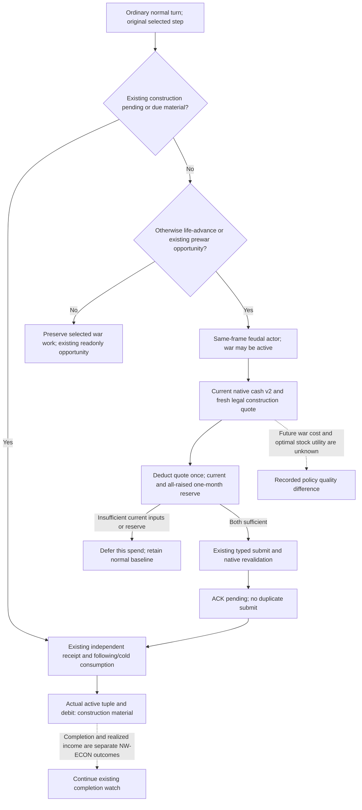

# M4 wartime construction using current native cash

2026-10-08 / 2026-W41. Source parent:
`af2370605b1a58f205daef81026ef53309aebd21`. CK3 1.20.0.4, Steam
25734779, executable SHA-256
`98702f88a547cde2eaf29a85f93b85f68ee4cf8148336a4f7afaeb75319dd518`.
This is a source-only policy and transport repair. Root owns the unique new
registered compound and any later game action. This worker performs no game,
SDK, process operation, native read, build, import or test execution.

## Native tree and policy inputs

The [native construction tree](domain-construction-ai.md),
[actual4 port](building-adopted-mcp-migration-12004.md), and
[economic consumers](construction-economic-consumers-12004.md) already close
the inputs needed for one ordinary spend. Final legality is native `2C77D30`;
effective ten-resource cost is `2C247A0`. The existing quote resolves the
player's full-generation held title, current province and idle slot. The
typed action repeats native validation `2982420`, materialization `2985DA0`
and queue submission `37F06D0`. The existing independent receipt observes
the selected active construction and actual treasury debit.

Current cash v2 reads treasury, gross monthly income `2BCA940`, complete
monthly expenses `2BCB160` with context `28BFD80`, current military expenses
`2C13F60` and all-raised military expenses `2C152B0`. NET already deducts
current military expenses. The all-raised scenario replaces that expense
once: `all_raised_NET = current_NET + current_military - all_raised_military`.
It is an observed alternative expense total across the actor's wars.

Stock AI's complete building pool weights, individual marginal ROI and future
war events remain unclosed. The minimal policy retains the existing native
legal, idle-slot, positive authored-income selector and 200-gold reserve.
During war, both current and all-raised constant-state scenarios must retain
that reserve for the existing explicit one-month horizon after the fresh
native cost. This is a finite policy choice, not a future war-cost upper bound.
No speculative future fee, new regiment cost or authored income is credited
to cash. Existing monthly projection metadata keeps those limitations.

## Observed problem and minimum repair

The current formal consumer returned its readonly wartime observation before
reaching the quote decision. Its ordinary scope also required peace. The
transport `_binding` rejected any active war or player army for normal quote
and submit. These are concrete source restrictions, even though war execution
has been authorized since 2026-10-03 and the native construction action has
its own current legality and cost validation.

The repair keeps selected war work ahead of new construction. When the
ordinary baseline would otherwise advance, it permits the same bound feudal
player during war, obtains the existing cash observation and fresh quote,
and applies the two observed expense scenarios. Normal quote and submit use
the same paused actor/revision/date/episode rules during peace and war. The
episode-less native-campaign readonly sampler remains readonly. No native
TU, MCP tool, flag or wire schema changes.

The existing projection explicitly deducts zero additional one-off commitment
in this single-spend policy: unresolved construction is handled first, and a
different selected action keeps priority. This is not a claim that every
future game expense is zero or that NW-JOINT's complete allocation is solved.
One month's observed expense burn is reserved; positive monthly income does
not finance additional upfront spend. Missing required native cash defers
the particular wartime spend instead of making an unknown future upper bound
a permanent execution restriction.

## Current opportunity and milestone boundary

The existing denominator is defined in
[g2-requirements-v1.json](../autonomous-agent-progress/g2-requirements-v1.json).
Its accepted state is retained:

| Milestone | Required visible outcome | Existing status |
| --- | --- | --- |
| M0 | War exit comparison, submit, independent postwar and cold result | Complete |
| M1 | Ruler/title/capital/liege/vassal/neighbor core observation | Complete |
| M2 | Three natural events, including two multi-option material outcomes | Complete |
| M3 | Natural inheritance prediction/reconciliation and successor continuation | Historically complete; current Robert natural succession0 |
| M4 | Construction, useful Council adjustment and vassal/faction material within two years | In progress |
| M5 | At least five legal diplomacy/war choices and a verified selected path | Complete |
| M6 | Scheme, prisoner/institutional action, nonreligious decision/law and activity lifecycle | In progress |
| M7 | Multiple rulers/seeds/governments with the same intent across checkpoints/inheritance | In progress |

The four-package nonwar queue is LIFE/ECON/FAMILY/JOINT: LIFE and FAMILY are
complete, ECON and JOINT remain in progress. ECON additionally requires
realized economic benefit; JOINT requires joint resource allocation. These
are separate success contracts from M4's material construction start.
An implementation lane called Crown/M7 does not redefine the original M7.

The retained R76 fields at raw `53288496`, public revision8/native7, show
Robert29829 alive and paused; SAVE024 preserved saved6007. The earlier
construction opportunity at native6 on that date is barony2103/province2635,
type604/slot3, `cereal_fields_01`, native cost raw14250000, treasury83667022,
post-cost cash69417022 and reserve20000000. It was readonly and unassessed.
These fields explain why this repair is useful; they are not a fresh quote
or an executed action. Root must query and plan against its current frame.

The original [M4 contract](g2-m4-original-visible-outcome-evidence-reconciliation-20261007.md)
requires construction, a useful Council adjustment and real vassal/faction
intervention in one interval of at most17520 raw hours. An independently
applied construction start with debit is sufficient construction material;
completion or realized marginal income is a separate NW-ECON outcome.
The [window reporter](m4-explicit-material-window-12004.md) retains original
dates and actor/episode identities. Historical Robert construction53178312,
Council53220000 and beneficial Sway53249664 do not join one current window.

CA1 to CA2 has a real separate receipt023 and SAVE024, but does not replace
any M4 condition. The current Steward32440/skill11 has no strictly better
eligible candidate among the observed rows, so no equal-skill switch is
justified. Chancellor observation/selection is a separate owned source task.
G2 remains5/8, the LIFE/ECON/FAMILY/JOINT work-package queue remains2/4,
M4 remains false and current Robert natural succession remains0. This repair
does not alter those counters or reopen the accepted .4 tool migration.

Evidence locators: `Z:/ck3_mod_rewrite_process_assets/g2-parallel-20261008/`
`m4-next-current-institution/CURRENT-018-022-024-FIELDS.json`; original
`upstream-build-migration/managed-full-h9658-startup30restore01/operator/`
`gameplay-responses/023-r76-crown-receipt.json` and `024-r75-ooda-save.json`.
The small extracted field packet and Root's receipt handoff are reused;
this worker does not repeat those game queries.

## Unique qualification entry

Root runs only
`tests/unit/test_g2_wartime_construction_service_compound_v1.py::test_registered_wartime_quote_submit_material_cold_and_observed_cash_floor`.
It supplies synthetic whole cash/construction command-result envelopes,
process identities and a baseline chooser. The actual registered MCP
callbacks, normal Service, native-cash normalizer, quote selector, typed
submit transport and durable material/cold consumer run unchanged.
The compound covers a wartime quote despite an unknown future-war upper,
the observed all-raised reserve shortfall, an unavailable actual expense,
selected war priority, one submit, pending duplicate suppression, independent
active tuple/debit, following consumption and a cold material recheck.
No Native fixture replay or previous GREEN compound is required. This source
delivery initially recorded `AUTHORED_NOTRUN` until Root supplied its result.

Root FIRST01 was RED exit1/8.8844678s at source33c4aab0. The earlier
quote/submit/material/cold and budget cases reached their assertions, but
the overall compound failed its final selected-war-work assertion. The
fixture inherited an action-step list containing only advance/root-query;
it omitted the selected existing Army query. Production
`_route_plan_to_available_step` therefore converted that unsupported fixture
step to advance before construction planning. The fix adds the existing
Army query to this synthetic capability list and keeps the priority assertion.
It changes no production code. FIRST01 remains preserved under
`Z:/ck3_mod_rewrite_process_assets/g2-background-20261008/`
`m4-wartime-construction-first01/ROOT-FIRST-COMPOUND-RESULT.json` and `test.log`.
Root owns FIRST02 for this fixture change; no successful whole result is
claimed from the partial FIRST01 assertions.
