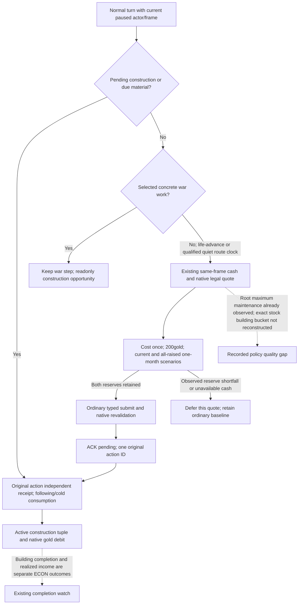

# Ordinary construction when wartime work is quiet

2026-10-08 / 2026-W41. Source baseline `a7460b11147d532d78d1b3edcef5ed49902525ed`; qualified readonly SDK source `6ee7dea1b4d2fa4ecb05223f12c66b7afe72ac2d`. CK3 1.20.0.4 / Steam25734779 / SHA `98702f88a547cde2eaf29a85f93b85f68ee4cf8148336a4f7afaeb75319dd518`. This is a finite source review, not a new gameplay sample or test.

The ordinary `life-advance` wartime construction branch already exists, but the current contact-free moving-route branch was missed. `strategy.py:11548` creates `advance_route_contact_horizon_step(...)` only after the committed route and other controllable armies pass the existing fresh next-day contact checks. Its selected phase is `native_war_route_contact_horizon_progress`. The construction consumer admitted only literal `life-advance` or prewar declaration, so this qualified clock opportunity still returned readonly construction without reaching a fresh quote. Service already calls the consumer; transport wiring is present.

The minimum source repair recognizes that existing phase and its canonical `parse_advance_route_contact_horizon_step` result as an otherwise selected advance. It adds no observer, flag, public command or new readiness field. Pending/receipt handling stays ahead; a concrete move, query, battle or other selected war work keeps priority. The normal same-frame scope already allows active war, and native legality/cost still controls the one construction submit.

## Native inputs before policy

The [native construction tree](domain-construction-ai.md) and [actual4 building port](building-adopted-mcp-migration-12004.md) supply native final legality `2C77D30`, effective resource cost `2C247A0`, current held-title/province/idle-slot bindings and original construction material. The typed action revalidates through `2982420`, materializes through `2985DA0` and queues through `37F06D0`. Independent receipt reads the active/completed selected tuple, initiator and actual treasury debit. Authored positive province income is an input to candidate selection; it is not credited as already earned income.

Existing current cash-v2 observes treasury, gross monthly income `2BCA940`, complete expense `2BCB160` with context `28BFD80`, current military expense `2C13F60` and all-raised military expense `2C152B0`. Gold uses scale100000 and expenses use the existing monthly unit. Current NET already includes current military expense. The observed alternative replaces that term once:

```text
all_raised_NET = current_NET + current_military_expense - all_raised_military_expense
```

The normal quote budget deducts fresh native construction cost once, retains200gold and projects one month of current and all-raised constant-state NET. Both wartime scenarios must retain the reserve. Positive income does not fund extra upfront cost. Additional commitment0 is the explicit single-spend policy input after pending construction and other selected work are considered; it is not an assertion that future warfare has no cost.

Stock AI's held `00_ai.txt` tree instead records minimum war chest by tier `{25,25,50,100,200,300,400}` and18months of maximum maintenance, with income fraction0.6 while filling the war chest. Long/short buckets are0.20/0.80 and their maximum5000. The exact building budget bucket remains unclosed.

The stock maximum-maintenance scalar is already published by the ordinary full campaign root as `player_max_monthly_gold_maintenance_v1.value.raw` with scale100000/month, when that field is available in the same actual frame. `ck3_12004_campaign.cpp:1051` binds `2C152B0`; `ck3_12002_nonwar_metrics.cpp:68` supplies the genuine80-byte output and consumes slot0. The full root publishes the observed metric at970, and the normalizer preserves its status/value. The existing18-month discretionary policy belongs to Feast: `war_cash_reserve_raw = 18 * same_frame_max_monthly_gold_maintenance_raw`, documented in [Feast finance](ck3-1.20.0.3-robert-feast-finance.md). It is not a construction rule or a future war-cost upper bound. The older measured588600raw at date53220456 is historical, not R77's current scalar.

Published all-raised military expense and the maximum-maintenance root scalar retain their separate roles. No duplicate native observer or new mapping is needed for either. The implemented construction one-month policy is the already-authorized finite alternative; full stock bucket/utility adoption is a recorded quality difference, not another `null` execution gate.



## Current R77 boundary and next ordinary entry

Root supplied current raw date **53288544**, Robert **29829**, and a player army moving **2618→2615**. The M4 interval **[53286144,53303664]** has100elapsed/630remaining days at that frame. These supplied fields do not identify the current selected step or prove a new legal construction quote. The earlier `cereal_fields_01` opportunity at2103/2635/type604/slot3/cost14250000 is a historical observation, not spending authority for a fresh frame.

Root's shortest route remains fresh snapshot/root → normal `ck3_plan_turn` → normal `ck3_auto_turn` if construction is selected → an actual later native frame with the original independent construction receipt → following/save → matched cold material consumption. An occupied army, active war or unknown future cost upper does not itself block the quiet advance opportunity. A selected army operation remains the normal selected work and is not manually overridden for construction.

The previous wartime compound remains Root FIRST02 GREEN5.0902798s and is reused without replay. One new authored compound covers the distinct qualified quiet-route opportunity through actual registered normal Service and transports: quote/cash → one typed submit → same-action pending without duplicate → later-frame applied material → following/cold consumption. It also retains the original quiet clock on observed reserve shortfall and preserves a concrete move. Its game/frame/process and qualified planner baseline are synthetic; it does not prove native contact qualification or a real construction.

The unique Root-only node is `tests/unit/test_g2_quiet_route_construction_service_compound_v1.py::test_registered_quiet_route_quote_submit_receipt_cold_and_clock_fallback`, with output environment `XAR_QUIET_ROUTE_CONSTRUCTION_SERVICE_OUTPUT`. It is authored, not run. This worker performs no import, test, native build, SDK query, Game operation, date advance, save or process operation. Original Council44fa material remains reusable at its actual date53286144; new construction and a useful in-window vassal/faction intervention remain the visible M4 work.
