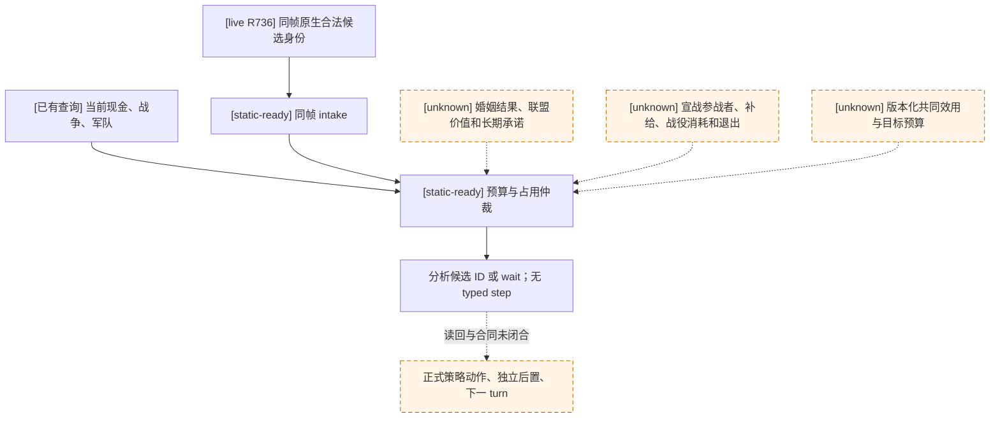

# M5 同帧预算与承诺仲裁核

状态：**static-ready analytic core；没有 production 策略接线或实机选择**。CK3 exact build `1.19.0.6`，EXE SHA-256 `2D00FF3101EF70B566F2FCBAE292F09263199C80E9DC8F139B82D7D96F83DB86`。原生决策依据沿用[婚姻/联盟树](marriage-and-alliance.md)、[宣战树](war-declaration.md)、[战前输入树](prewar-encounter-inputs.md)、[R736 同帧账本](m5-r736-joint-selector-inputs-2026-09-16.md)和[R0082 字段缺口](m5-r0082-joint-selector-field-gap-2026-09-22.md)；本包未改变原生逆向结论。

## 可运行的部分

`m5_joint_budget_selector.select_m5_assessed_candidate` 接收现有 `m5_joint_intake` 的**同一 paused frame** 候选、当前 `state_snapshot` 的 `played_character_gold`、`active_wars`、`player_armies`，以及调用者已经用同一量纲评估的至少五个当前合法候选。它拒绝跨玩家、日期或 native revision 的评估；只把 `raw/scale=100000` 的当前现金用作实际现金来源。调用者显式提供现金储备、已占用现金/军队/盟友/角色/长期承诺和最大并发战争数。

每个候选的收益、战争、家族、外交、补给、长期承诺成本都由同一**外部政策量纲**给出；函数从不把 `recipient_ai_accept_raw`、原生合法性、原生相对军力或枚举顺序当成收益。战争候选还需调用者量测的目标路线上补给余量。它只从正净收益、现金够用、补给非负、军队可控、没有已占用资源且不超出并发战争预算的候选中选一个；相同净收益按稳定候选 ID 裁定。全部非正或冲突时明确返回 `wait`。`selected_candidate_id` 只是**分析结果**，`selected_step` 始终为 `null`，`formal_action_ready` 始终为 `false`；尚未比较的其余合法候选数单独列出，不声称全局最优或正式 M5 选择。

聚焦测试使用 R736 同一 native revision 中真实出现的五个首继承人候选 ID 和一个宣战 ID，验证确定选择、战争预算、现金、补给、角色/盟友/军队/长期承诺冲突，以及正收益不会永久等待。**测试中的现金、估值和承诺全为合成输入**；R736 没有保留这些字段，不能把测试选择写成 R736 的真实游戏动作或实机收益。normal/-O 测试只证明纯静态仲裁行为。

## 使真实候选可以进入仲裁的下一只读入口

1. 先在已冻结的 M5 `xar_on` 候选上完成现有 `query-first-heir-candidate-alliance-projection-v1-private` 的 paused 五候选读回。其 pair 仅是“若接受则会尝试”，不直接产生收益或联盟承诺。该候选资产、DLL/profile 和 preflight 身份见[只读准备记录](m5-alliance-readback-prep-2026-09-22.md)；不可与战争 `xar_off` 恢复配对混用。
2. 对仍缺失的婚配值，以 exact-build `CMarriageOffer` 与现有五候选 context 入口补最小**只读 native bridge/MCP 查询**：每候选的 secondary pair、成人婚姻或订婚结果、lineality、当前联盟与新联盟是否真正成立所需条件、可识别的承诺/持续时间/取消代价。先在私有默认关闭入口做版本绑定 fixture 和真实 paused readback；确认语义后才决定公开合同。既有 `possible_alliance_pairs` 不能代替联盟实际收益。
3. 对一项当前合法 declaration，以[战前输入树](prewar-encounter-inputs.md)已冻结的强制参战、当前军队路线/补给来源和[M5 当前主力只读口](m5-war-primary-current-readback-2026-09-16.md)为基础，补 declaration-bound 自愿盟友最终可调用性、军队/补给目标路线余量、预计战役现金与兵力消耗、合法退出及物质条款的**只读 native bridge/MCP 查询**。旧相对军力 ratio 不能代替这些字段或胜率。先做同版本 paused readback，再用于候选评估。
4. 与上述真实 readback 同帧保留当前现金、active WarID、军队和高层目标已作出的资源承诺；由正式策略制定版本化共同效用量纲、现金储备与战争并发预算，对至少五个不同当前合法候选实际比较。仅当正式 typed 动作、独立结果、下一 turn 消费和所需恢复门完成，才能改变 M5 readiness。没有这些输入时，本核返回缺评估或仅用于离线试算，M5 仍 `not_started`。

本包没有新增公开协议、MCP 广告、宗教查询或 CK3 动作。资源声明是显式的策略账本，不根据 native 字段中尚不存在的补给/联盟承诺默默填零。
