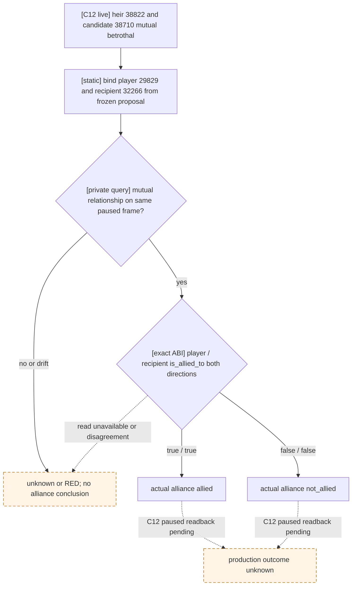

# C12 first-heir betrothal: actual alliance result boundary

The C12 frozen Robert evidence at `Z:\ck3_mod_rewrite_process_assets\g2-robert-nonwar-prewar-r0149-20260926-c12` establishes a bilateral betrothal between first heir 38822 and candidate 38710 on a new PID. A second new PID verified cold recovery. That is a material **betrothal**, not proof of an alliance. The earlier five-row `would_attempt_if_accepted` is a native projected attempt, not a result. The source proposal's actor was player 29829 and recipient matchmaker 32266: candidate 38710's exact row in the frozen C10 `attempt-01/formal-report.txt` (SHA-256 `2BD6EBD230C2E730560119CF36D867192457D4E3247B7C4BF3DD8C8B0446C6F4`) contains both `recipient_character_id=32266` and `recipient_matchmaker_character_id=32266`. The C12 durable `state/first-heir-marriage-formal-v1.json` (SHA-256 `44489AF3AD4A2901EE7D6236CE82C7412743D3109FCB8186A3703F3E8AA52918`) records actor/heir/candidate but does not retain recipient. The private readback caller must bind 32266 from that frozen final-legal row. Do not alter the C12 ledger to fill that historical field.

The exact CK3 1.19.0.6 EXE (SHA-256 `2D00FF3101EF70B566F2FCBAE292F09263199C80E9DC8F139B82D7D96F83DB86`) already has the certified `CCharacter::is_allied_to` RVA `0x2661E00` adapter. A private, default-OFF, read-only result query resolves the four CharacterIDs on one paused native revision: it first reads the heir/candidate spouse or betrothed relationship in both directions, then calls `is_allied_to` for player/recipient in both directions. `allied` requires two true reads, `not_allied` requires two false reads; a missing or mismatched read is `unknown`, never zero. The Python transport requires an existing material result and checks the returned identities, relationship kind, revision, and a second paused snapshot. The query performs no proposal submission and does not change public MCP/action advertisement.



This source increment is static-ready until a frozen candidate reads C12 on a real paused frame. Its result describes the **current** alliance pair, not the causal effect of the betrothal; an alliance may predate or follow the proposal. Future proposals should persist the exact recipient identity with the pending receipt before automatic result consumption can use this query without an external frozen row.

## Managed C12 h148 read-only entry

The latest retained C12 `recovery-pair-h148` contains a paired save, driver and family sidecar. A no-launch read of that sidecar and the C10 report binds played 29829, heir 38822, candidate 38710 and recipient 32266 without modifying either source. The package adds a dedicated, default-OFF `g2_preview_operator.py query-first-heir-marriage-alliance-result-v1` command. It first runs the official `native-one-generation-preflight` with the exact save/driver hashes, then uses a cold-checkpoint managed native session for one paused read. It stops and proves cleanup without a gameplay action or date advance, and records the before/after frames, current first-heir root query, native bilateral relationship, actual two-direction alliance read, window minimized/hidden state and query receipt. The query process validates the C10 report's supplied SHA and selected final-legal row against the C12 material ledger before session start. Neither the old sidecar nor the frozen proposal report is edited.

For h148, `prepare-state` takes `--sample-dir <C12-recovery-pair-h148> --family-sidecar <C12-recovery-pair-h148/first-heir-marriage-formal-v1.json>` on the new candidate manifest. This resolved branch checks the old `source_pending`, material betrothal, actor and episode against the saved checkpoint, then copies the sidecar after the ordinary rebind and official no-launch preflight. It retains the original SHA. The existing pending branch still requires `--family-proof-report`; the resolved h148 branch does not read or rewrite h148's non-UTF-8 `formal-report.txt`. C10's separate frozen report and SHA are supplied only to the later read-only query.

The operator command is:

```text
py tools/g2_preview_operator.py query-first-heir-marriage-alliance-result-v1 --manifest <official-h148-prepared-manifest> --output <new-Z-attempt-dir> --proposal-report <frozen-C10-attempt-01-formal-report.txt> --proposal-report-sha256 2BD6EBD230C2E730560119CF36D867192457D4E3247B7C4BF3DD8C8B0446C6F4 --recipient-character-id 32266 --ownership-round-id <allocated-R-number>
```

The manifest must pin the new source commit, DLL and prepared h148 save/driver. The ownership round must come from the persistent allocator, never from the example placeholder. Source tests and no-launch checks do not establish C12's actual alliance result; only the operator's paused native `query_envelope` can do that.

The persistent allocator formats its canonical suffix as `R{sequence:04d}` (for example `R0227`). The first private query parser accepted only unpadded numbers, so it would reject that actual allocated ID before launch. The operator and managed query now accept the exact nonzero padded suffix and reject alternate spellings such as `R227` for the same allocation. This is a no-launch integration fix; it does not add alliance outcome evidence.

The c14 h148 attempt allocated `R0227`, but the official preflight blocked before CK3 launch: the new operator query omitted lifecycle arguments, so preflight assumed `rogue_one_life/xar_on` while the paired Robert profile is `ordinary_campaign_succession/xar_off`. Its `attempt-01/operator-receipt.json` records `preflight_blocked`, `game_launched=false`, zero actions, and the process inventory was empty. The allocator marks R0227 voided; it is no live alliance evidence. The operator now passes the manifest's validated lifecycle to the existing preflight helper, as other ordinary campaign entries do. The focused operator test asserts all three ordinary arguments. A later candidate still needs its own paired no-launch check and paused query.

The c15 `R0228` preflight passed, then the managed native session failed before a paused frame with the same `game-rule source/profile fingerprint differs` error. The query runner had left `native_session` at its `prepared_xar_enabled=xar_on` default. Its RED report records `launch_attempted=true`, null readiness and query result, unchanged save/driver hashes and zero actions; the CK3 process inventory was empty afterward. The allocator marks R0228 `completed-red`. The runner now forwards the validated checkpoint lifecycle's `xar_enabled` to the managed session, with a focused test for the ordinary `xar_off` profile. Actual alliance status remains unobserved.
