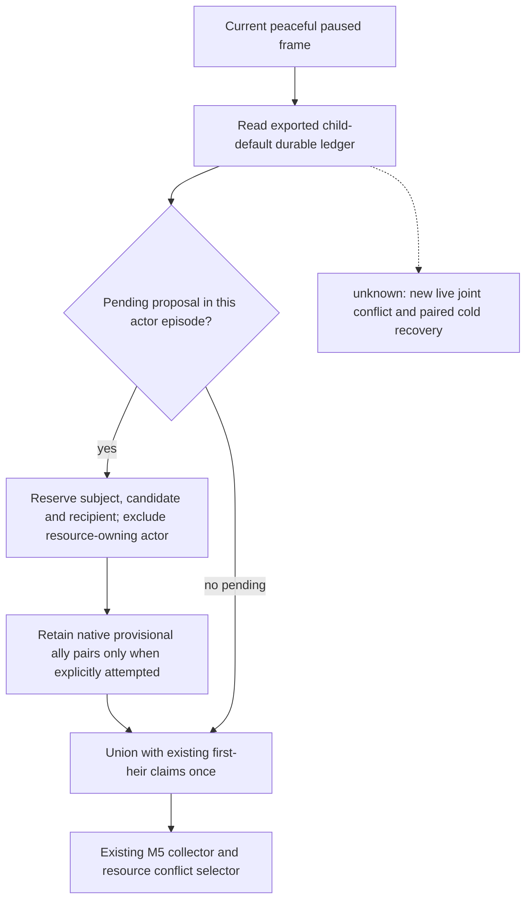

# M5 pending player-child default marriage claims (2026-09-30)

Scope: the existing private peacetime M5 proposal source on CK3
1.19.0.6-steam23530548, EXE SHA-256
`2D00FF3101EF70B566F2FCBAE292F09263199C80E9DC8F139B82D7D96F83DB86`.
The native marriage decision tree, typed submission and result consumer remain
unchanged. This extends the [existing pending-family resource adapter](m5-pending-family-claims-c79-2026-09-27.md).

## Actual input and missing consumption

R0399 used source `ed2c916a91cc62ef3e0e306f8b295b135c59b60c` and submitted
Guy 38988 / candidate 37909 / recipient 34332 through the private default
player-child marriage consumer. Its following turns 7 and 8 retained the
proposal as pending. The recorded input is
`D:\ck3-nw-family-guy-h3911-c3-20260930\state-final\player-child-default-formal-v1.json`;
the [read-only trace](D:/nw-joint-child-default-trace-20260930/evidence.json)
records the original ledger and formal-report hashes.

The ledger claims actor 29829 and the three relationship participants.
Its selected native projection reports generic gold cost zero, application
timing `on_send`, and no alliance attempt if accepted. The old peacetime M5
source read only the first-heir ledger, whose pending entry was null, and
therefore omitted this actual player's child proposal from its shared claims.
Those source files did not change between R0399's source and master
`0b4b36d7c10ce723561180467d56c3ea35d8ffaf`.

R0399 was a wartime run with the M5 collector disabled. This is a missing
production input, not an observed overlapping gift, double spend or live
joint decision. The proposal has not been shown accepted in these inputs.

## Claim projection

The actor owns the observed current treasury and does not become an exclusive
marriage participant in the joint selector. Generic `on_send` costs are
already part of current treasury and are not reserved a second time. A
native attempted pair involving the actor can occupy its other member's
provisional ally resource; this never asserts an established alliance or
positive payoff. R0399's false-attempt pair produces no ally claim.

The adapter uses the exported read-only ledger interface independently of a
new submission opt-in. Existing obligations survive a restored driver or a
disabled submit flag; a cleared pending entry releases these temporary
claims. It does not invent a new marriage proposal or modify result priority,
native actions, public capabilities or M5's five-real-candidate contract.

The focused verification uses the original R0399 ledger bytes in the
production source and collector. A peaceful frame and overlapping gift plus
independent building are controlled inputs, not new CK3 observations. New
M5 live evidence remains required.

## Focused verification

On the isolated source workspace, the new commitment tests and existing
peacetime source tests passed 40/40 with six subtests in normal Python and
40/40 with six subtests under `-O`. The original-byte production replay
preserved the R0399 ledger, projected exclusive characters
`[34332, 37909, 38988]`, zero additional gold and no ally claim. Its controlled
gift to recipient 34332 was rejected as `existing_commitment_conflict`; the
independent building remained eligible and reserved only its own raw
3,000,000 cash cost. The actor was absent from exclusive relationship claims.

Replay artifact:
`D:\nw-joint-child-default-trace-20260930\production-source-replay.json`,
SHA-256 `4CAC72B1265A5EFBD916FEF06F4911094DC0E8499EAA358FF0BC65A729783F02`.
Logs: `D:\nw-joint-child-default-trace-20260930\test-normal.log` and
`test-opt.log`. These are production-path source/fixture checks with real
pending input bytes. They add no date, gameplay turn, accepted proposal,
live joint conflict or cold-recovery evidence.
