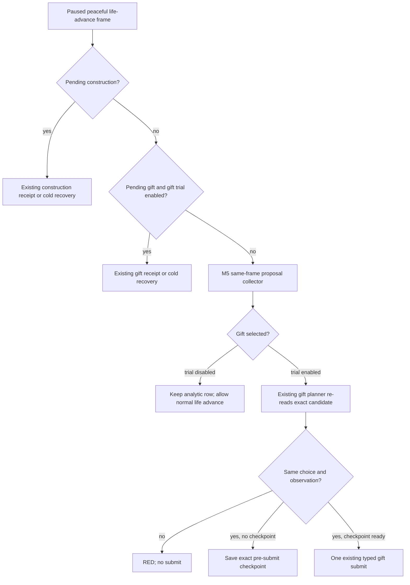

# M5 faction gift formal routing (2026-09-27 C54)

Scope: private, default-off M5 collector and private faction gift formal trial
on CK3 1.19.0.6. The native faction gift decision tree and source fields remain
those documented in the existing faction topic. This change does not alter
native eligibility, gift value, gift cost, or public MCP advertising.

## Proven call-path gap

The private M5 producer could return a same-frame, domain-approved faction
gift. The dispatcher could reserve that `diplomacy:faction-gift:*` proposal,
but `plan_m5_formal_query_only` had typed branches only for building and
marriage. It returned `selected_step=null`. `GameplayBridgeService.plan_turn`
then returned early from its M5 branch, so the existing
`plan_faction_gift_private_v1` consumer did not run even when its private
opt-in was enabled. The old unit coverage checked only analytic selection.
An unresolved gift ledger also made the M5 producer reject the next read
before the independent receipt or cold-recovery planner could run.

The deterministic service-path test reproduced the first gap before the
repair: one approved gift was selected, while the existing consumer was called
zero times. This is a production code-path reproduction with fixture input,
not a CK3 gift-positive live artifact. Recent Robert faction roots reported
zero targeting opportunities, so no actual gift was submitted in C54.

## Current bounded route

The M5 consumer now calls the owning gift planner only when the gift formal
trial is separately enabled. It requires the planner's re-read `choice` and
`observation` to equal the selected M5 source before accepting its checkpoint
or typed step. A pending gift goes through the original receipt/cold route
before any fresh M5 proposal read. With gift trial disabled, the same analytic
gift row remains visible, but cannot block the otherwise valid date advance.
No unknown war cost or absent faction value is converted to zero.

Focused normal and optimized tests cover the old early-return regression,
gift opt-in off, pending cold routing, same-frame selection, the original
checkpoint gate, and typed planning after an exact checkpoint. These are
static source/fixture results. A matching gift-positive paused frame still
needs formal submit, independent gold/opinion/faction readback, next turn, and
new-PID cold recovery before any live gift or M5 capability claim. M5's five
real candidate requirement remains unmet.
