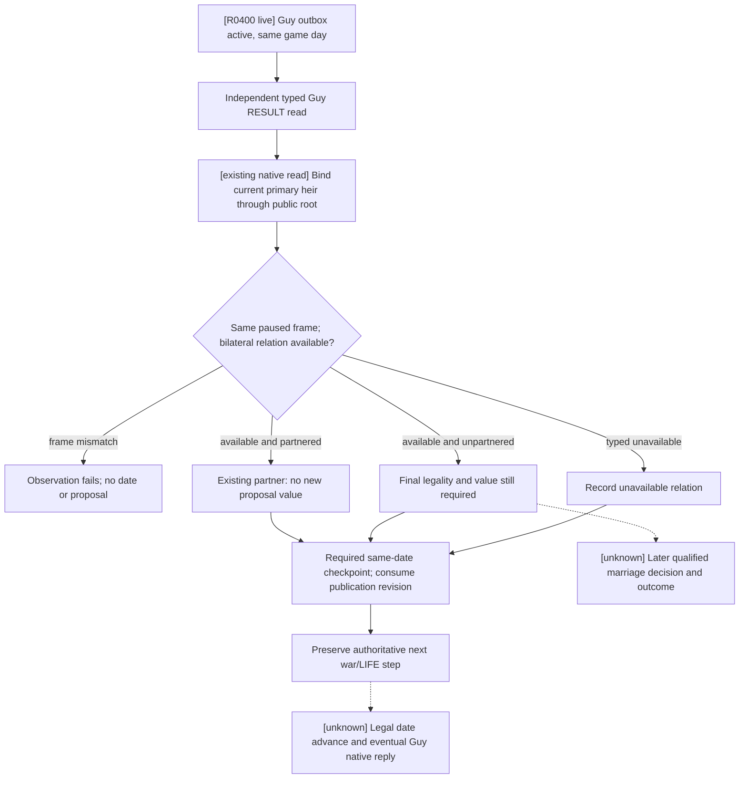

# H3928 family companion: paired no-launch candidate (2026-09-29)

Status: **official paired no-launch ready; no new CK3 frame or family action**.
The exact game remains CK3 `1.19.0.6-steam23530548`, EXE SHA-256
`2D00FF3101EF70B566F2FCBAE292F09263199C80E9DC8F139B82D7D96F83DB86`.
The native decision and result boundaries remain in
[marriage-and-alliance.md](marriage-and-alliance.md), and the first-heir
relationship reader remains private.

## Why this H3928 frame needs a read

The original H3928/raw53219928 sidecars for actor 29829 and episode
`native-29829-2bc2d599f7f9` contain two different family states:

- First heir 38822 and candidate 38718 have a **resolved betrothal** with
  `material_result=true`. This does not establish an alliance or adult marriage.
- Player child Emma 37265 to Gerard 37267, recipient 32440, remains
  `receipt_pending` with `material_result=false`. Sending this proposal again
  would duplicate an unresolved action.

The merged #663 companion path reads the child result and current primary
first-heir relationship beside it in one paused native frame. It does not
evaluate or submit a new marriage. Source inspection found no additional
reproducible missed family consumer on this H3928 frame. The relevant next
evidence is the exact pending state and first-heir relationship from CK3.

## Frozen candidate and pairing

The [candidate index](<Z:/family-h3928-companion-v2-20260929/CANDIDATE-INDEX.json>)
has SHA-256 `6E6044002DD4A0238FE1CE6A8E662825F2984BA866E4B298896DCB2BA78999C4`.
It binds exact master `74d58efc9df8ca319f276ea2eae415e2ea450a8e`
(official push CI `36572566634` SUCCESS), Release DLL SHA-256
`A6D749B576F2E8543F2121CE0352762D39EBC061C749DED6782CA5A80E75041A`,
injector SHA-256 `7160ACA19FC5D23B8B0239A19101105E450B1D7AD91FAAC20AC8C9FC6B38A3E4`,
the original H3928 save SHA-256
`A92073407D1CB2800EEF9C0C3EFEB9846D48398F679DC3163B71EF86C40CEC2C`,
and its official rebind of the paired driver and family/Sway sidecars. The
candidate's Z-drive preparation script has SHA-256
`E212A1AFF00737BD774D36549173A47EAC6F4C632F17C64ADEDEE7F4647FF663`.

Official [no-launch report](<Z:/family-h3928-companion-v2-20260929/state/preflights/20260929T132943Z-one-generation-preflight-04d310ac/report.json>)
SHA-256 `F209097FB74736CCA09F77BC646DA2F4CF8267FBE1E95E9F9BDD1D9D984410A1`
returned `status=ready`, `ok=true`, `ck3_launch_attempted=false` and an
empty local process inventory. The prepared driver SHA-256 is
`D22186105142B81B815CA500E618A61668ABD63A6BA8BE853CDB877C58660E05`.
The source save remained byte-identical. This is a no-launch result; there is
no new native revision, proposal response, date advance or material outcome.

The single-instance owner can take this indexed candidate into the existing
queue. Its indexed operator arguments request one child pending read for
37265/37267 plus the first-heir companion, with zero proposal/action/date.
Before that run, verify current PID/owner and the frozen index/manifest; after
load, minimize the window. An unavailable or frame mismatch stays RED. The
live result must report the child pending/resolved status separately from the
first-heir relation. Any later gameplay turn and cold restore require their
own paired evidence. This candidate is separate from PRV008 and does not
expand its qualification or change G2's `3/8` count.

## R0375 matched live result (2026-09-29)

The indexed H3928 candidate was executed once by the single local owner in a new minimized CK3 PID171476. The same paused native:3/revision4/actor29829/raw53219928 frame read Emma37265→Gerard37267 as outbound `active` pending, pending ID `-469762048`, age 0 with a 7-day AI reply cutoff, and `material_result=false`. The companion independently read primary first heir 38822 and 38718 as bilaterally betrothed, with no spouse, and `new_proposal_eligible=false`. [Formal report](<Z:/family-h3928-companion-v2-20260929/operator-runs/companion-read-1/formal-report.txt>) SHA-256 `5B4278C03CFA64D5F470FF8A2D2AB2ADDA8FBAAA72228617F4941DC4051B75B5`; [operator receipt](<Z:/family-h3928-companion-v2-20260929/operator-runs/companion-read-1/operator-receipt.json>) SHA-256 `E7F16A58D15C79B814E523FC75ED287DAA877511AD464CEA250E946871466E9D` completed/exit0. The source save hash stayed `A92073407D1CB2800EEF9C0C3EFEB9846D48398F679DC3163B71EF86C40CEC2C`; gold stayed raw120644281; no gameplay turn/date or proposal was submitted; process tree and owner were released. This is a private same-frame cold result read, not an acceptance, marriage, alliance, next-turn consumer or public capability.

## R0400 Guy result: missing companion binding (2026-09-30)

The exact native build and relationship tree above remain unchanged. R0400
restored Robert's h3931/raw53219928 pair in PID144920 and read Guy38988 to
37909, recipient34332, as outbound `active`, signed pending ID `-469762048`,
age0 and AI reply cutoff7 days. `material_result=false`. Its next formal turn
returned to `query-war-termination-options-16777231`; the paired-checkpoint
revision is now consumed instead of causing another same-date Guy query.
Neither read advances the native daily age function (`0x27516F0`, pending
`+0x5B8`). This does not prove acceptance or let the marriage consumer override
the retained contact expected-utility RED to advance time.

The same restored sidecar still records first heir38822 and38718 as betrothed,
with the prior material read in PID118364 and prior `not_allied` result. R0400
did not independently re-read that pair. Its current public root still binds
38822 as the primary first heir and Guy38988 as county2173's split successor.
The [R0400 input and production-consumer replay](<D:/nw-family-pending-actionability-20260930/evidence.json>)
has SHA-256 `8D545776053741A27E533AED49C3ECCFB181B47844FC6C840B04BE7C86CD1643`.
Its three bounded fixtures preserve the actual war query, retained contact
RED and an already selected `life-advance`; they do not infer a complete war
decision from a partial snapshot.

The existing `query-current-first-heir-relationship-v1-private` first binds
the public primary first heir, reads bilateral spouse/betrothal identities,
and verifies the same paused revision/player/date before returning. The
existing companion classifier performs another unchanged-frame check and
never enumerates candidates or submits a proposal. Its CLI was only bound
to the matrilineal child pending observation, so the default-lineality Guy
RESULT branch could not consume this existing observation in its formal run.
Enabling the full first-heir marriage trial is unsuitable for this read:
its wartime entry requires an existing query/advance step and it can evaluate
new candidates if the old material pair has ended.

The narrow Python binding is default OFF and runs the existing companion
after the independent Guy RESULT read, before the required paired checkpoint.
The full family marriage trial stays OFF. A partnered current heir has no new
proposal value; an unpartnered or changed heir still requires its own final
legality and value evidence, which this observer does not collect. A malformed
or missing typed reply or frame drift fails the observation; a valid typed
`unavailable` result remains an unknown relation. The
checkpoint continues to consume its own publication revision, and real later
dates/new native frames/cold PIDs still trigger the Guy result read.

This is a Python formal observation binding using an already qualified
private native reader. It changes no DLL, schema, public MCP registration,
PRV008 artifact, G2 milestone or material marriage/alliance conclusion. A
matching bounded candidate and live same-frame read are still required.

The formal operator flag is `--private-guy-default-first-heir-companion`,
with `--private-guy-default-formal-trial` ON and the full family trial OFF.
The operator forwards the same companion flag to `native-auto-run`; the
native CLI uses `--allow-private-guy-default-formal-trial` for its existing
default-child trial. The existing `private_first_heir_companion_observation`
report records the current relation and whether it matches the old material
pair. The Guy result turn records `guy_default_first_heir_companion_observed`;
the old first-heir sidecar is not rewritten as a new material result.

Focused production-runner and operator fixtures pass 9/9 in normal mode and
9/9 in `-O`, with logs in
`D:\nw-guy-firstheir-companion-tests-20260930`. They cover old-PID betrothal
comparison against the current primary heir, a changed unpartnered heir
without a proposal, option-OFF compatibility, typed query frame drift staying
RED, and the true checkpoint fence after an additional publication. The
relationship query itself preserves its existing revision contract; a later
checkpoint refresh is consumed without replacing the original Guy read
revision. The generated operator command is parsed by the actual native CLI.
These are fixture results; no new CK3 process, relationship outcome, date or
candidate qualification is claimed here.
