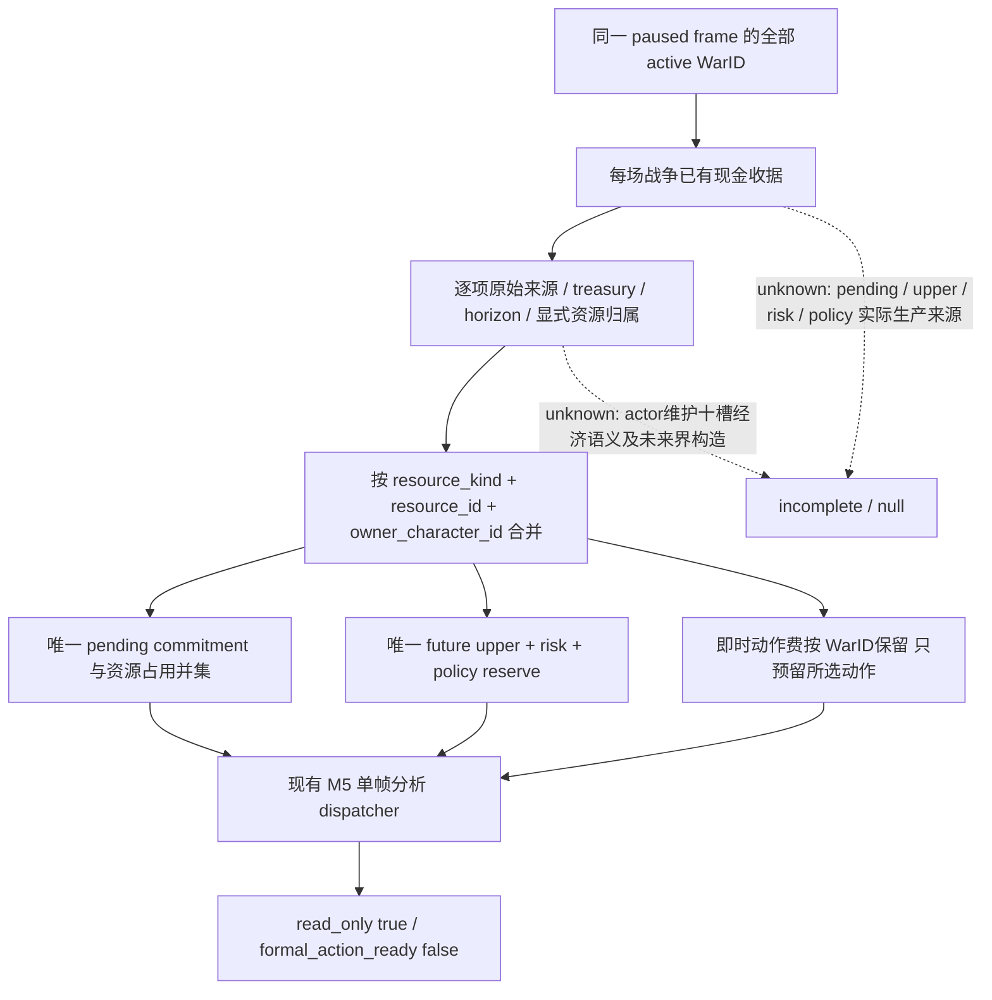

# M5 同帧多战争资源聚合 v1

本包基线 `9e37d3d`，仅离线源码/fixture；没有启动、查询或枚举 CK3、Steam、进程、pipe 或桌面。原生输入研究遵循 [native AI 索引](README.md)，复用 [R0266 同帧现金专题](r0266-war-cash-resource-2026-09-28.md) 与 [prewar 军队身份合同](prewar-encounter-inputs.md)。1.20.0.2 exact EXE 绑定为 `AE1BA6FF060BA603842F6F4A2DED0AF4B7D3666B3DD271F75FB01B0DA8E81B2D`；本页不迁移旧 RVA，也不声称新维护 provider 已 live。

## 施工输入树与证据边界

`static-confirmed`：既有 R0266 合同分开 pending、本次动作即时费、未来有界费、风险额和政策最低保留，单战争收据始终只读。原生维护候选输出十槽角色向量，下层语义尚未闭合；不能把 slot 0、净月收入或军队数量当未来战争费用。`prewar-encounter-inputs.md` 证明 public `army_id` 是完整 CUnitID，`native_carmy_id` 是完整 CArmyID，两者不可互换。当前资源聚合是我方收据消费语义，不是对原版战争意愿的复刻。

WarID 不是成本资源身份：同一 actor 的 `actor_military_maintenance`、`actor_war_reserve`，或同一军队同时关联多场战争，不能为每个 WarID 再收一遍钱。未来界构造必须显式发布身份和覆盖 WarID；聚合只去重已有金额，不把当前维护率乘期限、不制定储备政策、不新增战争意愿或解锁动作。

## 收据接口

`observe_aggregate_active_war_cash_resource_v1(snapshot=..., receipts=[...])` 消费全部 active WarID 的既有 `xar.ck3.m5-active-war-cash-resource.v1` 收据。遗漏收据、缺金额/期限/资源身份或占用观察产生 `incomplete` 和逐项 `missing`；跨帧、重复/非活跃 WarID 或互相矛盾的来源属于输入错误。完整聚合收据通过 `require_complete_aggregate_war_cash_resource_v1` 重新消费。

每项原始金额可附 `resource_components`，每个 component 包含 `resource_kind`、`resource_id`、`owner_character_id`、`war_ids`、`raw`、`scale=100000`、`source`、`source_frame`。允许 actor 全军维护/储备身份，不假设维护一定来自 CArmy。每场战争金额等于本项组件之和；同一身份在多场战争中必须携带完全相同的金额、来源与覆盖 WarID，并出现在所有声明关联的战争收据中。显式来源的零金额用 `resource_components=[]`，没有 component 的 legacy 金额不够完成多战争聚合。同一经济义务不得由生产者重复拆进 pending 与 future；各用途的金额仍分开消费。

可选 `resource_claims` 观察携带 `source`、`source_frame`、`war_id`、`army_ids`、`ally_character_ids`、`character_ids`、`commitment_keys`。多战争完整聚合要求每场都有显式占用观察，空列表必须来自已知来源；结果是去重并集。这里不推断军队归属/盟友战争承诺。

聚合 `existing_shared_gold_commitment_raw` 仅为唯一 pending 之和；`war_future_gold_cost_raw` 为唯一 upper 与 risk 之和，`joint_gold_reserve_raw` 再加唯一政策 reserve。`immediate_war_action_costs_raw` 按 WarID 输出，不能把所有备选动作费一起预留。所有未来收据必须有相同显式 `horizon_days`；不同期限保持 incomplete，不能用最长/最短期限冒充共同费用界。

正式 collector 可接受完整聚合并核对外部共享承诺已包含现金和占用并集。既有战争 continuation adapter 仍只接单战争，不扩大其行动能力；wartime planner 仅记录聚合诊断并保留原 selected_step、战争 owner 与 date hold。多战争只读资源层 static-ready 不代表战争预算齐备、完整 M5、material outcome 或 production-live loop。

## 离线交付与验收

源码与测试位于 `m5_war_cash_resource_v1.py`、`m5_formal_proposal_collector.py` 及对应两份 unit tests。2026-10-01 纯文件 replay 的四个受影响模块（cash、collector、observed selector、dispatcher）普通 / `-O` 各 **67/67 GREEN**；两份直接修改的模块为 **17 + 31 = 48** 项，其余为既有调用者测试。`git diff --check` 对本包源码/测试通过。

全部耐久证据位于 [aggregation artifact 目录](Z:/ck3_mod_rewrite/artifacts/g2-offline-2026-10-01/war-cash/aggregation/)，[manifest](Z:/ck3_mod_rewrite/artifacts/g2-offline-2026-10-01/war-cash/aggregation/manifest.json) 固定实际 source/artifact SHA-256。两战争共享 actor 成本 fixture SHA-256 `694b83cea64b686465f01d0c9d0e76f60f87c36035f4f82e50d8ecdffee96076`；完整聚合 `f21a95f2967d28ac20facbe2f8277d161b253c1019875881644bcc98a3eea498`；缺第二战争的 incomplete 聚合 `f62f5e83df62009edae930c70b099902c15ad1603990dc00906744e57b32f4c1`；现有 collector 分析回放 `5ae6e6d8cb099c0b611b5530bb3007efdab455637eb4e19347e21a383e6e6dac`；保留步骤/owner/date hold 的 wartime 诊断 `502a65a626b110b55905829c626a701cace25c199bb798d9e9e9adf56d102b0a`。这些是 synthetic fixture，不能称为实机 paused evidence。

当前仍缺实际 pending 账本、已选动作费、有共同期限的 future upper/risk、明确战争 reserve 政策及占用生产者；actor 当前维护十槽/月 flow 不能代填这些结果。下一项由原生 cash owner 闭合实际来源，再接同帧只读收据。战争 willingness、正式优先级、owner、日期授权及动作门没有由本包改变。报告/commit/push 由协调者统一合并。
