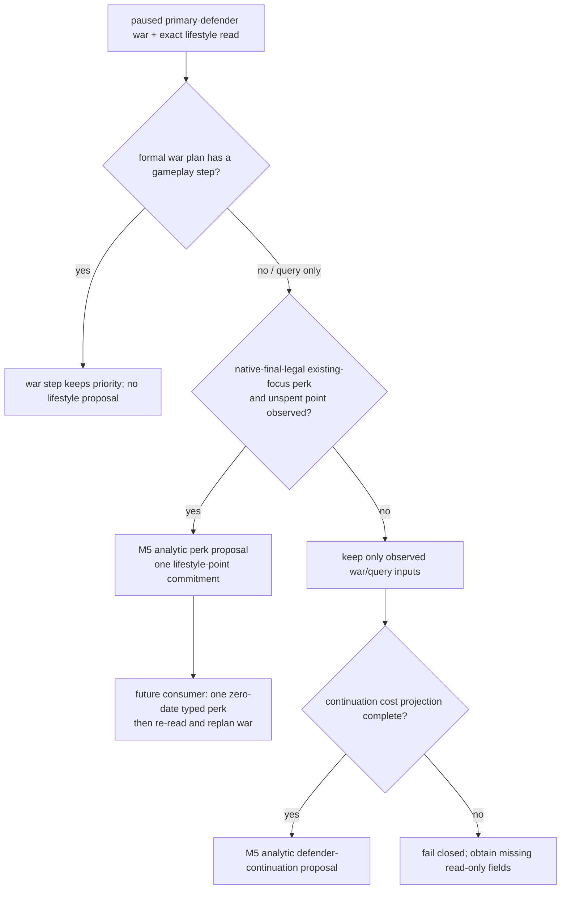

# M5 observed opportunity dispatch (2026-09-23)

Status: **static-ready analytic dispatch; no formal M5 action or live joint
selection**. The exact game remains CK3 `1.19.0.6-steam23530548`, EXE SHA-256
`2D00FF3101EF70B566F2FCBAE292F09263199C80E9DC8F139B82D7D96F83DB86`.
This adds to the earlier [single-frame dispatch](m5-single-frame-dispatch-2026-09-22.md)
without changing public MCP capability or the production turn strategy.

## Why another selector entry exists

The existing `m5_joint_budget_selector` can reserve one candidate and reject
duplicate gold, army, ally, character and commitment claims, but it requires a
caller to supply `benefit_units` and five separate cost-unit values. No live
artifact currently provides a common utility scale for those values. They are
valid fixture inputs and are not an observed production payoff.

`m5_observed_opportunity_selector` accepts only proposals already approved by
their own formal domain policy. It does not compare native stewardship skill,
opinion delta, military power or alliance projections as though they shared a
unit. It filters the proposals using one full paused-frame identity and the
actual shared resources that are already observable:

- current gold plus each proposal's native or formal-policy gold cost and
  reserve;
- active and pending war slots;
- exact controllable army IDs and projected supply margin for war proposals;
- exact ally, character and long-term commitment keys;
- the existing commitment ledger, so two subpolicies cannot reserve the same
  army, ally, character, council seat, building slot or diplomatic promise.

Eligible proposals are ordered by least observed shared commitment: war slot,
army count, ally count, gold, commitment-key count, character count, then
supply margin and stable ID. This ordering is an explicit arbitration policy,
not an inferred native utility. A positive selection remains analytic and
returns no typed step.

`M5FrameDispatcher.choose_observed` is the reusable entry. It shares the same
single-writer reservation as the earlier assessed selector: after it reserves
one proposal, another call in the same paused frame cannot select a second
action. Its reservation records the chosen source policy and the resulting
gold, war-slot and identity claims.

## Existing proposal adapters

| Domain | Existing source consumed | Observed cost/commitment retained | Current boundary |
| --- | --- | --- | --- |
| Council | normalized Council19 steward observation plus `council-composition-steward-v1` action-ready decision | chosen CharacterID, incumbent/candidate stewardship, exclusive steward seat | Static adapter ready; no same-frame multi-domain live artifact |
| Building | `domain_construction_private_transport_v1` `status=selected` query | exact barony/province/building/slot, stock gold cost, formal 20M reserve, permanent slot key | Static adapter ready; typed building path remains independently gated |
| Diplomacy | `faction_gift_formal_candidate_v1` `status=selected` choice | faction/recipient identity, exact gift gold, 10M reserve, opinion delta and unique gift key | Static adapter ready; gift result still needs its own durable receipt |
| War | existing final-legal declaration/entry assessment or active primary-defender plan | entry remains unadmitted; continuation adapter retains an already occupied slot, exact ArmyIDs, projected supply, gold/reserve and stable war commitments | R0178/R0179 lack the same-frame continuation cost projection, so no real proposal is admitted yet |
| Lifestyle | existing private LIFE query plus wartime minimum-policy decision | current focus, one unspent perk point, permanent perk target; zero gold/Army/ally/new-war/date claim | Static adapter ready for query-only/no-step war plans; formal M5 consumer absent |
| First-heir marriage | R0133 final-legal rows and five private alliance projections | none admitted yet | R0133's eight pairs all had `both_have_realm_data=false` and `would_attempt_if_accepted=false`; marriage/betrothal result and long-term alliance commitment remain unobserved |

## B1 production call-path audit

The adapters above are not yet one production proposal stream.  A source-tree
audit on base `29c0a5b9ffbed89600d99c564a191c27a99fb527` found no caller of
`M5FrameDispatcher.choose_observed`; its only source occurrence is the method
definition in `m5_joint_dispatch.py`.  The live planner currently commits to
the first applicable domain before later domains can be compared:

1. `GameplayService.plan_turn` calls `choose_one_life_turn` first.  Council19
   returns its query or assignment step directly from that strategy path.
2. The opt-in private lifestyle consumer runs next.  A step other than
   `life-advance` returns immediately and removes the faction and construction
   planning contexts.
3. The private faction-gift route runs next and can replace `life-advance`
   with its typed step.  The construction consumer runs last and only admits
   work while the selected step is still `life-advance`.

Consequently, individually complete council, diplomacy or building readbacks
do not coexist as domain-approved proposals at the dispatcher boundary.  The
first missing production interface is a default-OFF, query-only M5 collector.
It must bind one paused `snapshot_id`/revision/native revision/date/episode,
read the durable commitment ledger, adapt every already complete domain result
without selecting or submitting a typed step, and pass that proposal list to
the existing dispatcher exactly once.  A later formal consumer may use the
reservation only after live paused-frame validation.  This is an integration
gap in the formal planner/service route; it is not grounds for another
selector or another marriage rejection gate.

R0133's 657 final-legal rows cannot currently enter either dispatcher route.
The observed route accepts only explicit domain-approved proposals, while the
older assessed route requires complete caller-supplied assessments that no
production caller creates.  No R0133 row can therefore displace a ready war or
diplomacy result today.  Marriage remains excluded until one same-frame native
read supplies the material marriage-or-betrothal outcome and lineality, the
resulting alliance pairs with usable realm/ally state, and the alliance's
duration and cancellation cost.  The existing five-row projection and the
657-row count do not supply those fields.

## Default-OFF formal collector

The B1 static call-through now implements the narrow interface identified by
the audit.  `GameplayBridgeService.plan_turn` checks the private driver flag
`allow_private_m5_joint_collector` after creating its ordinary formal plan and
before any private typed lifestyle, faction-gift or construction route.  The
flag is absent/false in normal production, so the ordinary plan and public
capabilities are unchanged.

An enabled candidate must provide exactly one unadvertised, read-only
`query_m5_joint_proposal_sources_private_v1` result for the planning snapshot,
history and revision.  Its `xar.ck3.m5-formal-proposal-sources.v1` payload
contains the full paused-frame identity, current commitment claims, explicit
gold reserve and war-slot budget, plus only the domain sources complete in
that frame.  The collector applies the existing war-continuation, council,
construction, faction-gift and wartime-lifestyle adapters, constructs one
`M5FrameDispatcher`, and calls `choose_observed` once.  The service then
returns `selected_step=null` and `m5_joint_formal_action_ready=false`, even
when the analytic reservation is non-null.

Marriage is not a source-bundle domain.  Adding a `marriage` key is a RED;
the R0133 legality inventory therefore cannot enter through this private
route.  The source reader itself is also deliberately not advertised or
enabled by a general CLI flag.  A later bounded candidate must wire real
same-frame domain queries and commitment persistence into that private reader,
then obtain paused live readback before any formal typed consumer is added.
This static collector does not advance G2-M5 from `not_started`.

R0133 remains read-only evidence: 657 distinct final-legal first-heir rows and
five successful projection reads, with zero observed alliance payoff in the
sample. This selector does not turn that count into a marriage proposal. It
also does not convert the Robert war power ratios into a war proposal because
power alone omits the resource and exit observations above.

## Focused fixture boundary and next live input

The focused fixture builds proposals using the exact field shapes already
returned by the council, construction and faction-gift formal paths. A
zero-gold steward replacement is selected when its seat is free. When the
same-frame commitment ledger already owns that seat, the result changes to the
lower-gold feasible faction gift; a second dispatch call cannot reserve the
building as well. This proves real resource arbitration behavior, but its
numbers and characters are fixtures and are not CK3 live outcomes.

The next read-only run should bracket current council, construction,
faction-gift, declaration/war-entry and first-heir queries with one snapshot
identity and persist the existing commitment ledger in that frame. War joins
only after the private prewar readers publish army/supply/participant/exit
claims; an active defense uses the narrower continuation projection described
below. Marriage joins only after a candidate with an observed material
marriage or betrothal result and alliance commitment is available. Then a
formal consumer must submit exactly one selected typed action, prove an
independent material postcondition, consume the next turn and exercise the
required recovery path. Until those gates pass, G2-M5 remains `not_started`.

## Existing defensive war and wartime perk opportunity

The R0178 durable defensive-war pair and the R0179 same-date perk result add
two real source shapes, but they do not form one selector frame. R0178's
frozen driver has SHA-256
`E01A77CE72C4746875CD255FC82158A692069F7E52FE1A102DB62479492E2549`.
At history 1763 it publishes player capital Province `2619`; history 1766
publishes active defender War `16777231`, player Army `83886367` moving toward
Province `2610`, and enemy Army `50331920` sieging Province `2619`. History
1765 independently reads `2328` player soldiers and `1855` enemy soldiers.
The durable frame is date `53202168`, history 1767.

R0179's frozen report has SHA-256
`A586D30588FF6546731A790DC6DB1ACE1A76F37530E960BE5D780DD99545493B`.
Its private wartime policy consumed one native-final-legal
`cutting_corners_perk`: unspent stewardship points changed `2 -> 1`, used
points changed `4 -> 5`, and the date remained `53202168`. The action receipt
is native frame `native:4`; the following war plan is a termination query and
the ending read is `native:5`. R0178 and those later revisions cannot be
spliced into a synthetic same-frame comparison.

The source-reviewed and live-bounded ordering is:

The selector now has two strict adapters. Neither creates a legal candidate:

- `active_defensive_war_continuation_proposal` requires the existing
  `one-life-turn-v1` plan, the same active primary-defender WarID in plan and
  snapshot, exact controllable player ArmyIDs plus explicit ArmyID-to-WarID
  bindings, explicit
  ally/character claims, measured incremental gold/reserve and a measured
  projected supply margin. It records `war_slot_claim=0`, because the active
  war already occupies its slot, while retaining ArmyIDs and stable
  `active-war:*` commitment keys. A declaration still claims one new slot.
- `wartime_lifestyle_perk_proposal` accepts only the existing private wartime
  policy result. The LIFE snapshot, query source frame and action binding must
  agree on actor, episode, date, snapshot and native/public revision. The
  current focus, unspent/used points, owned perks and the unique final-legal
  target must all be present. It claims one
  `lifestyle-perk-point:<lifestyle>` resource and no gold, Army, ally, war slot
  or game date. If the war planner has a gameplay step, the adapter rejects
  the perk; it admits the R0179-style opportunity only while the plan is
  query-only or has no step.

The focused static fixture proves that an already active defensive war remains
eligible at a one-war limit without claiming a second slot, and that an
observed zero-date perk can be selected before a query-only continuation while
preserving the war's Army and commitment cost in the evaluated rows. It also
proves missing supply is rejected and a move/action-ready war plan suppresses
the lifestyle proposal. Fixture identities and the `250000` supply margin
are synthetic contract inputs; they are not R0178 measurements or live M5
outcomes.

R0178/R0179 still lack the exact same-frame continuation projection required
by the adapter: current treasury/reserve, route-projected supply margin,
complete ally/participant claims and a source-bound incremental gold cost.
The minimum read-only addition is one private projection over the already
published active WarID, player ArmyID/route, exact current supply source and
formal war plan. It must return those fields with the full M5 frame identity;
an unavailable component keeps the proposal absent. Capital siege progress,
route ETA/contact and exit terms remain war-policy inputs rather than M5
utility scores.

Both adapters remain analytic. `M5FrameDispatcher` still returns
`selected_step=None` and `formal_action_ready=false`. A later formal consumer
must persist the selected reservation, submit at most one owning typed action,
verify its independent postcondition, then re-read a new paused revision and
resume the defense before any date advance. Static selection, R0179's private
perk, and candidate counts do not advance G2-M5; it remains `not_started`.
