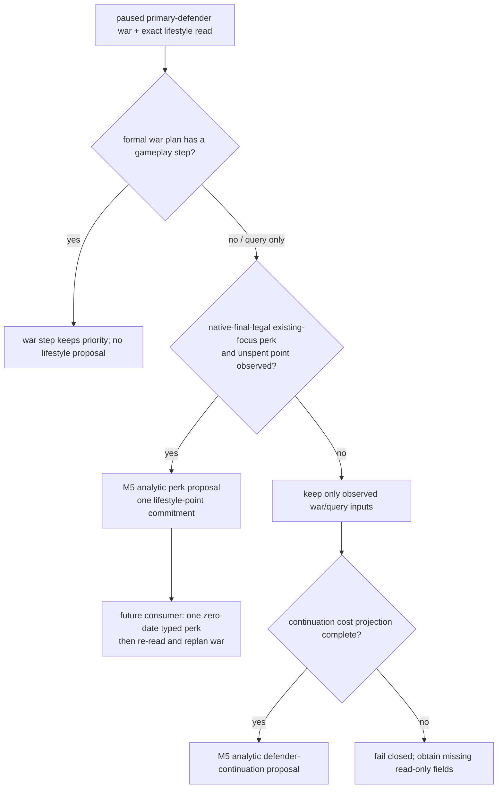
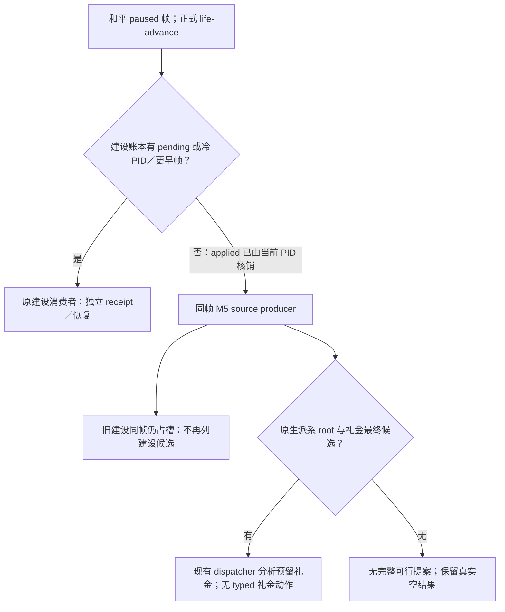
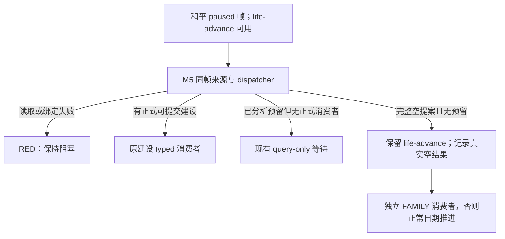

# M5 observed opportunity dispatch (2026-09-23)

Status: **static-ready private construction consumer; no live joint action or
M5 milestone completion**. The exact game remains CK3 `1.19.0.6-steam23530548`, EXE SHA-256
`2D00FF3101EF70B566F2FCBAE292F09263199C80E9DC8F139B82D7D96F83DB86`.
This adds to the earlier [single-frame dispatch](m5-single-frame-dispatch-2026-09-22.md)
without changing public MCP capability or the production turn strategy.

## Why another selector entry exists

The existing `m5_joint_budget_selector` can reserve one candidate and reject
duplicate gold, army, ally, character and commitment claims, but it requires a
caller to supply `benefit_units` and five separate cost-unit values. No live
artifact currently provides a common utility scale for those values. They are
valid fixture inputs and are not an observed production payoff.

`m5_observed_opportunity_selector` accepts only proposals already approved by
their own formal domain policy. It does not compare native stewardship skill,
opinion delta, military power or alliance projections as though they shared a
unit. It filters the proposals using one full paused-frame identity and the
actual shared resources that are already observable:

- current gold plus each proposal's native or formal-policy gold cost and
  reserve;
- active and pending war slots;
- exact controllable army IDs and projected supply margin for war proposals;
- exact ally, character and long-term commitment keys;
- the existing commitment ledger, so two subpolicies cannot reserve the same
  army, ally, character, council seat, building slot or diplomatic promise.

Eligible proposals are ordered by least observed shared commitment: war slot,
army count, ally count, gold, commitment-key count, character count, then
supply margin and stable ID. This ordering is an explicit arbitration policy,
not an inferred native utility. In the bounded peaceful building/gift source,
a building with positive authored monthly-income script value precedes an
unpriced gift; ties retain the shared-cost order. This is not actual character
tax or a cross-domain utility scale. The dispatcher remains analytic and
returns no typed step.

`M5FrameDispatcher.choose_observed` is the reusable entry. It shares the same
single-writer reservation as the earlier assessed selector: after it reserves
one proposal, another call in the same paused frame cannot select a second
action. Its reservation records the chosen source policy and the resulting
gold, war-slot and identity claims.

## Existing proposal adapters

| Domain | Existing source consumed | Observed cost/commitment retained | Current boundary |
| --- | --- | --- | --- |
| Council | normalized Council19 steward observation plus `council-composition-steward-v1` action-ready decision | chosen CharacterID, incumbent/candidate stewardship, exclusive steward seat | Static adapter ready; no same-frame multi-domain live artifact |
| Building | `domain_construction_private_transport_v1` `status=selected` query | exact barony/province/building/slot, stock gold cost, authored monthly income, formal 20M reserve, permanent slot key | Private opt-in typed submit reuses the existing construction receipt path; no live M5 pair |
| Diplomacy | `faction_gift_formal_candidate_v1` `status=selected` choice | faction/recipient identity, exact gift gold, 10M reserve, opinion delta and unique gift key | Static adapter ready; gift result still needs its own durable receipt |
| War | existing final-legal declaration/entry assessment or active primary-defender plan | entry remains unadmitted; continuation adapter retains an already occupied slot, exact ArmyIDs, projected supply, gold/reserve and stable war commitments | R0178/R0179 lack the same-frame continuation cost projection, so no real proposal is admitted yet |
| Lifestyle | existing private LIFE query plus wartime minimum-policy decision | current focus, one unspent perk point, permanent perk target; zero gold/Army/ally/new-war/date claim | Static adapter ready for query-only/no-step war plans; formal M5 consumer absent |
| First-heir marriage | R0133 final-legal rows and five private alliance projections | none admitted yet | R0133's eight pairs all had `both_have_realm_data=false` and `would_attempt_if_accepted=false`; marriage/betrothal result and long-term alliance commitment remain unobserved |

## B1 production call-path audit

The adapters above are not yet one production proposal stream.  A source-tree
audit on base `29c0a5b9ffbed89600d99c564a191c27a99fb527` found no caller of
`M5FrameDispatcher.choose_observed`; its only source occurrence is the method
definition in `m5_joint_dispatch.py`.  The live planner currently commits to
the first applicable domain before later domains can be compared:

1. `GameplayService.plan_turn` calls `choose_one_life_turn` first.  Council19
   returns its query or assignment step directly from that strategy path.
2. The opt-in private lifestyle consumer runs next.  A step other than
   `life-advance` returns immediately and removes the faction and construction
   planning contexts.
3. The private faction-gift route runs next and can replace `life-advance`
   with its typed step.  The construction consumer runs last and only admits
   work while the selected step is still `life-advance`.

Consequently, individually complete council, diplomacy or building readbacks
do not coexist as domain-approved proposals at the dispatcher boundary.  The
first missing production interface is a default-OFF, query-only M5 collector.
It must bind one paused `snapshot_id`/revision/native revision/date/episode,
read the durable commitment ledger, adapt every already complete domain result
without selecting or submitting a typed step, and pass that proposal list to
the existing dispatcher exactly once.  A later formal consumer may use the
reservation only after live paused-frame validation.  This is an integration
gap in the formal planner/service route; it is not grounds for another
selector or another marriage rejection gate.

R0133's 657 final-legal rows cannot currently enter either dispatcher route.
The observed route accepts only explicit domain-approved proposals, while the
older assessed route requires complete caller-supplied assessments that no
production caller creates.  No R0133 row can therefore displace a ready war or
diplomacy result today.  Marriage remains excluded until one same-frame native
read supplies the material marriage-or-betrothal outcome and lineality, the
resulting alliance pairs with usable realm/ally state, and the alliance's
duration and cancellation cost.  The existing five-row projection and the
657-row count do not supply those fields.

## Default-OFF formal collector

The B1 static call-through now implements the narrow interface identified by
the audit.  `GameplayBridgeService.plan_turn` checks the private driver flag
`allow_private_m5_joint_collector` after creating its ordinary formal plan and
before any private typed lifestyle, faction-gift or construction route.  The
flag is absent/false in normal production, so the ordinary plan and public
capabilities are unchanged.

An enabled candidate must provide exactly one unadvertised, read-only
`query_m5_joint_proposal_sources_private_v1` result for the planning snapshot,
history and revision.  Its `xar.ck3.m5-formal-proposal-sources.v1` payload
contains the full paused-frame identity, current commitment claims, explicit
gold reserve and war-slot budget, plus only the domain sources complete in
that frame.  The collector applies the existing war-continuation, council,
construction, faction-gift and wartime-lifestyle adapters, constructs one
`M5FrameDispatcher`, and calls `choose_observed` once.  The service then
returns an analytic reservation. The private formal planner consumes that
reservation only for a selected, positive authored-income building from the
same native query, routing the existing typed construction submit step. Other
selections retain `selected_step=null` and
`m5_joint_formal_action_ready=false`.

The currently bound producer is peacetime-only. If the ordinary formal plan
has already selected any step other than `life-advance`, the collector returns
that plan unchanged and does not call the private producer. This keeps an
existing war, marriage, or other formal strategy ahead of M5 analytics and
prevents a peacetime-source RED from erasing its typed step. With both private
M5 and LIFE flags enabled, the existing LIFE planner runs first; a due focus,
perk or receipt step is preserved, and the peacetime source is not queried.
This is priority preservation, not a same-frame LIFE/building value comparison.

Marriage is not a source-bundle domain.  Adding a `marriage` key is a RED;
the R0133 legality inventory therefore cannot enter through this private
route. The source reader remains unadvertised. The private bounded CLI flag
enables the producer and selected-building consumer; it does not enable a
public M5 capability. The typed branch still needs a frozen paused-frame
action, independent material readback, next turn and cold restore before it
can be called live. This source and no-launch work does not advance G2-M5
from `not_started`.

### 2026-09-26 c7 operator entry gap

Robert c7's [bounded formal report](<Z:/ck3_mod_rewrite_process_assets/g2-robert-nonwar-prewar-r0149-20260926-c7/attempt-01/formal-report.txt>) (SHA-256 `3CF4106636A5B895073C35FFA3E70F196F9655FCCE933C99065136FD35539F3F`) consumed the already applied `hill_farms_01` construction receipt and ran a later completion watch. It did not run an M5 collector. The native auto-run CLI, driver and service already carry the default-OFF `allow_private_m5_joint_collector` route, but the official `g2_preview_operator.py run` previously offered no matching argument or forwarding. The operator now accepts `--private-m5-joint-collector`, sends `--allow-private-m5-joint-collector` to bounded native auto-run only when requested, and records the opt-in in its receipt. This only makes a matching future candidate testable; it does not retroactively add a c7 proposal or prove a joint action.

The c4 paused action showed one native-legal, budgeted `hill_farms_01` at barony 2174/slot 1, 100 gold with authored province monthly-income value +0.35. c5/c7 carried that same slot as `applied/in_progress`, so it cannot be recycled as a second candidate. No second same-frame positive building, valued betrothal or complete five-candidate joint comparison was observed in these reports. A future M5 run must read its own current native proposal frame and preserve the existing construction receipt before considering another slot; pending or unknown future war costs remain unavailable rather than zero.

### 2026-09-26 c8 peacetime scope and family routing

Robert c8's [bounded formal report](<Z:/ck3_mod_rewrite_process_assets/g2-robert-nonwar-prewar-r0149-20260926-c8/attempt-01/formal-report.txt>) (SHA-256 `084BF26A79D84B0E4F1AB398A1EAD76F76DA19E612E8BDA19C9D96B0FE099AF6`) enabled the private M5 collector. After an applied construction receipt requery, the turn-3 paused peace frame advanced to raw date 53155296. War queries followed; turn 8 declared WarID 52 and turn 10 raised troops. Turn 11 had an observed active war and player army, but the service sent its `life-advance` baseline into the peacetime-only M5 producer. The producer's rejection became `M5 private proposal collection RED: M5 peacetime source requires one stable peaceful paused actor frame`. The early M5 return also bypassed the ordinary family consumer, so absence of a c8 family diagnostic is **not** evidence that marriage had no value. This run stopped without a new checkpoint or M5 action.

For this bound source, a `life-advance` baseline with a nonempty observed active-war list or player-army list makes M5 `ineligible_active_war` or `ineligible_player_army` and leaves its formal action readiness false. The service then continues the existing LIFE, construction receipt/watch and family routes. An already selected formal step remains unchanged. A missing or malformed scene observation is not treated as empty and still reaches the M5 source, which may return a real RED. On a peaceful baseline, M5 retains a typed positive-income building if selected. If it has no typed action, the independent family consumer may diagnose or select its own legal valued proposal; a true M5 observation RED keeps the turn blocked even if family diagnoses a potential step. This is a focused source-scope and routing fix, not a same-frame valuation of marriage against construction or evidence of an accepted marriage, completed building or G2-M5 completion. A new exact candidate still needs no-launch pairing and live postconditions.

R0133 remains read-only evidence: 657 distinct final-legal first-heir rows and
five successful projection reads, with zero observed alliance payoff in the
sample. This selector does not turn that count into a marriage proposal. It
also does not convert the Robert war power ratios into a war proposal because
power alone omits the resource and exit observations above.

## Realizable peacetime source producer

The default-OFF `m5_peacetime_proposal_sources_v1` producer is the first real
source implementation for the collector.  It composes exactly two existing
side-effect-free reads on one unchanged paused frame:

1. the private native construction source; and
2. the public same-frame faction root followed, only for a nonempty targeting
   vector, by the private native faction-gift preview.

The producer requires `one-life-turn-v1` to have selected `life-advance`, a
living feudal player with no event or pending interaction, no active wars and
no player armies.  The last two conditions come from the existing production
construction query contract.  Therefore the three-domain war + building +
gift focused fixture is a dispatcher contract test, not a realizable live
frame.  Active-war continuation remains a separate read-only MCP dependency
and cannot be spliced into this producer.

At the reported Robert `h2134` frame, active War `16777231` makes this
peacetime producer inapplicable. The existing construction consumer separately
requires the baseline `life-advance` step and
`same_frame_feudal_peace_scope`; the authored income field does not override
either gate. Future war cash and supply commitments remain unknown in this
comparison. No Robert construction action or joint live benefit follows from
the static nominal-income value.

The 2026-09-26 R0223 replay used the independently frozen Robert R0142
day-zero peace pair and the exact `4592ba0` candidate. The operator completed
eight paused turns and minimized its sole CK3 window. Turn 2 queried
declarable wars; turns 3–5 queried entry assessments; turn 6 started WarID 4;
turn 8 raised ArmyID 18. No construction or marriage consumer ran before that
declaration because both were gated on `selected_step=life-advance`. This is a
real opportunity-evaluation gap, not evidence that a legal, affordable
building or positive marriage existed: R0142 had 246 gold, of which 200 gold
was reserved for construction, and no matching candidate result was read.
The replay's date remained 53144328 and does not add Robert mainline days.
The paused report, operator and minimized-window receipts are in
`Z:\ck3_mod_rewrite_process_assets\g2-robert-nonwar-peace-r0142-20260926-c1`.
The later private pre-declaration consumer route evaluates the existing domain
rules on a same-frame peaceful native declaration query or legal declaration
step, and retains the war plan when neither domain returns an admissible
action. It is separate from the incomplete five-candidate M5 selector; no
joint live benefit or material nonwar action is inferred from R0223.

The separately frozen Robert R0149 peace pair reached R0224 turn 2 on exact
`d070e0b`. The paused bridge had `active_wars=[]`, but the private building
world source returned `status=unavailable`, `failure=construction_state` after
identifying four directly held baronies. Its definition count, native cost and
final legality were unavailable, so no building affordability or income claim
can be made. The normal `life-advance` route preserved that RED by setting
`selected_step=None` before the independent marriage consumer could read its
own legality. The focused service change lets marriage inspect the same frame
while carrying the construction RED. A material marriage or result-read step
may proceed; if marriage has no step, the construction RED remains blocking
and the date does not advance. R0224 itself made no nonwar action and retained
the original checkpoint. The native construction source still needs an
exact-build fix and independent live validation. Evidence is in
`Z:\ck3_mod_rewrite_process_assets\g2-robert-nonwar-prewar-r0149-20260926-c1\attempt-01`.

Before either query, both durable formal ledgers must have no pending action.
After the 2026-09-26 NW-ECON continuation, an applied construction receipt
blocks a new building proposal only until the formal route has consumed it and
the same process reaches a later game day and native revision. A cold process
must recheck the earlier material receipt first. This producer follows those
conditions before it asks for another native candidate; a blocked building
does not suppress an independently ready faction gift. The
producer verifies the full player, native revision, public revision, date,
snapshot and episode binding plus player gold before, between and after the
reads,
then re-reads both ledgers.  Only `selected` domain results are included.
Known-empty faction targeting and a complete no-building result are valid
domain omissions; a missing public root, private route OFF, partial result,
ledger change or frame drift is RED.

The returned commitment set is explicitly empty because both formal pending
ledgers were read as empty.  Current gold is read from the paused snapshot and
must match both native domain observations.  Each proposal retains its own
existing reserve (20M raw construction, 10M raw faction gift); the joint
additional reserve is zero rather than a new invented budget.  The observed
war vector and admitted war-slot budget are both zero.  Neither `war` nor
`marriage` is emitted.

The existing observed selector is the arbitration implementation; this
producer does not add a second selector. A building proposal carries its
permanent `building-slot:<barony>:<slot>` commitment, while a gift carries its
`faction-gift:<faction>:<recipient>` commitment. The dispatcher compares the
two observed gold costs under their domain reserves and the zero-war budget,
then favors a positive authored-income building over an unpriced gift when
both are eligible. It persists only the selected proposal's claims in its
one-frame analytic
reservation. Its single-writer guard prevents a second choice in that frame.

`native-auto-run --allow-private-m5-joint-collector` remains default OFF. With
it present, the producer compares the two same-frame candidates once. The
formal planner routes an observed positive-income selected building through
the existing construction submit/checkpoint/receipt path. Before another
selection, an unresolved construction ledger is handed to that path for
receipt or cold recheck. The analytic reservation claims only the selected
building's gold and slot once; the durable construction ledger owns the
subsequent action state. These are source and focused-test claims only: no
joint live action, next-turn result or cold restore was produced here.

### 2026-09-26 NW-JOINT source continuation

At baseline `c0c7c52`, the formal construction path could reassess a later
legal building, but this peacetime M5 producer still omitted every building
after the first `applied` receipt in an episode. The source fix admits a later
same-frame, native-budgeted building again after the verified receipt and a
later game day; the focused fixture includes an independent faction-empty
frame and observes the existing dispatcher select the building. This removes
one proposal omission in the opt-in analytic path. At that source-only commit,
material income remained unavailable. The later NW-ECON-VALUE change on
master `8beded9` supplies positive authored monthly income for selected
tier-one economic buildings; the bounded typed branch above consumes it.
Construction time, realized income and live M5 postcondition/recovery remain
unproved.

## Focused fixture boundary and next live input

The focused fixture builds proposals using the exact field shapes already
returned by the council, construction and faction-gift formal paths. A
zero-gold steward replacement is selected when its seat is free. When the
same-frame commitment ledger already owns that seat, the result changes to the
lower-gold feasible faction gift; a second dispatch call cannot reserve the
building as well. This proves real resource arbitration behavior, but its
numbers and characters are fixtures and are not CK3 live outcomes.

The next read-only run should bracket current council, construction,
faction-gift, declaration/war-entry and first-heir queries with one snapshot
identity and persist the existing commitment ledger in that frame. War joins
only after the private prewar readers publish army/supply/participant/exit
claims; an active defense uses the narrower continuation projection described
below. Marriage joins only after a candidate with an observed material
marriage or betrothal result and alliance commitment is available. Then a
formal consumer must submit exactly one selected typed action, prove an
independent material postcondition, consume the next turn and exercise the
required recovery path. Until those gates pass, G2-M5 remains `not_started`.

## Existing defensive war and wartime perk opportunity

The R0178 durable defensive-war pair and the R0179 same-date perk result add
two real source shapes, but they do not form one selector frame. R0178's
frozen driver has SHA-256
`E01A77CE72C4746875CD255FC82158A692069F7E52FE1A102DB62479492E2549`.
At history 1763 it publishes player capital Province `2619`; history 1766
publishes active defender War `16777231`, player Army `83886367` moving toward
Province `2610`, and enemy Army `50331920` sieging Province `2619`. History
1765 independently reads `2328` player soldiers and `1855` enemy soldiers.
The durable frame is date `53202168`, history 1767.

R0179's frozen report has SHA-256
`A586D30588FF6546731A790DC6DB1ACE1A76F37530E960BE5D780DD99545493B`.
Its private wartime policy consumed one native-final-legal
`cutting_corners_perk`: unspent stewardship points changed `2 -> 1`, used
points changed `4 -> 5`, and the date remained `53202168`. The action receipt
is native frame `native:4`; the following war plan is a termination query and
the ending read is `native:5`. R0178 and those later revisions cannot be
spliced into a synthetic same-frame comparison.

The source-reviewed and live-bounded ordering is:

The selector now has two strict adapters. Neither creates a legal candidate:

- `active_defensive_war_continuation_proposal` requires the existing
  `one-life-turn-v1` plan, the same active primary-defender WarID in plan and
  snapshot, exact controllable player ArmyIDs plus explicit ArmyID-to-WarID
  bindings, explicit
  ally/character claims, measured incremental gold/reserve and a measured
  projected supply margin. It records `war_slot_claim=0`, because the active
  war already occupies its slot, while retaining ArmyIDs and stable
  `active-war:*` commitment keys. A declaration still claims one new slot.
- `wartime_lifestyle_perk_proposal` accepts only the existing private wartime
  policy result. The LIFE snapshot, query source frame and action binding must
  agree on actor, episode, date, snapshot and native/public revision. The
  current focus, unspent/used points, owned perks and the unique final-legal
  target must all be present. It claims one
  `lifestyle-perk-point:<lifestyle>` resource and no gold, Army, ally, war slot
  or game date. If the war planner has a gameplay step, the adapter rejects
  the perk; it admits the R0179-style opportunity only while the plan is
  query-only or has no step.

The focused static fixture proves that an already active defensive war remains
eligible at a one-war limit without claiming a second slot, and that an
observed zero-date perk can be selected before a query-only continuation while
preserving the war's Army and commitment cost in the evaluated rows. It also
proves missing supply is rejected and a move/action-ready war plan suppresses
the lifestyle proposal. Fixture identities and the `250000` supply margin
are synthetic contract inputs; they are not R0178 measurements or live M5
outcomes.

R0178/R0179 still lack the exact same-frame continuation projection required
by the adapter: current treasury/reserve, route-projected supply margin,
complete ally/participant claims and a source-bound incremental gold cost.
The minimum read-only addition is one private projection over the already
published active WarID, player ArmyID/route, exact current supply source and
formal war plan. It must return those fields with the full M5 frame identity;
an unavailable component keeps the proposal absent. Capital siege progress,
route ETA/contact and exit terms remain war-policy inputs rather than M5
utility scores.

Both adapters remain analytic. `M5FrameDispatcher` still returns
`selected_step=None` and `formal_action_ready=false`. A later formal consumer
must persist the selected reservation, submit at most one owning typed action,
verify its independent postcondition, then re-read a new paused revision and
resume the defense before any date advance. Static selection, R0179's private
perk, and candidate counts do not advance G2-M5; it remains `not_started`.

### 2026-09-26 c12 attempt-03：M5 opt-in 已开，但来源帧未出现

c10 四 turn 与 c12 attempt-01/02 的 operator receipt 均显示 `private_m5_joint_collector=false`；原报告没有 `m5_joint_*` 不能解释为候选零。c12 attempt-03 在同一冻结源码 `bb5e4aa` / DLL SHA `7A14A216...3A65ED36` 上，官方以 h137 save/driver 通过 no-launch 后显式启用 `--private-m5-joint-collector`，operator receipt 确认 `true`。唯一 PID104656（创建 `20260926132245.837999+000`）受管窗口最小化，8/8 turn `turn_limit/qualified`，进程树清理。派生 raw53155488→53155728、h148 checkpoint SHA `63D918053CD3DE7B9E8348F1C766759A6FE22EECF9B571E9C82386951F8150E5`；[正式报告](Z:/ck3_mod_rewrite_process_assets/g2-robert-nonwar-prewar-r0149-20260926-c12/attempt-03/formal-report.txt) SHA `8F1D185752548D71C4F2C2AD32B19E79A54CF9DD942C61F923F4545FB6AA2ACA`。

第1–3 turn 依次冷读 root、旧建设 `applied/in_progress`、既成双边订婚；第4 turn 是和平 `life-advance`，但同日期旧建设 applied 账本仍需由原 consumer 核销，`plan_m5_formal_query_only` 按源码短路给建设消费者，该 turn 没有调用 M5 proposal source reader。第5/6 turn 是实际事件只读/有界选项，第7 turn 重读施工仍未完工，第8 turn 是 declarable-war 查询。因此虽开启 opt-in，本次仍未取得同帧 M5 source、候选比较、selected_step 或正式 joint 动作；不能把字段缺席写成零、false 或 RED。当前 source producer 仅接和平建设与派系礼金，既成订婚不会自动作为 M5 proposal。后续须在同 PID 已核销旧账本的和平 `life-advance` 帧观测源，再依据真实字段判断接线/价值缺口；不为填库存反复重启。h148 save/driver/两账本和报告已逐项哈希复制到 c12 `recovery-pair-h148`，新候选仍须官方 prepare/rebind/no-launch。

### 2026-09-26 NW-JOINT-C13：已核销建设的同帧来源短路

复查 c12 不可变 `driver-state.json` 的第 4 turn 前公共 root：native revision `3`、raw date `53155488`、`player_targeting_faction_count=0`。第 2 turn 已在同一 PID 独立重读建设 `applied/in_progress`，账本的 `post_bridge_pid=104656`、`post_native_revision=3`、`post_date_raw=53155488`。因此第 4 turn **没有已证明可提交的礼金或第二项建设**；本修复不把它改写成漏动作。

源码复现显示另一条可行动来源路径被过宽的 `<=` 挡住：建设 applied 已由当前 PID 核销且仍处于该 paused frame 时，`plan_m5_formal_query_only` 继续返回建设消费者，根本不到达现有 source producer。producer 本来就会把同帧旧建设标为 `prior_receipt_not_released`，只排除重复建设，并独立读取当前合法派系礼金。单帧生产路径测试在修复前失败（`plan_construction_private` 被调用一次，source reader 零次）；把已核销账本的同帧比较改为严格早于 `<` 后，测试通过，派系礼金进入既有 dispatcher 的 analytic reservation。测试使用合法字段 fixture；**c12 实机 root 的派系数为零，尚无新 live joint 动作**。

此改动只恢复来源评估；`selected_step` 仍为 `null`、`formal_action_ready=false`，礼金仍需自身正式消费者、独立后置、下一 turn 与恢复。没有扩大 M5 里程碑或公共广告。

### 2026-09-26 R0232：空提案误拦正常推进

c19 冻结源码/master `9e305a25aa2d815a2218b4a5fa8a6daeeafdd7d4`、CK3 1.19.0.6 exact EXE、DLL SHA-256 `E1C8EBA0DC631F134C2A6E9157ED298166AFDF7EBBB190F461794A58AFB6D514`，从 h148/raw53155728 官方配对及 no-launch 启动唯一 PID29596。8-turn 有界运行的前 3 turn 依次核 root、旧建设 `applied/in_progress`、既成双边订婚；第 4 turn 首次进入 `m5_joint_query_only_observed`。同一 paused revision 3 的 collector 返回 `no_complete_feasible_proposal`、`collected_domains=[]`、`evaluated=[]`、`formal_action_ready=false`。报告 SHA-256 `588806669FCCD6DFFEC86B77652E5B75DFB8B6FD6A9C458BB6933EF084A31CE5`、operator receipt SHA-256 `705CC12E5039CE6752A71BA50A3CE3F6B4050DD31C23BF914ECEA928717D6ECA`；四 turn 日期均 raw53155728，无 typed 动作或日期推进，checkpoint SHA 未变，进程树回收。失败回执没有窗口终态字段，故不外推最小化验收。正式结果是 planner RED，非 M5 动作成功。

源码路径表明空提案是完整的真实空结果：source schema、同帧身份、commitments 与预算已通过，dispatcher 没有预留；`plan_m5_formal_query_only` 却把可执行的和平 `life-advance` 改成 `selected_step=None`，随后 `GameplayBridgeService` 的家庭消费者仍保留这个 null，令 `native_auto_run` 以 `compare complete same-frame proposals without submitting an action` 停止。这是实际漏推进，不是缺少候选数量。仅空且无预留的结果应保留原 `life-advance` 并附 M5 诊断；来源读失败继续 RED，已预留但尚无正式消费者的提案继续按现有边界处理，不伪造联合动作。

### 2026-09-26 R0233：空提案后正式日期推进

#295 仅在完整 `no_complete_feasible_proposal`、无预留时保留既有 `life-advance` 和空结果诊断，normal/`-O` 聚焦各 13/13；PR 检查及 exact master `2700802d2e31ae28449ec8e9dd106f06a7597a6d` 官方 CI `36253284868` 成功，交付文件 blob 一致，临时远端/本地分支和源码 worktree 已清理。来源读取 RED 与已预留但无正式消费者的路径保持原边界。

c20 独立候选 DLL SHA-256 `2B81CF7E81EB7DB28C4D8F8361F5C9A510266374FF1C81E22AE3E5A0A4E61AD3` 从原 h148 save/driver/建设/家庭账本通过官方 ordinary `xar_off` rebind/no-launch。R0233 唯一 PID174384 的 8/8 有界正式运行，turn 1–3 核 root/建设 applied/双边订婚；turn 4 在 `m5_joint_empty_proposals` 保留真实 `no_complete_feasible_proposal`、`formal_action_ready=false` 后实际执行 `life-advance`，游戏日期 raw53155728→53156568；turn 5 重新消费施工 watch，仍 `in_progress`、月收入读数 raw606918、未观测完工收益；turn 6–8 为正式战争入口查询，没有新 M5/建设/婚配 typed 提交。[正式报告](Z:/ck3_mod_rewrite_process_assets/g2-robert-joint-econ-c20-20260926/attempt-01/formal-report.txt) SHA-256 `75BE30DE9A8A2F55CA21A66A88FA7C00D8AE6D295A7B5E8809025BCE0F0C0784`，[operator 回执](Z:/ck3_mod_rewrite_process_assets/g2-robert-joint-econ-c20-20260926/attempt-01/operator-receipt.json) SHA-256 `D756F83D18D6FE8396B094D4DB76AB17DC320A79907D163257F25407587797FE`；`turn_limit`、date_advanced=true、终局 h159 checkpoint SHA `0E4236834EBDC752AAB74ACE62FDEF1CD4CC74412EA7FE041BCD92A4358E72B3`，进程树清理。operator `completed` 且分配器 R0233 completed-green。失败/成功回执均未提供窗口终态字段，本节不声称该项实测通过。

h159 save/driver/两账本及报告已单独哈希保留为 `g2-robert-joint-econ-c20-20260926/recovery-pair-h159`，原始 h148 未改。后续仍需新 PID、官方配对/no-launch 与下一 paused 帧消费证明冷恢复；R0233 只证明空场景正常推进、下一 turn 和持久 checkpoint，不提升 M5 五候选或建设完工收益结论。