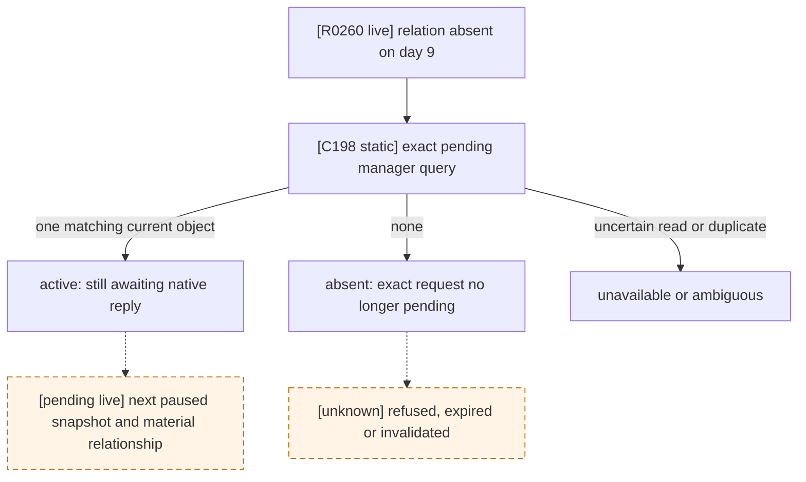
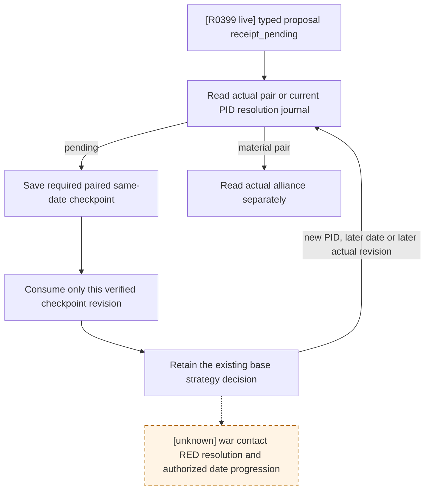

# C198: outgoing marriage proposal after a cold restore

The R0259 Robert run submitted one typed `arrange_marriage_interaction`
proposal for heir 38822 and candidate 38718. R0260 resumed the paired save in
a new PID and read no bilateral betrothal or marriage through proposal day 9.
Its four cold queries called the outcome `pending`, because the old reader had
only the relationship and the preceding PID's resolution journal had been
lost. R0260 did not send another proposal. These observations do not establish
whether the recipient is still deciding or whether the proposal ended without
a relationship.

## Exact-build source and reader

- CK3 `1.19.0.6`, EXE SHA-256
  `2D00FF3101EF70B566F2FCBAE292F09263199C80E9DC8F139B82D7D96F83DB86`.
- `_character_interactions.info`, SHA-256
  `F360C05B72CD2B0D87885E570FA55E70E41089DEFB4675BE5A82E390940D5D10`,
  declares generic AI reply range 4–9 days. It does not prove the exact
  scheduling or final answer for this proposal.
- The existing [pending interaction ABI](events-and-interactions.md) fixes
  manager slot `0x57BF1C8`, object vtable `0x431C550`, full signed component
  ID at `+0x10`, frozen context at `+0x18`, five roles at
  `+0x2F0..+0x300`, marriage special payload at `+0x348`, age/cutoff at
  `+0x5B8/+0x5BC`, and responder route at `+0x5C0`. The canonical marriage
  definition comes from interaction database `+0xF48`.
- C198's private paused application-main query now scans that exact component
  storage for **one** object with the same definition, actor, recipient,
  heir, candidate and no intermediary. It compares full IDs to slot indexes,
  calls the exact component-alive leaf `0x10495A0` on the pending `+0x08`
  subobject, verifies the marriage special vtable, then returns `active`, `absent`,
  `ambiguous` or `unavailable`. `active` also returns the signed full ID and
  raw age/cutoff. These are observations of the current PID only.
- The proposal's recipient is taken from its persisted final-legal row. The
  caller still checks the paused revision, date, player and first heir;
  native code checks the snapshot again after scanning. The public marriage
  API and advertised capability remain unchanged.

`active` proves the exact outgoing request still exists in the current
manager. `absent` means the exact request was not in that manager at the
paused snapshot; it does **not** distinguish refusal, expiry, invalidation
or another terminal route. The material `marriage` or `betrothal` result
still requires bilateral relationship readback. C198 keeps the existing
`status=pending` ledger on absent relation so it cannot resubmit based on a
guessed refusal. A refusal may fire `marriage_interaction.0011` and set the
heir's five-year `player_declined_marriage` flag, but that flag alone carries
no candidate/recipient identity and cannot prove this request's outcome.

This is a static and fixture-tested reader until a new exact DLL/paired
candidate reads R0260's latest Robert checkpoint in CK3. Neither C198 nor
the previous cold queries prove acceptance, refusal, betrothal or alliance.

Focused verification on the C198 source: Python family/runner transport tests
pass 167/167 in normal and `-O` mode; Release native bridge compilation and
the journal/observed-heir CTests pass 2/2. The exact EXE verifier checks the
pending constructor, response transition, daily age function and component
alive leaf. A broad native CTest run in this isolated source worktree had
16 unrelated source-contract failures because its default `Crusader Kings III`
path is absent there; its focused marriage tests passed. The live result gate
remains open.

## R0261 matched live result (2026-09-27)

The C202 candidate used source commit `585f2aea984faa0638980d208ba75b08ed75126c`,
Release DLL SHA-256 `C279C0F5D512AFBAB579ED8EE08BA5FA65475DA8CDB8C633FFF4BEED2F80CA70`,
and the official ordinary `xar_off` prepare/rebind/no-launch pair from the
R0260 Robert h2543/raw53216856 save, driver and family sidecar. Its
[candidate index](Z:/c202-prisoner-h2543-final-preview/master585/C202-CANDIDATE-INDEX.json)
has SHA-256 `C777485266E60E94C062D9E6039E14DDC961D9F776F7FDE9DDDAE060881CB910`.

R0261's first paused marriage query, at raw53216856, found **one active exact
outbound proposal** for heir 38822/candidate 38718/recipient 32897: signed
component ID `-738197504`, age 9 days and native AI reply cutoff 10 days.
This is a live proof of C198's `active` branch in the current PID, not a new
submission. After one normal date advance to raw53216880, the next relationship
query returned `betrothal` for heir 38822/candidate 38718. A separate next-turn
alliance query returned `relationship_status=betrothal`,
`played_has_recipient_alliance=false`, `recipient_has_played_alliance=false`,
`alliance_status=not_allied`. The subsequent turn consumed the material family
result and cleared `pending`; the final family sidecar has
`resolved.status=betrothal`, `material_result=true`, `cold_recovery=true`.
No second typed proposal was sent. This closes the **specific R0259 proposal's
material betrothal and paired cold-recovery path**, not adult marriage, alliance
formation, all candidate outcomes or the full M4/M5 contracts.

The [R0261 formal report](Z:/c202-prisoner-h2543-final-preview/master585/run-formal-16/formal-report.txt)
has SHA-256 `E39AEE7ED9B8FF025C993DC56D416C90E3170E801E1C687B42799001BA4025A6`;
the [resolved family sidecar](Z:/c202-prisoner-h2543-final-preview/master585/state/first-heir-marriage-formal-v1.json)
has SHA-256 `05B3E78CF70B7C984CBED7AE5D4A184B7149DC7B32BAB6E2A1EF3335F5AA6B0A`.
The bounded run completed 16/16 qualified turns in new PID26168, saved
h2577/raw53216880, and cleaned up its CK3 process tree. Its observed `active`
branch is one exact-build positive; `absent`, `ambiguous` and `unavailable`
remain bounded by the source/fixture contract above, without new live examples.

The original h2577 save, driver, resolved family sidecar and run evidence were
copied byte-for-byte into the [R0261 source-pair index](Z:/r0261-h2577-family-betrothal-freeze-20260927/PAIR-IDENTITY.json),
SHA-256 `1F074A14B003A1D7F1D47E1C7A6BC236D88B42047B330B33891BDF7A7A93D232`.
The official resolved-family sidecar validator passed on those copied bytes.
Full prepare/rebind/no-launch for the **next** candidate remains pending; this
source-pair check does not qualify a new runtime or PID.

## R0399: pending readback must consume its paired checkpoint (2026-09-30)

R0399 used source `ed2c916a91cc62ef3e0e306f8b295b135c59b60c` and DLL
`DB0D16062137CD5A1929FA24C9D9BBEE51147C7F2379D7FFAA948EE3F5B15C3B`
on the same CK3 `1.19.0.6` / EXE hash above. It submitted the private default
proposal for split successor Guy 38988, candidate 37909 and recipient 34332.
The typed receipt remained `receipt_pending`; no material relationship,
alliance or date advance was observed. Its formal report at
`D:/ck3-nw-family-guy-h3911-c3-20260930/operator-runs/guy-h3911-c3-formal-1/formal-report.txt`
has SHA-256 `FD9B3094993E3C247F0D5FAB3D199EAF0E5328C3540F316165C4482ED8A716B6`.

The production caller has a reproducible scheduling defect. Turn 7 read
`pending` at native revision 4 and stored `last_checked_native_revision=4`.
Its required same-date checkpoint then published native revision 5. Turn 8
treated `5 > 4` as a fresh result opportunity, read `pending` again, and its
checkpoint published revision 6. Both reads remained at raw53219928. The
final pending ledger retains last checked revision 5 while the paired driver
is at revision 6 / history 3931. Its SHA-256 is
`B41318E9B3B6839B0BD20F990CE93F0BD338E41D5C5BD6A84E45885AC422B5E8`.
That save-only revision increment can repeatedly replace the base war query
or an otherwise authorized `life-advance`; it is not evidence of a new native
answer. The underlying war contact expected-utility RED remains a separate
dependency and must still govern any date advancement.

The existing native reader's hot path reads bilateral relationship and the
current PID's resolution journal. Its outbound age/cutoff projection is
cold-only; a hot `outbound_pending_state=null` does not prove refusal. The
daily age function and generic AI reply range above explain why same-date
pending reads do not by themselves obtain the scheduled answer.

The bounded Python repair records the consumed checkpoint revision separately
from the actual result-read revision. It does not submit another proposal,
invent acceptance or authorize time through war RED. A new PID still reads
first; a later date or native revision still triggers a result read. This
section records the observed defect and repair boundary before policy edits;
the repaired path requires focused production-path verification and a new
matched live candidate before claiming live closure. `open_kaishek` precheck
is not applicable: this is Python scheduling around a native checkpoint,
without a script parser, finite-runtime or vanilla effect semantic change.

Focused Python verification of this repair passes 14/14 in normal mode and
14/14 in `-O`: the formal result branch materializes its required checkpoint,
consumes its actual revision, retains the prior war RED or LIFE step on that
same paused frame, and leaves the marker absent after a failed checkpoint.
The consumer tests retain later-revision, later-date, cold-PID and material
relationship reads without resubmission. These are deterministic production
path checks; no CK3 was launched for this patch and they do not prove Guy's
proposal was accepted.
