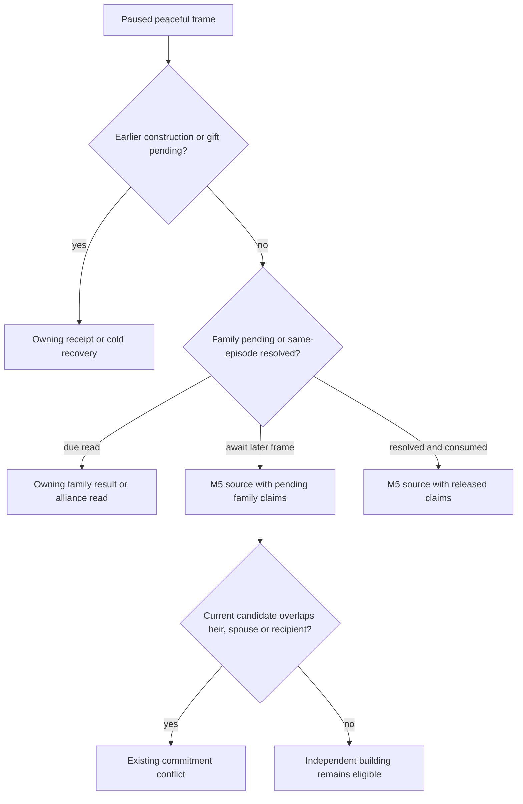

# M5 pending family claims and receipt priority (2026-09-27 C79)

Scope: private M5 peacetime source and formal collector on CK3 1.19.0.6.
The native construction, gift and marriage decision trees and action contracts
are unchanged. This note covers their existing formal ledgers and the shared
M5 resource comparison; it does not assert a new CK3 outcome.

## Production-path gap

When the family ledger held an unresolved first-heir proposal, the M5 source
correctly omitted a second marriage proposal, but published all-zero
`existing_commitments`. A same-frame faction gift to that proposal's recipient
could therefore be marked eligible by the selector. The service also tried
M5 before its independent family consumer: a selected positive-income
building returned a typed step before a due marriage result or cold readback.

Two deterministic tests exercised these real service/producer paths before
the repair. They failed with `character_ids=[]` for the pending proposal and
with the family result planner called zero times while a building was ready.
The test gift and building rows are fixture inputs. The Robert R0240 evidence
has an actual marriage pending/result sequence and a building action, but no
gift-positive targeting frame or five complete joint candidates; C79 makes
no claim that the overlapping gift occurred in CK3.

## Current routing and claim lifetime

The M5 collector asks the existing family consumer first when the family
ledger is pending or has a same-episode resolution needing readback. A due
result step takes that turn. If the family consumer is waiting for a later
paused frame, the M5 producer takes the exact actor, episode, heir, candidate
and recipient from the pending ledger and reserves those character IDs, the
heir marriage key and the recipient's provisional ally slot. The ally claim is
a temporary commitment, **not** evidence of an established alliance or its
value. It prevents overlapping allocation until the material result is
classified. Independent building resources remain available. Once the
ledger's pending entry is cleared, those pending claims are released; any
necessary resolved-state cold or alliance read still precedes a new M5
action.

Focused tests cover the initial conflict, due family read priority,
non-conflicting building, and claim release after a resolved ledger. They are
source/fixture verification only. A real overlapping scene still needs the
matching frozen candidate, formal typed action, independent material
postcondition, next turn and paired recovery. M5's five-real-candidate
milestone remains unmet.
