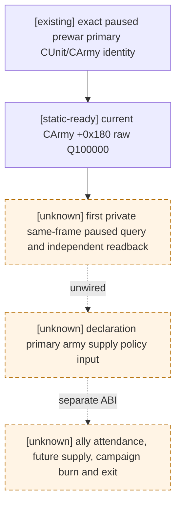

# M5 current primary raised-army supply source

CK3 exact build `1.19.0.6`, `ck3.exe` SHA-256
`2D00FF3101EF70B566F2FCBAE292F09263199C80E9DC8F139B82D7D96F83DB86`.
The stock combat supply selector `0x23049E0` reads each `CArmy+0x180`
signed Q100000 supply operand. The existing [combat input tree](combat-simulation-inputs.md)
and `combat_v3.cpp` already pin that leaf and its loaded threshold selection;
the combined-defensive paused combat artifact validates the selector's supply
categories. That combat evidence does not prove an unobserved R736 army's value.

The new independent `m5_primary_army_supply_v1` source consumes only an
`available_primary_scope` result from the existing [prewar tree](prewar-encounter-inputs.md).
It binds each currently raised primary public full-generation `CUnitID` to its
internal full-generation `CArmyID` and `CArmy+0x124` backlink, then reads
`CArmy+0x180` twice on the same paused native revision. A raw `0` is an
observed zero. No raised primary army yields an available empty current list;
it does not forecast supply after raising or movement. Identity, paused or
two-sample drift failure is `unavailable`, never a guessed normal supply.
The exact offsets and limits are in
`research/m5_primary_army_supply_1_19_0_6_abi.json`.

R736's real read-only same-frame legal observations remain 30 war rows and 657
first-heir family rows; `state_snapshot` armies and supply were not retained.
This source package is **static-ready and unwired**. It does not select a war,
claim M5, register or advertise an MCP capability, or change the frozen preview
bundle. The next production read should retain one `state_snapshot` with
treasury/active wars/player armies and bind this module to one legal declaration
on the same native revision. Voluntary allies, objective-route supply,
campaign cost/exit and first-heir marriage commitment need separate exact-build
observations before cross-domain scoring can submit one action.
