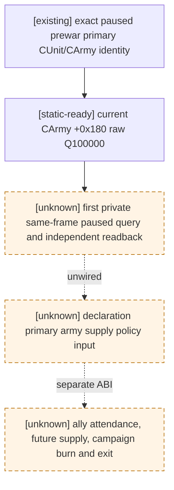
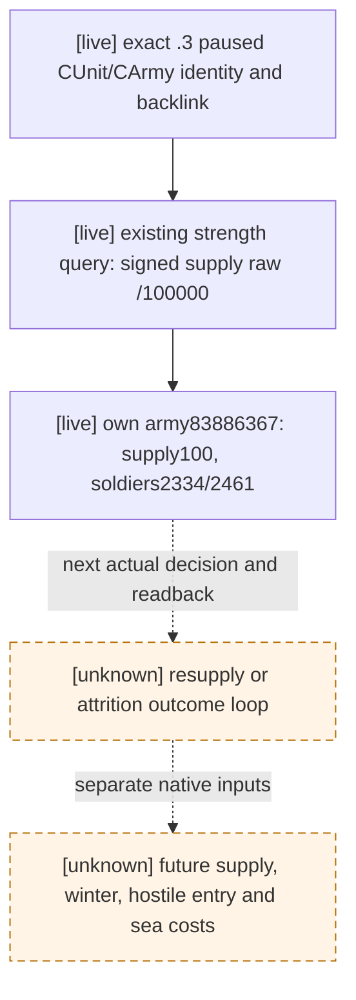

# M5 current primary raised-army supply source

CK3 exact build `1.19.0.6`, `ck3.exe` SHA-256
`2D00FF3101EF70B566F2FCBAE292F09263199C80E9DC8F139B82D7D96F83DB86`.
The stock combat supply selector `0x23049E0` reads each `CArmy+0x180`
signed Q100000 supply operand. The existing [combat input tree](combat-simulation-inputs.md)
and `combat_v3.cpp` already pin that leaf and its loaded threshold selection;
the combined-defensive paused combat artifact validates the selector's supply
categories. That combat evidence does not prove an unobserved R736 army's value.

The new independent `m5_primary_army_supply_v1` source consumes only an
`available_primary_scope` result from the existing [prewar tree](prewar-encounter-inputs.md).
It binds each currently raised primary public full-generation `CUnitID` to its
internal full-generation `CArmyID` and `CArmy+0x124` backlink, then reads
`CArmy+0x180` twice on the same paused native revision. A raw `0` is an
observed zero. No raised primary army yields an available empty current list;
it does not forecast supply after raising or movement. Identity, paused or
two-sample drift failure is `unavailable`, never a guessed normal supply.
The exact offsets and limits are in
`research/m5_primary_army_supply_1_19_0_6_abi.json`.

```mermaid
flowchart TD
  A["[existing] exact paused prewar primary CUnit/CArmy identity"] --> B["[static-ready] current CArmy +0x180 raw Q100000"]
  B --> C["[unknown] first private same-frame paused query and independent readback"]
  C -. "unwired" .-> D["[unknown] declaration primary army supply policy input"]
  D -. "separate ABI" .-> E["[unknown] ally attendance, future supply, campaign burn and exit"]
  classDef unknown stroke-dasharray:6 4,fill:#fff4e5,stroke:#b36b00;
  class C,D,E unknown;
```

R736's real read-only same-frame legal observations remain 30 war rows and 657
first-heir family rows; `state_snapshot` armies and supply were not retained.
This source package is **static-ready and unwired**. It does not select a war,
claim M5, register or advertise an MCP capability, or change the frozen preview
bundle. The next production read should retain one `state_snapshot` with
treasury/active wars/player armies and bind this module to one legal declaration
on the same native revision. Voluntary allies, objective-route supply,
campaign cost/exit and first-heir marriage commitment need separate exact-build
observations before cross-domain scoring can submit one action.

## 2026-10-03 exact .3 existing army-strength query: production observation

The older `1.19.0.6` M5 module above remains its historical static-ready, unwired
package. This increment uses the separately adopted **existing**
`ck3_query_army_strengths` path on CK3 **1.20.0.3 / Steam build25652598**,
EXE SHA-256 `94B55397ABB687A3DCD436805A5D885E6BE90FA6C693FEB44A9E3BBEEADE02A6`. Source/compile commit is `6b0e6bdfa6b18396394ce8f12301e464825f1f46`;
bridge DLL SHA-256 is `bdb08f2e6cc7bc5afd4d65119e8d19ca5cf19fba50c1e356eb8fa892c1702c16`.
The exact .3 selector operand `0x2587254` is signed64 `CArmy+0x180`, scale100000;
the strength reader retains the actual public CUnit-to-CArmy backlink before
publishing the additive raw/scale fields. No old M5 capability or runtime flag
was enabled to obtain these values.

Root's ordinary Robert29829 paused capture is
`Z:/ck3_mod_rewrite_process_assets/g2-resume-20261003/runtime-preparation/v36-retry-02/actual-new-leaves-v36-01/026-ck3_query_army_strengths.json`
(SHA-256 `e5bcfc7b7c319e109590d4e00a281bc83920e02ebf98b40d9d62edc146829c0d`). It binds PID90596, connection generation2,
snapshot `native:2`, public/native revision2, date_raw53236728 and episode
`native-29829-2bc2d599f7f9`. All eight requested rows are available and carry
the additive numeric fields. The leaf's inline `source.game_version` and
`source.executable_sha256` are null; exact-build identity comes from the same
session's successful hello/diagnostics and the frozen runtime packet, rather
than attributing nonexistent pins to those null fields.

| Public CUnitID | Native CArmyID | Scope | Current/max soldiers | Supply raw /100000 | Exact supply units |
|---|---|---|---|---|---|
| 83886367 | 50331794 | player | 2334/2461 | 10000000 | 100 |
| 50331920 | 33554713 | active_war_enemy | 1343/1899 | 9100002 | 91.00002 |
| 83886484 | 150995083 | active_war_enemy | 300/311 | 11700000 | 117 |
| 67109295 | 67109272 | active_war_enemy | 101/101 | 11500000 | 115 |
| 251658381 | 167772260 | active_war_enemy | 2863/2880 | 10000000 | 100 |
| 473 | 461 | active_war_enemy | 300/300 | 10000000 | 100 |
| 474 | 462 | active_war_enemy | 10/10 | 10000000 | 100 |
| 16777683 | 457 | active_war_enemy | 2436/2436 | 10000000 | 100 |

The player's current decision input is **100 supply**, with **2334/2461 soldiers**
and **40 regiments**. Both enemy values above100 are retained as read; the
consumer does not clamp them to100. These values can feed the next actual
route, resupply or siege decision alongside its current contact/route inputs.
They are current observations, not a future supply budget, attrition forecast,
reinforcement arrival, or battle probability. Enemy groups on different war
fronts must not be summed into a claimed local battle comparison.

All eight supply operands are positive in this frame. Legal zero and negative
preservation, explicit-null handling and absent legacy fields reuse the existing
focused parser fixture at `war-supply/army-mcp-projection-test.json`; those
branches gain **no production-live coverage** from this all-positive packet.
An explicit raw0 is observed zero. Signed negative raw remains a signed value.
Missing or null supply remains unobserved and must not become zero. The existing
normalizer preserves absent legacy row fields and explicit null separately.
No fixture or live query was repeated for this documentation increment.

The supply leaf is **production-live primitive** for this actual numeric current
army set. A resupply/attrition outcome loop remains unproven. The broader query
batch is RED because other leaves failed; this successful supply row set does
not turn that batch GREEN. Root saved the unchanged date at history_index
4712, checkpoint SHA-256 `31ef035624be4146e8f9f9743081e27b0418e18ea3f67d885252648e97a8b784`.
This read-only observation adds **0 game days**; cumulative saved progress stays
3850/36524, G2 5/8, NW2/4 and natural succession0.

```mermaid
flowchart TD
  A["[live] exact .3 paused CUnit/CArmy identity and backlink"] --> B["[live] existing strength query: signed supply raw /100000"]
  B --> C["[live] own army83886367: supply100, soldiers2334/2461"]
  C -. "next actual decision and readback" .-> D["[unknown] resupply or attrition outcome loop"]
  D -. "separate native inputs" .-> E["[unknown] future supply, winter, hostile entry and sea costs"]
  classDef unknown stroke-dasharray:6 4,fill:#fff4e5,stroke:#b36b00;
  class D,E unknown;
```

## 2026-10-03 v40：当前围城军团供给实读

在同一 Robert29829 ordinary `xar_off` 战役、episode `native-29829-2bc2d599f7f9`，ROOT 从原正常存档接续到 v40 / R0019 / PID28788，冻结源码 `02e88d57fcef399368f34b23f497d3e8565af95d`（`Z:/g42`）。精确 CK3 仍为1.20.0.3 / Steam25652598，EXE SHA-256 `94B55397ABB687A3DCD436805A5D885E6BE90FA6C693FEB44A9E3BBEEADE02A6`。窗口保持最小化，子代理仅消费 ROOT 保留的文件，没有 SDK 或游戏输入。

既有 `ck3_query_army_strengths` 的当前合法7军scope查询实际 `available`；玩家public CUnit83886367 → native CArmy50331794，`current_supply_raw=10000000` / scale100000，即当前供给100；兵数2290/2461，40个regiment，AI base power7482900000/Q100000（即74829）。原始叶的 source 为date_raw53238336、paused=true、snapshot `native:7`、public revision2、native revision7。其 inline game_version/EXE SHA仍为null，精确版本绑定复用该受管session与冻结runtime证据，不给null字段捏造版本值。

原始叶：[actual-current-scope-strengths-v40-01/004-ck3_query_army_strengths.json](Z:/ck3_mod_rewrite_process_assets/g2-resume-20261003/runtime-preparation/v40/actual-current-scope-strengths-v40-01/004-ck3_query_army_strengths.json)，SHA-256 `a98a01b418490365ccb47b195776ecad360ffd8d370b2d9e58c01a2437b770c9`。只读消费摘要：[CURRENT-SUPPLY.json](Z:/ck3_mod_rewrite_process_assets/g2-resume-20261003/army-supply-attrition/actual-current-supply-v40/CURRENT-SUPPLY.json)。正常保存history5030，91,105,480 bytes，checkpoint SHA-256 `193d529cff139031b87ad60856421467ed985c27e4b982749d17d3377d7b92be`，date仍53238336。

v39保留的6个较早供给帧各读到100，最新第36轮date53238024、2312/2461；当前值来自上述新鲜v40叶，不能由旧100外推。当前2290与旧2334或2312的差额只是不同日期的兵数差，不作战斗死亡或围城损耗人数。此次新增0游戏天，累计仍3917/36524、resume764、10月3日+669、G2 5/8、NW2/4、自然继承0；percentage_reporting_allowed保持false。

第一次请求历史全部8军的查询RED保留于 `actual-fresh-war-strengths-v40-01`：public474已在战后脱离当前scope。ROOT随后按新鲜当前scope查询7军取得GREEN；没有为容纳过期scope修改 capability。该当前供给/兵数为限定 **production-live primitive**，不代表收复完成或完整损耗/补员循环。

原生供给容量与当前损耗比例已另行闭合getter入口，尚待候选运行时的新暂停实读：`0x2C53C10(out,CArmy,null)`输出current supply capacity，`0x24E2E50(CArmy,out,null)`输出current attrition fraction，均signed Q100000。现有 `maximum_soldiers` 不代表补给容量，当前供给100不证明容量固定100或损耗为0；这些新字段未获得本次v40的live信用。未来供给变化、真实净补员与可raise储备保持各自具体原生施工入口，普通围城接续继续进行。

截至本次文档总包收口，v40 / R0019 已正常退出，exit0；上述供给查询帧的正常保存 history5030 保持其冻结证据身份。ROOT 最新正常存档为 **history5034 / date_raw53238336 / 91,105,480 bytes**，SHA-256 `7ebe6682539b7e5477566a4613afc2b36356e0880ed94a0d7f9c4a3b62758983`。该末存档与查询帧同日，不能把 supply100 再称为末帧重新实读；此次只读观察与文档整合均新增0游戏天，累计 **3917/36524、resume764、10月3日+669** 不变。当前 supply 与兵数已获 production-live primitive 信用；容量、损耗比例候选 getter 未在本次 v40 获得 live 信用，未来供给、补员与完整损耗循环仍待对应实际观测。
