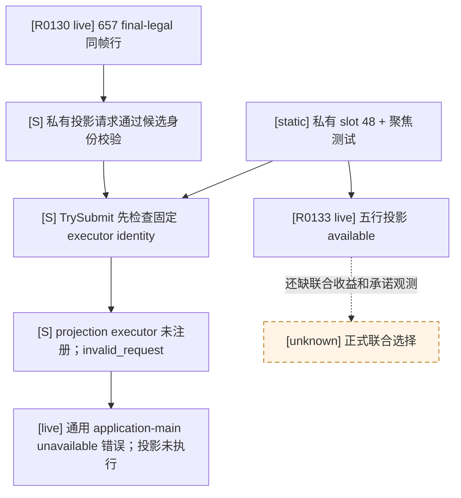

# M5 R0130：五候选联盟投影的 application-main 提交 RED

状态：**真实只读实机 RED；最终合法性读回成功，联盟投影未执行**。本页绑定 CK3 `1.19.0.6-steam23530548`、EXE SHA-256 `2D00FF3101EF70B566F2FCBAE292F09263199C80E9DC8F139B82D7D96F83DB86` 与源提交 `71d428b1a9b2d9834256e4d022dab83b83fbda5d`。原生婚配/联盟语义仍以[婚姻树](marriage-and-alliance.md)和[五候选私有查询](m5-first-heir-alliance-private-query-2026-09-22.md)为准；本次故障发生在进入原生查询前。

## 不可变实机证据

| 资产 | SHA-256 / 事实 |
| --- | --- |
| `Z:\ck3_mod_rewrite_process_assets\g2-m5-alliance-readback-live-R0130\evidence\report.json` | `B875905F2A75AFAF6E1EB44AAD58C912C47B36E355BF6C1777E123937A6F3E1B`；`status=RED`，实际 native 错误 `paused application-main marriage query unavailable` |
| 同目录 `observed-first-heir-legality.json` | `D7C3FE9BC820983BE6E747A2415DCDDC69F4FD5A10E88D65DC4543759A8B698A`；同一 paused native revision `3`、首继承人 `38822`、657 个不同 final-legal 行，`native_rank=null` |
| 将提交的只读五候选 | `16778038`、`16778252`、`16778632`、`16778730`、`16778737`，按当帧结果动态取前五；这些 ID 是证据定位值，不是策略排名 |
| 候选身份 | 原 no-launch manifest SHA-256 `DE71CECD5CD0C6EC2004B47AFE6BE01505E81C347DD1492ACB622B14AD137A32`，旧 Release DLL SHA-256 `F9AECCDE8DDEDE06AF651835AEA1471AA018F614F445CCC46462D88FEAC3E5DB`，`xar_on` fresh fixture |

R0130 没有生成 `five-candidate-alliance-projection.json`，游戏动作、UI 输入与日期推进均为零。PID `171596` 的树和 watchdog 已被正式 runner 证明回收，源/预备 save 仍同为 SHA-256 `9104CCB8AE9D5776166FBBAEDA9B43BD08CBAA2CB5C057332EB8B7A1A212CC63`。本轮不对婚姻、联盟结果或候选收益给出结论；不把合法性 GREEN 当成投影 GREEN。

## 精确失败链与最小修复

在上述冻结源码中，`bridge.cpp` 的 `kMarriageCandidateAllianceProjectionStepV1` 分支通过合法性/同帧校验后，直接把 `ExecuteMarriageCandidateAllianceMailboxQueryV1` 提交给 `TrySubmitMainThreadQueryV1`；提交失败时一律返回上述笼统错误。`main_thread_query_mailbox_v1.cpp` 的 `TrySubmit` 在检查 paused pump 与 mailbox 状态之前先逐项比较固定 permitted executor；未列出的函数指针返回 `invalid_request`。当前安装环境把 slot 38 注册为**另一函数** `ExecuteMarriageCandidateInternalRouteV1`，其余固定 slot 也没有注册联盟投影执行器。请求的 executor/context 均为有效静态地址；因此该冻结构建中此提交必定先命中 `invalid_request`，与重启游戏、重放日期或改变候选 ID 无关。真实 wire 只记录通用错误；具体 enum 是上述 exact-build 源码的确定性推导，尚未通过新诊断 wire 独立回读。

最小修复是在 M4 slot 43 写入冻结后，为该默认关闭的**私有只读**投影执行器分配独立固定 slot 48，贯通安装环境、mailbox 存储/身份检查及 bridge 注册；不占 slot 38 的婚姻内部 route、slot 43 的 M4 lifecycle 或已由 M2 `.0110` 占用的 slot 47。提交失败时将固定 enum 作为私有错误原因返回，使后续失败区分身份错误、未安装、paused 主线程未见与基础设施失败。聚焦 offline mailbox fixture 验证 slot 48 的允许执行和未注册时的拒绝；原有投影 adapter/ABI 测试与 Release/Debug 私有构建只证明静态修复。新 DLL、profile、manifest 和官方 no-launch 候选必须与 R0130 分开冻结；只有新一轮唯一 CK3 的真实五候选读回才可关闭此 RED。

本修复不改变公共 MCP、正式策略或 G2-M5 合同状态。它只解除已复现的只读查询传输阻塞；联盟物质结果、长期义务和联合选择仍另有观测缺口。

## 静态施工结果与实机边界

slot 48 的固定身份已经接入安装环境、mailbox 与私有投影请求；该私有请求在提交失败时返回具名 submit 原因。聚焦 offline mailbox 与投影测试在 Debug/Release 各 `2/2`，私有桥 DLL 在 Debug/Release 完整链接，Release injector 完整链接；Python 私有 transport 在 normal/-O 各 `5/5`。这些结果只证明原先未注册执行器的静态缺口已修，不证明 R0130 的真实五候选投影成功。独立新候选已完成源码/profile/save/DLL/manifest 冻结与官方 no-launch；下述 R0133 的同帧真实读回关闭了这一个传输 RED。

## R0133：独立候选与同帧只读结果

独立候选根为 `Z:\ck3_mod_rewrite_process_assets\g2-m5-alliance-mailbox-c86cae3-20260922`；detached source 提交 `c86cae3b7823b1e49c2dcfc0d535296d0fca0363`。候选使用原始 `dev3b_r639.ck3`（SHA-256 `9104CCB8AE9D5776166FBBAEDA9B43BD08CBAA2CB5C057332EB8B7A1A212CC63`），经官方 `prepare_profile(xar_enabled='xar_on')` 新建 profile，未承接 R0130 的 driver 尾部，也未碰战争主链配对。准备时原始与 prepared save 哈希相同，driver 不存在。

| 冻结项 | SHA-256 |
| --- | --- |
| EXE `1.19.0.6-steam23530548` | `2D00FF3101EF70B566F2FCBAE292F09263199C80E9DC8F139B82D7D96F83DB86` |
| Release 私有 DLL / injector | `4CB80B4995DE01D28859B52C496E805F5BA35D3872EC77B911FDD36554E85B2D` / `7A70925EC81701BFC7330B36EFF1436380F1B33378875AF873678D29E271BBBE` |
| CMake cache（私有两开关 ON） | `0975A47153278921A0CCDBE50A9D074F0A60C170FA3687094E406AAAD96079CA` |
| 冻结 runner `run_alliance_readback.py` | `E809588BBC1BB42B9A0A90124401DEB48A445B344CCB9B994DB4E60254BBD3CA` |
| `no-launch-manifest.json` / `no-launch-report.json` | `5261E8528A10EFF2C2935FA0BE183D7B71D09F35DF65804A955C445BC128450A` / `4B338351BEE29F303F34568E9E3BD9DB55B5853AB62469A6C23A1168E46796A4` |

官方 runner `--preflight-only` 返回 `READY_NO_LAUNCH`、`ck3_launched=false`、CK3 库存空；profile 环境 SHA-256 `997C7D4EAFA55182380A256DC1A58BF82D03C9A888825A409F80849AE7A84911`，agent runtime SHA-256 `B27444B263DB5A820A06FFEE3332B7E2CA267915547A012B56C407D45DF08AF6`。持久分配器随后分配 R0133，owner 派生 ledger SHA-256 `9F130AA6584806326A1F4B38657B666B0F463B83A6004D2B567EC19436E666F7`；候选身份没有覆盖 R0130 的任何文件。

R0133 唯一 CK3 PID `150896`，创建时间 `20260922150613.854028+000`。正式有界 runner 于原始 paused `date_raw=53178264`、native revision `3`、玩家 `29829`、首继承人 `38822` 上得到 657 个不同 final-legal 候选；同帧动态前五 `16778038`、`16778252`、`16778632`、`16778730`、`16778737` 的私有联盟投影全部 `available`。原始结果位于 `Z:\ck3_mod_rewrite_process_assets\g2-m5-alliance-readback-live-R0133\evidence`：报告 SHA-256 `CFE5635392393AABC4A1C5B1643151CA5C5A4CDAC9FF91740FD3661442F1B3B9`、合法性 SHA-256 `D7C3FE9BC820983BE6E747A2415DCDDC69F4FD5A10E88D65DC4543759A8B698A`、五行投影 SHA-256 `C58A3279BCD544844298B9C53D1C635FC23384D6F76E112B092E2BB7A5DBCF3A`。`GREEN_READ_ONLY` 报告记录 gameplay actions `0`、UI inputs `0`、日期未推进、wall `167.509s`；CK3 树及 watchdog 正式回收，job active `0`、owner 释放、受管库存空，原始与 prepared save 哈希未变。持久 run-id 状态已登记 `completed-green`。

本次动态抽样的五行 `possible_alliance_pairs` 分别为 `1/2/2/2/1`；所有 pair 的 `both_have_realm_data=false`、`would_attempt_if_accepted=false`。因此本次证实的是固定 mailbox executor 和只读投影查询可工作，**没有证实任何可带来联盟的婚配收益**，也没有执行婚姻动作。下一项 M5 观测应在自然 paused 场景筛选真正有 realm/联盟可能性的 final-legal 候选，并补接受后物质结果、长期承诺及同帧战争资源机会成本；正式联合选择、typed 动作、独立后置与下一 turn 消费仍未闭合，G2-M5 不晋级。
